

# مرحبًا بكم في Slicer

Sonia Pujol, Ph.D.

أستاذ مساعد في الأشعة

مستشفى بريغهام و النساء

كلية الطب بجامعة هارفارد

---

## الهدف

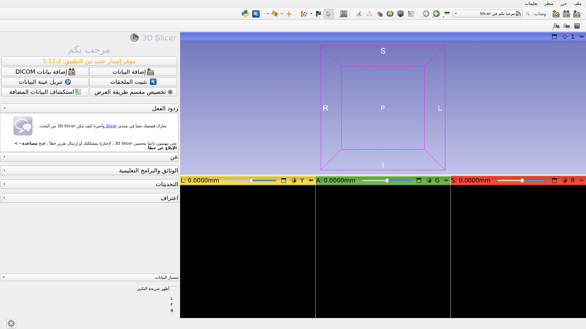

هذا الدليل التعليمي هو مقدمة قصيرة لوحدة الترحيب في برنامج Slicer مفتوح المصدر.

---

## أساسيات Slicer 5

* Slicer هو برنامج مفتوح المصدر يُستخدم لتقسيم الصور الطبية (Segmentation)، ومحاذاتها (Registration)، وعرضها (Visualization).

* تم تطوير المنصة من خلال تعاون مع عدة مؤسسات ضمن عدة اتحادات بحثية كبيرة ممولة من المعاهد الوطنية للصحة (National Institutes of Health).

* يُستخدم Slicer لأغراض البحث الطبي فقط، وهو غير معتمد من قبل إدارة الغذاء والدواء الأمريكية (Food and Drug Administration). 

---

## أساسيات Slicer 5

يتضمن برنامج 3D Slicer الإصدار 5 (النسخة 5.10.0) أكثر من 100 وحدة (Modules) وأكثر من 190 إضافة (Extensions) لتقسيم الصور الطبية (Segmentation)، ومحاذاتها (Registration)، وعرضها بشكل ثلاثي الأبعاد (3D Visualization).

---

## المنصات المدعومة

* Slicer هو برنامج متعدد المنصات، تم تطويره وصيانته للعمل على أنظمة Mac OS X وLinux وWindows.

* يتطلب Slicer حدًا أدنى يبلغ 2 جيجابايت من ذاكرة الوصول العشوائي (RAM)، بالإضافة إلى معالج رسومي مخصص مزود بذاكرة رسومية لا تقل عن 64 ميجابايت. 

---

## مرحبًا بكم في Slicer

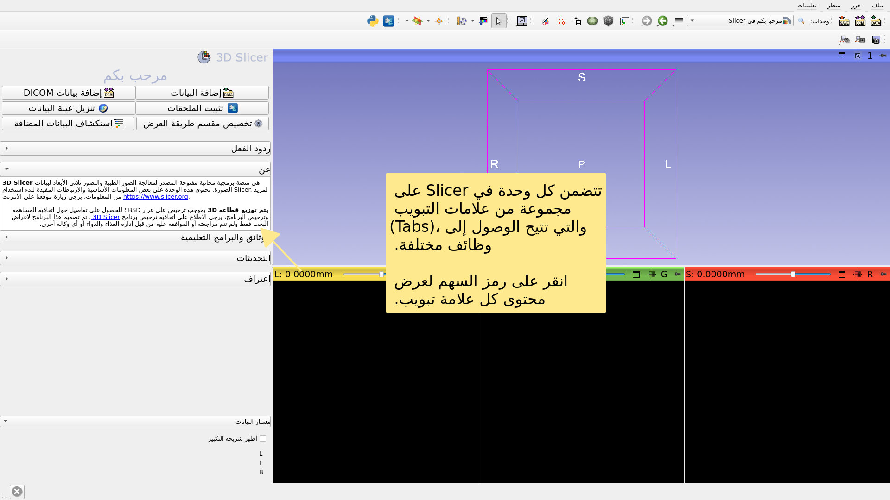

---

## واجهة مستخدم Slicer

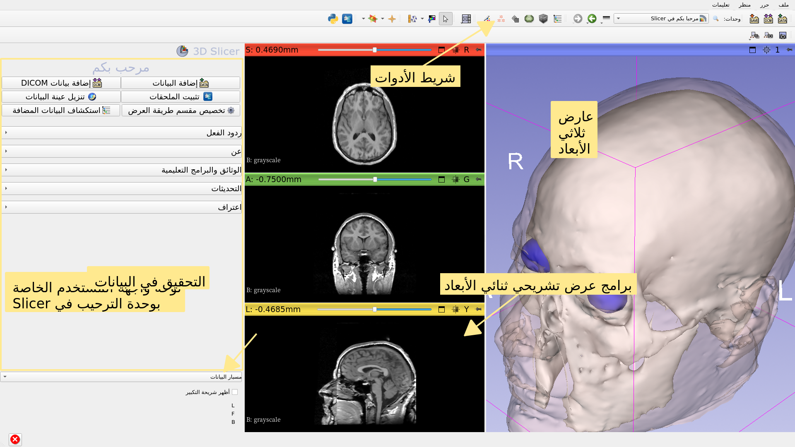

---

## وحدة الترحيب

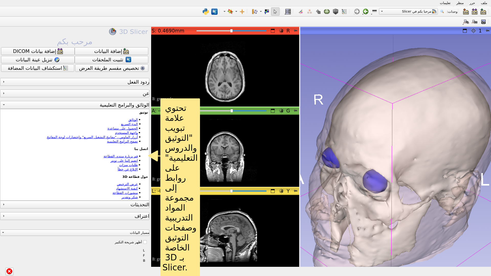

---

## وحدة الترحيب

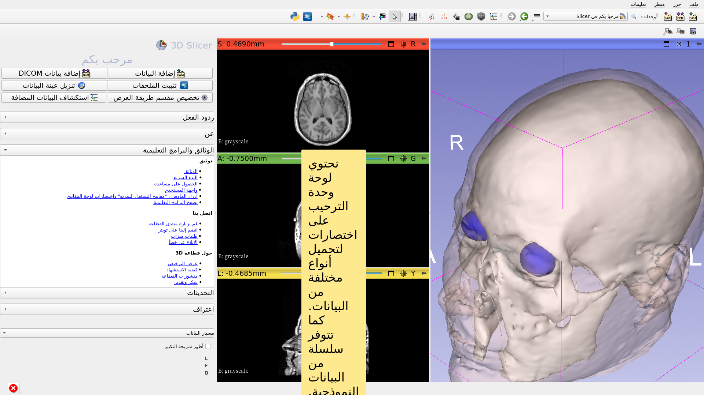

---

## بيانات نموذجية

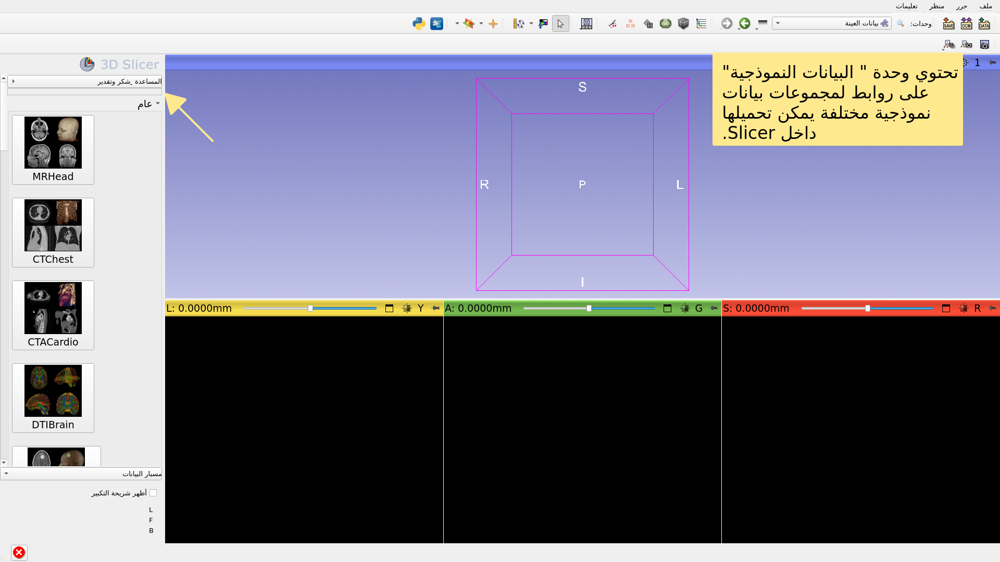

---

## بيانات نموذجية

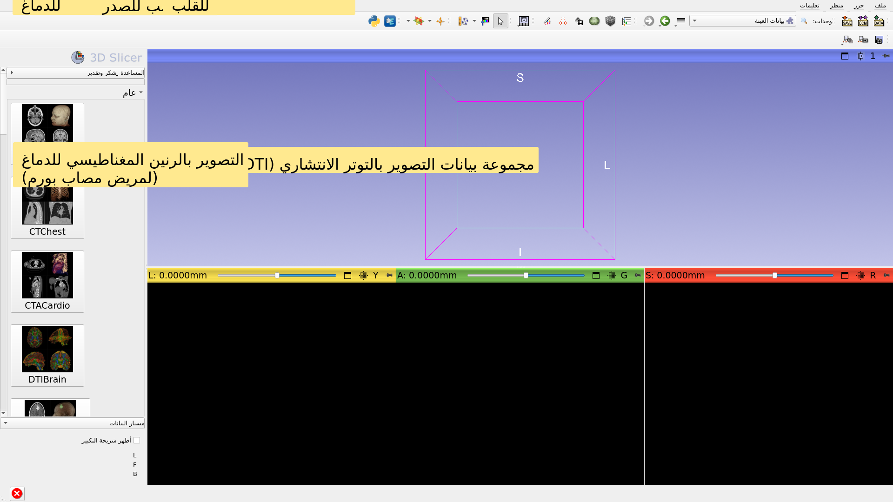

---

## بيانات نموذجية

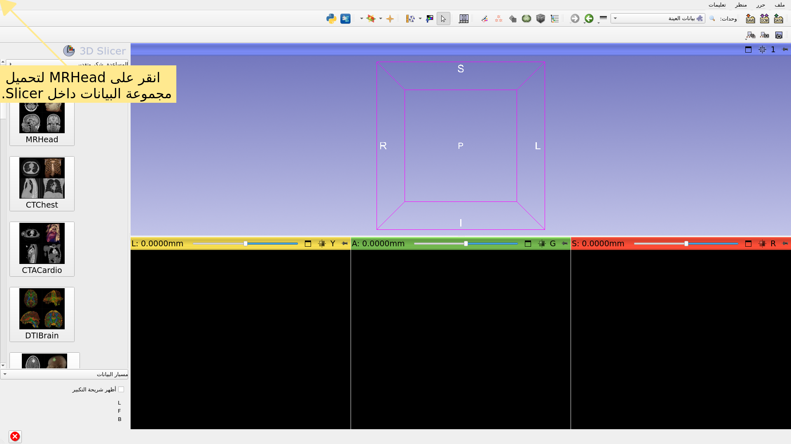

---

## وحدة الترحيب

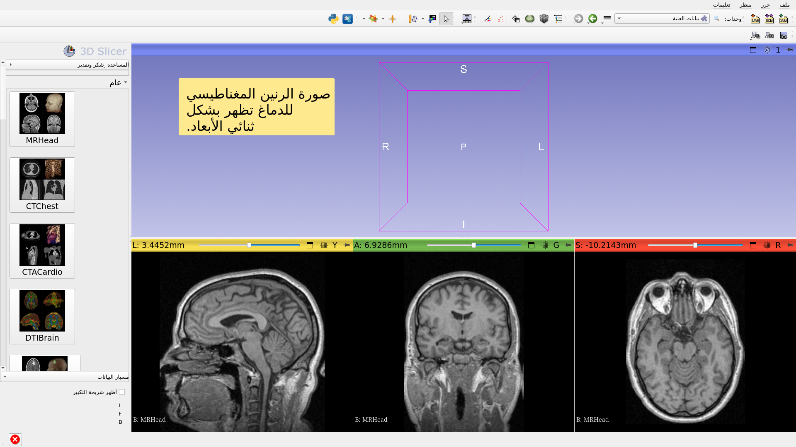

---

## مجموعة بيانات عينات الدماغ بالرنين المغناطيسي

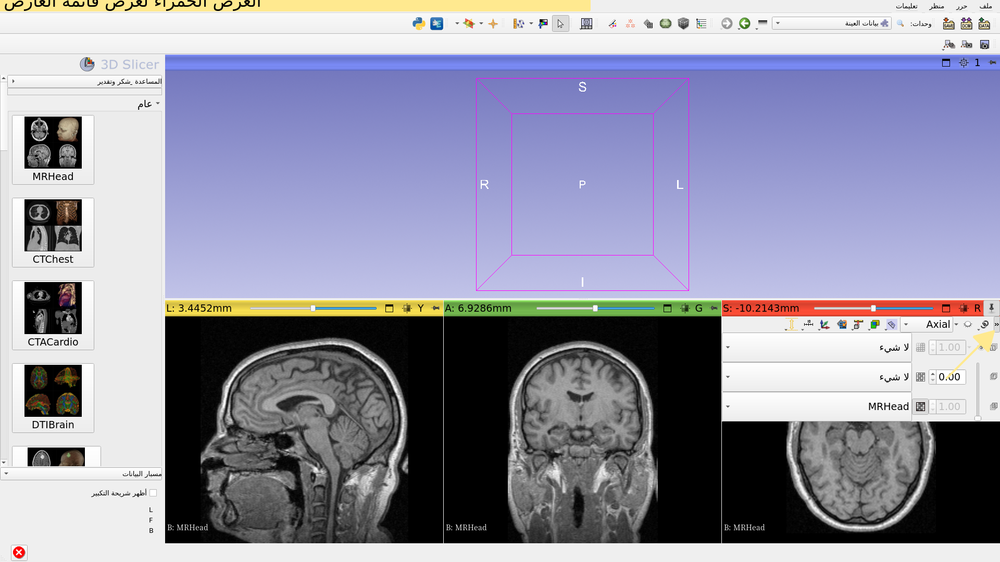

---

## مجموعة بيانات عينات الدماغ بالرنين المغناطيسي

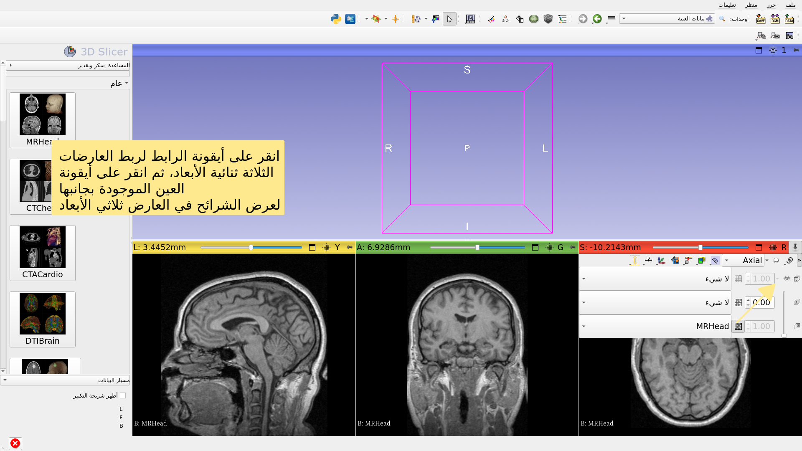

---

## مجموعة بيانات عينات الدماغ بالرنين المغناطيسي

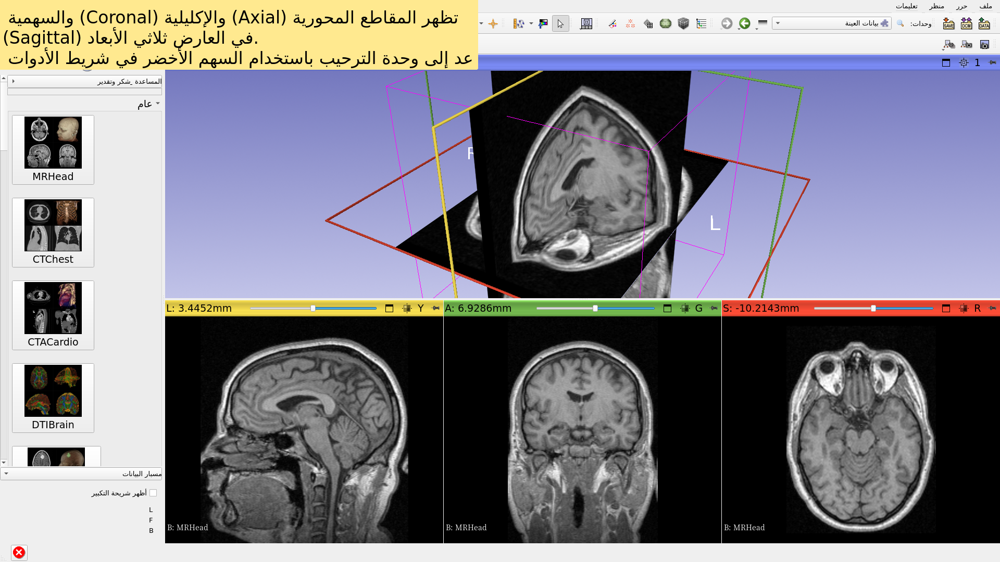

---

## المضي قدماً

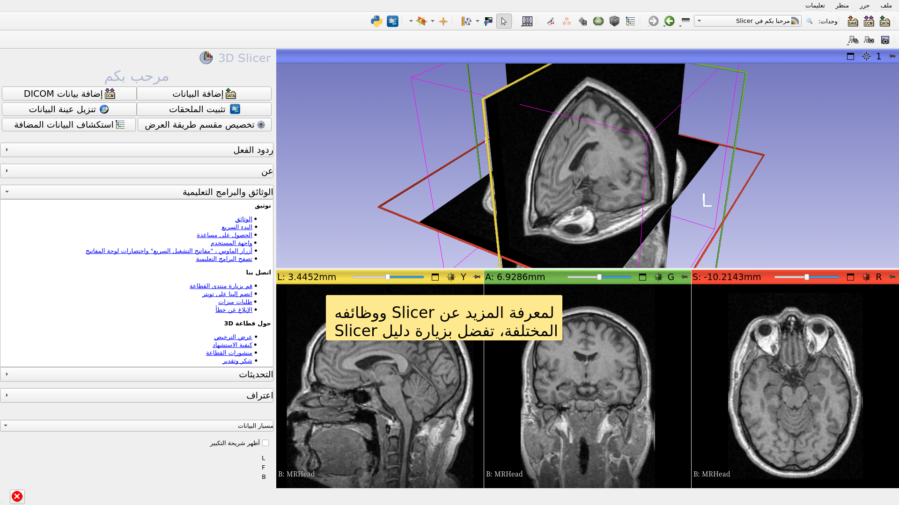

---

## المضي قدماً

https://training.slicer.org/

---

# شكر وتقدير

التحالف الوطني لحوسبة الصور الطبية

NIH U54EB005149

مركز تحليل الصور العصبية

NIH P41EB015902

مبادرة تشان زوكربيرغ (CZI)

---
