

# Slicer Willkommen

Dr. Sonia Pujol

Assistenzprofessor für Radiologie

Brigham and Women’s Hospital

Harvard Medical School

---

## Ziel

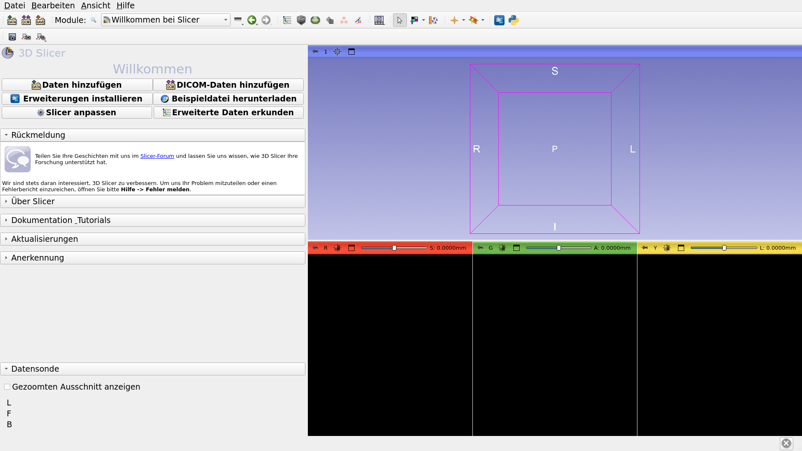

Dieses Tutorial bietet eine kurze Einführung in das „Welcome“-Modul der Open-Source-Software Slicer.

---

## Grundlagen von Slicer5

*Slicer ist eine Open-Source-Software zur Segmentierung, Registrierung und Visualisierung medizinischer Bilddaten.

*Die Plattform wurde im Rahmen einer institutionenübergreifenden Zusammenarbeit mehrerer großer, vom NIH finanzierter Konsortien entwickelt.

*Slicer ist ausschließlich für die medizinische Forschung bestimmt und nicht von der FDA zugelassen. 

---

## Grundlagen von Slicer5

Die Version 5.10.0 von 3D Slicer 5 umfasst über 100 Module und mehr als 190 Erweiterungen für die Bildsegmentierung, Bildregistrierung und 3D-Visualisierung medizinischer Bilddaten.

---

## Unterstützte Plattformen

*Slicer ist eine plattformübergreifende Software, die unter Mac OS X, Linux und Windows entwickelt und gepflegt wird.

*Slicer benötigt mindestens 2 GB RAM und eine dedizierte Grafikkarte mit 64 MB integriertem Grafikspeicher. 

---

## Willkommen bei Slicer

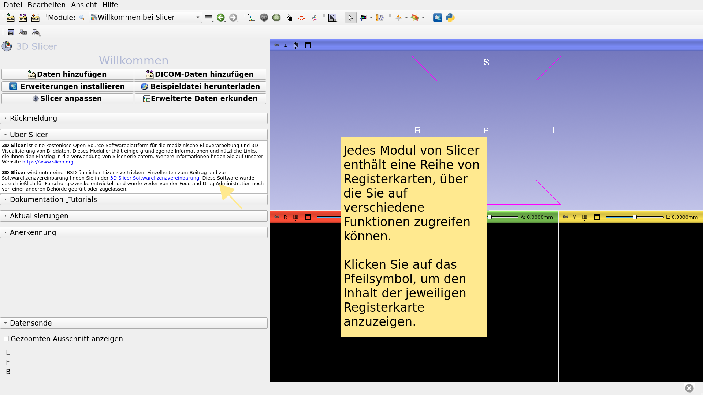

---

## Benutzeroberfläche von Slicer

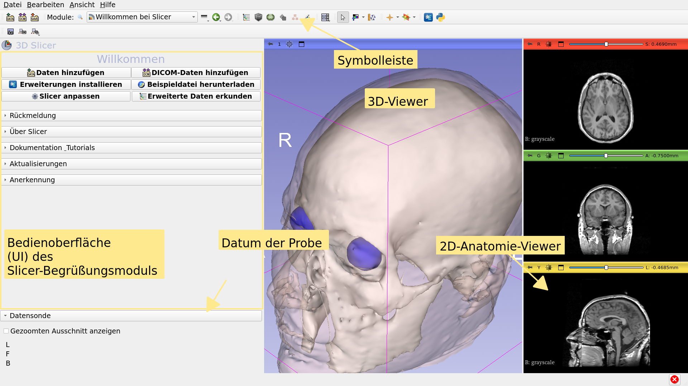

---

## Einführungsmodul

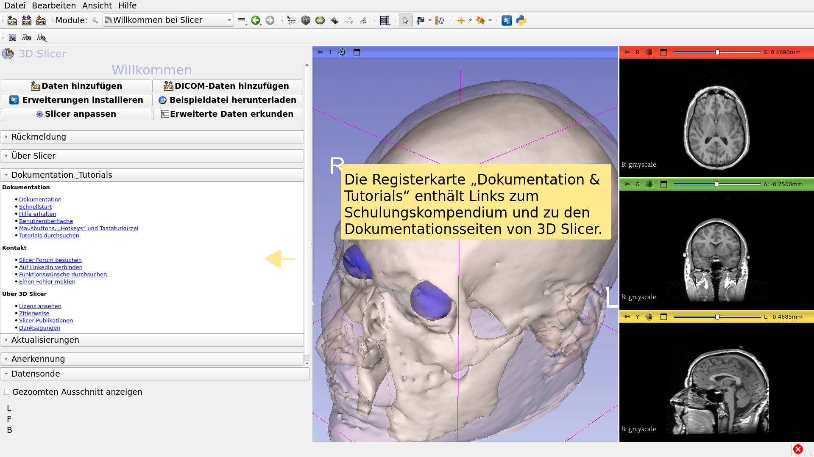

---

## Einführungsmodul

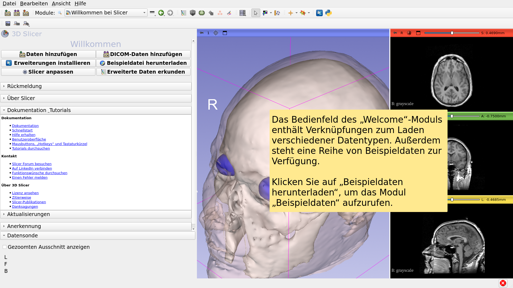

---

## Beispieldaten

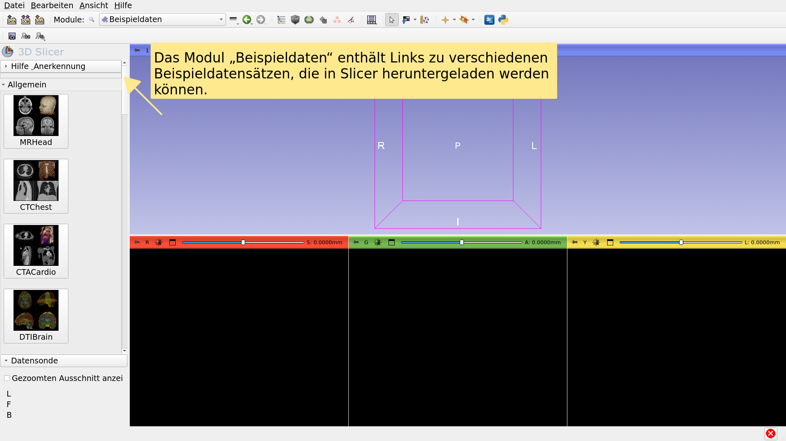

---

## Beispieldaten

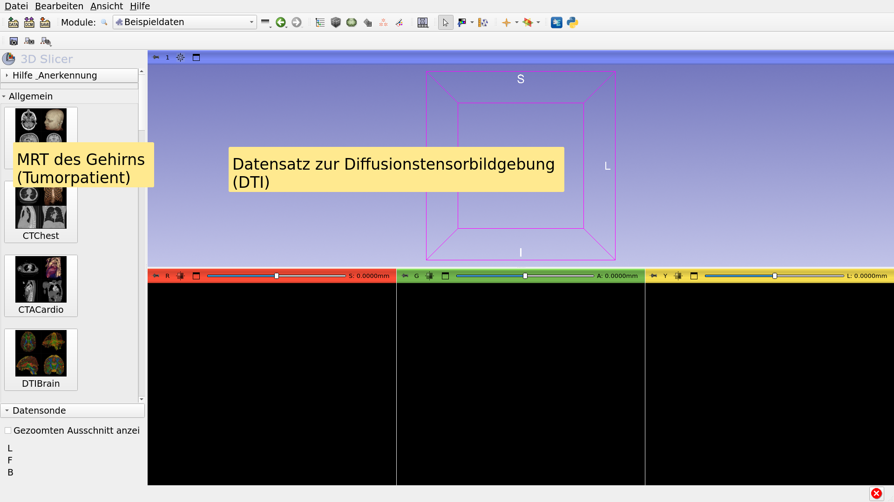

---

## Beispieldaten

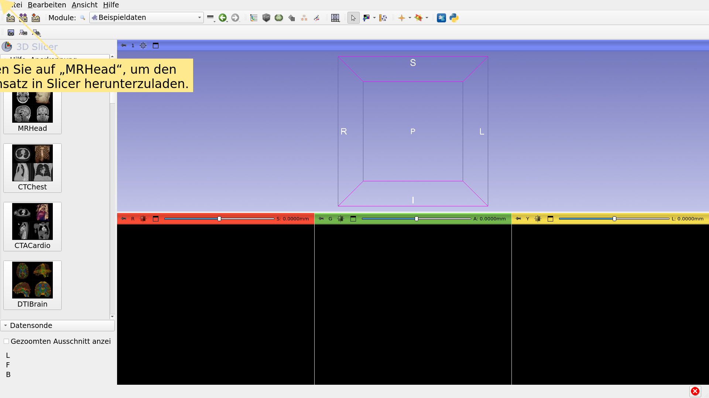

---

## Einführungsmodul

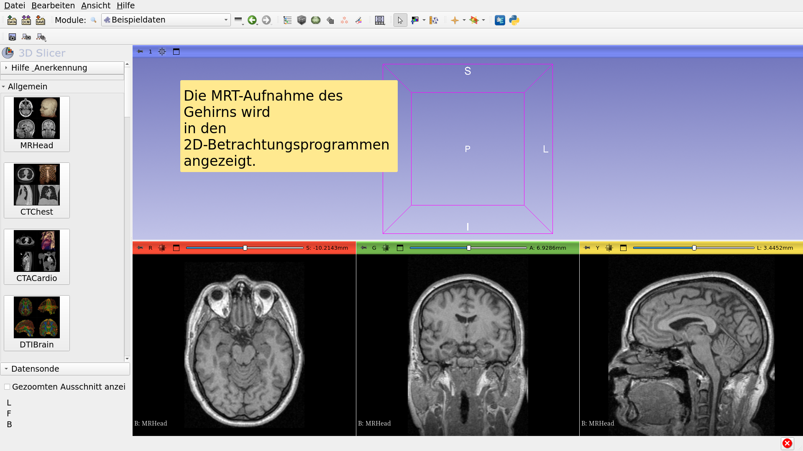

---

## MR-Gehirn-Beispieldatensatz

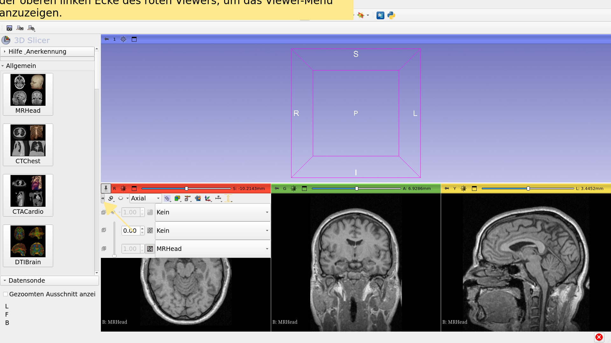

---

## MR-Gehirn-Beispieldatensatz

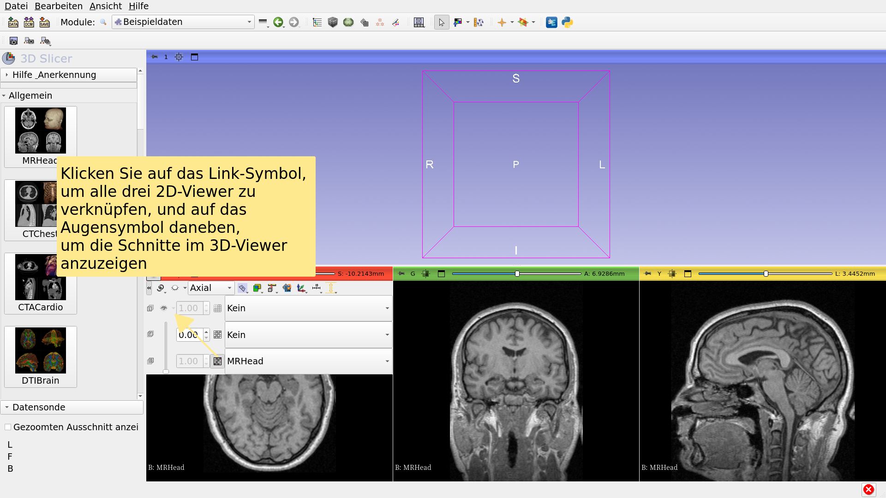

---

## MR-Gehirn-Beispieldatensatz

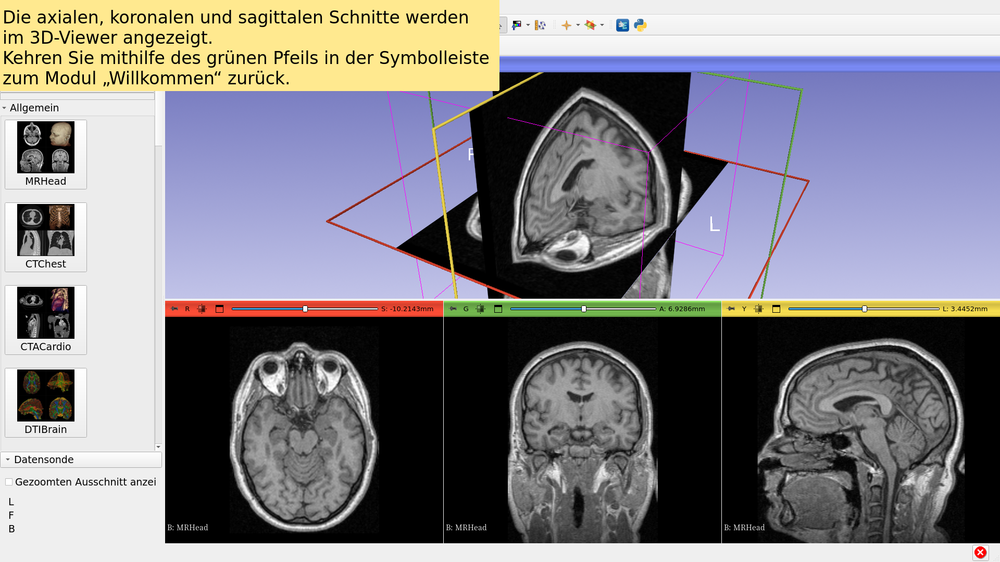

---

## Weiterführende Informationen

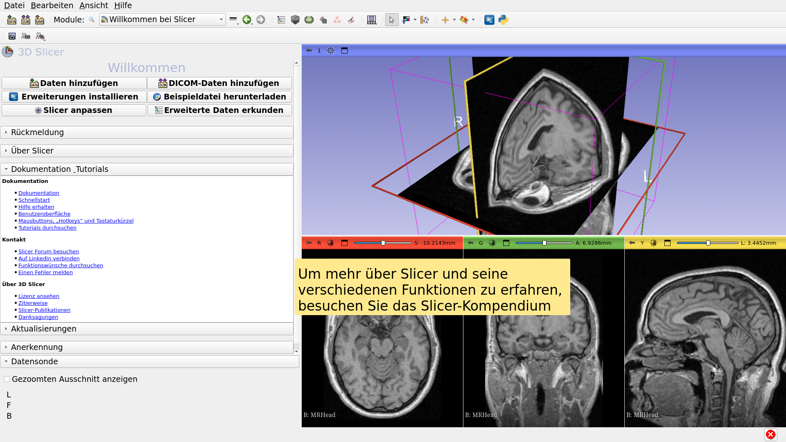

---

## Weiterführende Informationen

https://training.slicer.org/

---

# Danksagungen

Nationale Allianz für medizinische Bildverarbeitung

(National Alliance for Medical Image

Computing)

NIH U54EB005149

Zentrum für Neurobildanalyse

(Neuroimage Analysis Center)

NIH P41EB015902

Chan Zuckerberg Initiative (CZI)

---
