

# Bienvenido a Slicer

Dra. Sonia Pujol

Profesor Asistente de Radiología

Brigham and Women’s Hospital

Harvard Medical School

---

## Meta

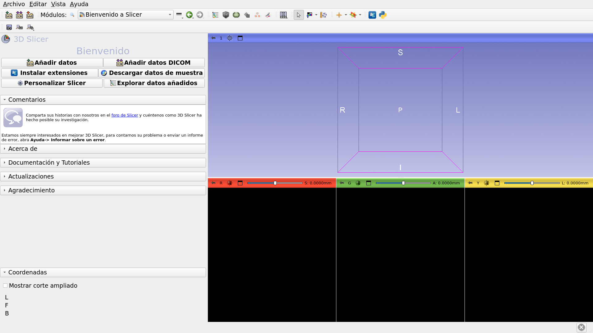

Este tutorial es una breve introducción al módulo de bienvenida del software de código abierto Slicer.

---

## Conceptos básicos de Slicer5

*Slicer es un software de código abierto para la segmentación, el registro y la visualización de datos de imágenes médicas. 

*La plataforma se desarrolla mediante un esfuerzo multi-institucional de varios consorcios a gran escala financiados por los NIH. 

*Slicer es solo para investigación médica y no cuenta con la aprobación de la FDA. 

---

## Conceptos básicos de Slicer5

3D Slicer 5 versión 5.10.0 incluye más de 100 módulos y más de 190 extensiones para segmentación de imágenes, registro y visualización en 3D de datos de imágenes médicas.

---

## Plataformas compatibles

* Slicer es un software multiplataforma desarrollado y mantenido en Mac OSX, Linux y Windows.

* Slicer requiere un mínimo de 2 GB de RAM y un acelerador gráfico dedicado con 64 MB de memoria gráfica integrada. 

---

## Bienvenidos a Slicer

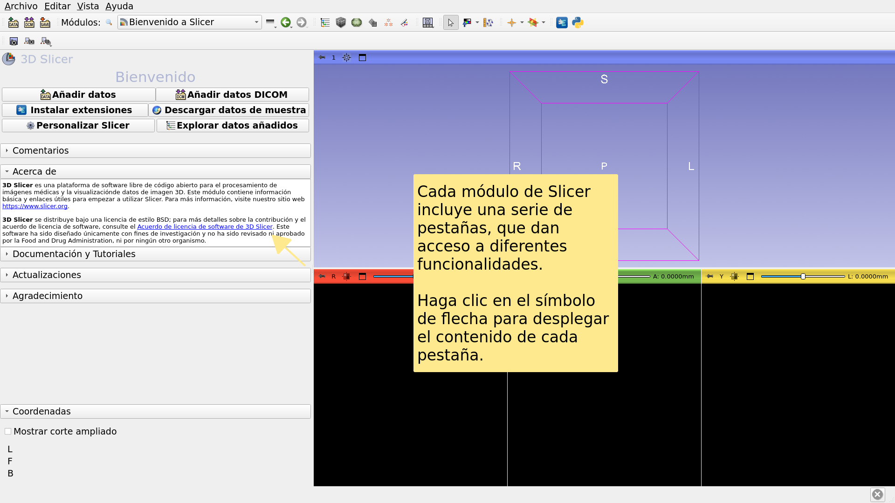

---

## Interfaz de usuario de Slicer

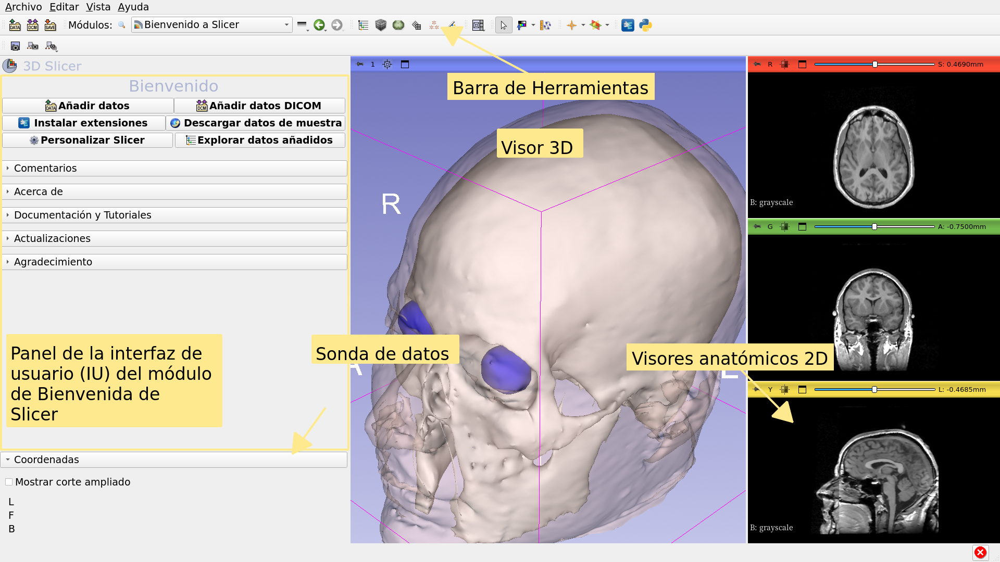

---

## Modulo de Bienvenida

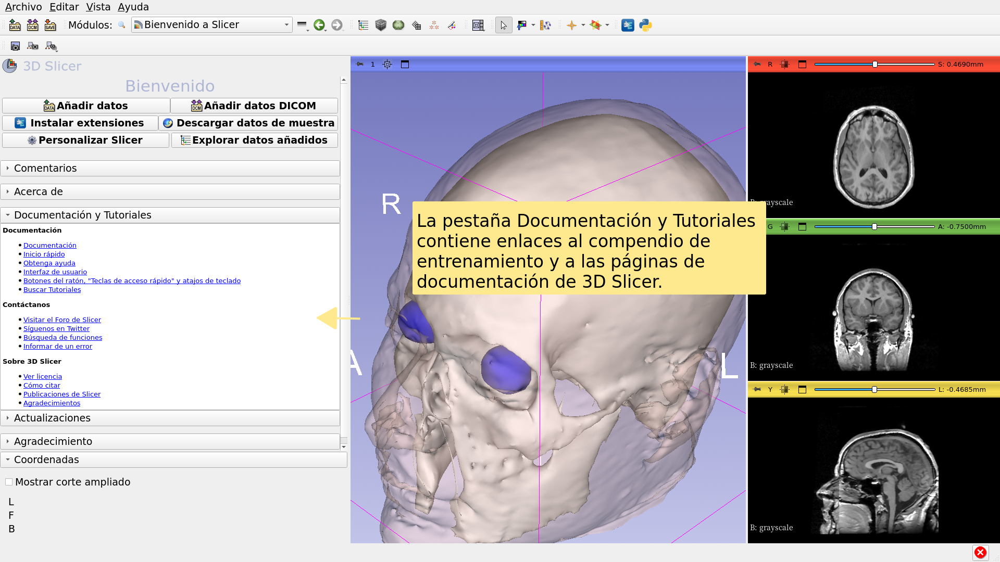

---

## Modulo de Bienvenida

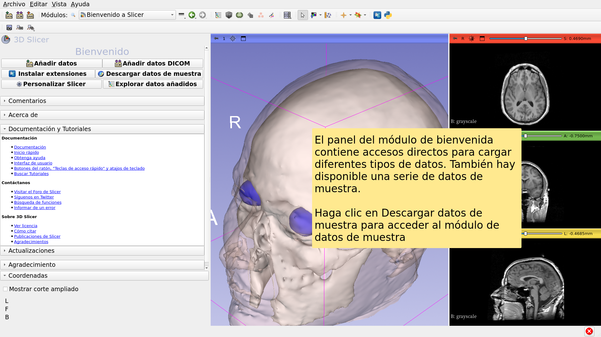

---

## Datos de muestra

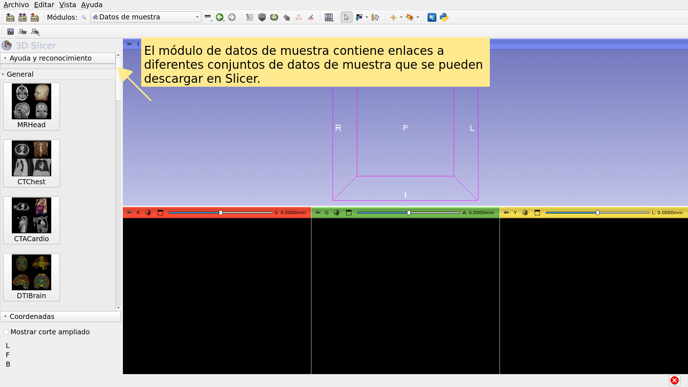

---

## Datos de muestra

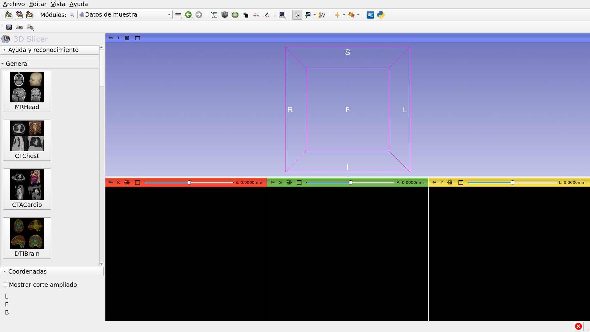

---

## Datos de muestra

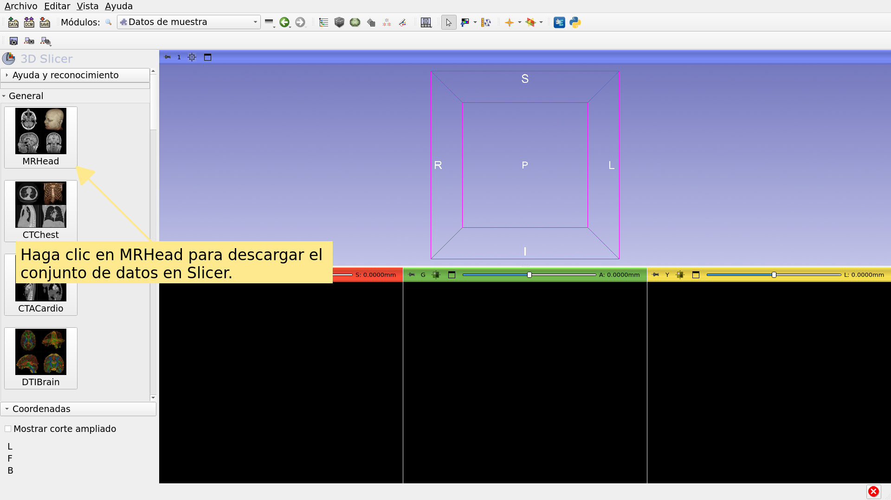

---

## Modulo de Bienvenida

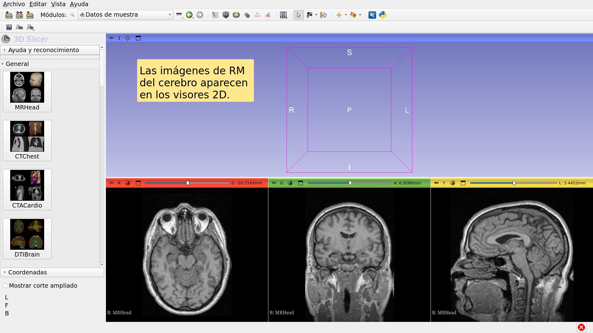

---

## Conjunto de datos de muestra de RM cerebral

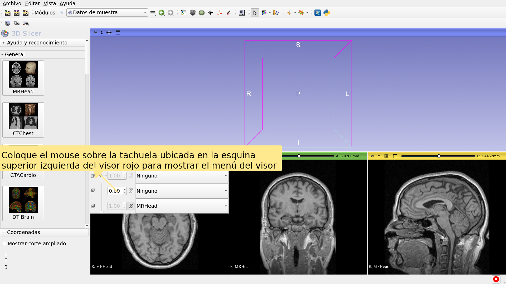

---

## Conjunto de datos de muestra de RM cerebral

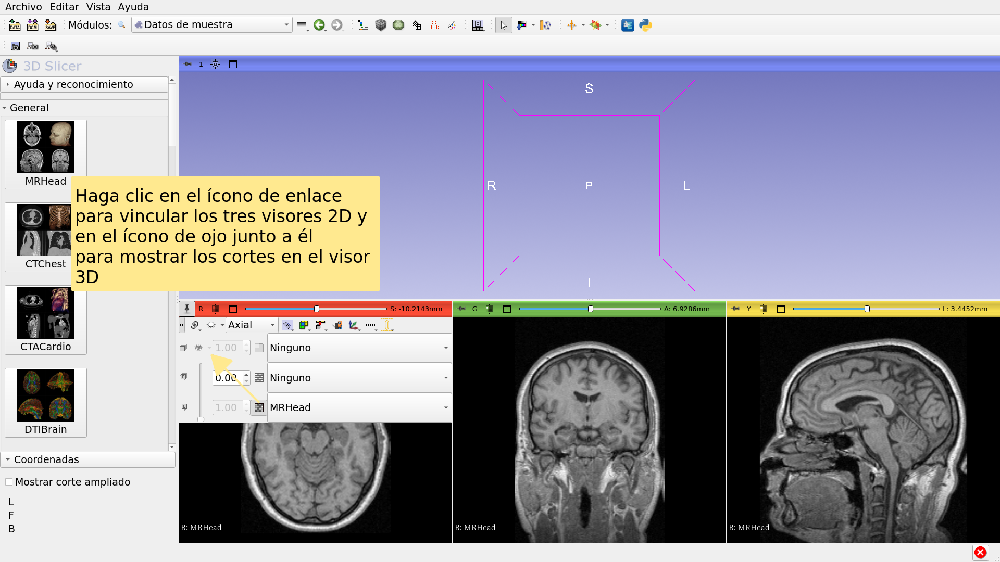

---

## Conjunto de datos de muestra de RM cerebral

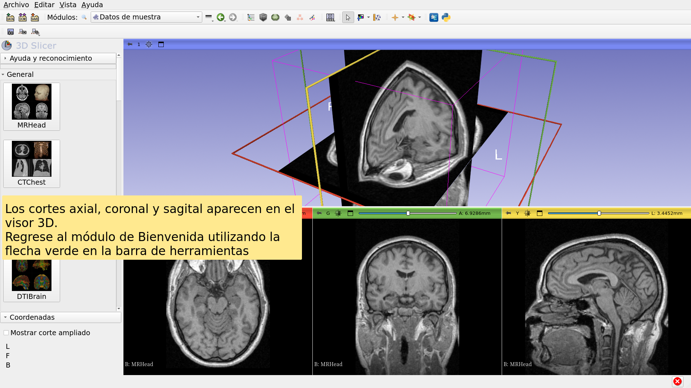

---

## Para profundizar más

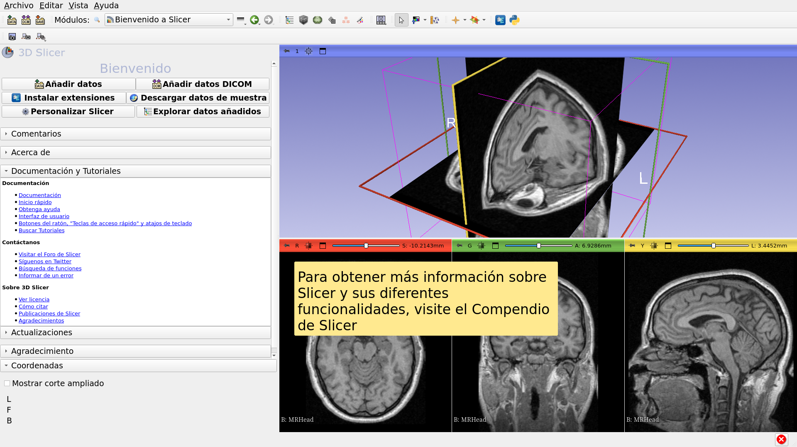

---

## Para profundizar más

https://training.slicer.org/

---

# Agradecimientos

National Alliance for Medical Image

Computing

NIH U54EB005149

Neuroimage Analysis Center

NIH P41EB015902

Chan Zuckerberg Initiative (CZI)

---
