

# Bienvenue dans Slicer

Sonia Pujol, Ph.D.

28/08/2024

Assistant Professor of Radiology
Brigham and Women’s Hospital
Harvard Medical School

---

# Bienvenue dans Slicer

Sonia Pujol, Ph.D.

Assistant Professor of Radiology

Brigham and Women’s Hospital

Harvard Medical School

---

## Objectif

This tutorial is a short introduction to the Welcome module of the Slicer open-source software.

---

## Slicer5 Basics

*Slicer is an open-source software for segmentation, registration and visualization of medical imaging data.

*The platform is developed through a multi-institution effort of several NIH funded large-scale consortia.

*Slicer is for medical research only, and is not FDA approved. 

---

## Slicer5 Basics

3D Slicer 5 version 5.10.0 includes over 100 modules and more than 190 extensions for image segmentation, registration and 3D visualization of medical imaging data.

---

## L’onglet Documentation & Tutoriels 
contient des liens vers 
le compendium de formation et les pages de documentation de la version 4.8 de 3D Slicer.	

*Slicer is a multi-platform software developed and maintained on Mac OSX, Linux and Windows.

*Slicer requires a minimum of 2 GB of RAM and a dedicated graphic accelerator with 64 MB of on-board graphic memory. 

---

## Bienvenue dans Slicer

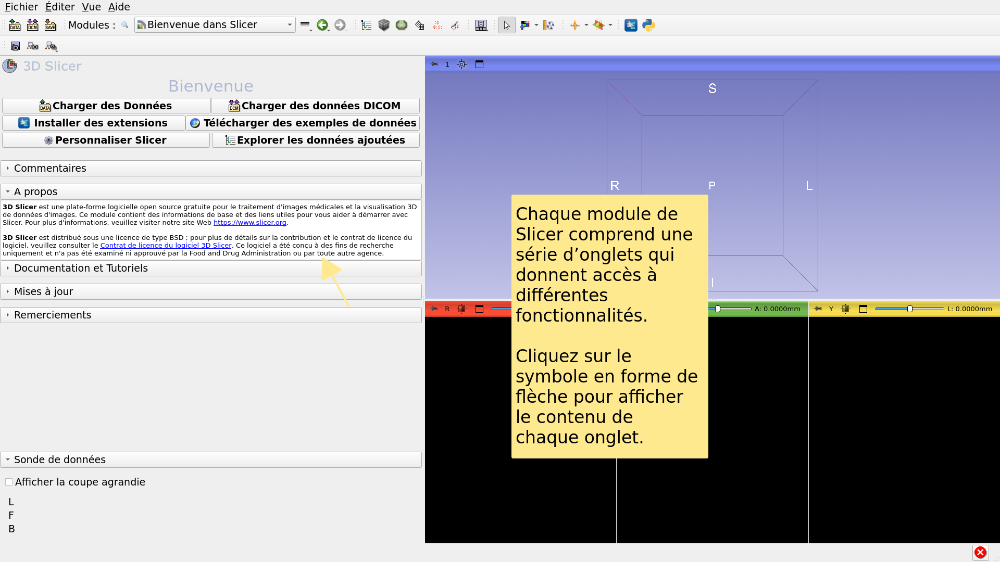

---

## Interface utilisateur de Slicer

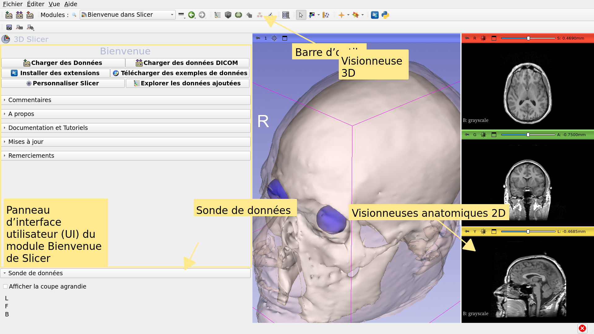

---

## Module Welcome

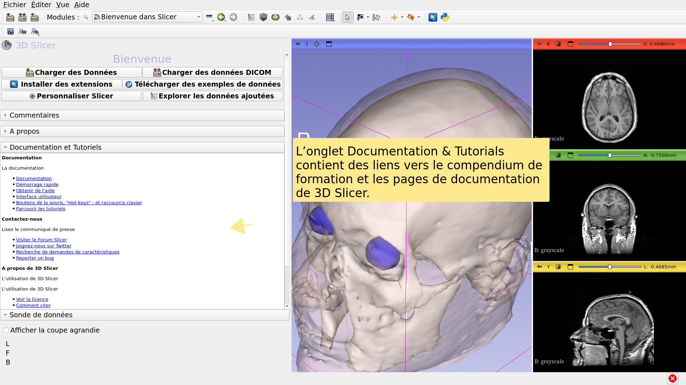

---

## Module Welcome

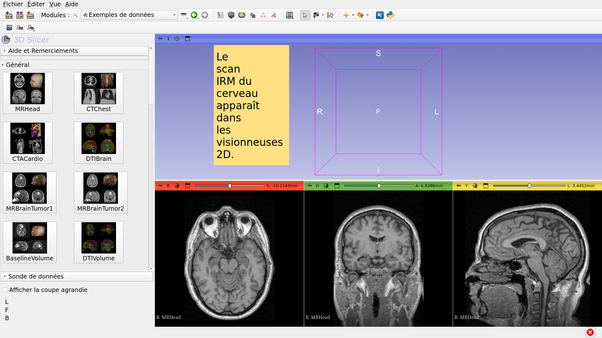

---

## Sample Data

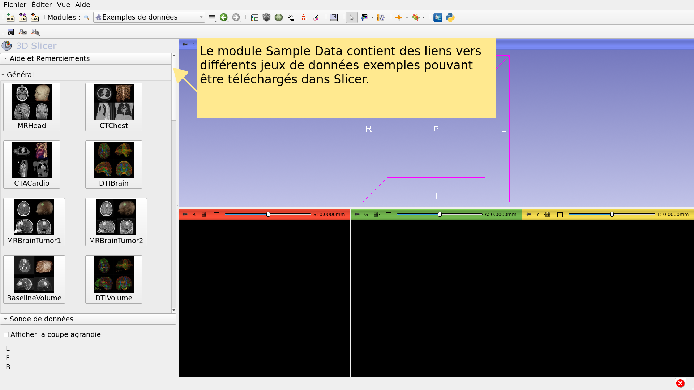

---

## Sample Data

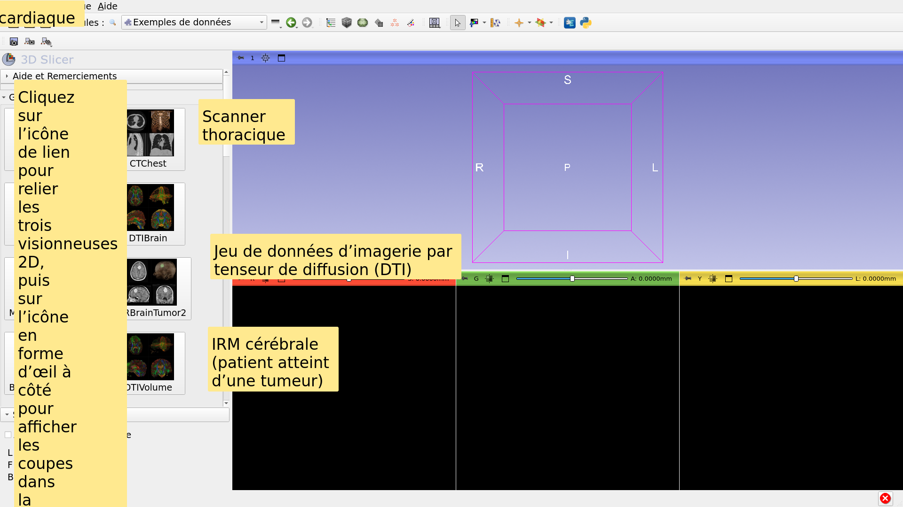

---

## Sample Data

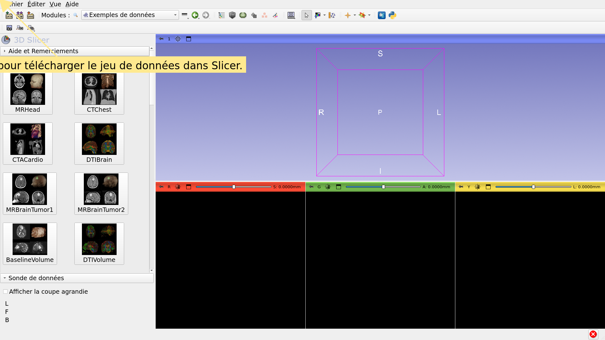

---

## Module Welcome

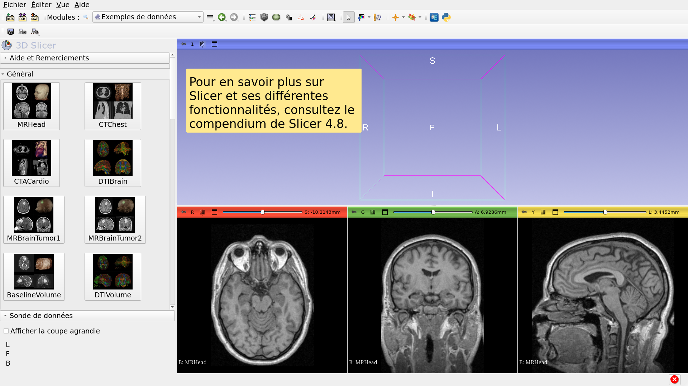

---

## Jeu de données d’exemple IRM du cerveau

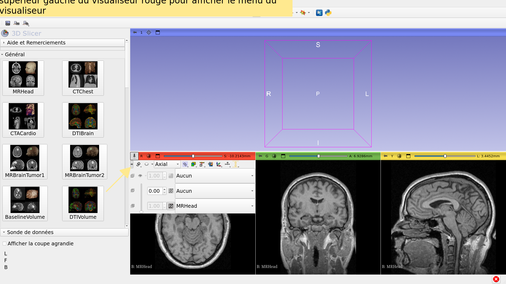

---

## Jeu de données d’exemple IRM du cerveau

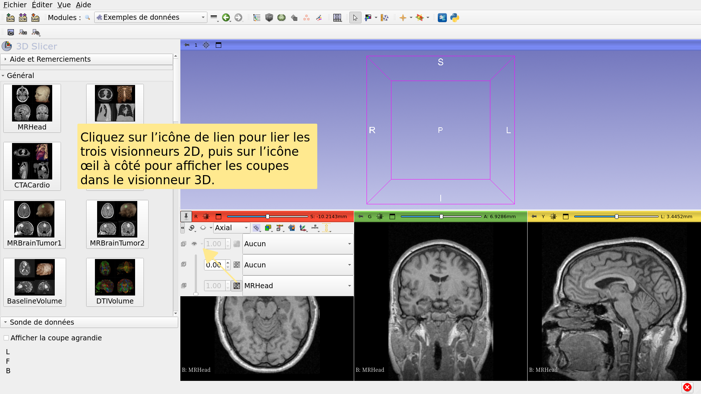

---

## Jeu de données d’exemple IRM du cerveau

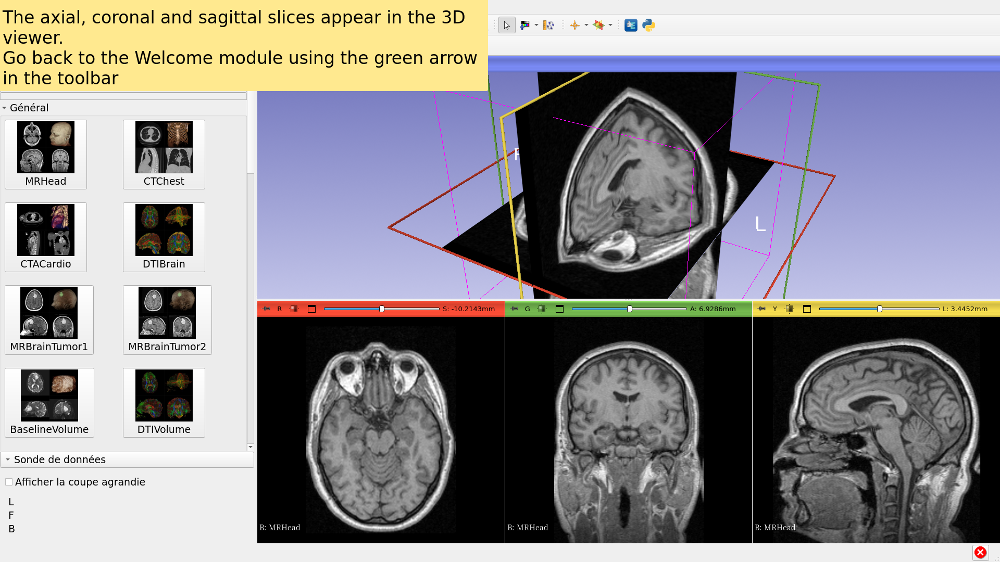

---

## Going Further

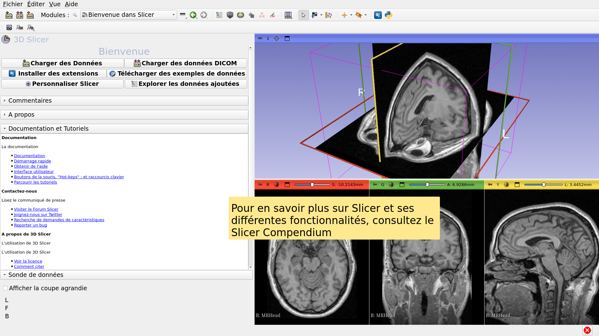

---

## Going Further

https://training.slicer.org/

---

# Remerciements

National Alliance for Medical Image

Computing

NIH U54EB005149

Neuroimage Analysis Center

NIH P41EB015902

Chan Zuckerberg Initiative (CZI)

---
