

# Bienvenue dans Slicer

Sonia Pujol, Ph.D.

28/08/2024

Professeur adjoint en radiologie
Brigham and Women’s Hospital
Harvard Medical School

---

# Bienvenue dans Slicer

Sonia Pujol, Ph.D.

28/08/2024

Professeur adjoint en radiologie

Brigham and Women’s Hospital

Harvard Medical School

---

## Objectif

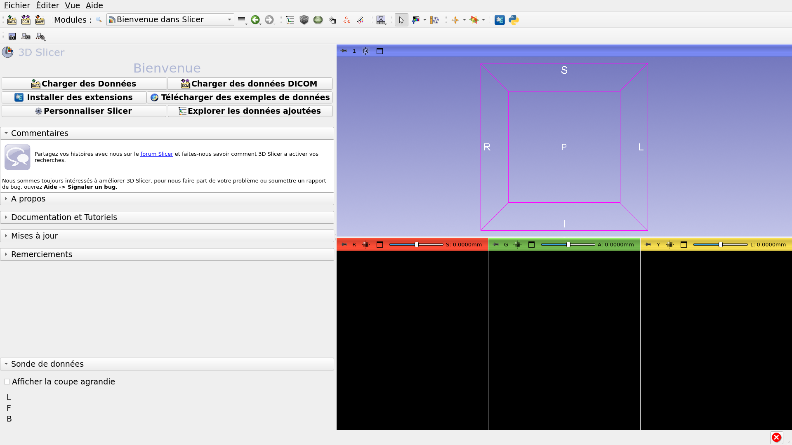

Ce tutoriel est une courte introduction au module Bienvenue du logiciel open-source Slicer.

---

## Notions de base Slicer5

*Slicer est un logiciel open-source dédié à la segmentation, au recalage et à la visualisation de données d’imagerie médicale.

*La plateforme est développée grâce à un effort multi-institutionnel impliquant plusieurs grands consortiums financés par le NIH.

*Slicer est destiné uniquement à la recherche médicale et n’est pas approuvé par la FDA. 

---

## Notions de base Slicer5

3D Slicer 5 version 5.10.0 comprend plus de 100 modules et plus de 190 extensions pour la segmentation d’images, le recalage et la visualisation 3D de données d’imagerie médicale.

---

## L’onglet Documentation & Tutoriels 
contient des liens vers 
le compendium de formation et les pages de documentation de la version 4.8 de 3D Slicer.	

*Slicer est un logiciel multiplateforme développé et maintenu sur Mac OS X, Linux et Windows.

*Slicer nécessite au minimum 2 Go de mémoire vive (RAM) ainsi qu’un accélérateur graphique dédié disposant de 64 Mo de mémoire vidéo embarquée.* 

---

## Bienvenue dans Slicer

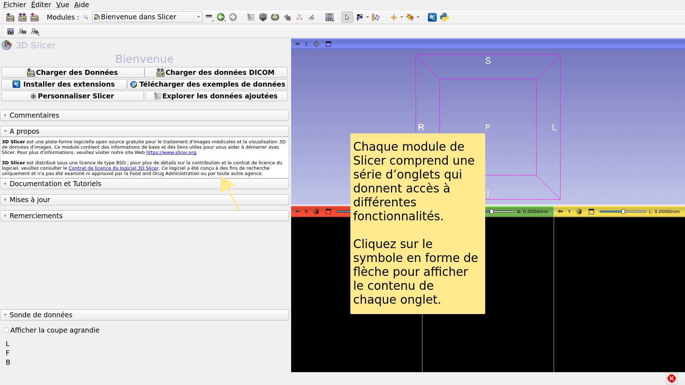

---

## Interface utilisateur de Slicer

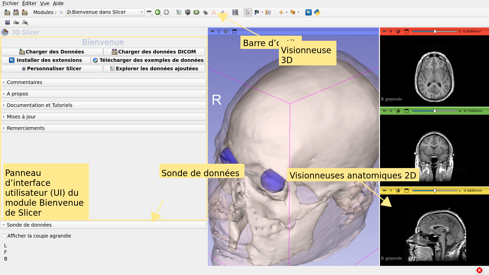

---

## Module Bienvenue

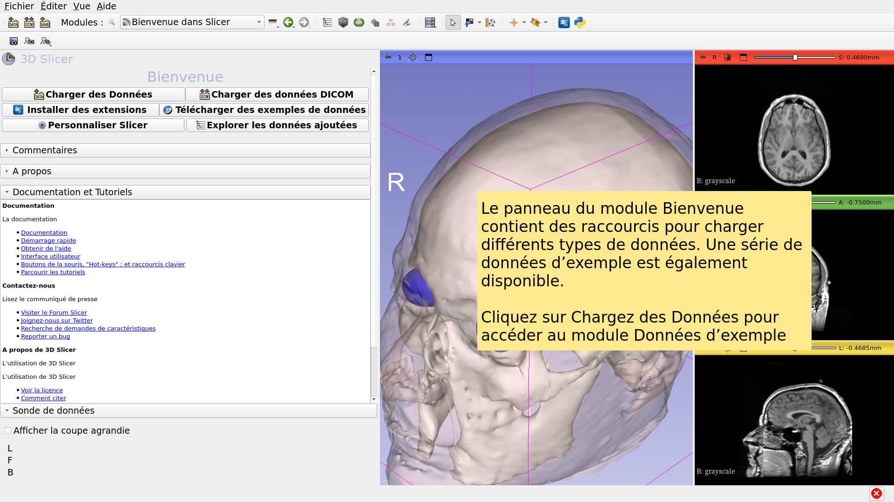

---

## Module Bienvenue

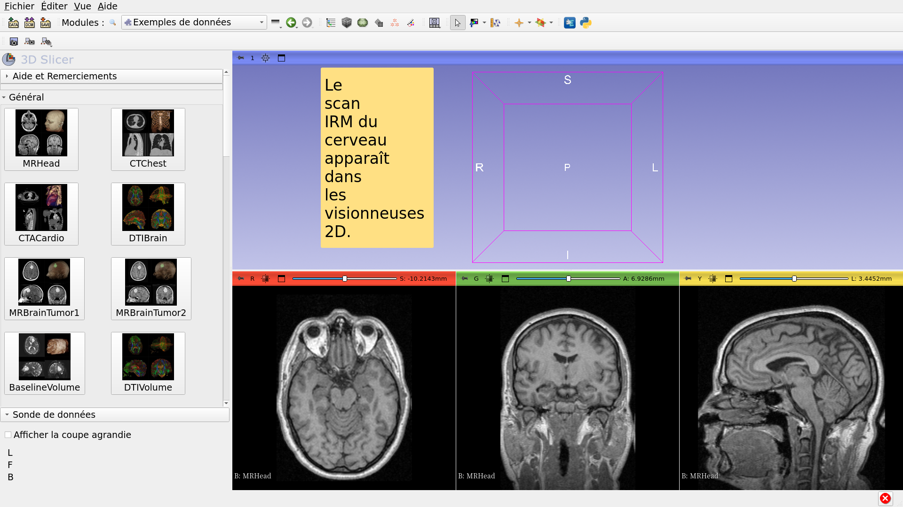

---

## Exemple de données

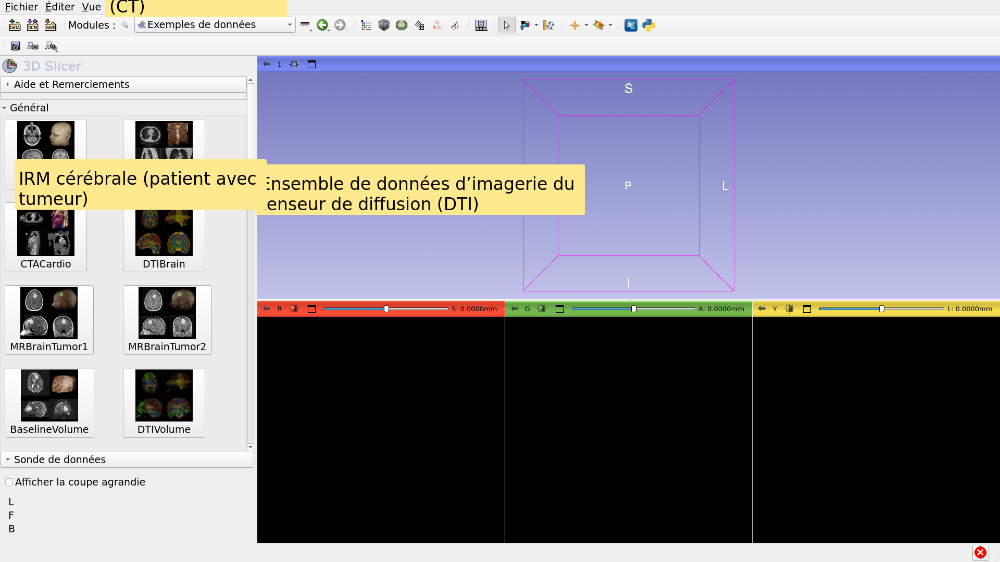

---

## Exemple de données

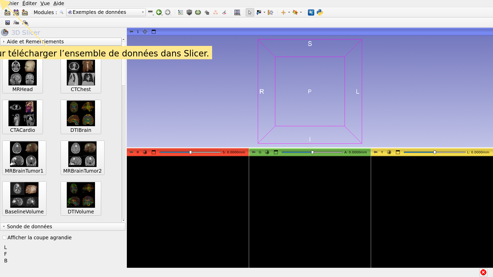

---

## Exemple de données

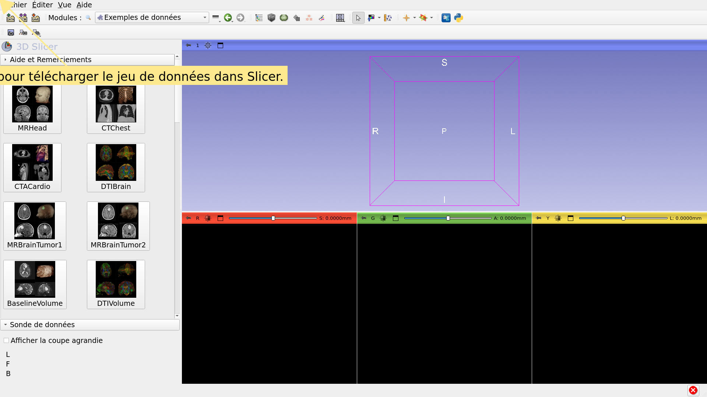

---

## Module Bienvenue

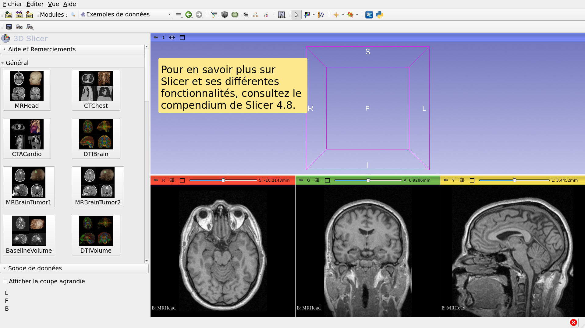

---

## Jeu de données d’exemple IRM du cerveau

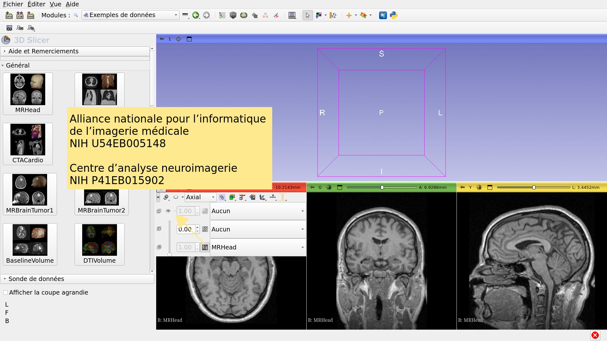

---

## Jeu de données d’exemple IRM du cerveau

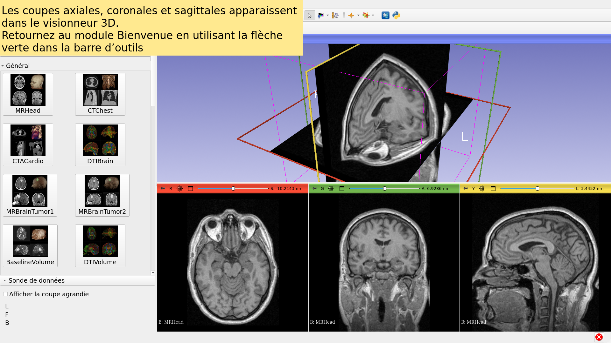

---

## Jeu de données d’exemple IRM du cerveau

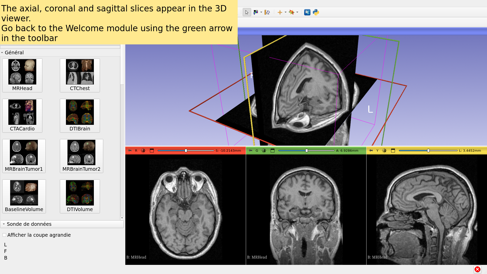

---

## Pour aller plus loin

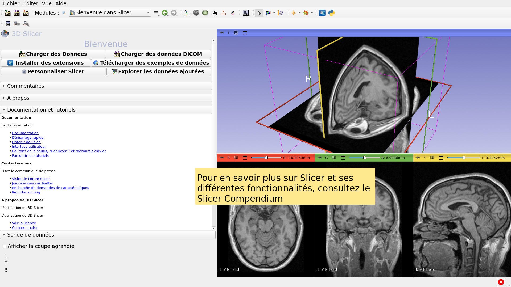

---

## Pour aller plus loin

https://training.slicer.org/

---

# Remerciements

National Alliance for Medical Image

Computing

NIH U54EB005149

Neuroimage Analysis Center

NIH P41EB015902

Chan Zuckerberg Initiative (CZI)

---
