

# Slicer üdvözlő

Sonia Pujol, Ph.D.

Radiológiai adjunktus

Brigham and Women's Hospital

Harvard Medical School

---

## Cél

Ez az oktatóanyag rövid bevezetést nyújt a Slicer nyílt forráskódú szoftver üdvözlő moduljába.

---

## Slicer5 alapismeretek

*A Slicer egy nyílt forráskódú szoftver orvosi képalkotó adatok szegmentálásához, regisztrációjához és megjelenítéséhez.

*A platformot több NIH által finanszírozott nagy méretű konzorcium többintézményes összefogásával fejlesztik.

*A Slicer kizárólag orvosi kutatási célokra készült, és nem rendelkezik FDA-jóváhagyással. 

---

## Slicer5 alapismeretek

A 3D Slicer 5 (5.10.0-s verzió) több mint 100 modult és több mint 190 bővítményt tartalmaz orvosi képalkotó adatok képszegmentálásához, regisztrációjához és 3D-s megjelenítéséhez.

---

## Támogatott platformok

*A Slicer egy többplatformos szoftver, amelyet Mac OSX, Linux és Windows rendszereken fejlesztenek és tartanak karban.

*A Slicer minimálisan 2 GB RAM-ot és legalább 64 MB beépített grafikai memóriával rendelkező dedikált grafikus gyorsítót igényel. 

---

## Üdvözöljük a Slicerben

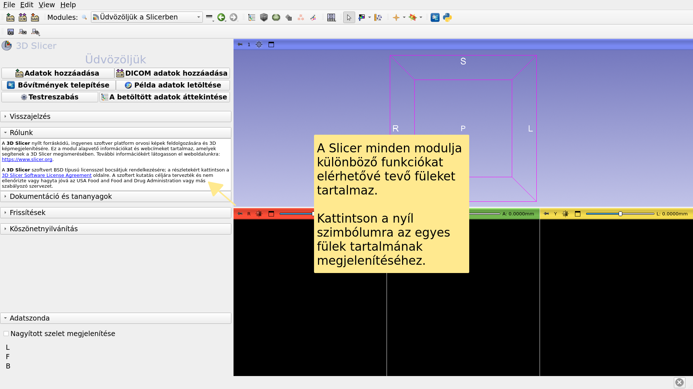

---

## A Slicer felhasználói felülete

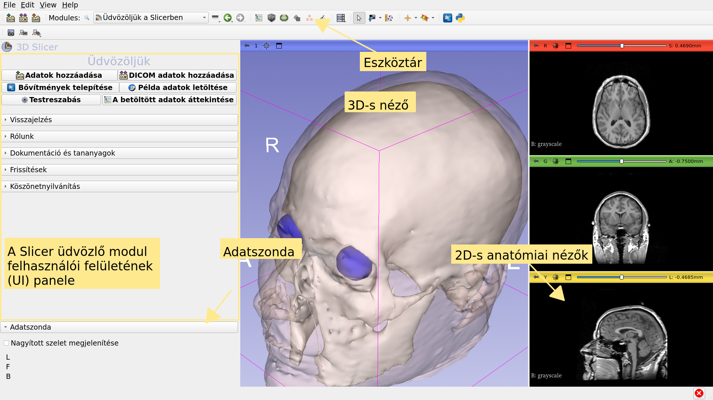

---

## Üdvözlő modul

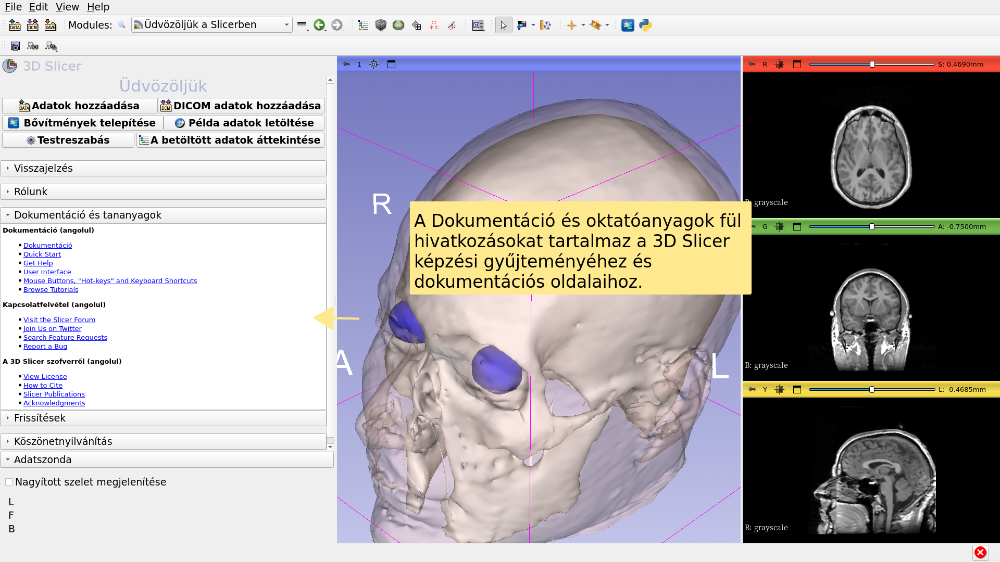

---

## Üdvözlő modul

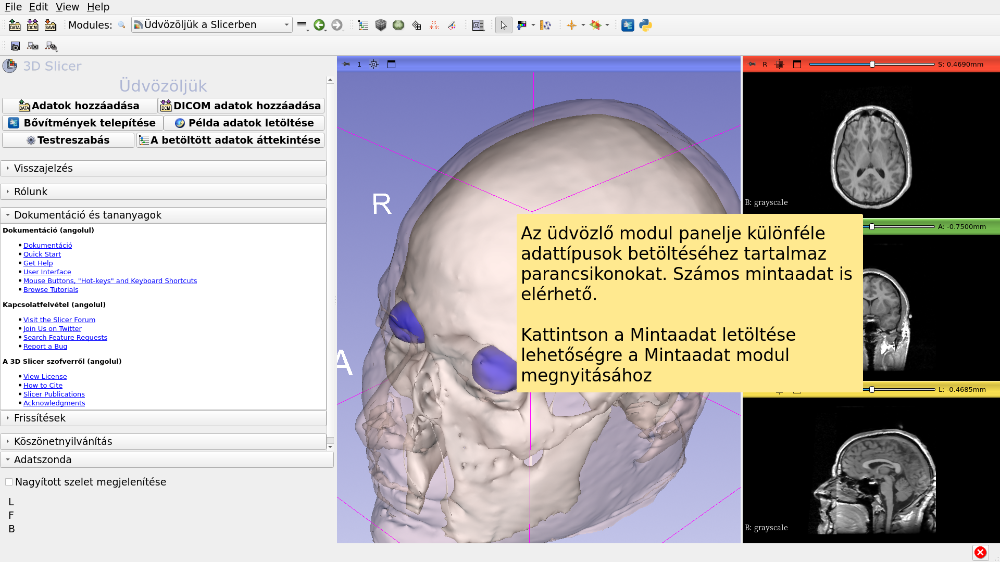

---

## Mintaadatok

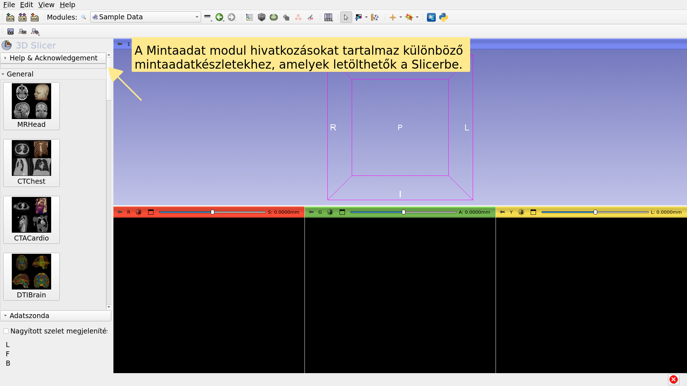

---

## Mintaadatok

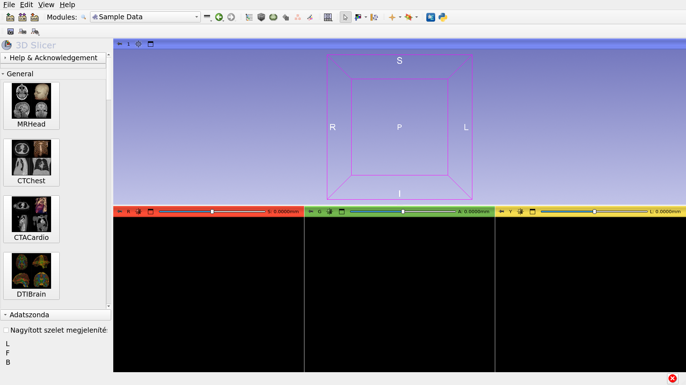

---

## Mintaadatok

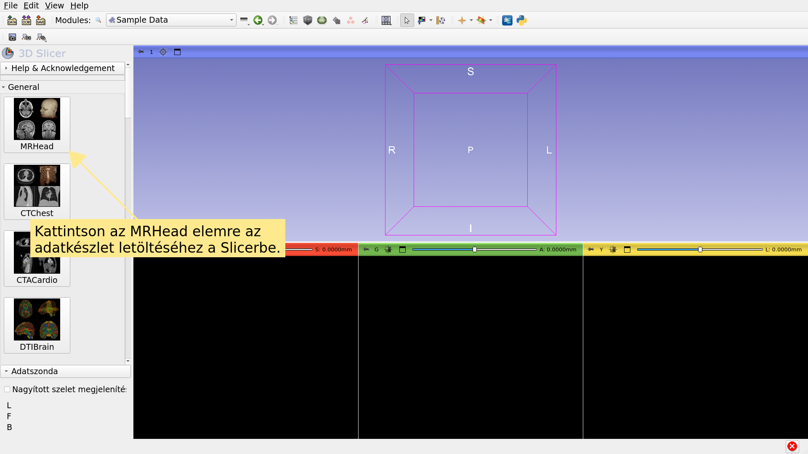

---

## Üdvözlő modul

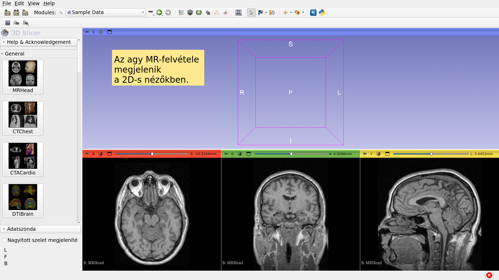

---

## Agy MR-mintaadatkészlet

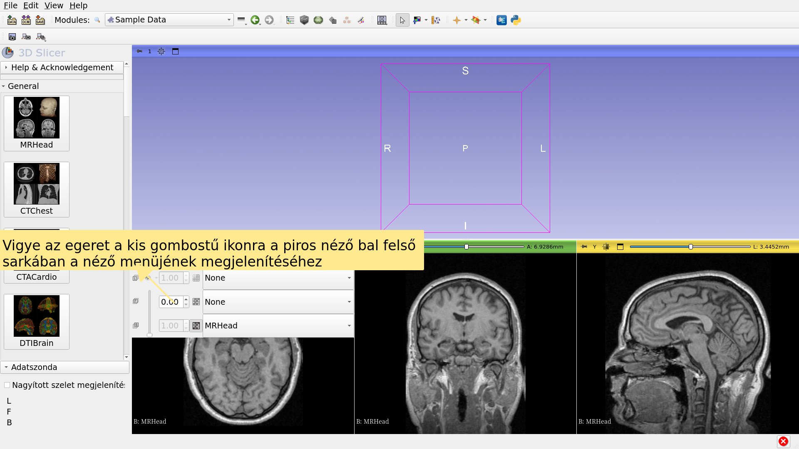

---

## Agy MR-mintaadatkészlet

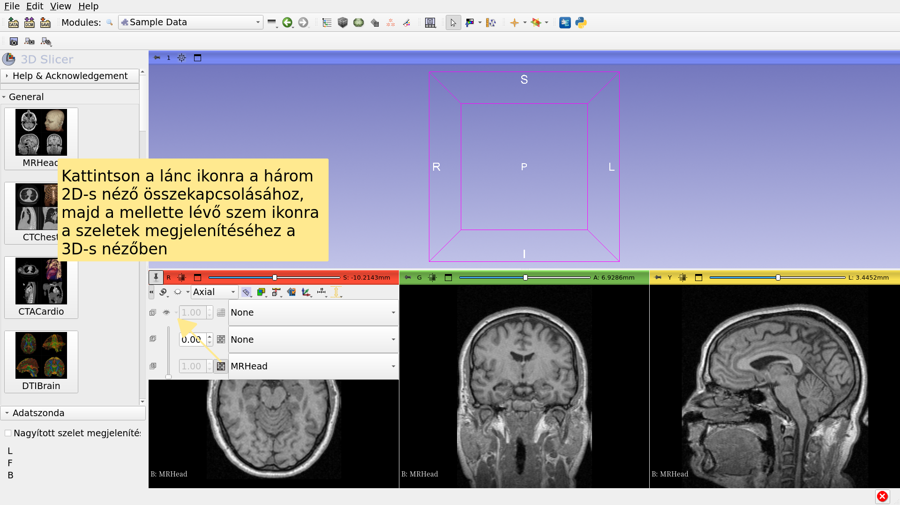

---

## Agy MR-mintaadatkészlet

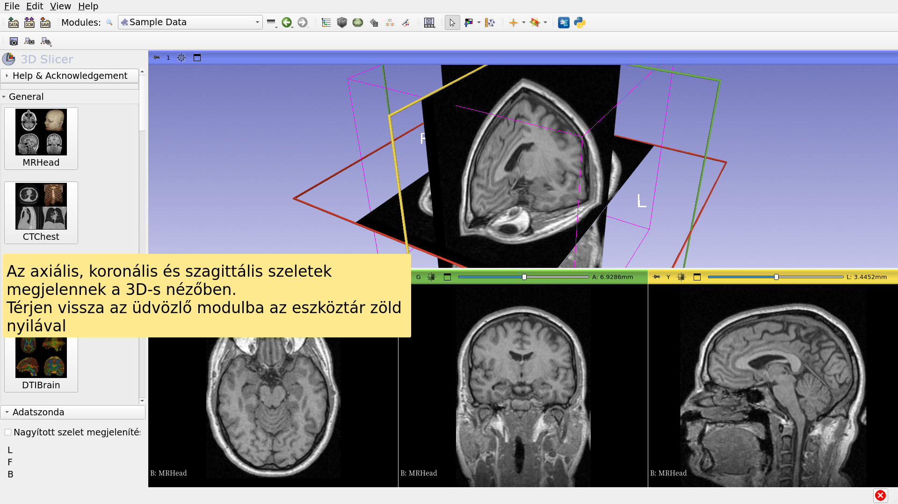

---

## Továbblépés

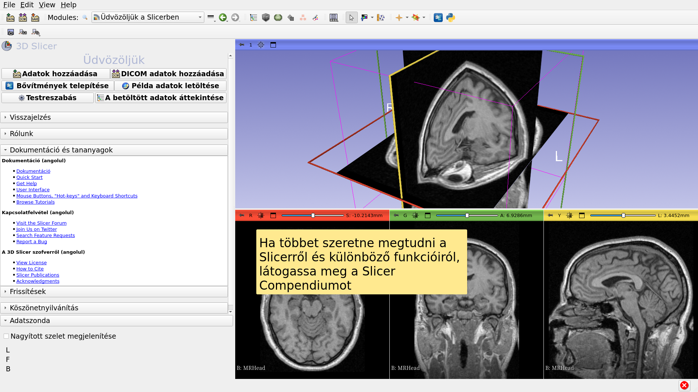

---

## Továbblépés

https://training.slicer.org/

---

# Köszönetnyilvánítás

National Alliance for Medical Image

Computing

NIH U54EB005149

Neuroimage Analysis Center

NIH P41EB015902

Chan Zuckerberg Initiative (CZI)

---
