

# Bem-vindo ao Slicer

Sonia Pujol, Ph.D.

Professor Assistente de Radiologia
Hospital Brigham and Women's
Faculdade de Medicina de Harvard

---

# Slicer Welcome

Sonia Pujol, Ph.D.

Professor Assistente de Radiologia
Hospital Brigham and Women's
Faculdade de Medicina de Harvard

---

## Objetivo

Este tutorial é uma breve introdução ao módulo de boas-vindas do software de código aberto Slicer.

---

## Slicer5 Basics

*Slicer é um software de código aberto para segmentação, registro e visualização de dados de imagens médicas. 

*A plataforma foi desenvolvida por meio de um esforço multi-institucional, com vários consórcios de grande escala financiados pelo NIH.

*O Slicer destina-se exclusivamente à pesquisa médica e não possui aprovação da FDA. 

---

## Básico do Slicer5

O 3D Slicer 5 versão 5.10.0 inclui mais de 100 módulos e mais de 190 extensões para segmentação de imagens, registro e visualização 3D de dados de imagens médicas.

---

## Plataformas Suportadas

*O Slicer é um software multiplataforma desenvolvido e mantido para Mac OSX, Linux e Windows.

*O Slicer requer, no mínimo, 2 GB de RAM e uma placa de vídeo dedicada com 64 MB de memória gráfica integrada. 

---

## Bem-vindo ao Slicer

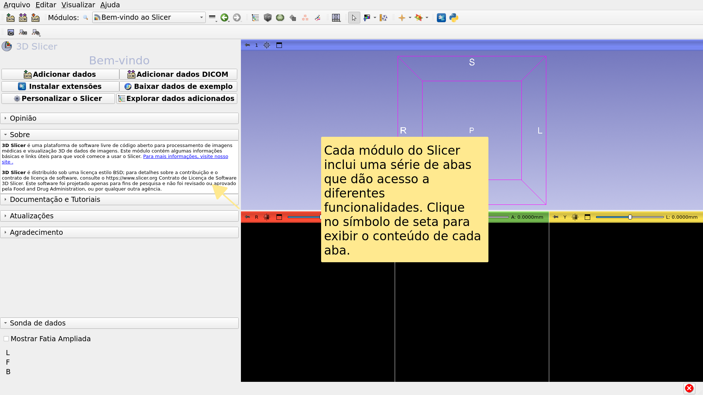

---

## Interface do Usuário no Slicer

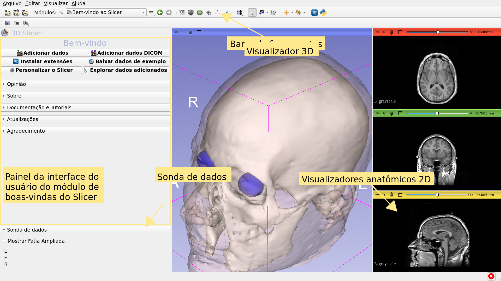

---

## Welcome Module

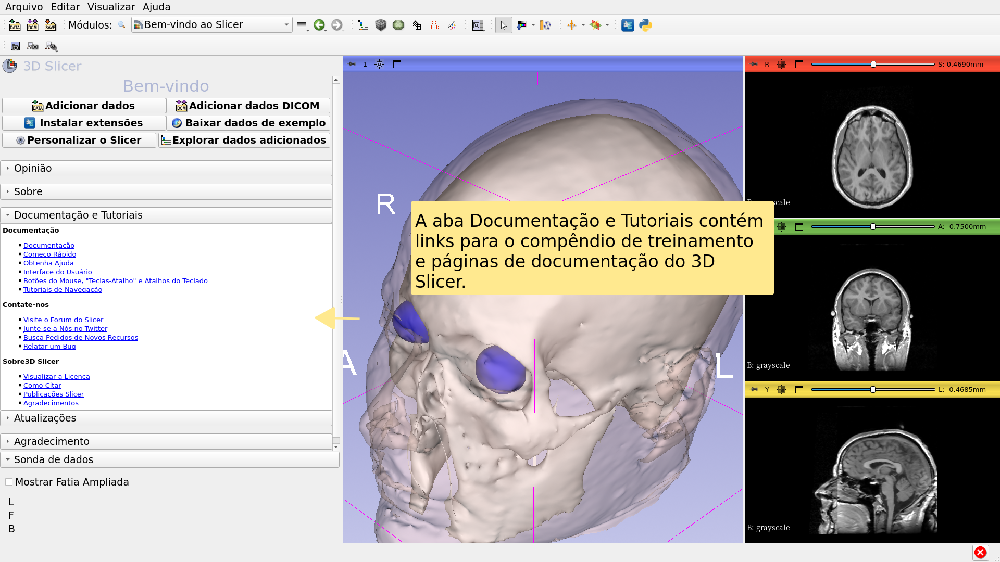

---

## Welcome Module

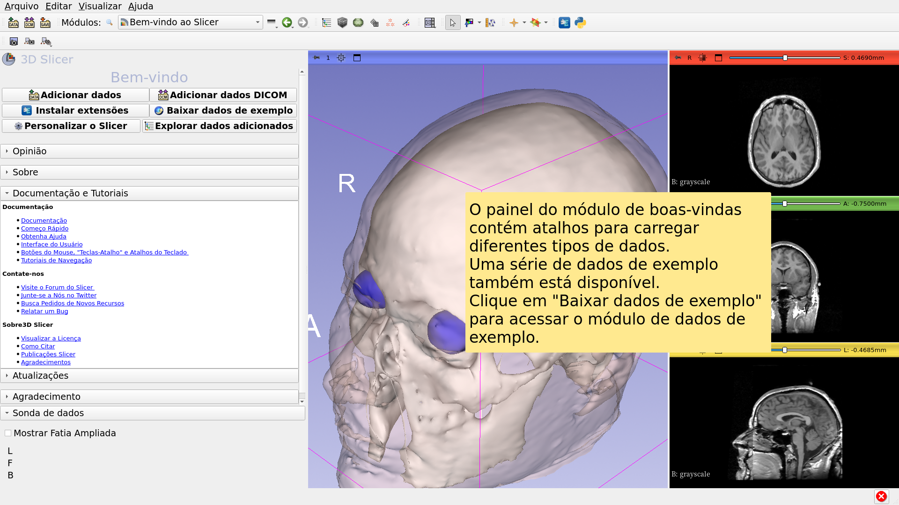

---

## Sample Data

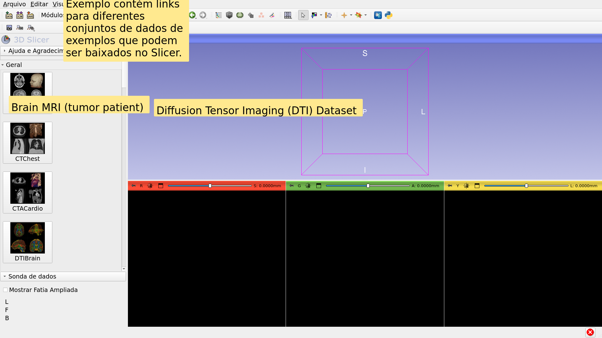

---

## Sample Data

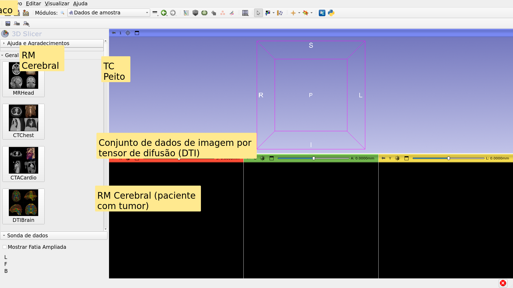

---

## Dados de Exemplo

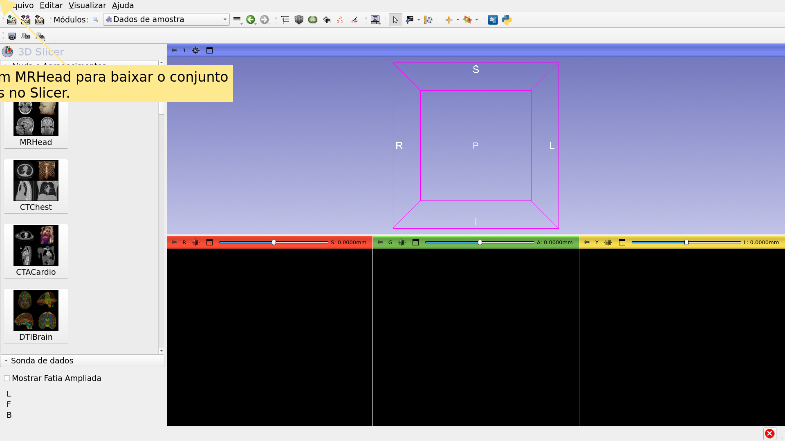

---

## Modulo de Boas-vindas

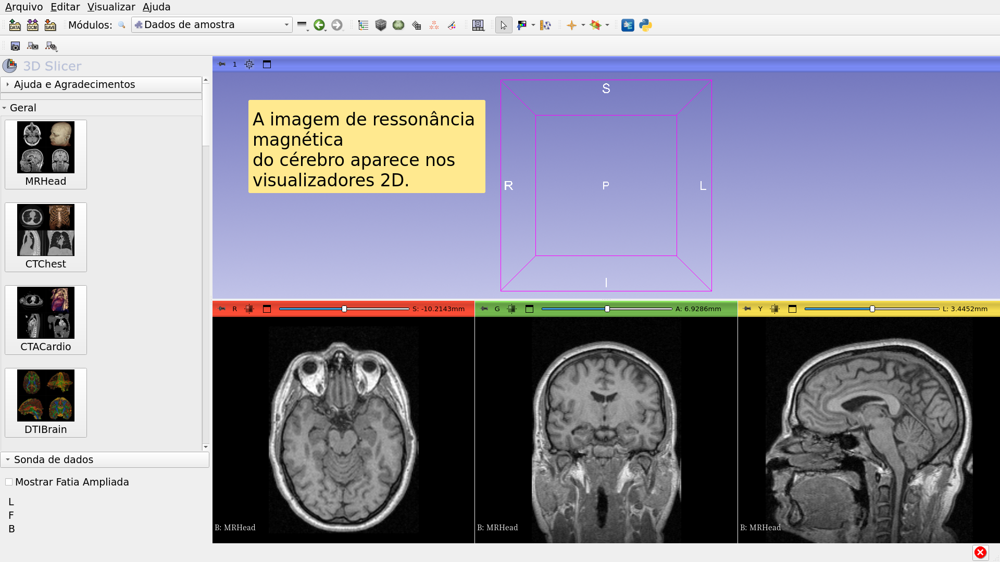

---

## MR Brain Sample Dataset

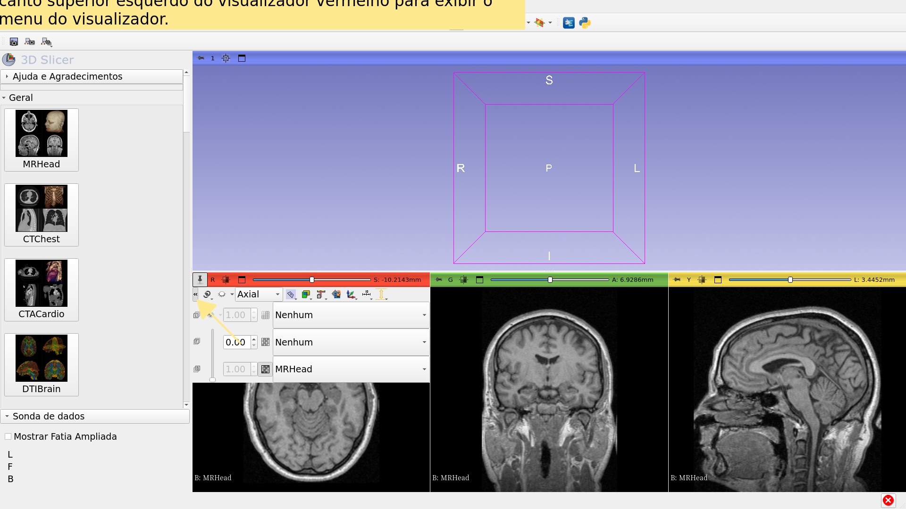

---

## MR Brain Sample Dataset

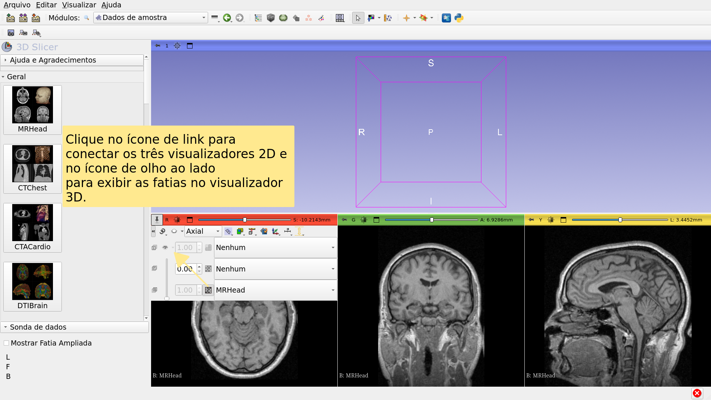

---

## RM Cerebral conjunto de dados de exemplo

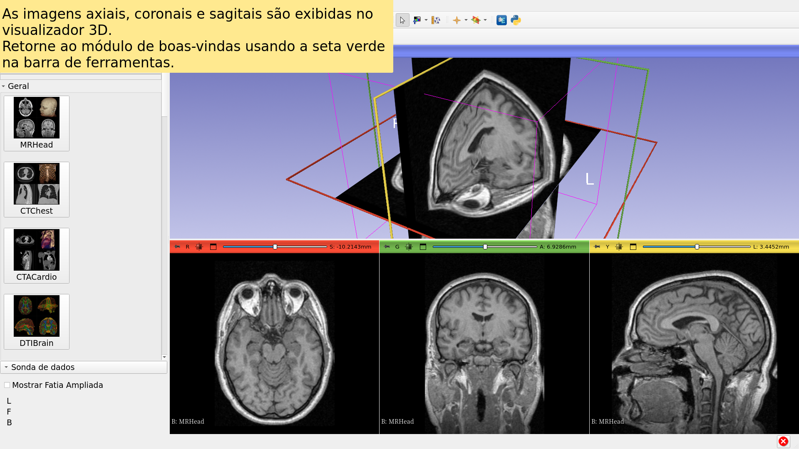

---

## Going Further

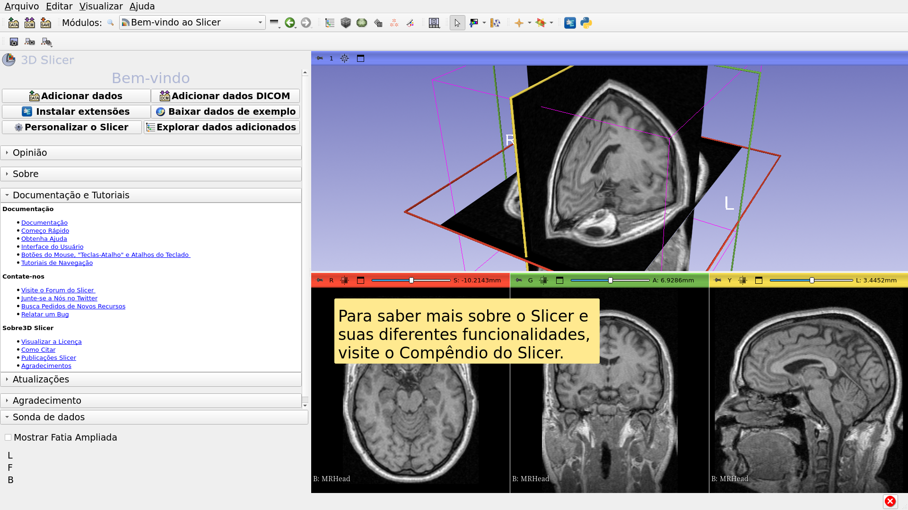

---

## Indo Além

https://training.slicer.org/

---

# Agradecimentos

Aliança Nacional para Computação de

Imagens Médicas

NIH U54EB005149

Centro de Análise de Neuroimagens

NIH P41EB015902 

Iniciativa Chan Zuckerberg (CZI)

---
