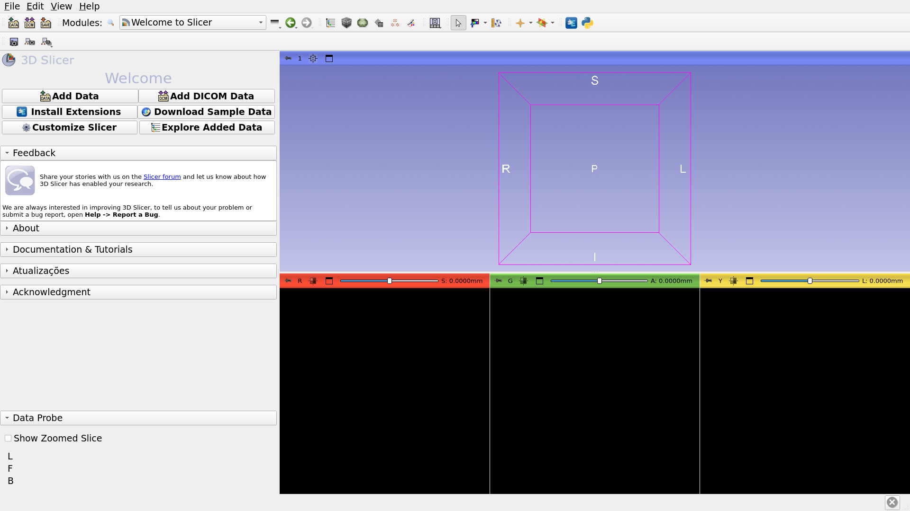
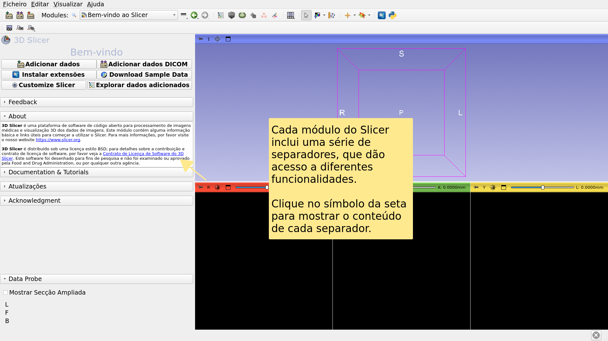
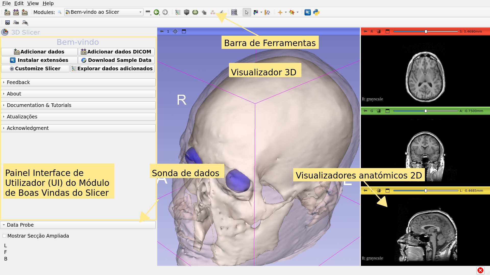
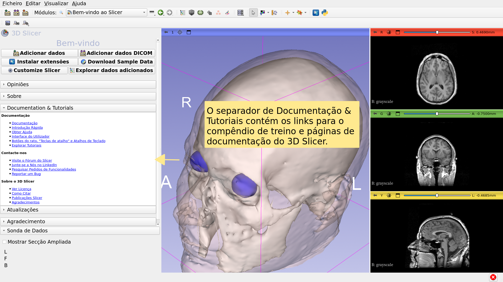
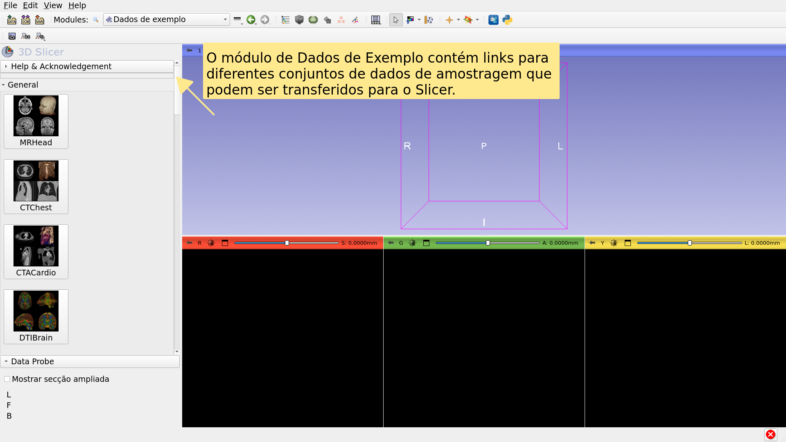
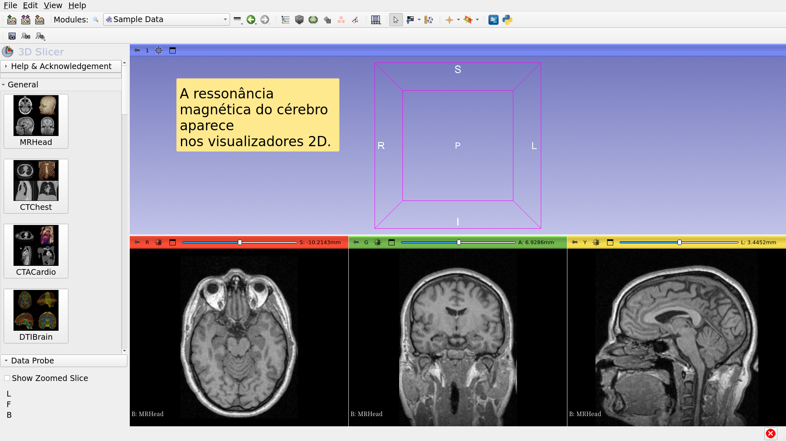
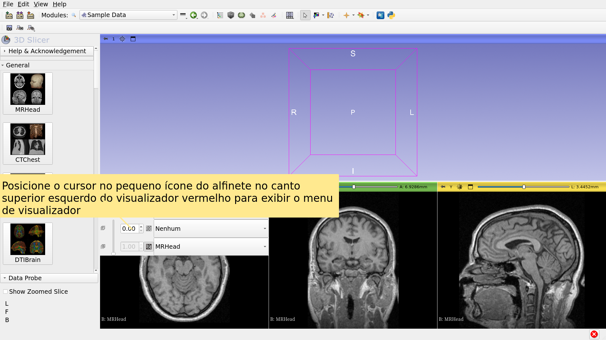
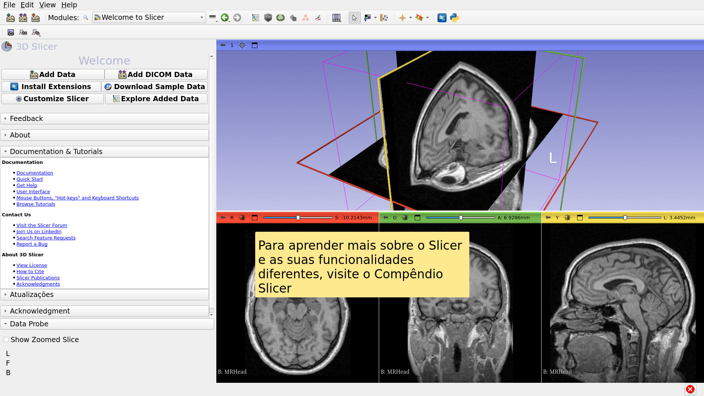

# Slicer Bem Vindo

Sonia Pujol, Ph.D.

Professor Assistente de Radiologia

Brigham and Women’s Hospital

Harvard Medical School

---

## Objetivo

Este tutorial é uma pequena introdução ao módulo de Boas Vindas do software open-source Slicer.

---

## Slicer5 Básicos

*Slicer é um software open source para segmentação, registo e visualização de imagiologia médica.

*A plataforma é desenvolvida através de um esforço multi institucional de vários consórcios de grande escala financiados pelo NIH.

*Slicer é para pesquisa médica apenas, e não é aprovado pela FDA. 

---

## Slicer5 Básicos

3D Slicer 5 versão 5.10.0 inclui mais de 100 módulos e mais de 190 extensões para segmentação de imagem, registo e visualização 3D de dados de imagiologia médica.

---

## Plataformas Compatíveis

*Slicer é um software multi plataforma desenvolvido e mantido em Mac OSX, Linux and Windows.

*Slicer requer um mínimo de 2 GB of RAM e um acelerador gráfico dedicado com 64 MB de memória gráfica na placa. 

---

## Bem Vindo ao Slicer

---

## Interface de Utilizador do Slicer

---

## Módulo de Boas Vindas

---

## Módulo de Boas Vindas

---

## Dados da Amostragem

---

## Dados da Amostragem

---

## Dados da Amostragem

---

## Módulo de Boas Vindas

---

## Conjunto de Dados Exemplo da RM do Cérebro

---

## Conjunto de Dados Exemplo da RM do Cérebro

---

## Conjunto de Dados Exemplo da RM do Cérebro

---

## Indo Mais Além

---

## Indo Mais Além

https://training.slicer.org/

---

# Agradecimentos

National Alliance for Medical Image

Computing

NIH U54EB005149

Neuroimage Analysis Center

NIH P41EB015902

Chan Zuckerberg Initiative (CZI)

---
