

# ச்லைசர் வரவேற்கிறோம்

சோனியா புசோல், Ph.D.

கதிரியக்கவியல் உதவிப் பேராசிரியர் 

பிரிகாம் மற்றும் மகளிர் மருத்துவமனை 

ஆர்வர்ட் மருத்துவப் பள்ளி

---

## இலக்கு

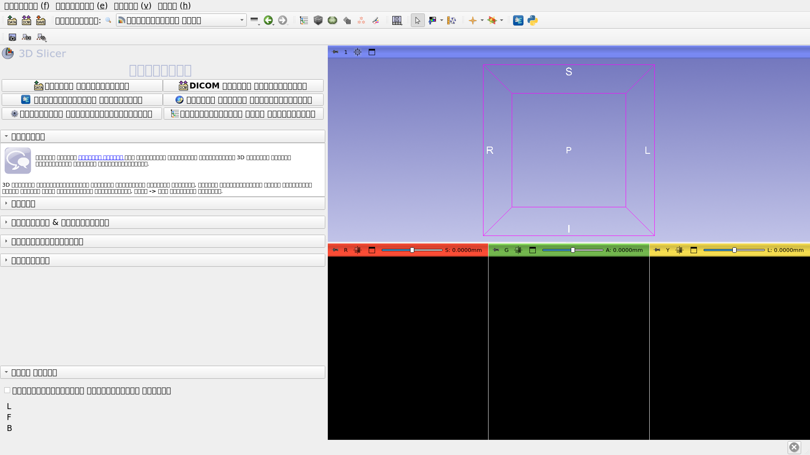

இந்த டுடோரியல் ச்லைசர் ஓப்பன் சோர்ச் மென்பொருளின் வரவேற்பு தொகுதிக்கான ஒரு சிறிய அறிமுகமாகும்.

---

## Slicer5 அடிப்படைகள்

*Slicer என்பது மருத்துவ இமேசிங் தரவைப் பிரித்தல், பதிவு செய்தல் மற்றும் காட்சிப்படுத்துதல் ஆகியவற்றுக்கான ஒரு திறந்த மூல மென்பொருளாகும். 

*பல NIH நிதியுதவி பெற்ற பெரிய அளவிலான கூட்டமைப்புகளின் பல நிறுவன முயற்சியின் மூலம் இயங்குதளம் உருவாக்கப்பட்டுள்ளது. 

*ச்லைசர் மருத்துவ ஆராய்ச்சிக்காக மட்டுமே, FDA அங்கீகரிக்கப்படவில்லை. 

---

## Slicer5 அடிப்படைகள்

3D ச்லைசர் 5 பதிப்பு 5.10.0 ஆனது 100 க்கும் மேற்பட்ட தொகுதிகள் மற்றும் படப் பிரிவு, பதிவு மற்றும் மருத்துவ இமேசிங் தரவின் 3D காட்சிப்படுத்தல் ஆகியவற்றிற்கான 190 க்கும் மேற்பட்ட நீட்டிப்புகளை உள்ளடக்கியது.

---

## ஆதரிக்கப்படும் தளங்கள்

*Slicer என்பது Mac OSX, Linux மற்றும் சாளரங்கள் இல் உருவாக்கப்பட்டு பராமரிக்கப்படும் பல-தளம் மென்பொருளாகும். 

*ச்லைசருக்கு குறைந்தபட்சம் 2 சிபி ரேம் மற்றும் 64 எம்பி ஆன்-போர்டு கிராஃபிக் மெமரியுடன் கூடிய பிரத்யேக கிராஃபிக் முடுக்கி தேவை. 

---

## ச்லைசருக்கு வரவேற்கிறோம்

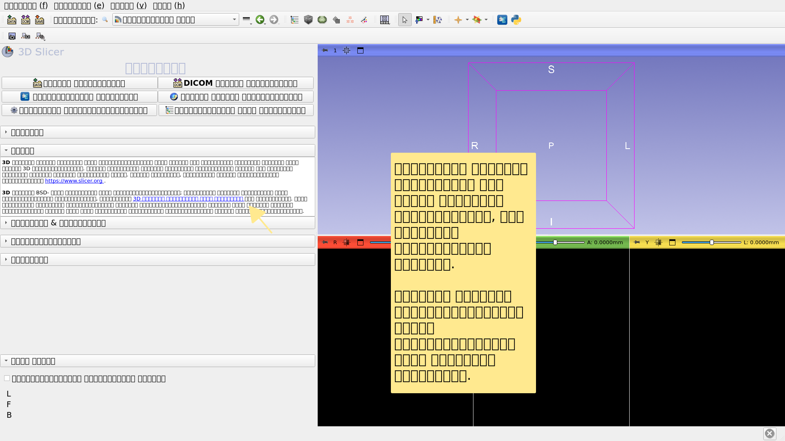

---

## ச்லைசர் பயனர் இடைமுகம்

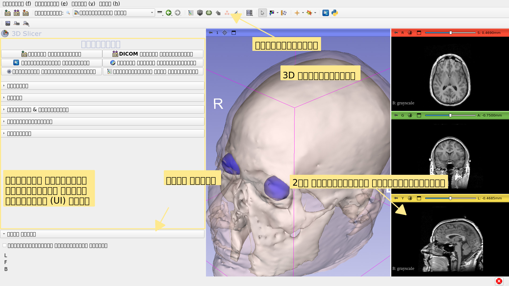

---

## வரவேற்பு தொகுதி

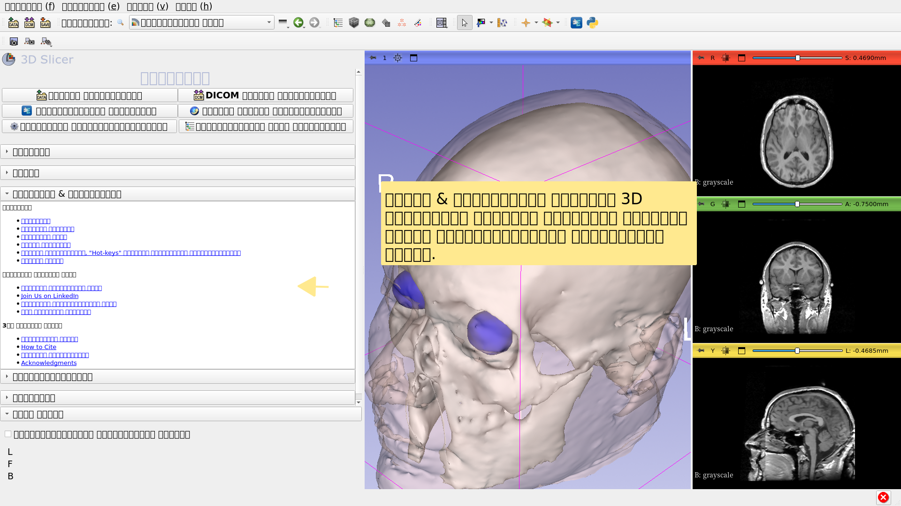

---

## வரவேற்பு தொகுதி

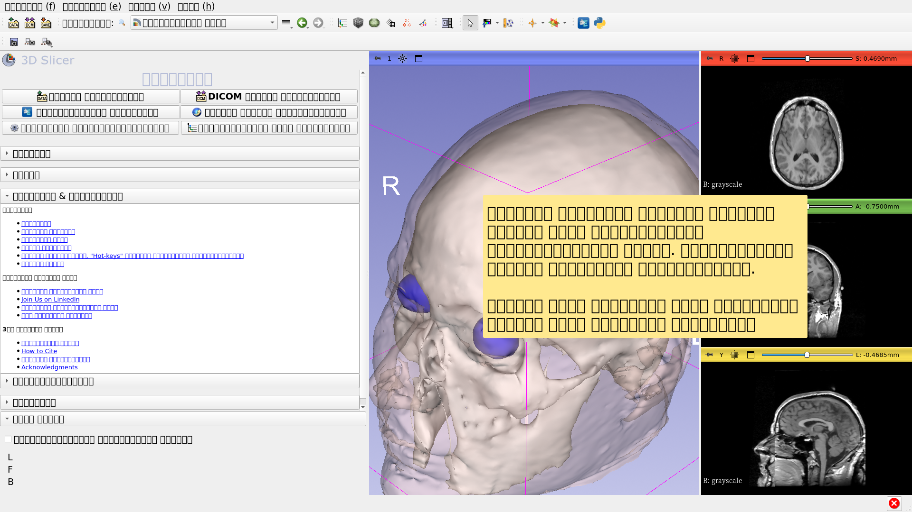

---

## மாதிரி தரவு

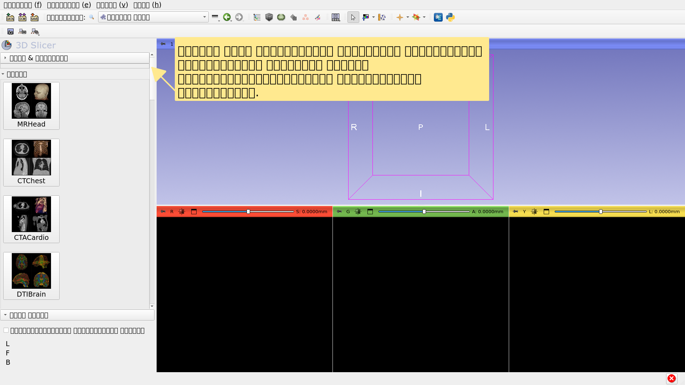

---

## மாதிரி தரவு

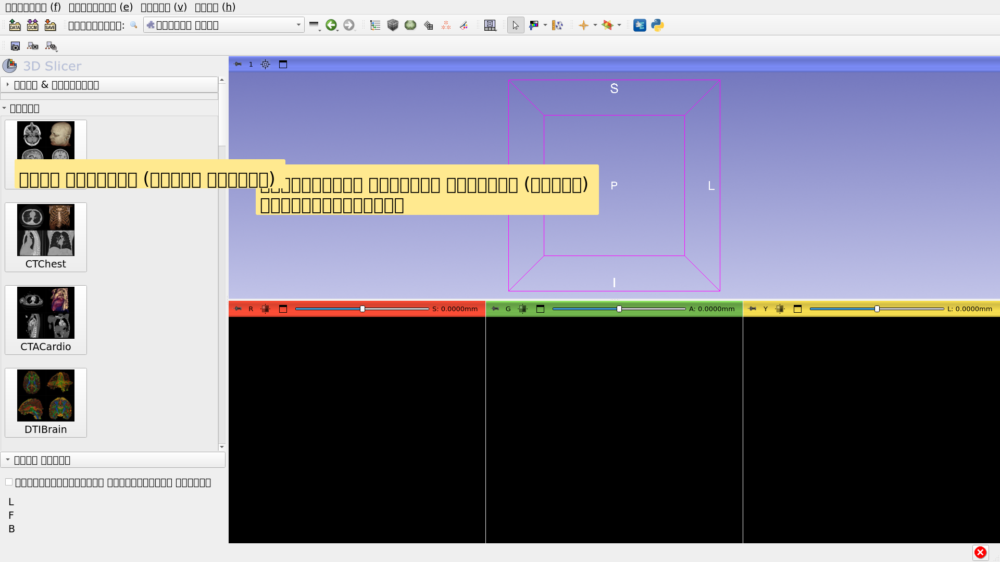

---

## மாதிரி தரவு

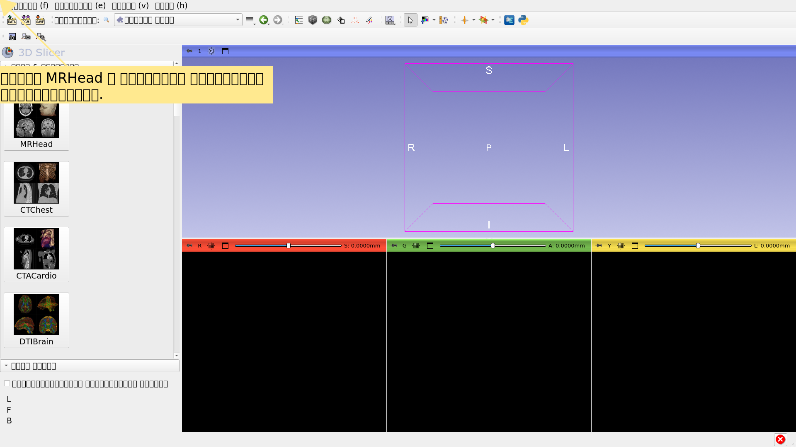

---

## வரவேற்பு தொகுதி

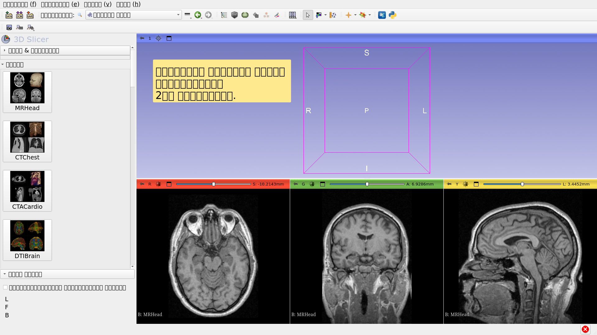

---

## எம்ஆர் மூளை மாதிரி தரவுத்தொகுப்பு

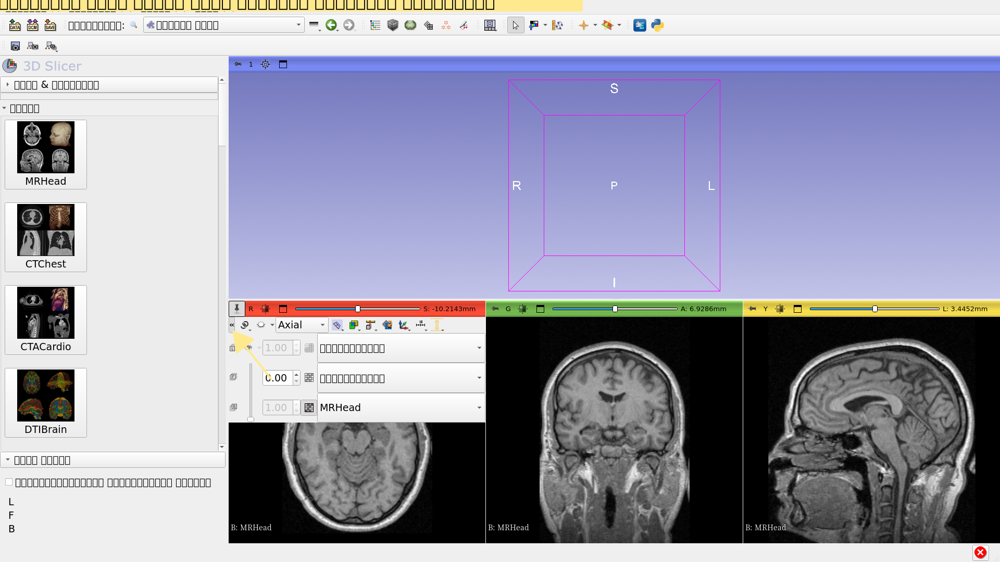

---

## எம்ஆர் மூளை மாதிரி தரவுத்தொகுப்பு

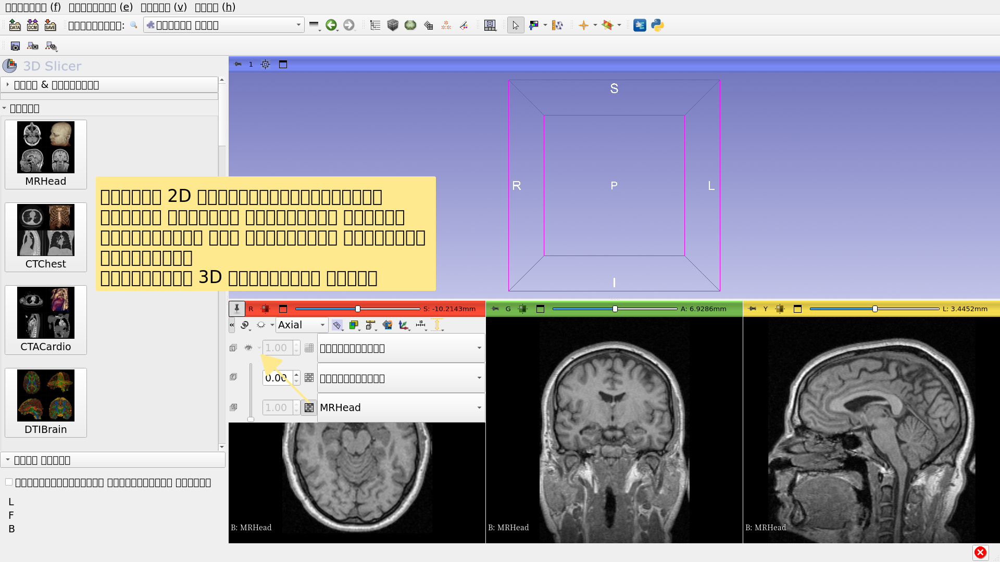

---

## எம்ஆர் மூளை மாதிரி தரவுத்தொகுப்பு

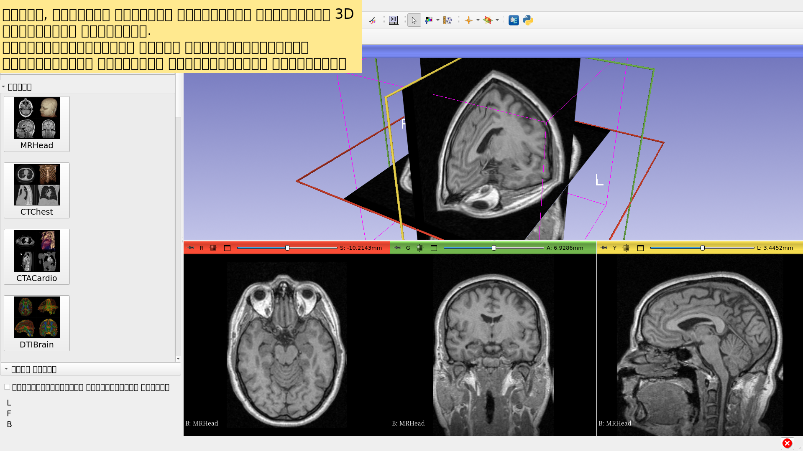

---

## மேலும் செல்கிறது

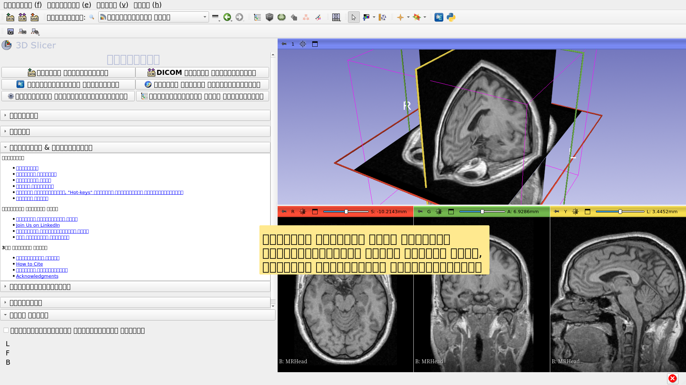

---

## மேலும் செல்கிறது

https://training.slicer.org/

---

# அங்கீகாரங்கள்

மருத்துவ படத்திற்கான தேசிய கூட்டணி 

கம்ப்யூட்டிங் 

NIH U54EB005149 

நியூரோஇமேச் பகுப்பாய்வு நடுவண் 

NIH P41EB015902 

சான் சுக்கர்பெர்க் முன்முயற்சி (CZI)

---
