

# Slicer 欢迎

索尼娅·普约尔，博士

放射科助理教授

布里格姆妇女医院

哈佛医学院

---

## 目标

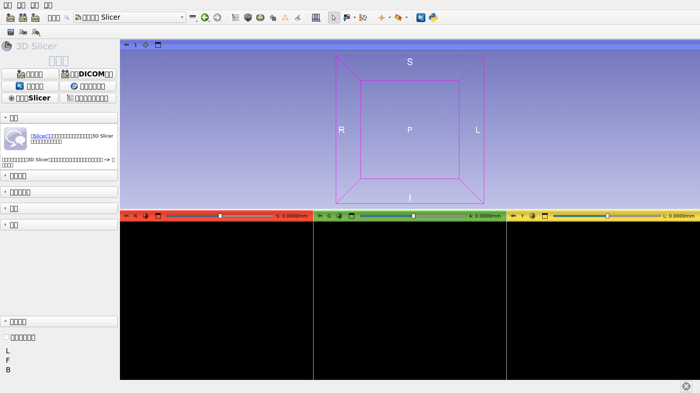

本教程简要介绍了开源软件 Slicer 的“欢迎”模块。

---

## Slicer5 基础知识

*Slicer 是一款用于医学影像数据分割、配准和可视化的开源软件。

*该平台是由多个由美国国立卫生研究院（NIH）资助的大型联盟通过多机构合作开发的。

*Slicer 仅用于医学研究，尚未获得美国食品药品监督管理局（FDA）的批准。

---

## Slicer5 基础知识

3D Slicer 5 5.10.0 版本包含 100 多个模块和 190 多个扩展，用于医学影像数据的图像分割、配准和 3D 可视化。

---

## 支持的平台

*Slicer 是一款在 Mac OS X、Linux 和 Windows 平台上开发和维护的多平台软件。

*Slicer 至少需要 2 GB 内存，以及一块配备 64 MB 板载显存的独立显卡。

---

## 欢迎使用 Slicer

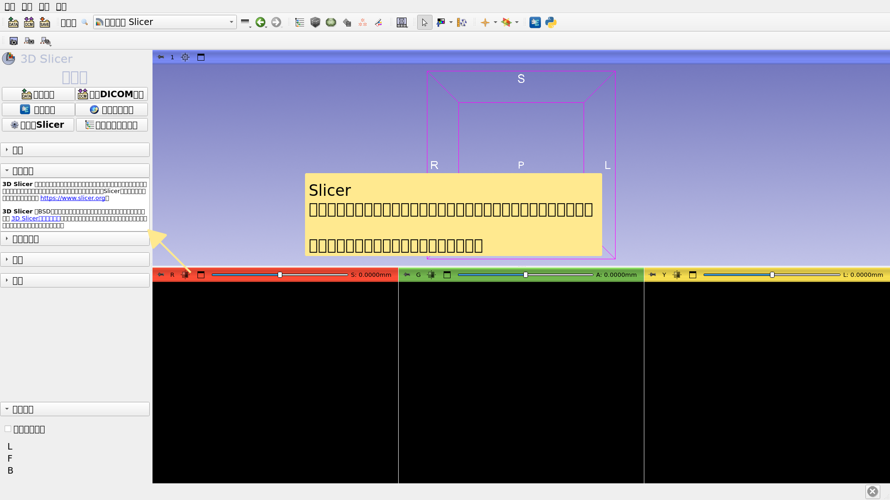

---

## Slicer 用户界面

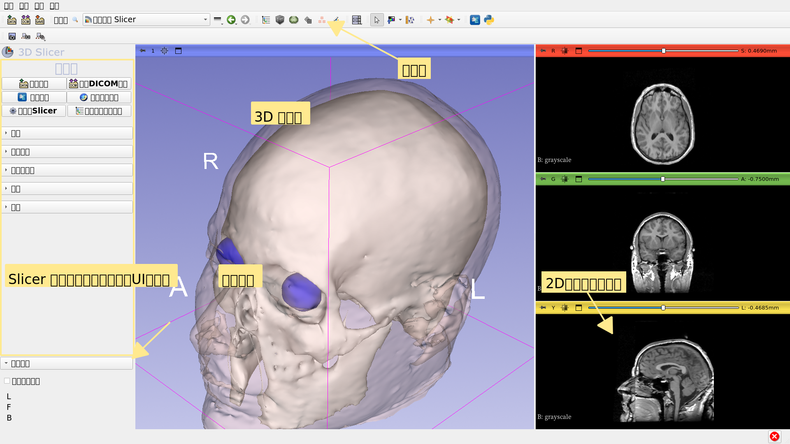

---

## 欢迎模块

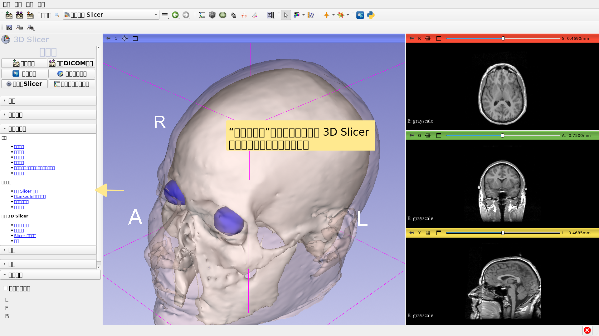

---

## 欢迎模块

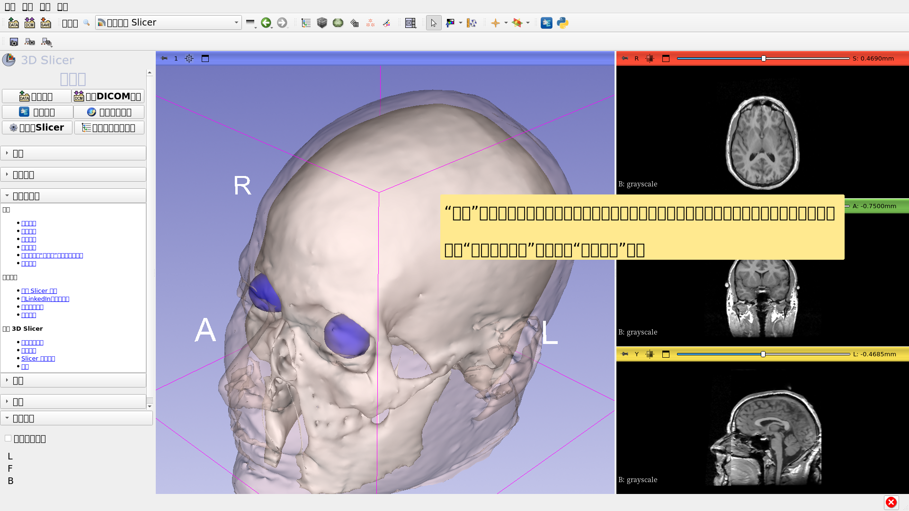

---

## 示例数据

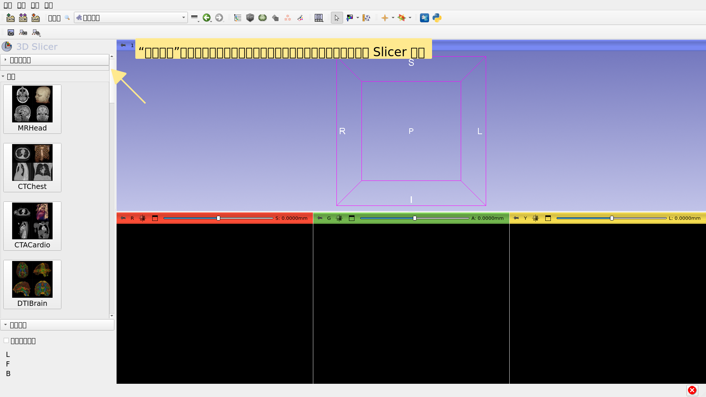

---

## 示例数据

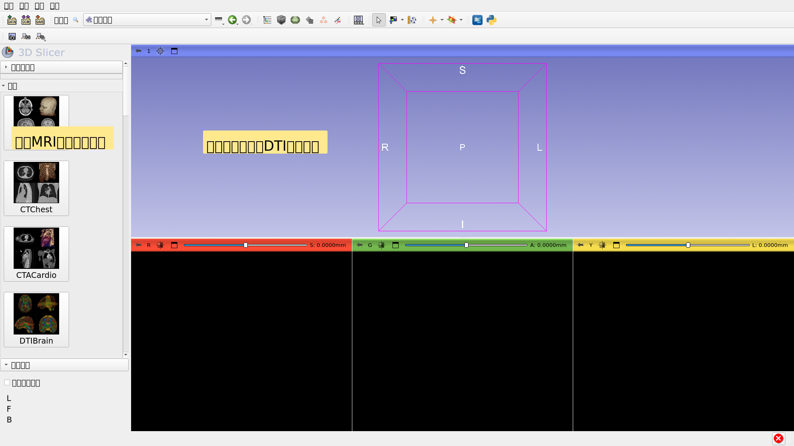

---

## 示例数据

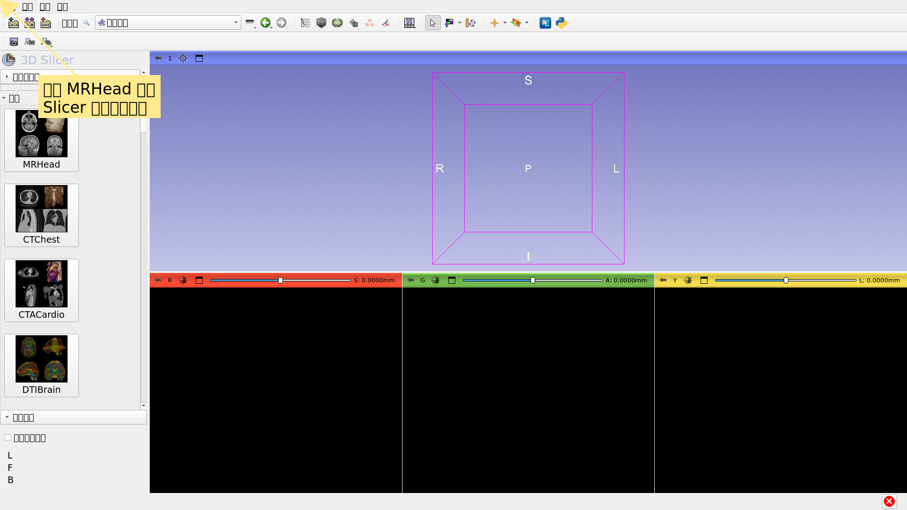

---

## 欢迎模块

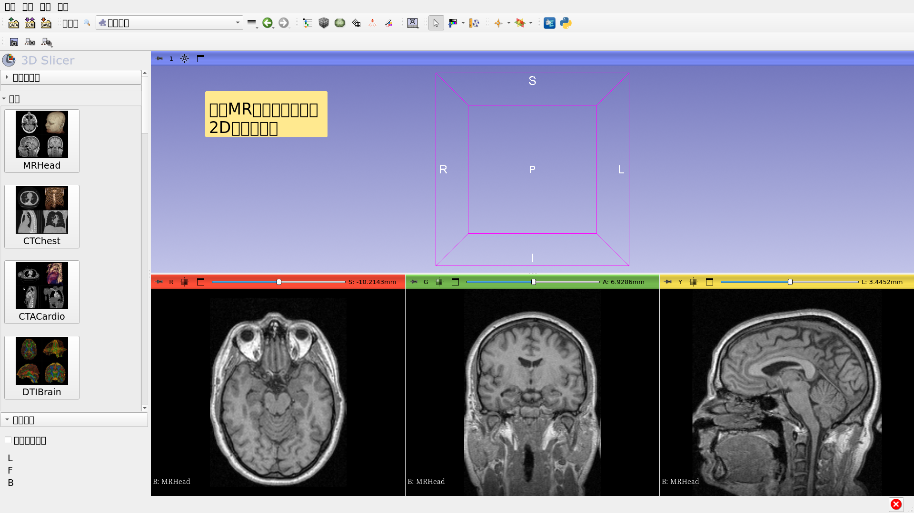

---

## MR脑组织样本数据集

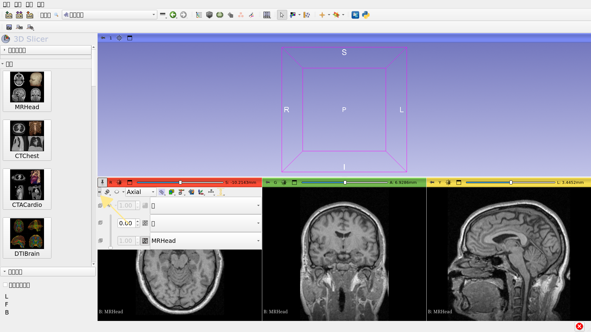

---

## MR脑组织样本数据集

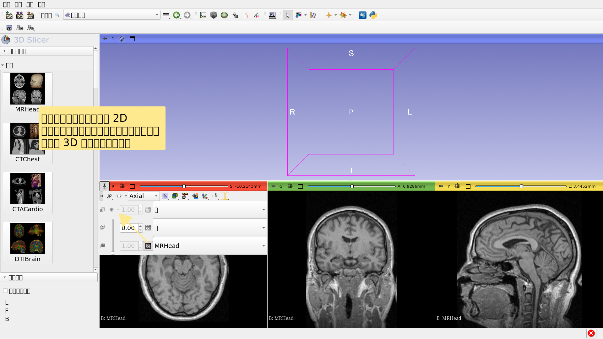

---

## MR脑组织样本数据集

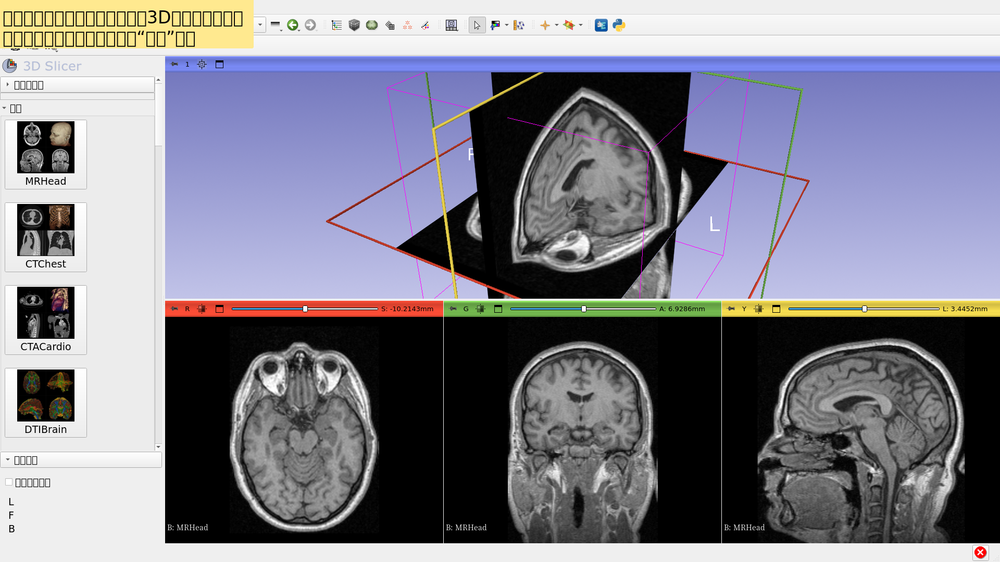

---

## 更进一步

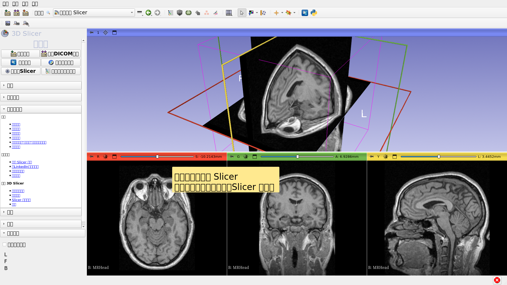

---

## 更进一步

https://training.slicer.org/

---

# 致谢

全国医学影像

计算联盟

NIH U54EB005149

神经影像分析中心

NIH P41EB015902

陈-扎克伯格倡议（CZI）

---
