

# 歡迎使用 Slicer

Sonia Pujol 博士

放射學助理教授

布萊根婦女醫院

哈佛醫學院

---

## 目標

本教學將簡短介紹 Slicer 開放原始碼軟體的歡迎模組。

---

## Slicer 5 基礎

*Slicer 是一套開放原始碼軟體，用於醫學影像資料的分割、配準及視覺化。

*此平台由多個獲 NIH 資助的大型聯盟，透過跨機構合作共同開發。

*Slicer 僅供醫學研究使用，尚未獲得 FDA 核准。 

---

## Slicer 5 基礎

3D Slicer 5 版本 5.10.0 包含超過 100 個模組及 190 多個擴充功能，可用於醫學影像資料的影像分割、配準及 3D 視覺化。

---

## 支援的平台

*Slicer 是一套多平台軟體，於 Mac OS X、Linux 及 Windows 平台上開發及維護。

*Slicer 至少需要 2 GB RAM，以及具備 64 MB 內建顯示記憶體的獨立顯示卡。 

---

## 歡迎使用 Slicer

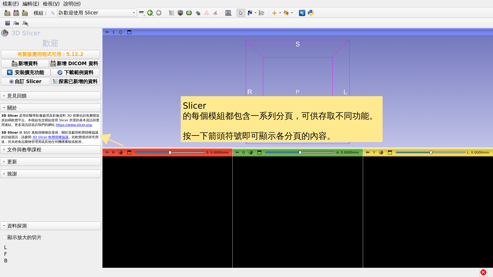

---

## Slicer 使用者介面

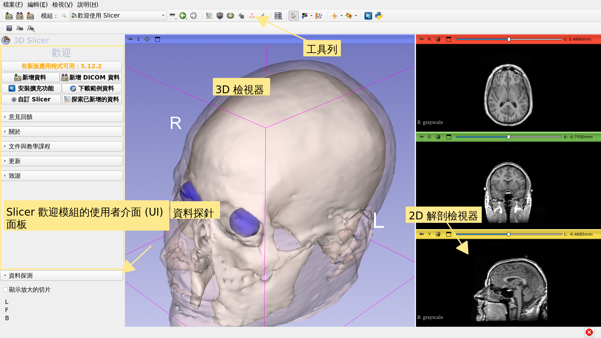

---

## 歡迎模組

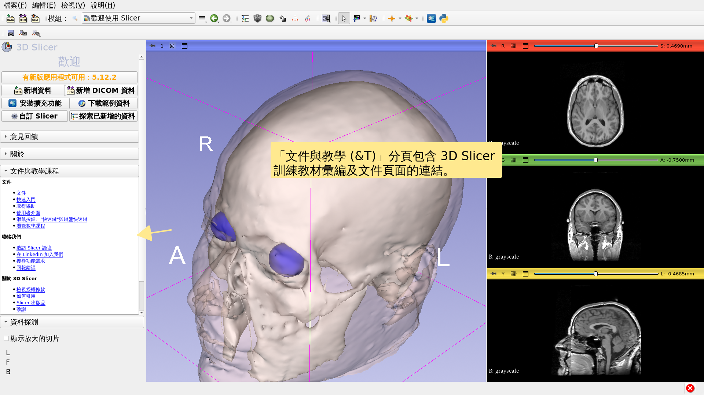

---

## 歡迎模組

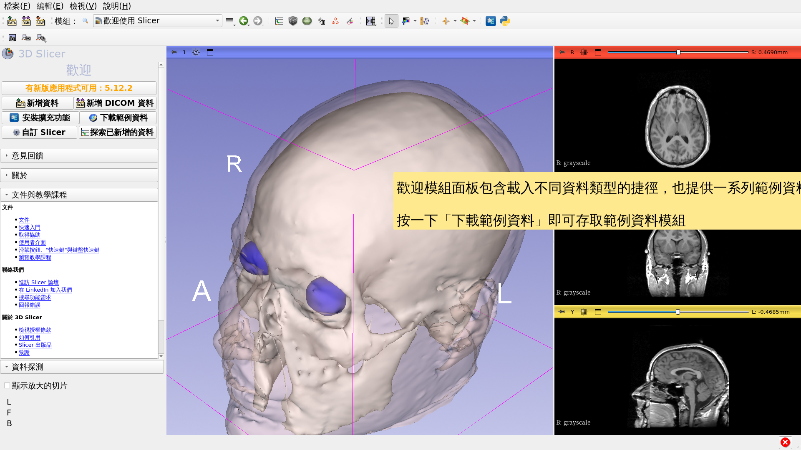

---

## 範例資料

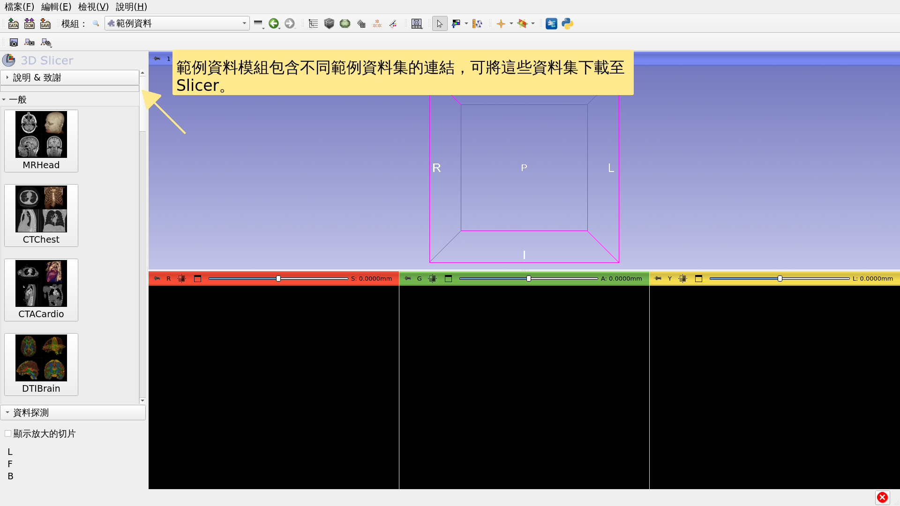

---

## 範例資料

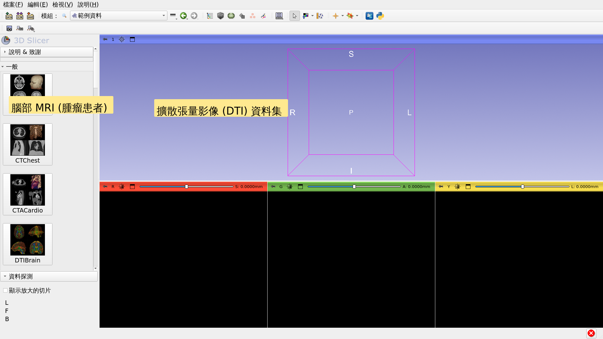

---

## 範例資料

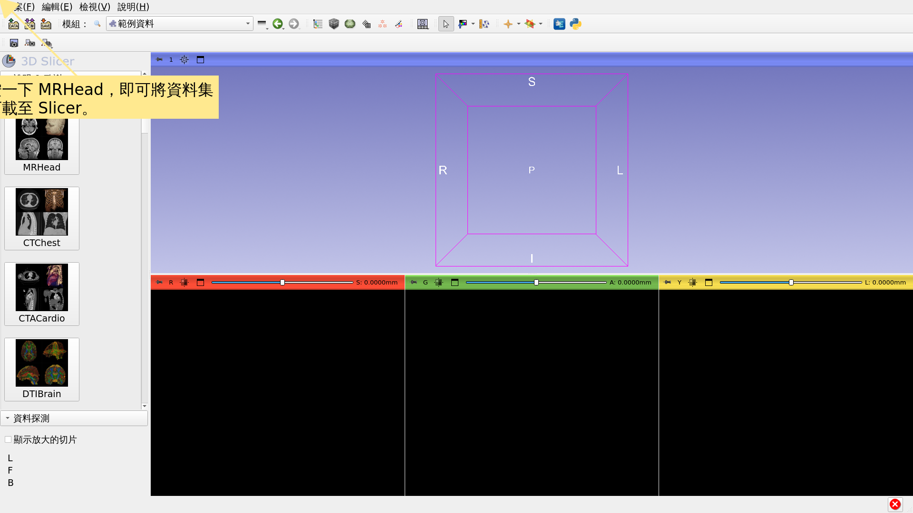

---

## 歡迎模組

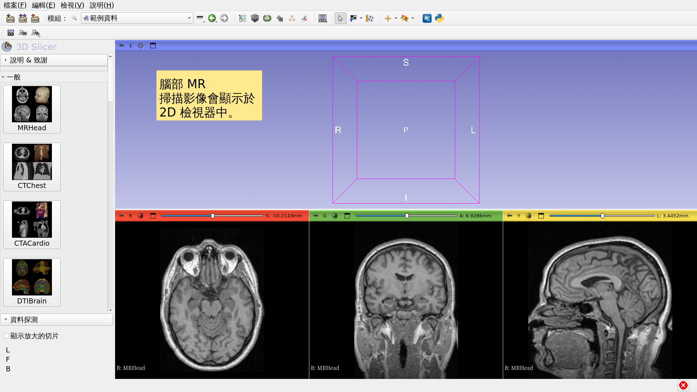

---

## 腦部 MR 範例資料集

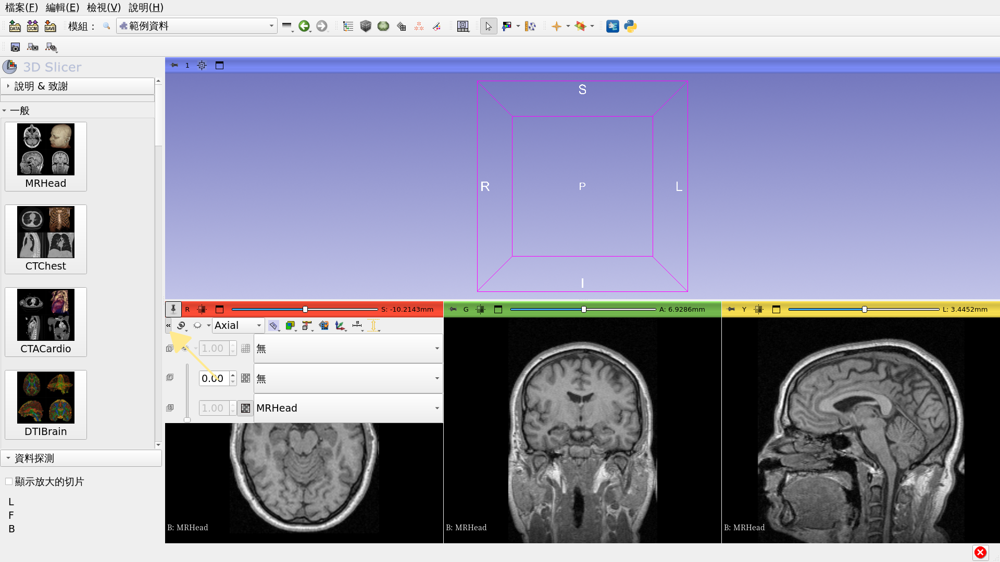

---

## 腦部 MR 範例資料集

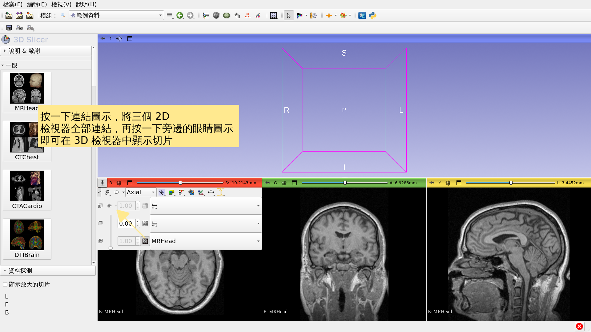

---

## 腦部 MR 範例資料集

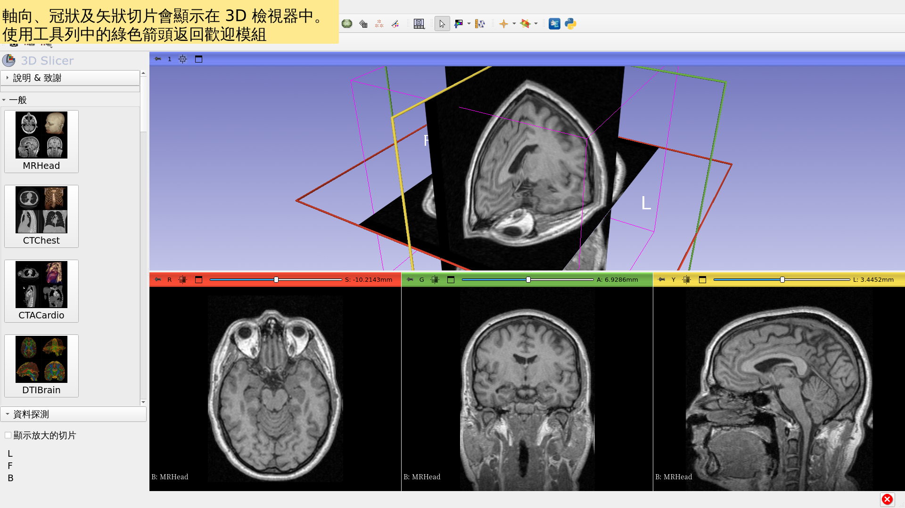

---

## 延伸學習

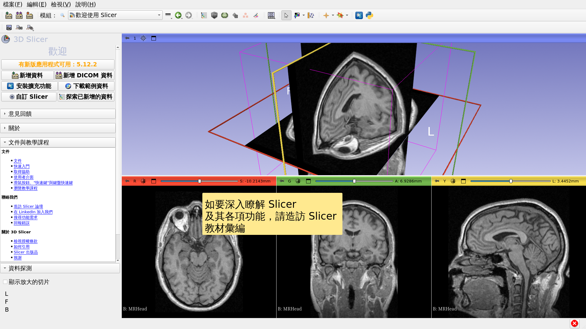

---

## 延伸學習

https://training.slicer.org/

---

# 致謝

國家醫學影像計算

聯盟

NIH U54EB005149

神經影像分析中心

NIH P41EB015902

Chan Zuckerberg Initiative (CZI)

---
