

# Slicer4 Minute

Sonia Pujol, Ph.D.

 

أستاذ مساعد في الأشعة
مستشفى بريغهام والنساء
كلية الطب بجامعة هارفارد

---

## دليل تعليمي مدته 4 دقائق حول برنامج Slicer

هذا البرنامج التعليمي هو مقدمة مدتها 4 دقائق لقدرات التصور ثلاثي الأبعاد لبرنامج Slicer5 لتحليل الصور الطبية. 

---

## برمجية Slicer5 ومجموعة البيانات

* قم بتنزيل برنامج Slicer5 المتاح على http://download.slicer.org

* قم بتنزيل مجموعة بيانات Slicer4minute المتاحة على https://www.slicer.org/wiki/Documentation/4.10/Training

---

## إصدار 5 من 3D Slicer

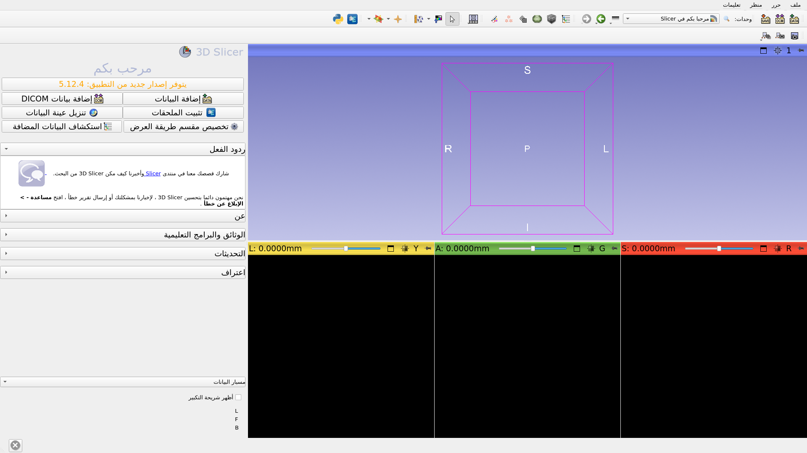

---

## مشهد 3D Slicer

*مشهد Slicer هو ملف MRML (لغة نمذجة الواقع الطبي) يحتوي على قائمة من العناصر المحملة في Slicer (وحدات التخزين والنماذج والنقاط المرجعية والتحويلات وما إلى ذلك).

*في المثال التالي، نستخدم مشهد "Slicer4minute.mrml" يتكون من فحص بالرنين المغناطيسي ونماذج ثلاثية الأبعاد للرأس.

*تم حفظ ملف المشهد ومجموعات البيانات كملف MRB (حزمة الواقع الطبي).

*تنسيق ملف MRB هو تنسيق ملف أرشيف Slicer.

---

## تحميل مجموعة بيانات Slicer4minute

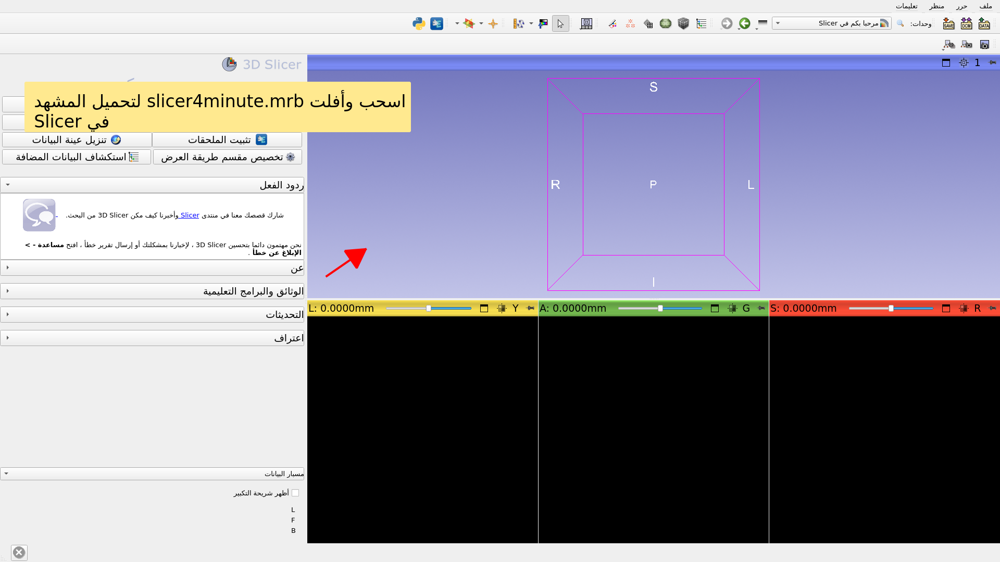

---

## مشهد Slicer4minute

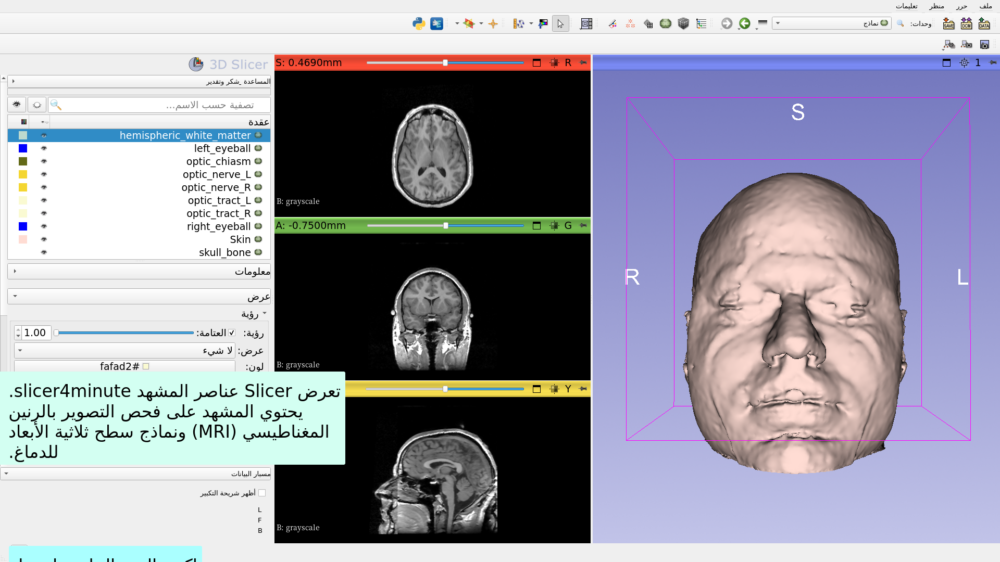

---

## تصوير ثلاثي الأبعاد

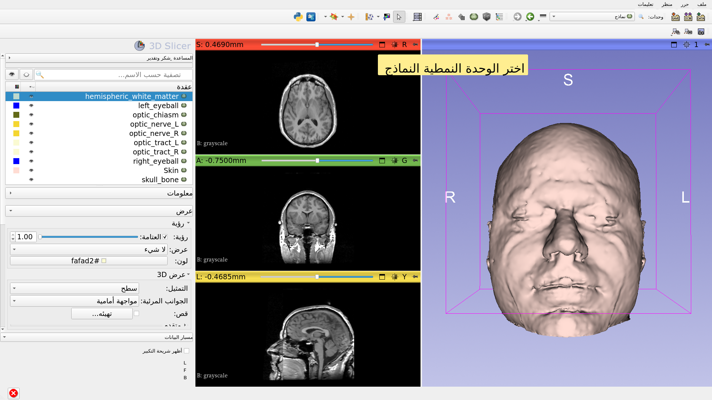

---

## تصوير ثلاثي الأبعاد

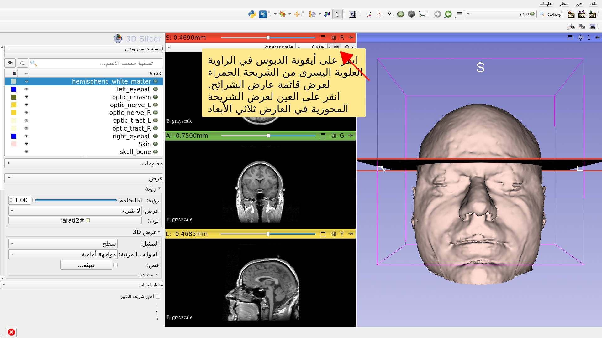

---

## تصوير ثلاثي الأبعاد

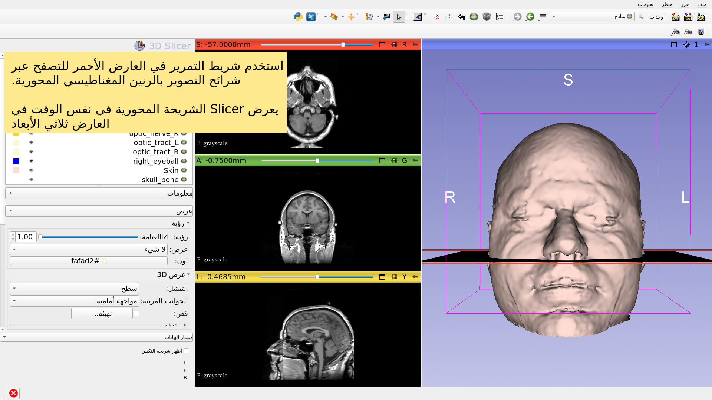

---

## تصوير ثلاثي الأبعاد

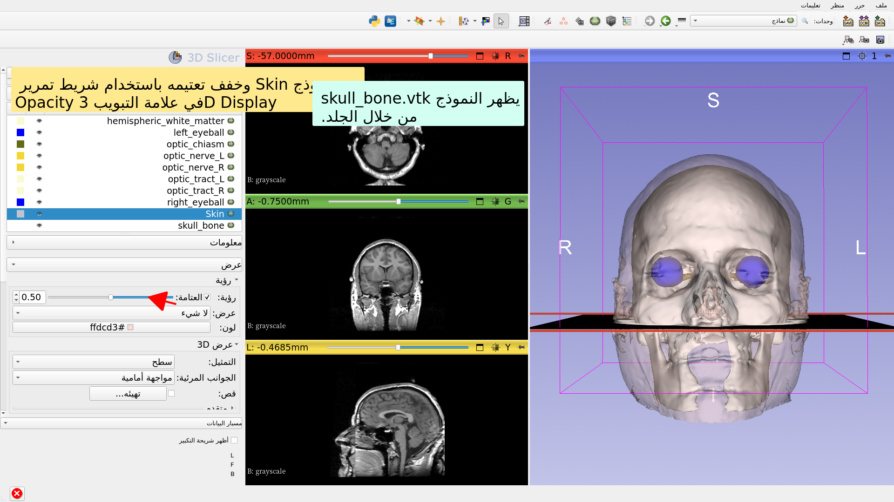

---

## تصوير ثلاثي الأبعاد

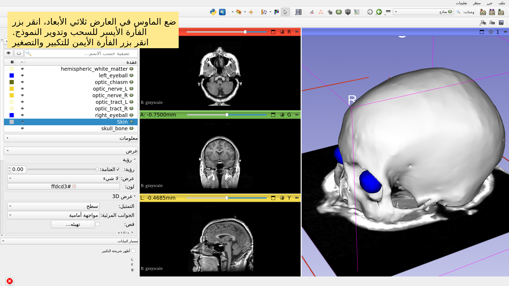

---

## آراء تشريحية

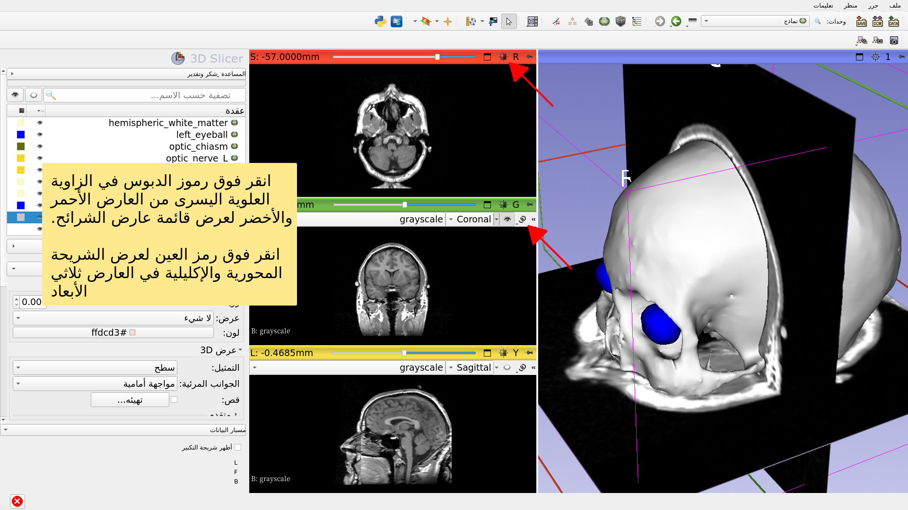

---

## تصوير ثلاثي الأبعاد

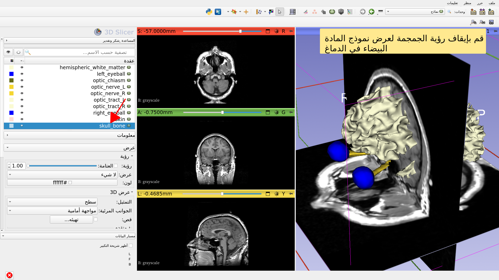

---

## تصوير ثلاثي الأبعاد

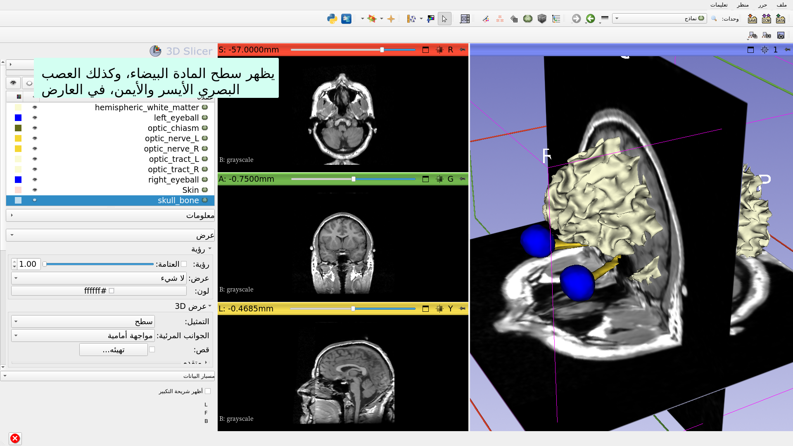

---

## تصوير ثلاثي الأبعاد

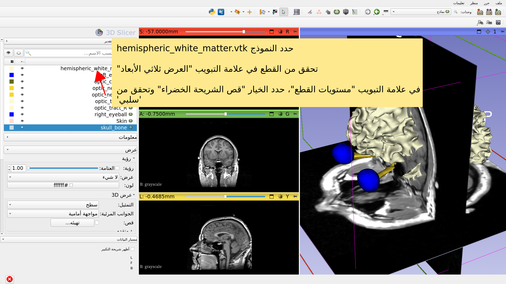

---

## دليل تعليمي مدته 4 دقائق حول برنامج Slicer

* كان هذا البرنامج التعليمي مقدمة قصيرة حول التصور التفاعلي ثلاثي الأبعاد لبيانات الرنين المغناطيسي والنماذج ثلاثية الأبعاد في Slicer.

* يحتوي موجز تدريب Slicer5 على سلسلة من البرامج التعليمية ومجموعات البيانات المحوسبة مسبقًا لتعلم كيفية استخدام البرنامج.

---

# شكر وتقدير

التحالف الوطني لتصوير الطب الحيوي

الحوسبة

المعهد الوطني للصحة U54EB005149

مركز تحليل الصور العصبية

المعهد الوطني للصحة P41EB015902

---
