

# Slicer4 Minuten

Dr. Sonia Pujol

 

Assistenzprofessor für Radiologie
Brigham and Women’s Hospital
Harvard Medical School

---

## Slicer4 Minuten Tutorial

Dieses Tutorial bietet eine 4-minütige Einführung in die 3D-Visualisierungsfunktionen der Software „Slicer5“ zur medizinischen Bildanalyse. 

---

## Slicer5-Software und Datensatz

*Laden Sie die Slicer5-Software unter http://download.slicer.org herunter.

*Laden Sie den Slicer4minute-Datensatz unter https://www.slicer.org/wiki/Documentation/4.10/Training herunter.

---

## 3D Slicer version 5

---

## 3D-Slicer-Szene

*Eine Slicer-Szene ist eine MRML-Datei (Medical Reality Modeling Language), die eine Liste der in Slicer geladenen Elemente enthält (Volumen, Modelle, Referenzmarken, Transformationen usw.).

*Im folgenden Beispiel verwenden wir eine Szene namens „Slicer4minute.mrml“, die aus einem MRT-Scan und 3D-Modellen des Kopfes besteht. 

*Die Szenendatei und die Datensätze wurden als MRB-Datei (Medical Reality Bundle) gespeichert. 

*Das MRB-Dateiformat ist das Archivdateiformat von Slicer.

---

## Laden des Datensatzes „Slicer4minute“

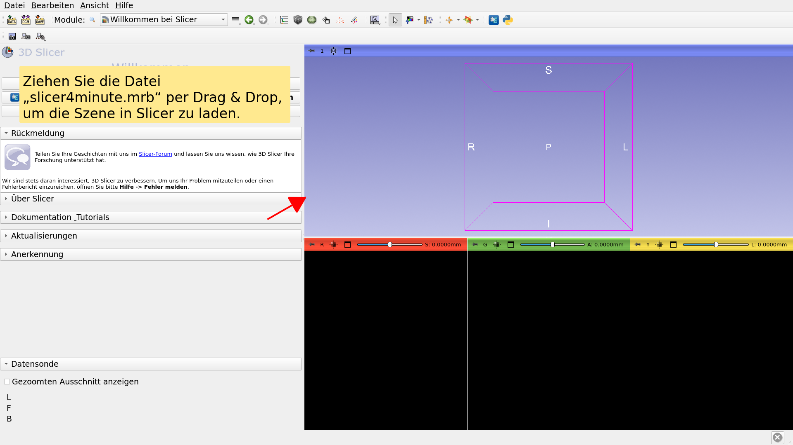

---

## Szene aus „Slicer4minute“

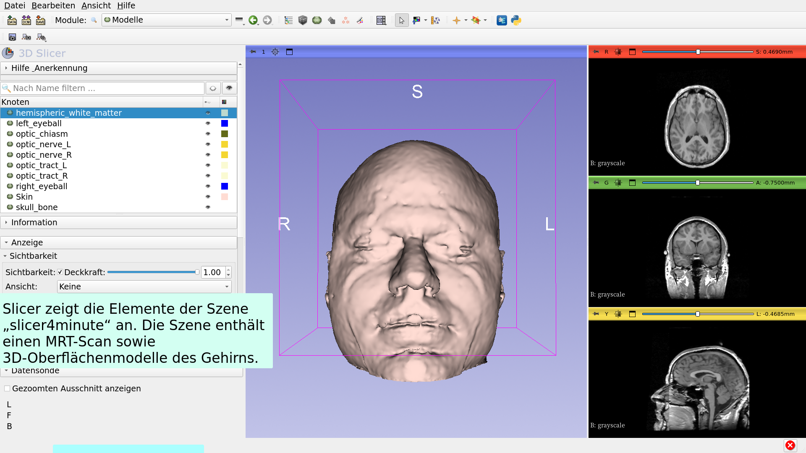

---

## 3D-Visualisierung

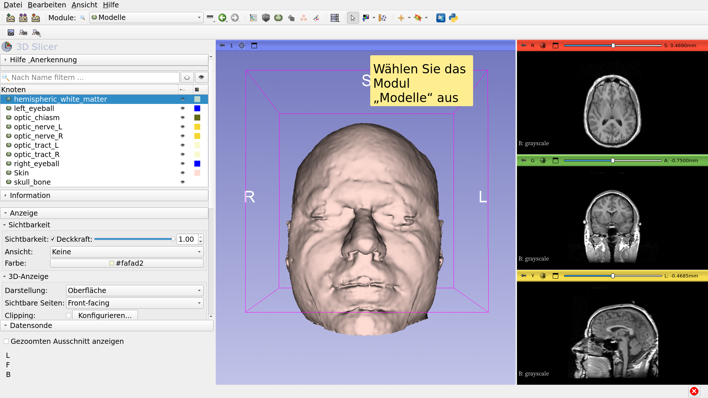

---

## 3D-Visualisierung

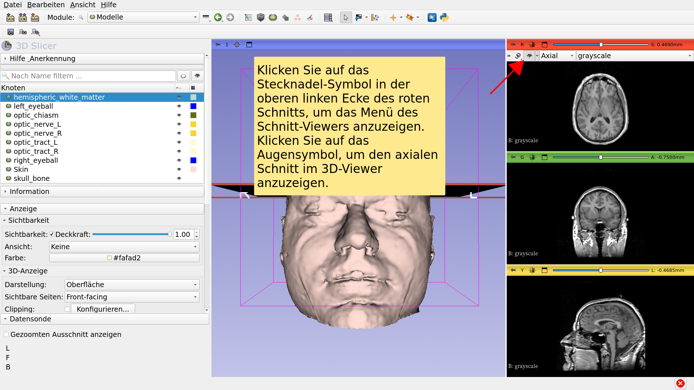

---

## 3D-Visualisierung

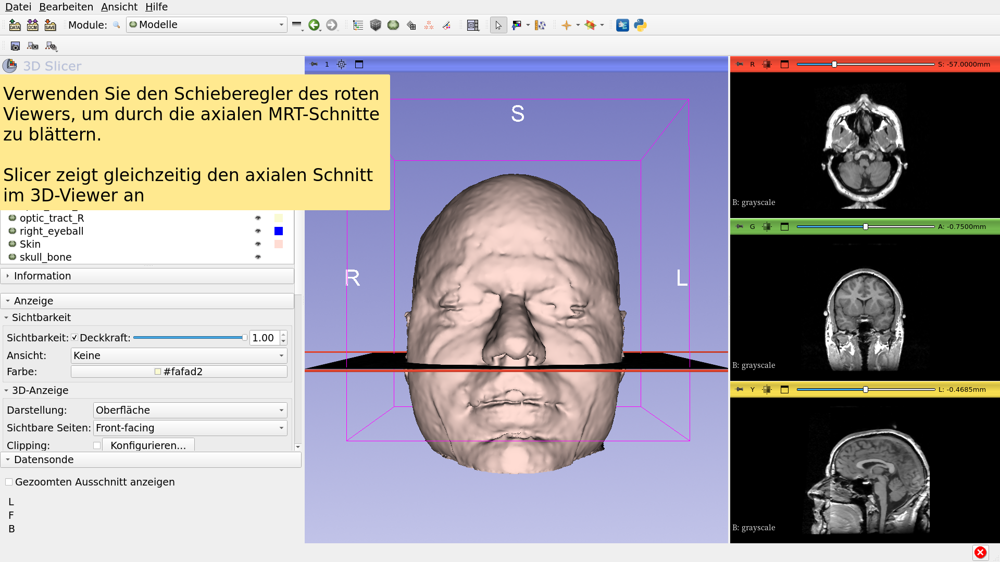

---

## 3D-Visualisierung

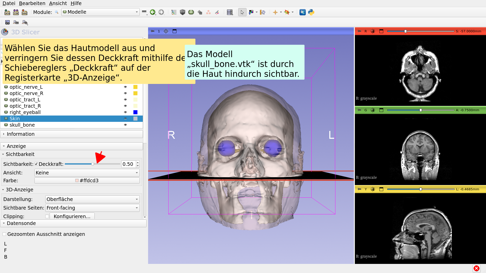

---

## 3D-Visualisierung

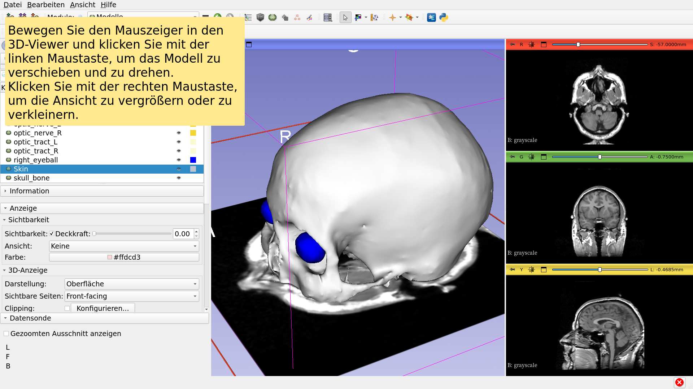

---

## Anatomische Darstellungen

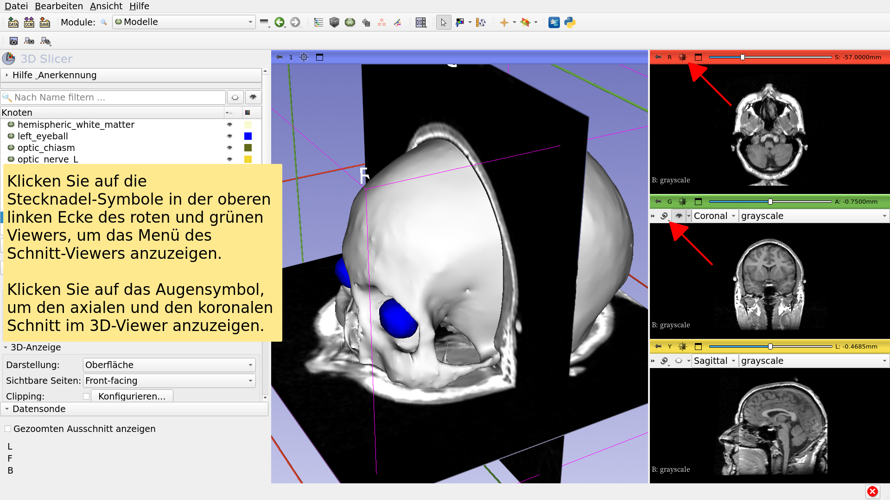

---

## 3D-Visualisierung

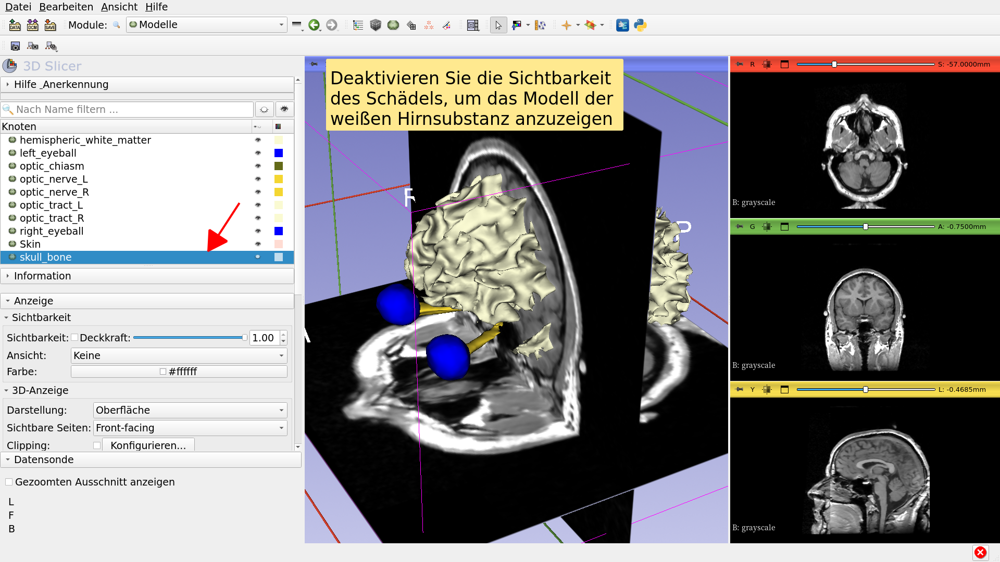

---

## 3D-Visualisierung

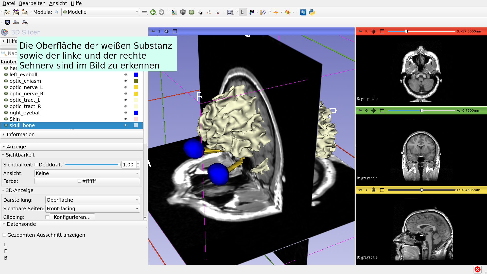

---

## 3D-Visualisierung

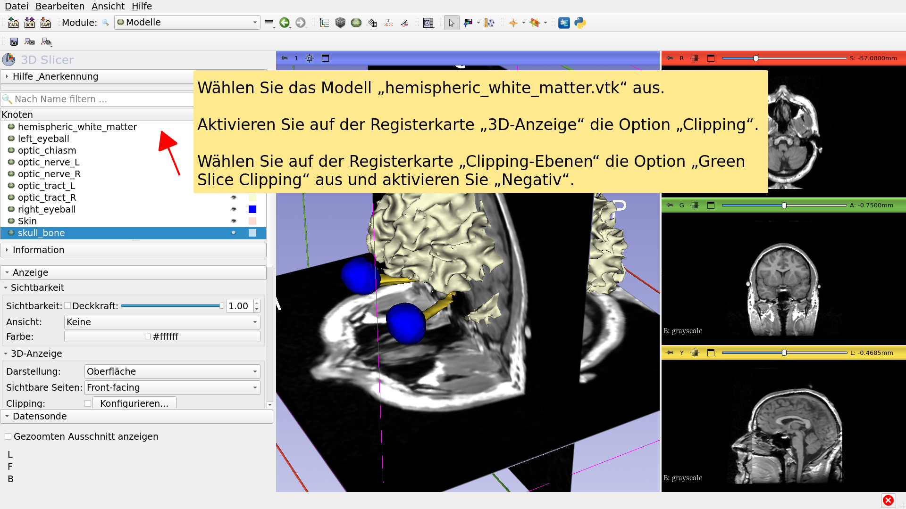

---

## Slicer4 Minuten Tutorial

*Dieses Tutorial bot eine kurze Einführung in die interaktive 3D-Visualisierung von MRT-Daten und 3D-Modellen in Slicer.

*Das Slicer5-Schulungskompendium enthält eine Reihe von Tutorials und vorberechneten Datensätzen, mit denen Sie den Umgang mit der Software erlernen können.

---

# Danksagungen

Nationale Allianz für medizinische Bildverarbeitung

(National Alliance for Medical Image

Computing)

NIH U54EB005149

Zentrum für Neurobildanalyse

NIH P41EB015902

---
