

# Slicer4 Minute

Sonia Pujol, Ph.D.

 

Assistant Professor of Radiology
Brigham and Women’s Hospital
Harvard Medical School

---

## Slicer4 minute tutorial

This tutorial is a 4-minute introduction to the 3D visualization capabilities of the Slicer5 software for medical image analysis. 

---

## Slicer5 software & dataset

*Download the Slicer5 software available at http://download.slicer.org

*Download the Slicer4minute dataset available at https://www.slicer.org/wiki/Documentation/4.10/Training

---

## 3D Slicer version 5

---

## 3D Slicer Scene

*A Slicer scene is a MRML (Medical Reality Modeling Language) file that contains a list of elements loaded into Slicer (volumes, models, fiducials, transforms, etc.)

*In the following example, we use a scene 'Slicer4minute.mrml' composed of an MRI scan and 3D models of the head. 

*The scene file and datasets have been saved as a MRB (Medical Reality Bundle) file. 

*The MRB file format is Slicer's archive file format.

---

## Loading the Slicer4minute dataset

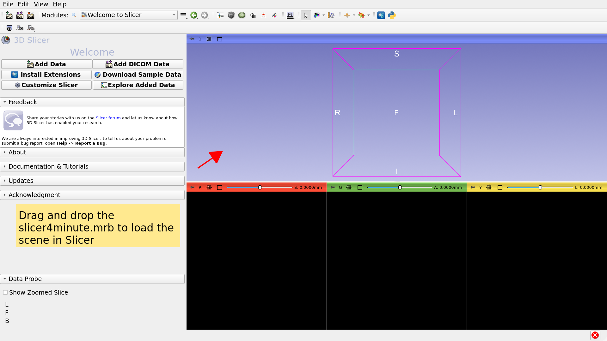

---

## Slicer4minute Scene

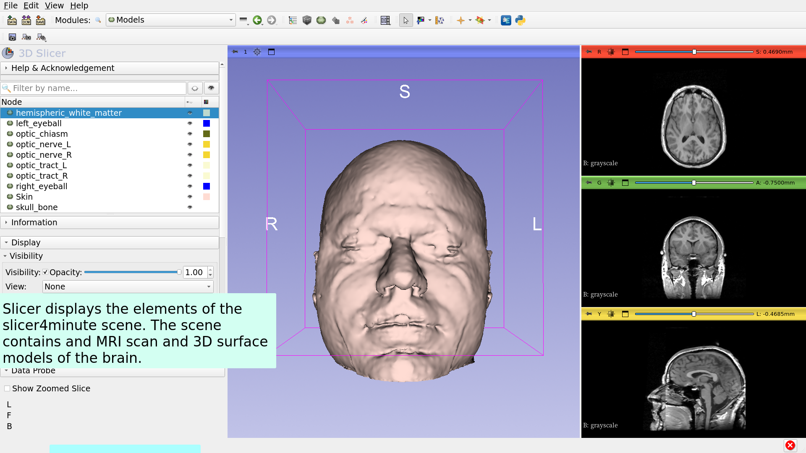

---

## 3D Visualization

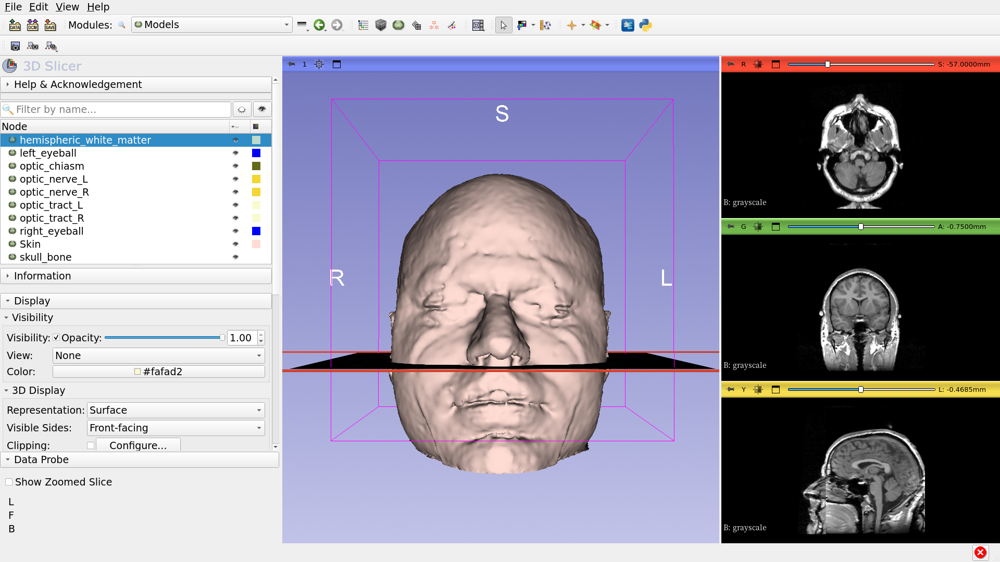

---

## 3D visualization

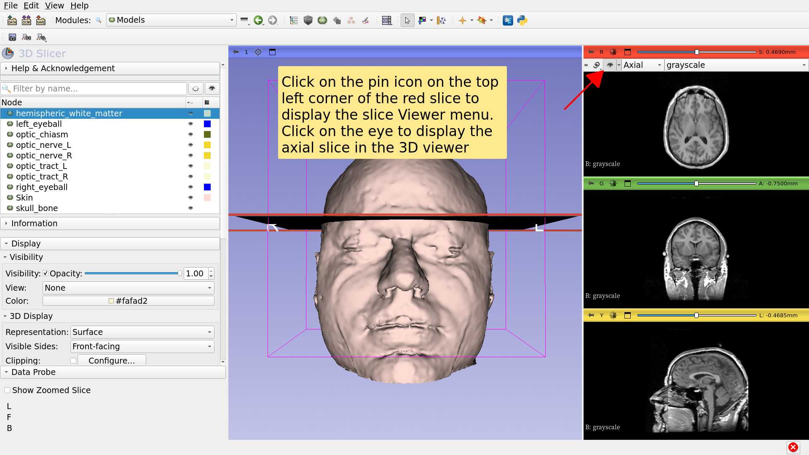

---

## 3D Visualization

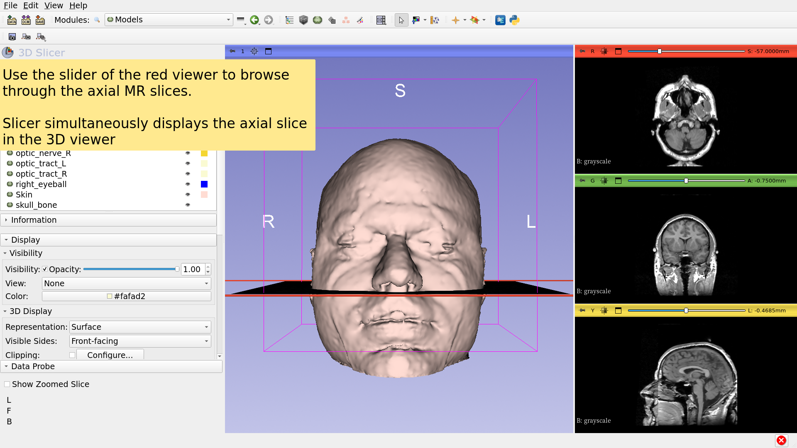

---

## 3D Visualization

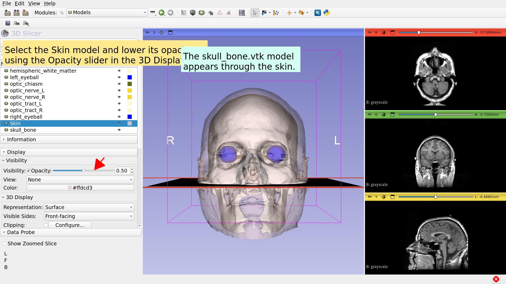

---

## 3D Visualization

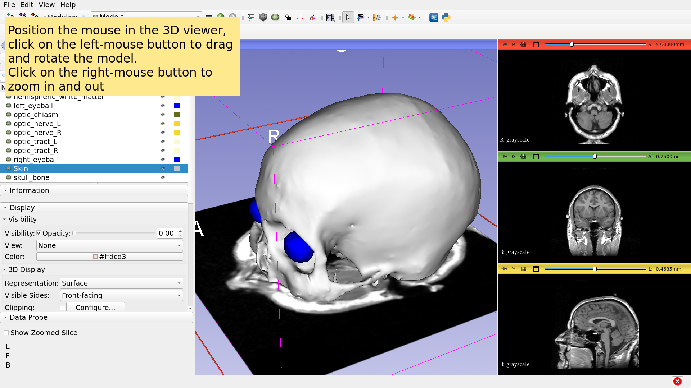

---

## Anatomical Views

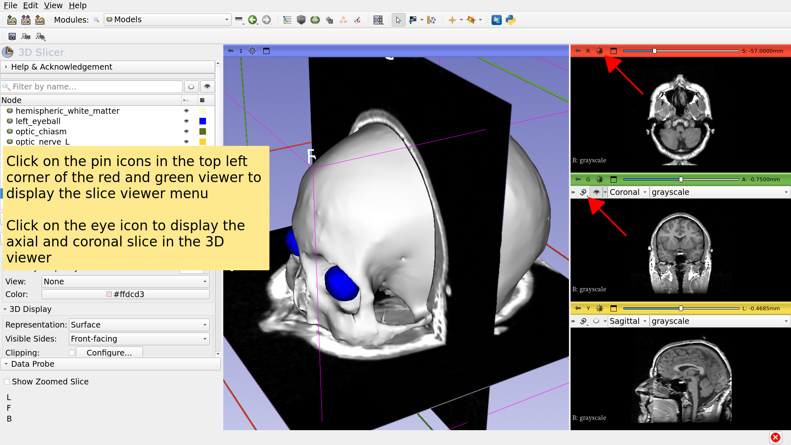

---

## 3D Visualization

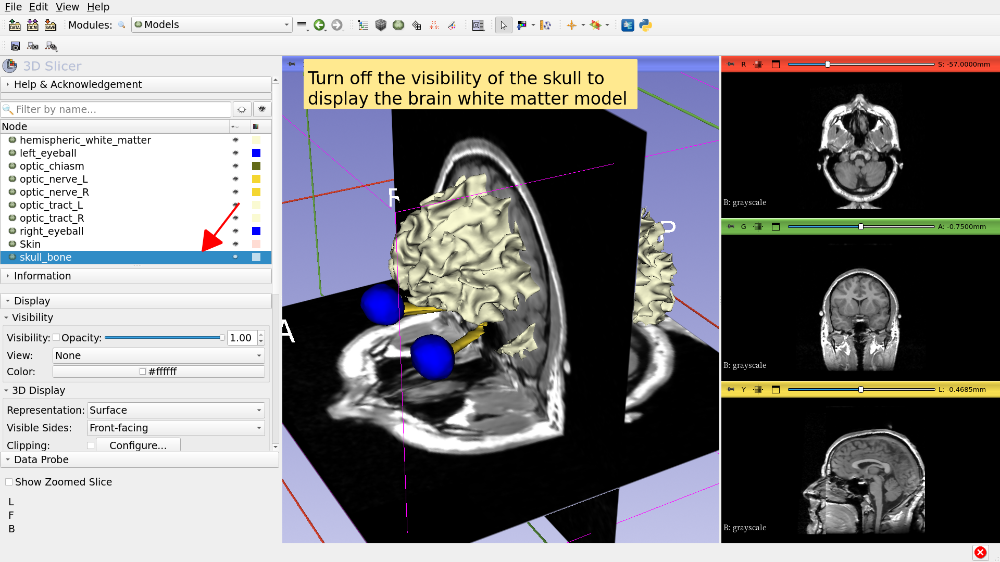

---

## 3D Visualization

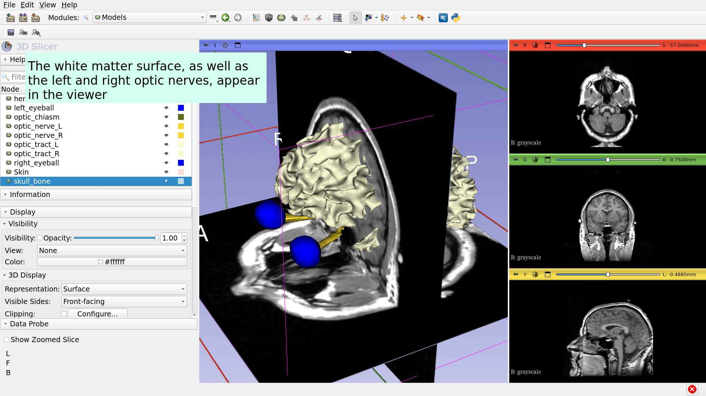

---

## 3D Visualization

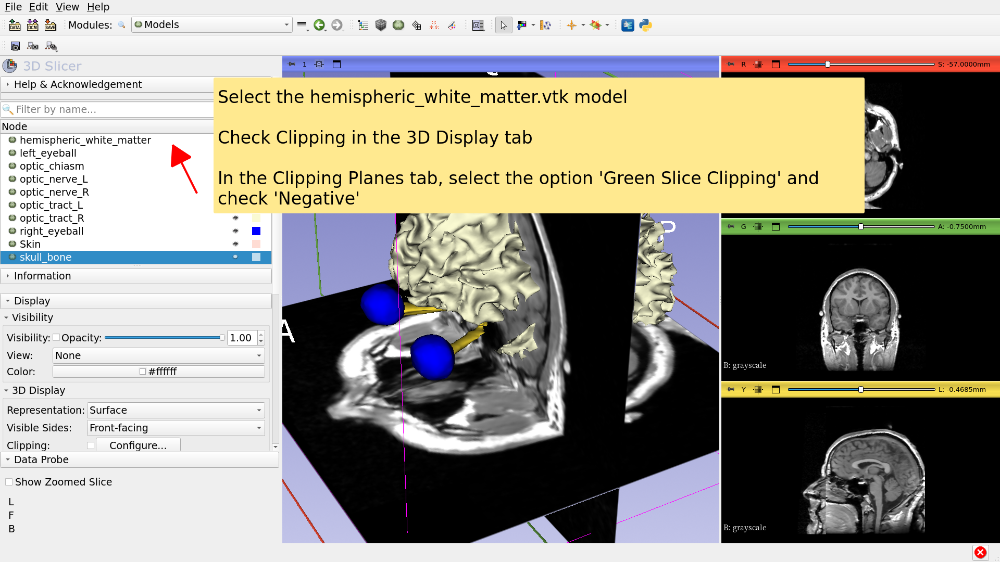

---

## Slicer4 minute tutorial

*This tutorial was a short introduction on interactive 3D visualization of MRI data and 3D models in Slicer.

*The Slicer5 training compendium contains a series of tutorials and pre-computed datasets to learn how to use the software.

---

# Acknowledgements

National Alliance for Medical Image

Computing

NIH U54EB005149

Neuroimage Analysis Center

NIH P41EB015902

---
