

# Rebanadora de 4 minutos

Sonia Pujol, Ph.D

 

Profesor adjunto de Radiología
Hospital Brigham and Women’s
Facultad de Medicina de Harvard

---

## Tutorial de Slice de 4 minutos

Este tutorial es una introducción de 4 minutos a las capacidades de visualización 3D del software Slicer5 para el análisis de imágenes médicas. 

---

## Software Slice5 y conjunto de datos

*Descarga el software Slicer5 disponible en http://download.slicer.org

*Descarga el conjunto de datos Slicer4minute disponible en https://www.slicer.org/wiki/Documentation/4.10/Training

---

## 3D Slicer versión 5

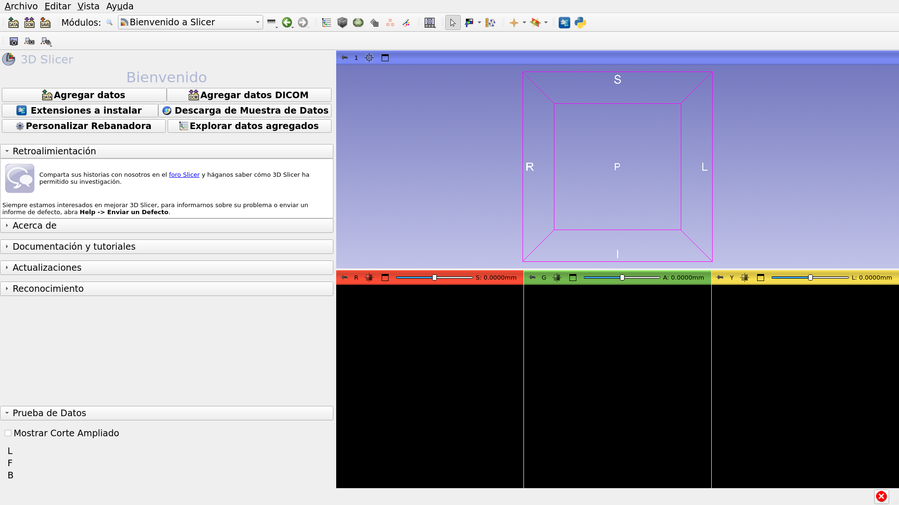

---

## Slicer muestra los elementos
de la escena de slicer4minute.
La escena contiene una resonancia
magnética y modelos de superficie
3D del cerebro.	

*Una escena de Slicer es un archivo MRML (Medical Reality Modeling Language) que contiene una lista de elementos cargados en Slicer (volúmenes, modelos, marcadores, transformaciones, etc.).

*En el siguiente ejemplo, utilizamos la escena 'Slicer4minute.mrml', compuesta por una resonancia magnética y modelos 3D de la cabeza.

*El archivo de escena y los conjuntos de datos se han guardado como un archivo MRB (Medical Reality Bundle).

*El formato de archivo MRB es el formato de archivo comprimido de Slicer.

---

## Cargando el conjunto de datos Slicer4minute

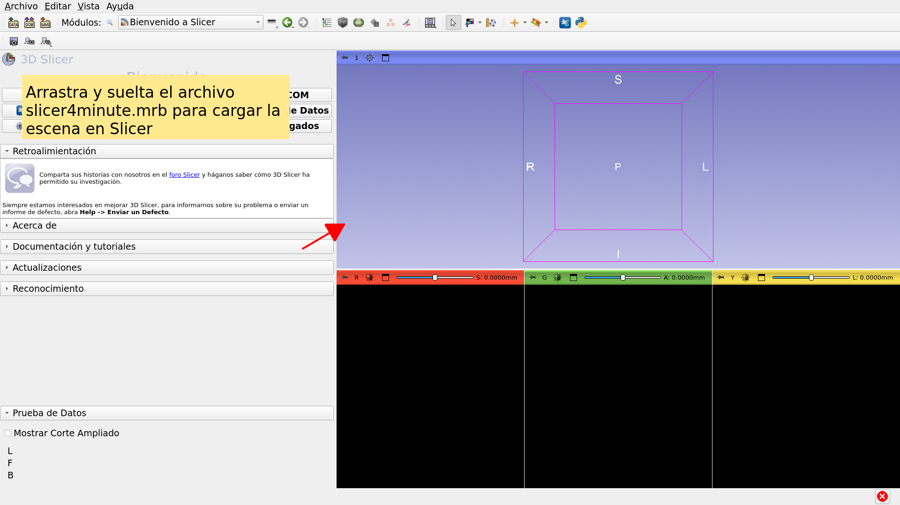

---

## Escena Slicer4minute

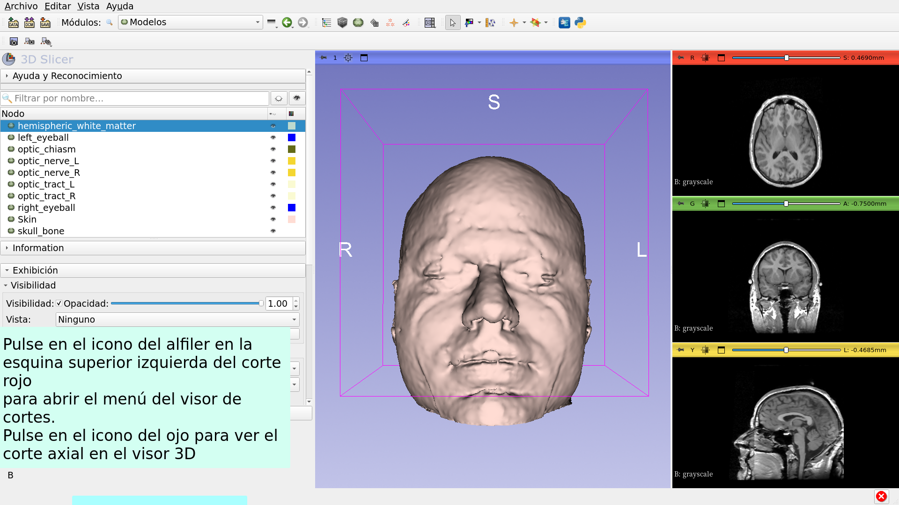

---

## Visualización 3D

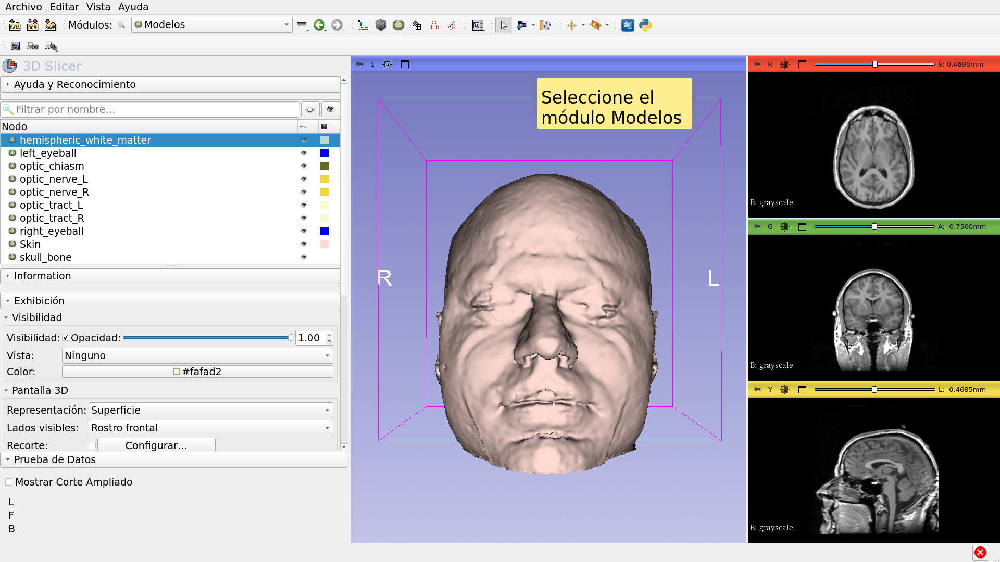

---

## Visualización en 3D

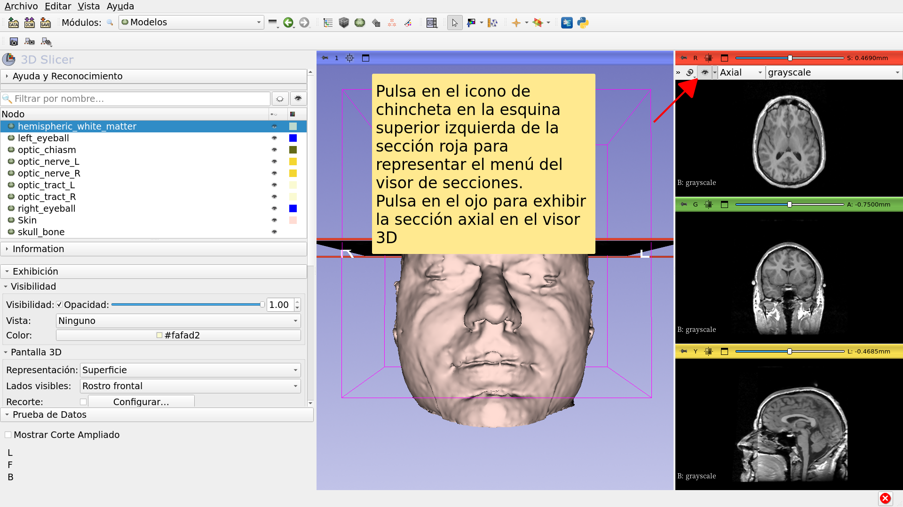

---

## Visualización 3D

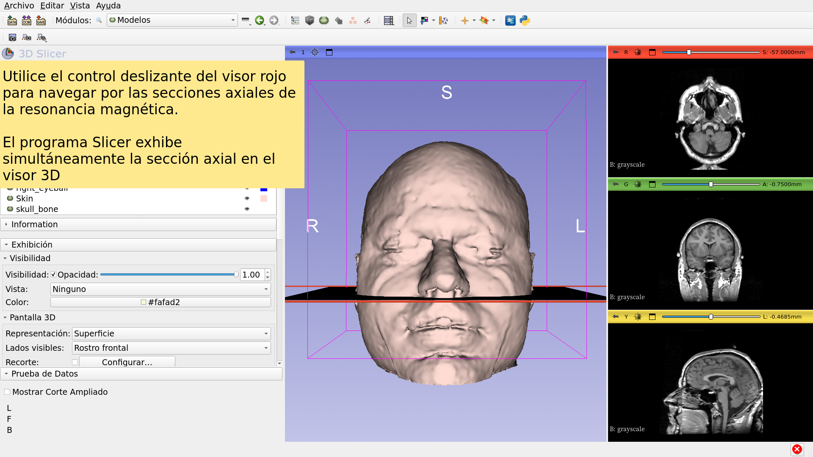

---

## Visualización 3D

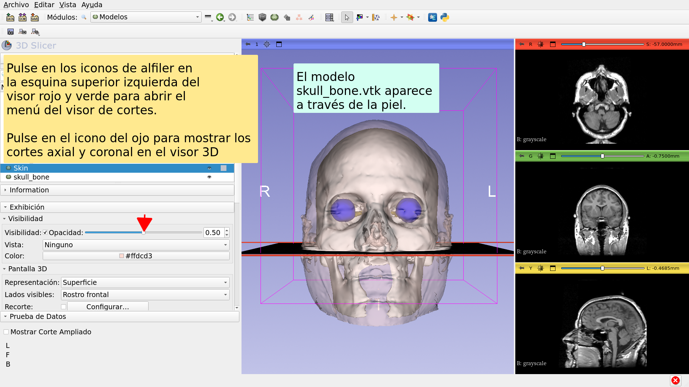

---

## Visualización 3D

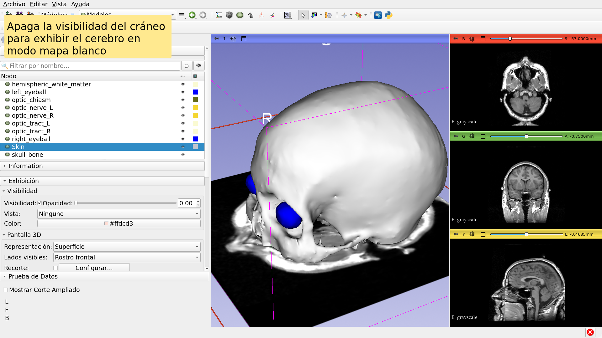

---

## Vistas Anatómicas

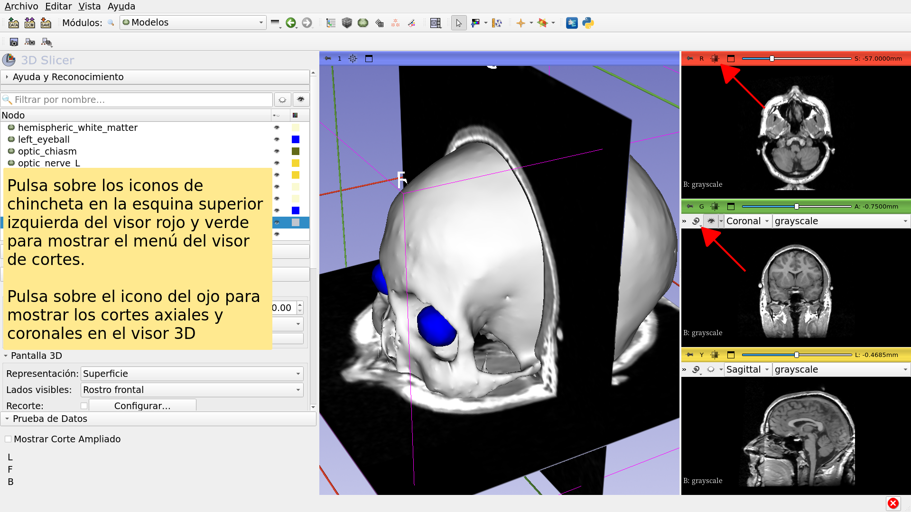

---

## Visualización 3D

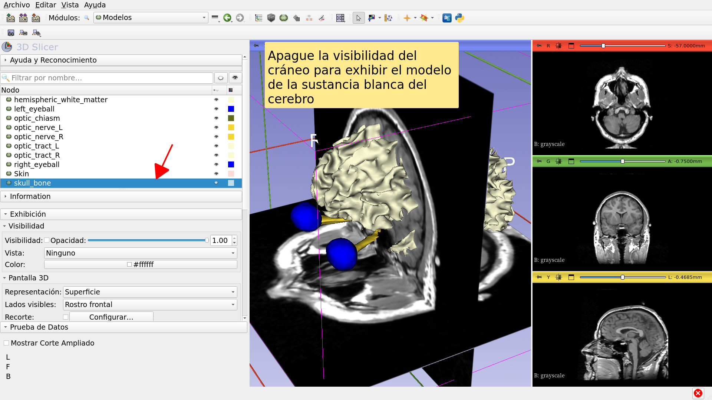

---

## Visualización 3D

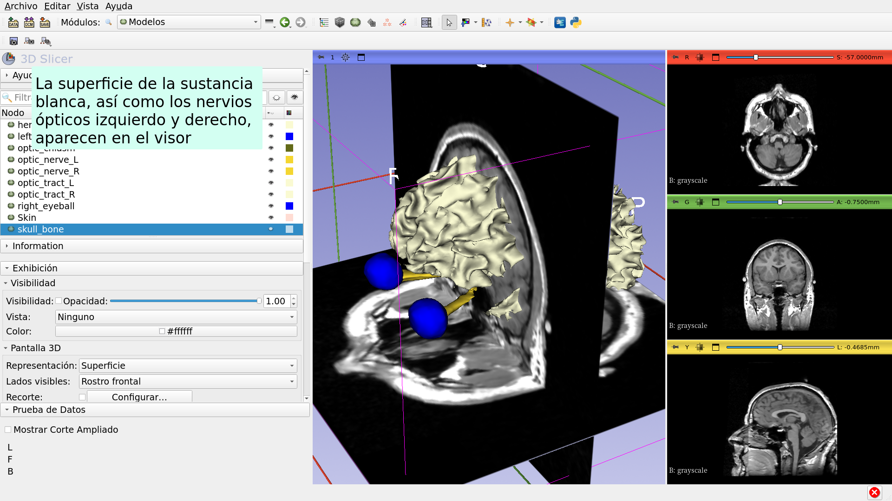

---

## Visualización 3D

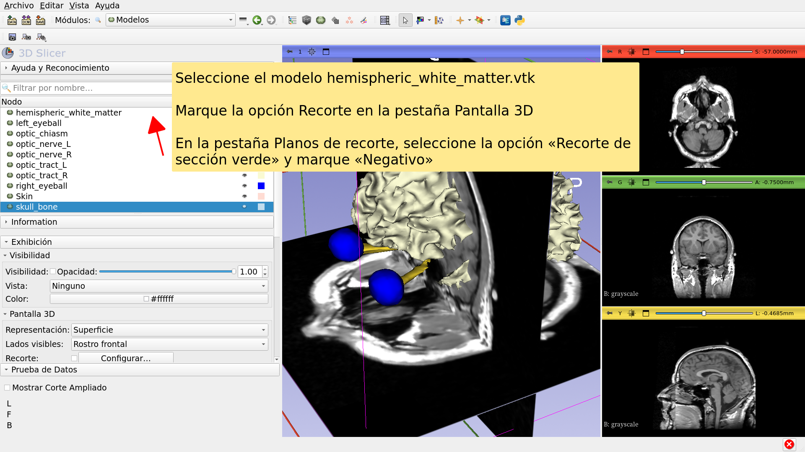

---

## Tutorial de Slice de 4 minutos

*Este tutorial fue una breve introducción a la visualización interactiva en 3D de datos de resonancia magnética y modelos 3D en Slicer.

*El compendio de capacitación de Slicer 5 contiene una serie de tutoriales y conjuntos de datos precalculados para aprender a usar el software.

---

# Agradecimientos

Alianza Nacional para Cómputo de

Imagen Médica

NIH U54EB005149

Centro de Análisis Neuroimagen

NIH P41EB015902

---
