

# Slicer4 Minute

Sonia Pujol, Ph.D.

Professeure adjointe de radiologie
Brigham and Women’s Hospital
Harvard Medical School	

Professeur adjoint en radiologie
Brigham and Women’s Hospital
Harvard Medical School

---

## Tutoriel Slicer4 minute

Ce tutoriel est une introduction de 4 minutes aux capacités de visualisation 3D du logiciel Slicer5 pour l’analyse d’images médicales. 

---

## Logiciel et jeu de données Slicer5

*Téléchargez le logiciel Slicer5 disponible à l’adresse http://download.slicer.org

*Téléchargez le jeu de données Slicer4minute disponible à l’adresse 

https://www.slicer.org/wiki/Documentation/4.10/Training

---

## 3D Slicer version 5

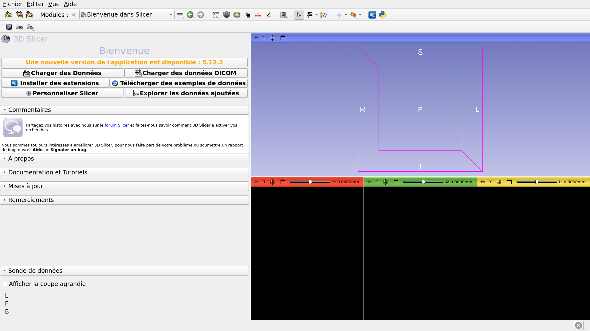

---

## Slicer affiche les éléments de la scène slicer4minute.
La scène contient une IRM ainsi que des modèles de surface 3D du cerveau.	

*Une scène Slicer est un fichier MRML (Medical Reality Modeling Language) qui contient une liste d’éléments chargés dans Slicer (volumes, modèles, repères, transformations, etc.)

*Dans l’exemple suivant, nous utilisons une scène « Slicer4minute.mrml » composée d’une IRM et de modèles 3D de la tête.

*Le fichier de scène et les jeux de données ont été enregistrés sous forme de fichier MRB (Medical Reality Bundle).

*Le format de fichier MRB est le format d’archive de Slicer.

---

## Chargement du jeu de données Slicer4minute

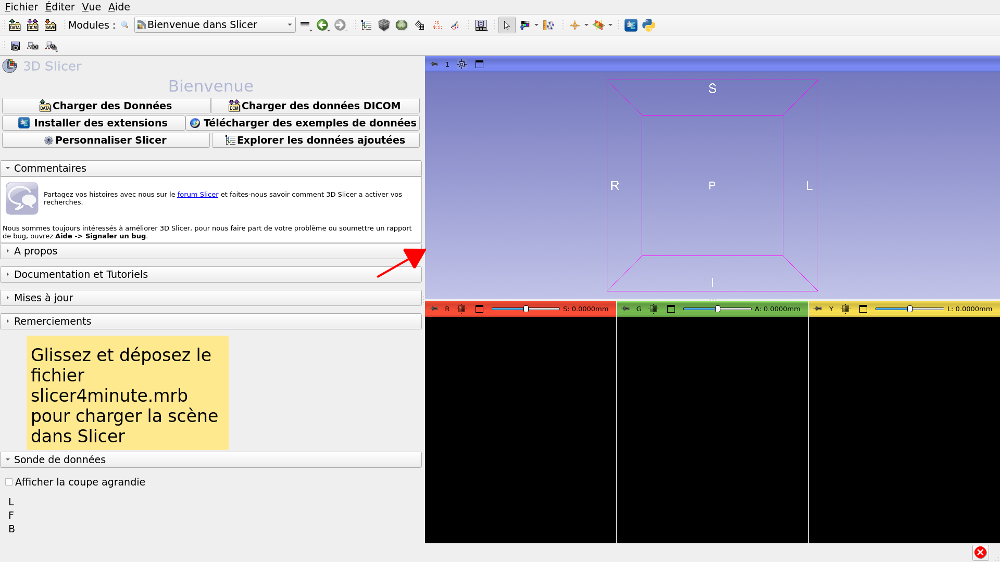

---

## Scène Slicer4minute

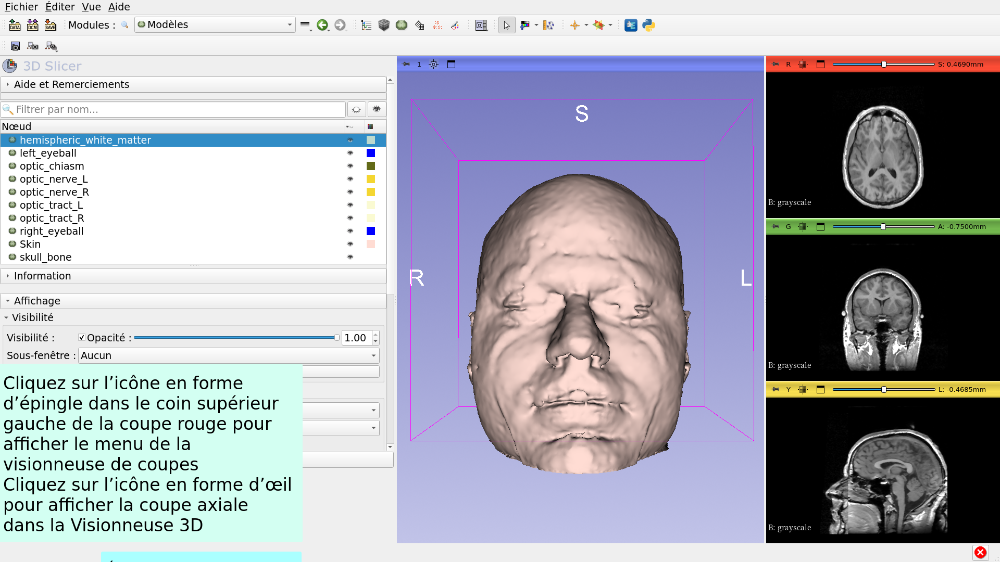

---

## Visualisation 3D

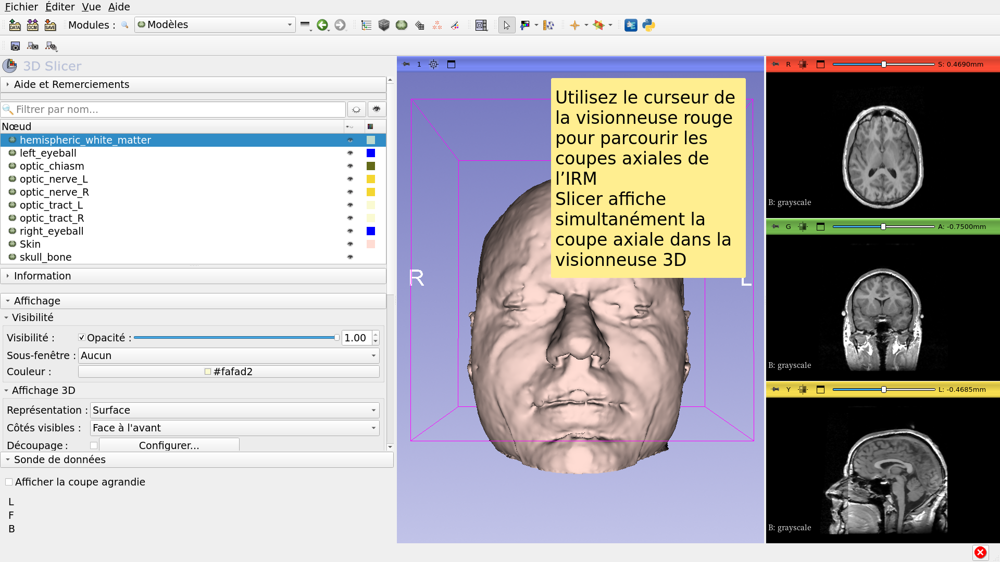

---

## Visualisation 3D

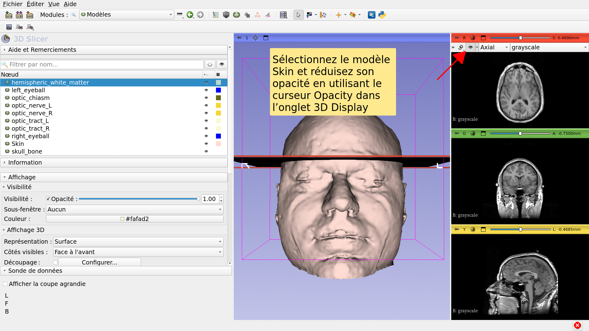

---

## Visualisation 3D

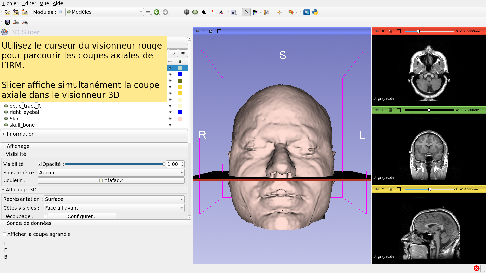

---

## Visualisation 3D

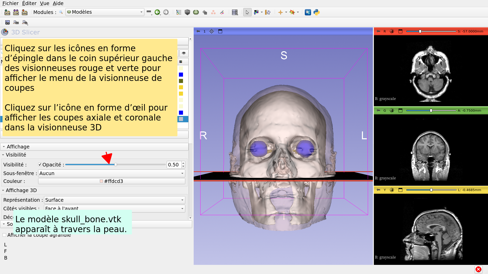

---

## Visualisation 3D

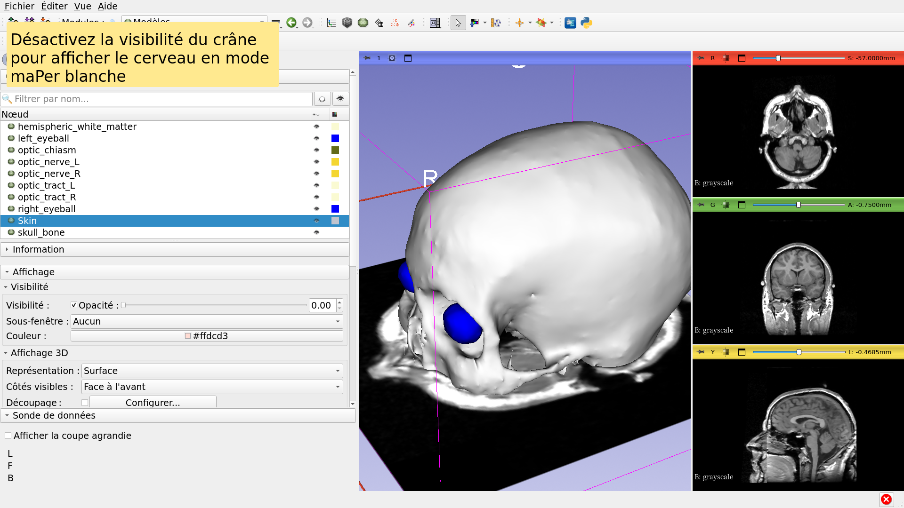

---

## Vues anatomiques

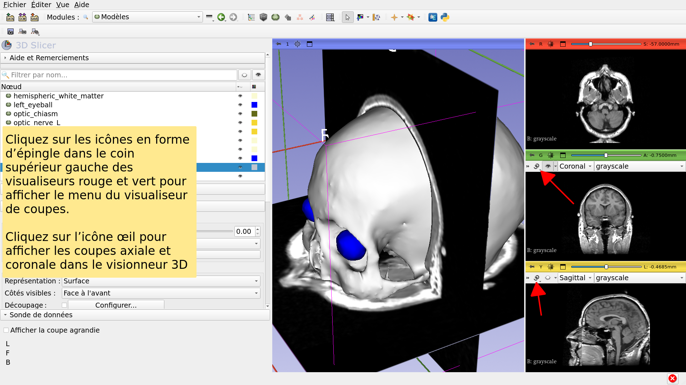

---

## Visualisation 3D

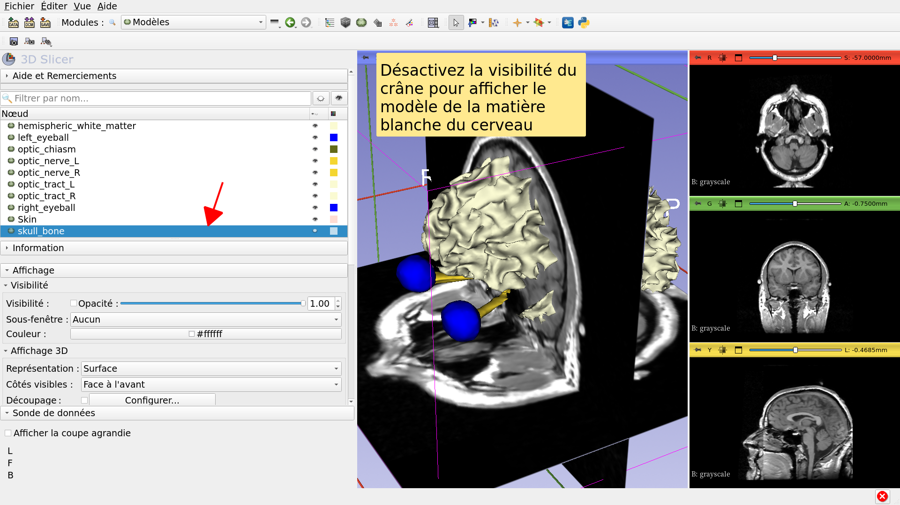

---

## Visualisation 3D

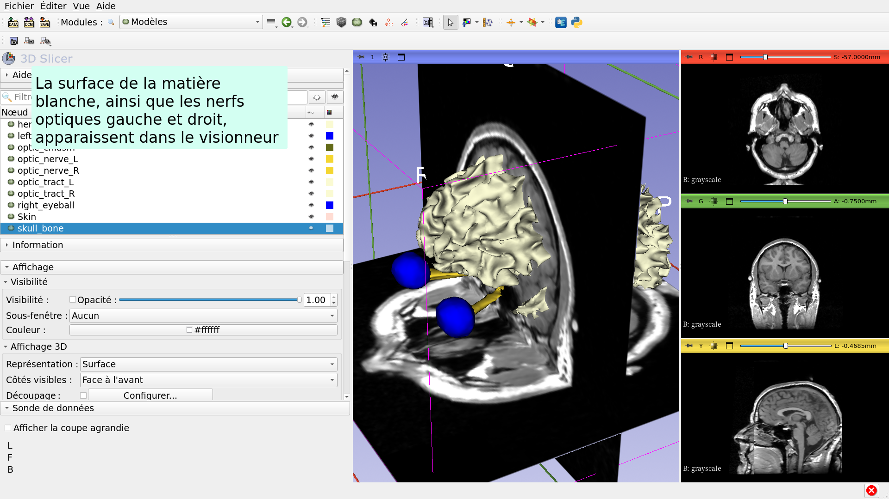

---

## Visualisation 3D

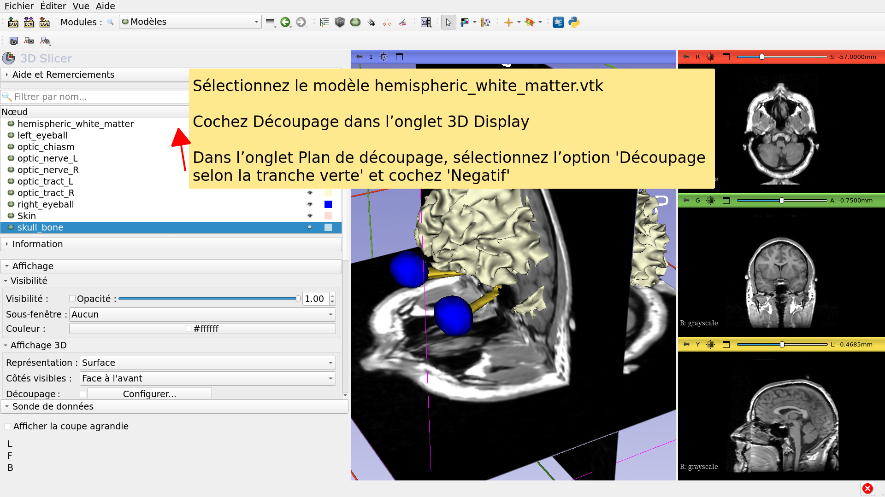

---

## Tutoriel Slicer4 minute

*Ce tutoriel était une courte introduction à la visualisation 3D interactive des données IRM et des modèles 3D dans Slicer.

*Le compendium de formation Slicer5 contient une série de tutoriels et de jeux de données pré-calculés pour apprendre à utiliser le logiciel.

---

# Remerciements

National Alliance for Medical Image

Computing

NIH U54EB005149

Neuroimage Analysis Center

NIH P41EB015902

---
