

# Slicer4 perc

Sonia Pujol, Ph.D.

 

Radiológiai adjunktus
Brigham and Women’s Hospital
Harvard Medical School

---

## Slicer4 perces oktatóanyag

Ez az oktatóanyag egy 4 perces bevezetés a Slicer5 szoftver orvosi képelemzéshez használható 3D vizualizációs lehetőségeibe. 

---

## Slicer5 szoftver & adatkészlet

*Töltse le a Slicer5 szoftvert a http://download.slicer.org címről

*Töltse le a Slicer4minute adatkészletet a https://www.slicer.org/wiki/Documentation/4.10/Training címről

---

## 3D Slicer 5-ös verzió

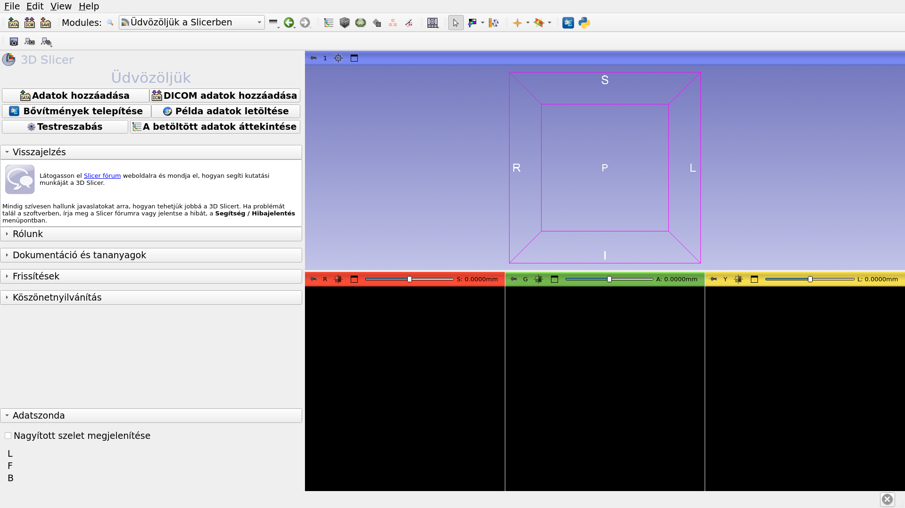

---

## 3D Slicer jelenet

*A Slicer jelenet egy MRML (Medical Reality Modeling Language) fájl, amely a Slicerbe betöltött elemek listáját tartalmazza (kötetek, modellek, fiduciálisok, transzformációk stb.)

*A következő példában a 'Slicer4minute.mrml' jelenetet használjuk, amely egy MRI-felvételből és a fej 3D-s modelljeiből áll.

*A jelenetfájl és az adatkészletek MRB (Medical Reality Bundle) fájlként lettek elmentve.

*Az MRB fájlformátum a Slicer archív fájlformátuma.

---

## A Slicer4minute adatkészlet betöltése

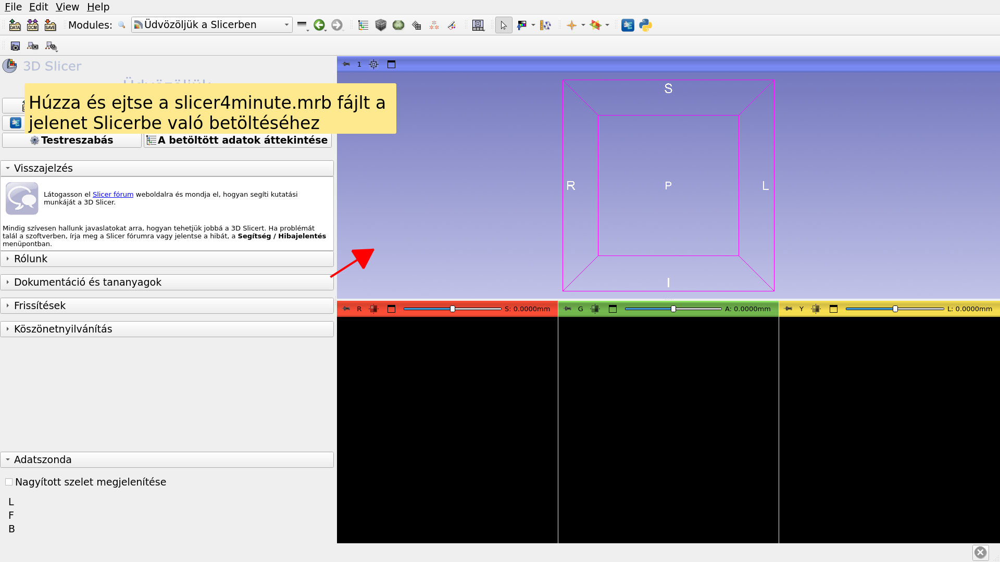

---

## Slicer4minute jelenet

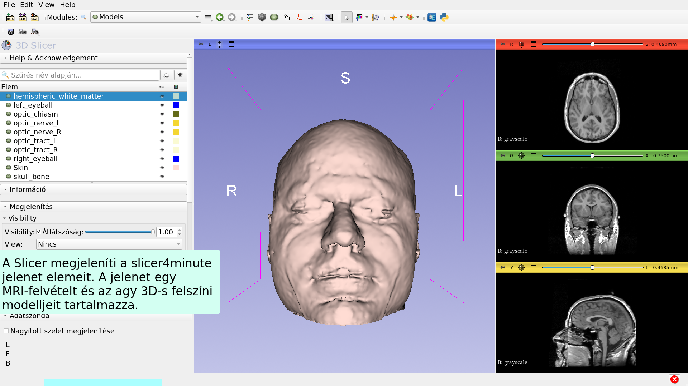

---

## 3D vizualizáció

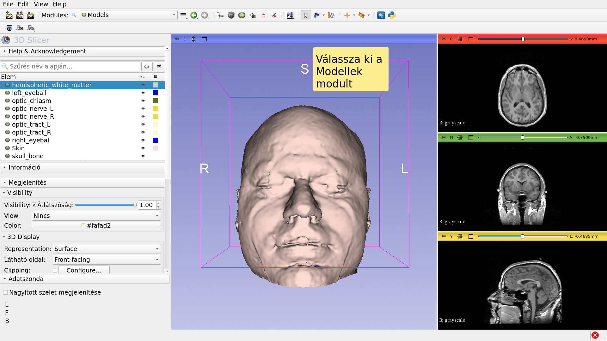

---

## 3D vizualizáció

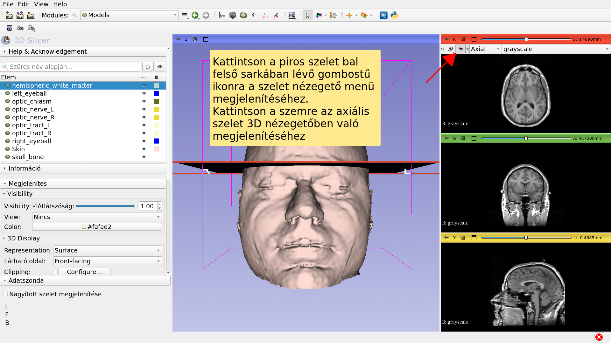

---

## 3D vizualizáció

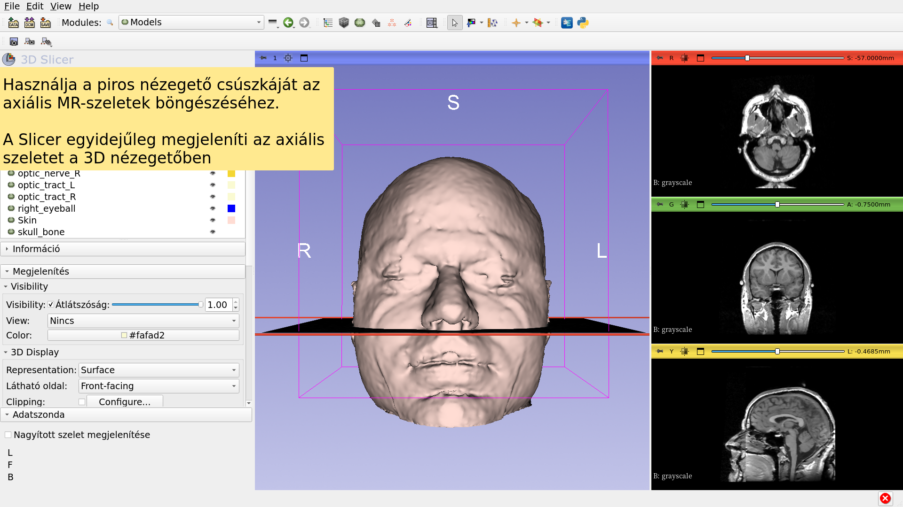

---

## 3D vizualizáció

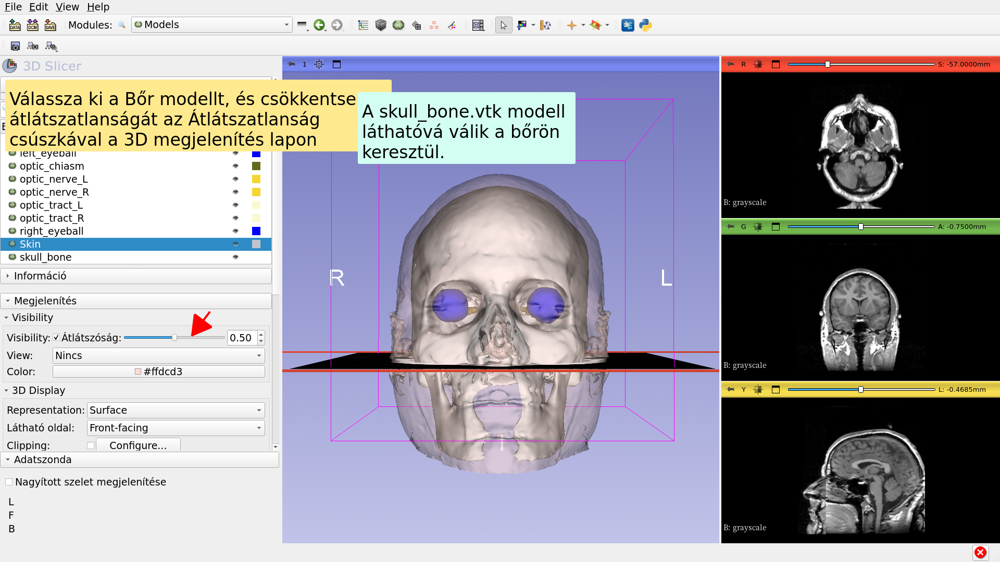

---

## 3D vizualizáció

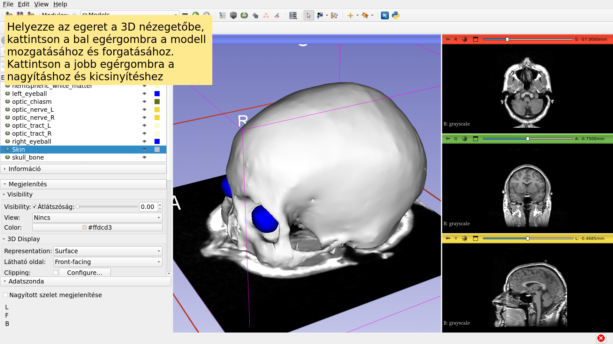

---

## Anatómiai nézetek

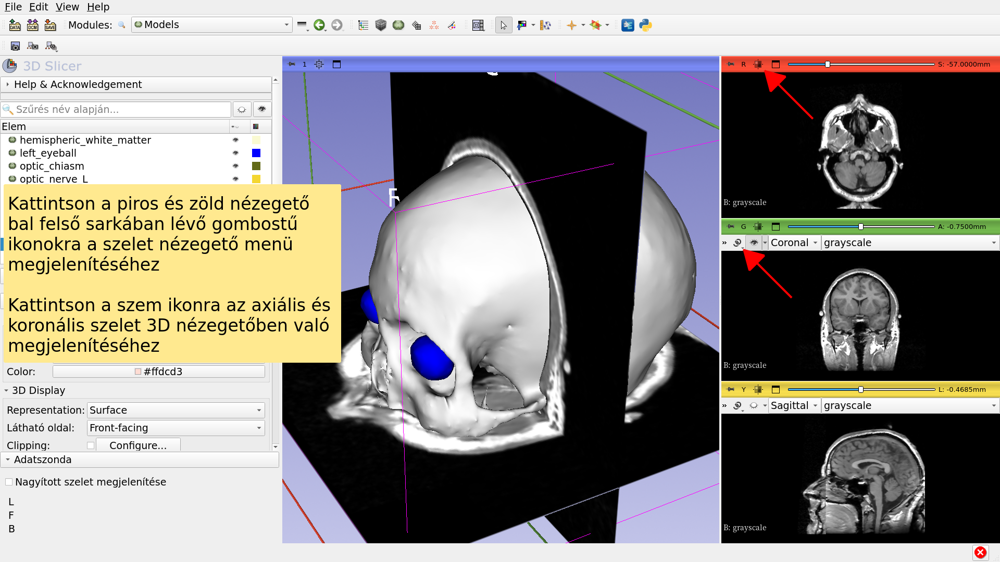

---

## 3D vizualizáció

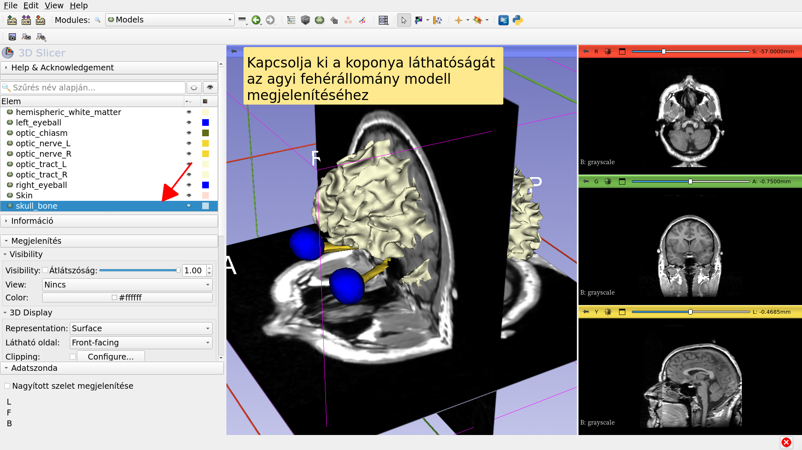

---

## 3D vizualizáció

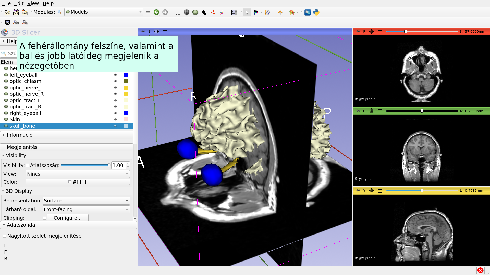

---

## 3D vizualizáció

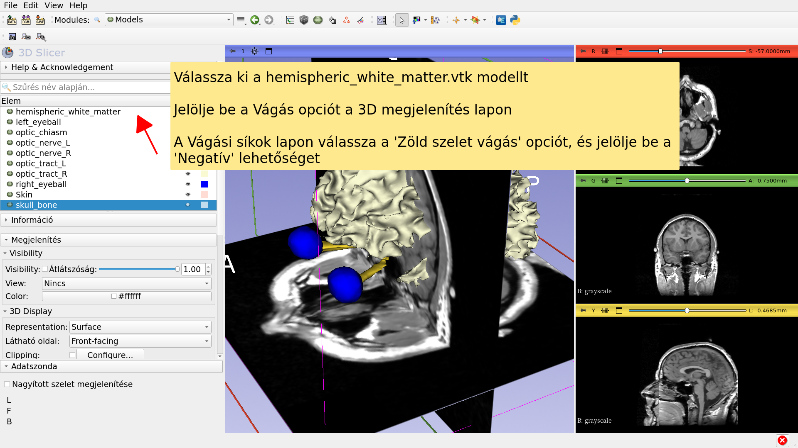

---

## Slicer4 perces oktatóanyag

*Ez az oktatóanyag rövid bevezetés volt az MRI-adatok és 3D-s modellek interaktív 3D vizualizációjába a Slicerben.

*A Slicer5 képzési összefoglaló oktatóanyagok és előre kiszámított adatkészletek sorozatát tartalmazza a szoftver használatának megtanulásához.

---

# Köszönetnyilvánítás

National Alliance for Medical Image

Computing

NIH U54EB005149

Neuroimage Analysis Center

NIH P41EB015902

---
