

# ச்லைசர் 4 மணித்துளி

சோனியா புசோல், Ph.D.

 

கதிரியக்கவியல் உதவிப் பேராசிரியர் 
பிரிகாம் மற்றும் மகளிர் மருத்துவமனை 
ஆர்வர்ட் மருத்துவப் பள்ளி

---

## Slicer4 நிமிட பயிற்சி

இந்த டுடோரியல் மருத்துவப் படப் பகுப்பாய்விற்கான ச்லைசர்5 மென்பொருளின் 3டி காட்சிப்படுத்தல் திறன்களுக்கான 4 நிமிட அறிமுகமாகும். 

---

## Slicer5 மென்பொருள் & தரவுத்தொகுப்பு

* http://download.slicer.org இல் கிடைக்கும் Slicer5 மென்பொருளைப் பதிவிறக்கவும் 

* https://www.slicer.org/wiki/Documentation/4.10/Training இல் கிடைக்கும் Slicer4minute தரவுத்தொகுப்பைப் பதிவிறக்கவும்

---

## 3D ச்லைசர் பதிப்பு 5

---

## 3D ச்லைசர் காட்சி

*ஒரு ச்லைசர் காட்சி என்பது MRML (மருத்துவ ரியாலிட்டி மாடலிங் மொழி) கோப்பாகும், இது ச்லைசரில் ஏற்றப்பட்ட உறுப்புகளின் பட்டியலைக் கொண்டுள்ளது (தொகுதிகள், மாதிரிகள், நம்பிக்கைகள், உருமாற்றங்கள் போன்றவை.) 

*பின்வரும் எடுத்துக்காட்டில், எம்ஆர்ஐ வருடு மற்றும் தலையின் 3டி மாடல்களைக் கொண்ட 'Slicer4minute.mrml' காட்சியைப் பயன்படுத்துகிறோம். 

*காட்சி கோப்பு மற்றும் தரவுத்தொகுப்புகள் MRB (மருத்துவ ரியாலிட்டி பண்டில்) கோப்பாக சேமிக்கப்பட்டுள்ளன. 

*MRB கோப்பு வடிவம் ச்லைசரின் காப்பக கோப்பு வடிவமாகும்.

---

## Slicer4minute தரவுத்தொகுப்பை ஏற்றுகிறது

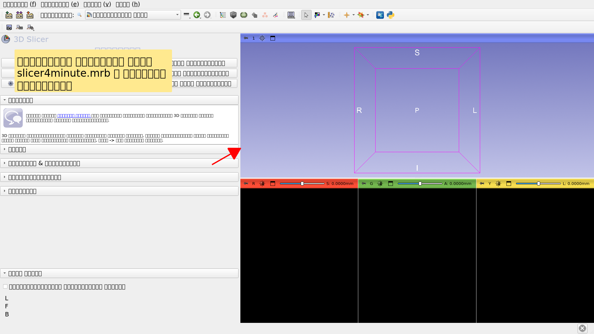

---

## ச்லைசர் 4 நிமிட காட்சி

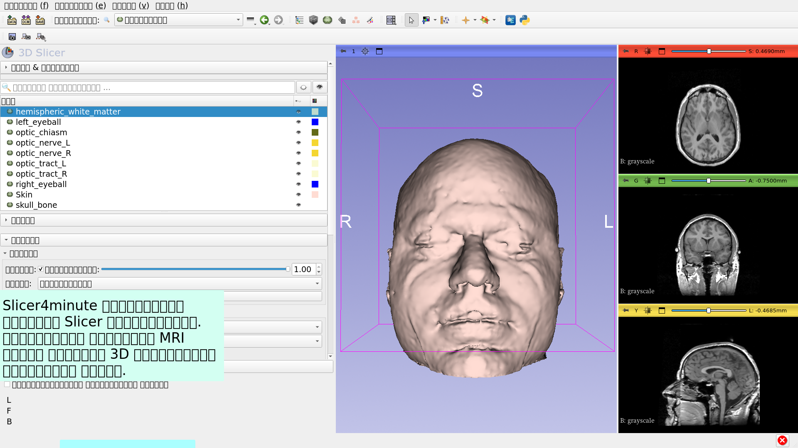

---

## 3D காட்சிப்படுத்தல்

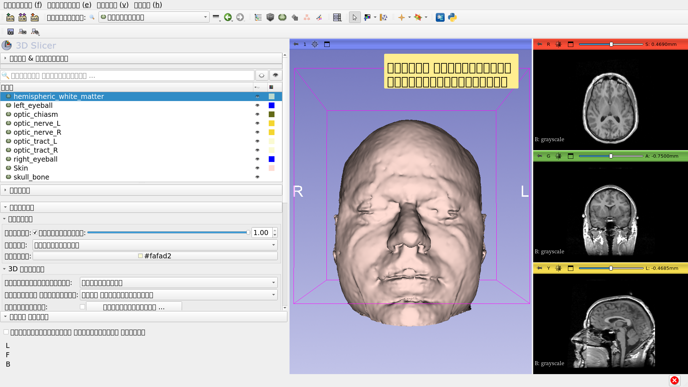

---

## 3D காட்சிப்படுத்தல்

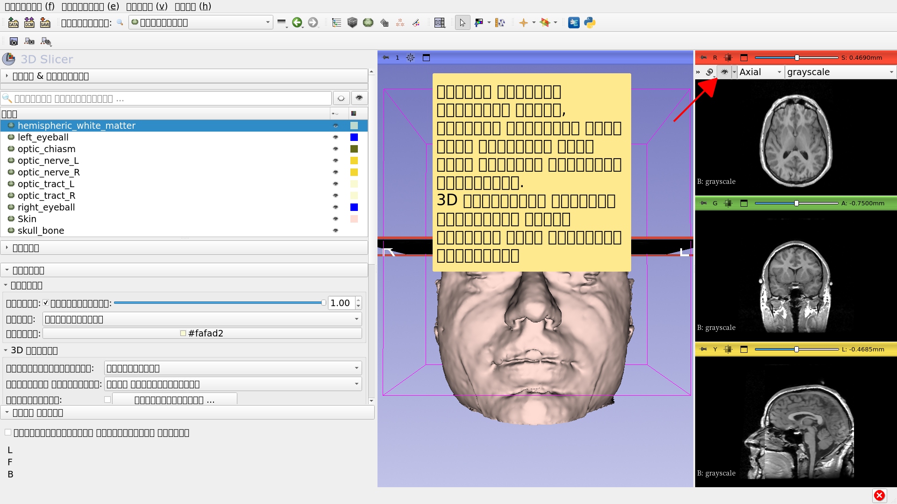

---

## 3D காட்சிப்படுத்தல்

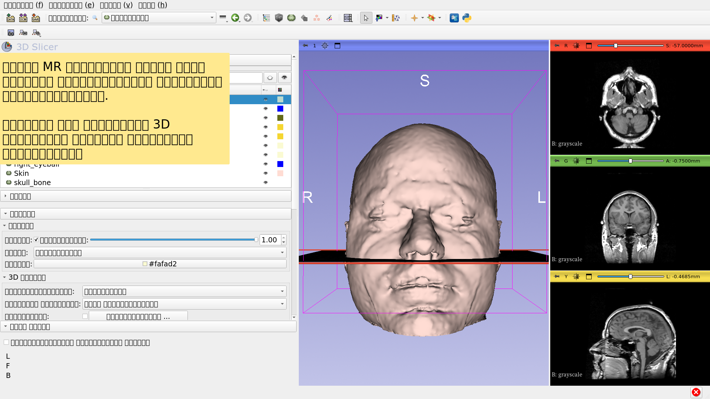

---

## 3D காட்சிப்படுத்தல்

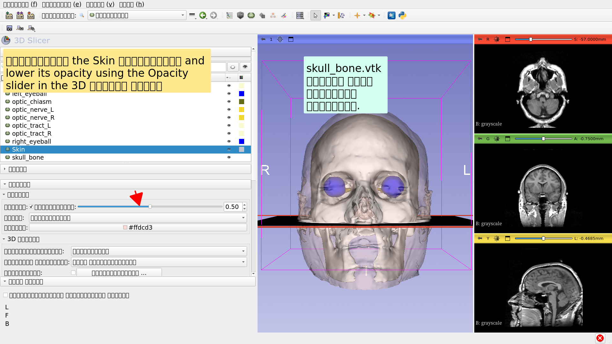

---

## 3D காட்சிப்படுத்தல்

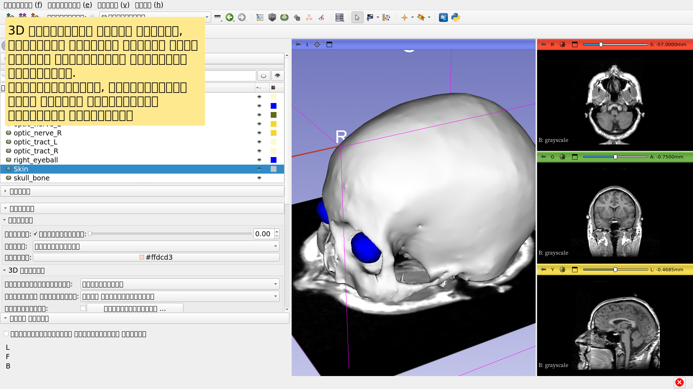

---

## உடற்கூறியல் பார்வைகள்

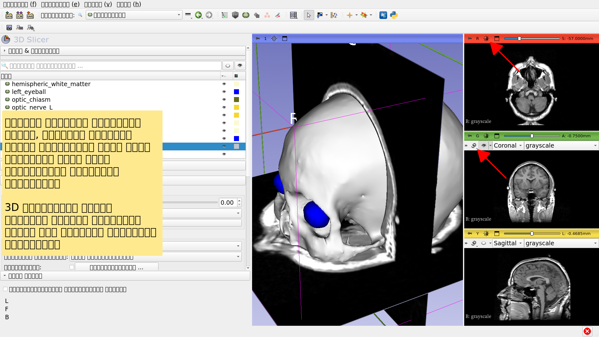

---

## 3D காட்சிப்படுத்தல்

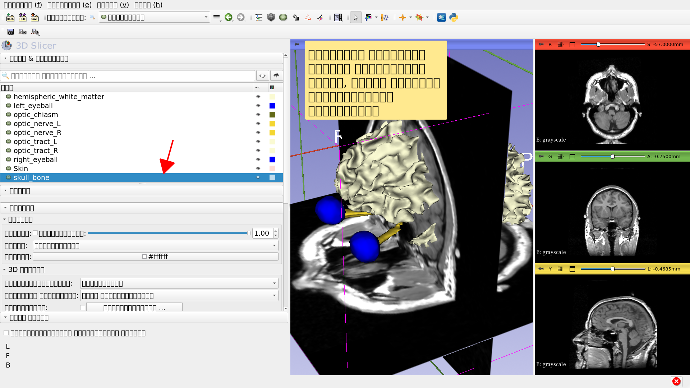

---

## 3D காட்சிப்படுத்தல்

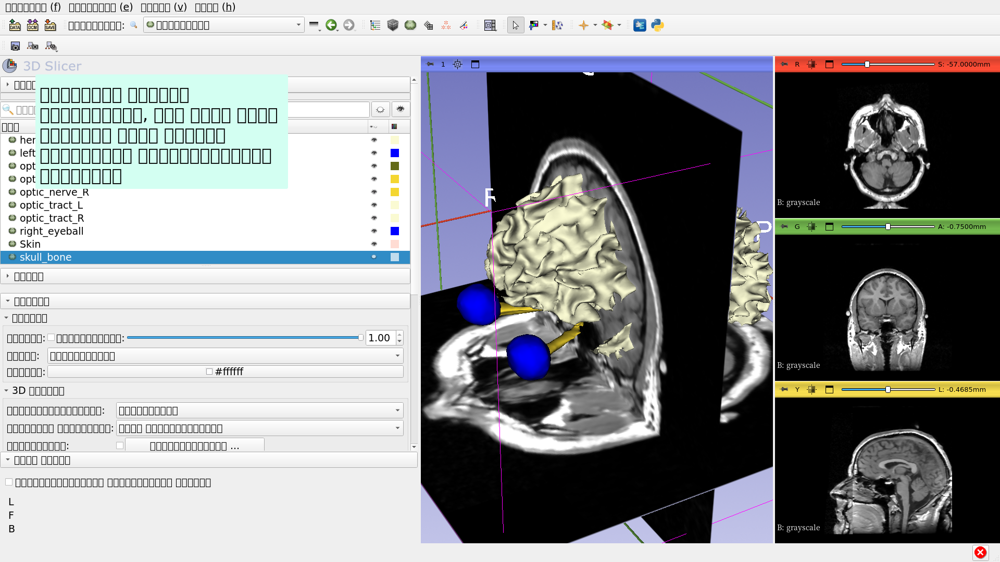

---

## 3D காட்சிப்படுத்தல்

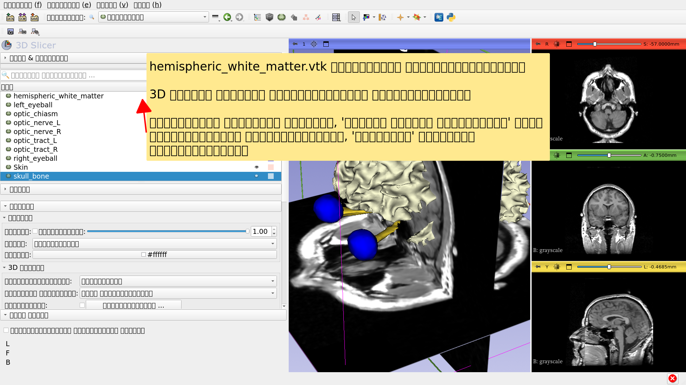

---

## Slicer4 நிமிட பயிற்சி

*இந்த டுடோரியல் MRI தரவு மற்றும் ச்லைசரில் உள்ள 3D மாடல்களின் ஊடாடும் 3D காட்சிப்படுத்தல் பற்றிய ஒரு சிறிய அறிமுகமாகும். 

*Slicer5 பயிற்சித் தொகுப்பானது, மென்பொருளை எவ்வாறு பயன்படுத்துவது என்பதை அறிய, தொடர்ச்சியான பயிற்சிகள் மற்றும் முன்-கணிக்கப்பட்ட தரவுத்தொகுப்புகளைக் கொண்டுள்ளது.

---

# அங்கீகாரங்கள்

மருத்துவ படத்திற்கான தேசிய கூட்டணி 

கம்ப்யூட்டிங் 

NIH U54EB005149 

நியூரோஇமேச் பகுப்பாய்வு நடுவண் 

NIH P41EB015902

---
