

# Slicer4 Minute

索尼娅·普约尔，博士

 

放射科助理教授
布里格姆妇女医院
哈佛医学院

---

## Slicer 4分钟教程

本教程是一段时长4分钟的视频，旨在介绍用于医学图像分析的Slicer5软件的3D可视化功能。

---

## Slicer5 软件及数据集

*请从 http://download.slicer.org 下载 Slicer5 软件

*请从 https://www.slicer.org/wiki/Documentation/4.10/Training 下载 Slicer4minute 数据集

---

## 3D Slicer 5版

---

## 3D Slicer 场景

*Slicer 场景是一个 MRML（医学现实建模语言）文件，其中包含加载到 Slicer 中的元素列表（体素、模型、定位标志、变换等）。

*在下面的示例中，我们使用了一个名为“Slicer4minute.mrml”的场景，该场景由 MRI 扫描数据和头部的 3D 模型组成。

*该场景文件和数据集已保存为 MRB（医疗现实捆绑包）文件。 

*MRB 文件格式是 Slicer 的归档文件格式。

---

## 加载 Slicer4minute 数据集

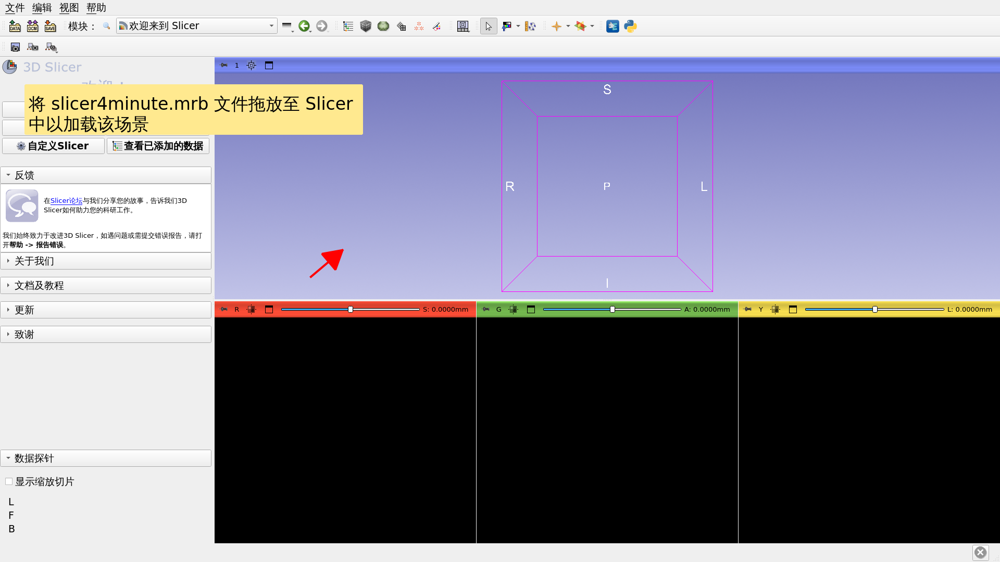

---

## 《Slicer4minute》场景

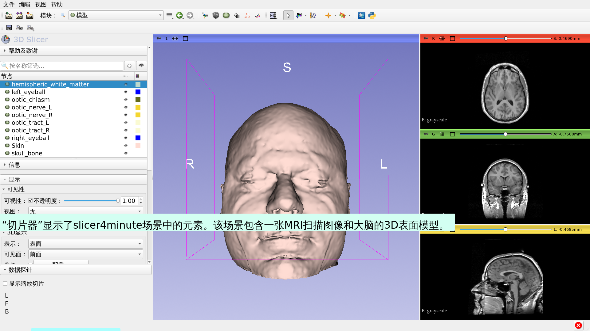

---

## 3D 可视化

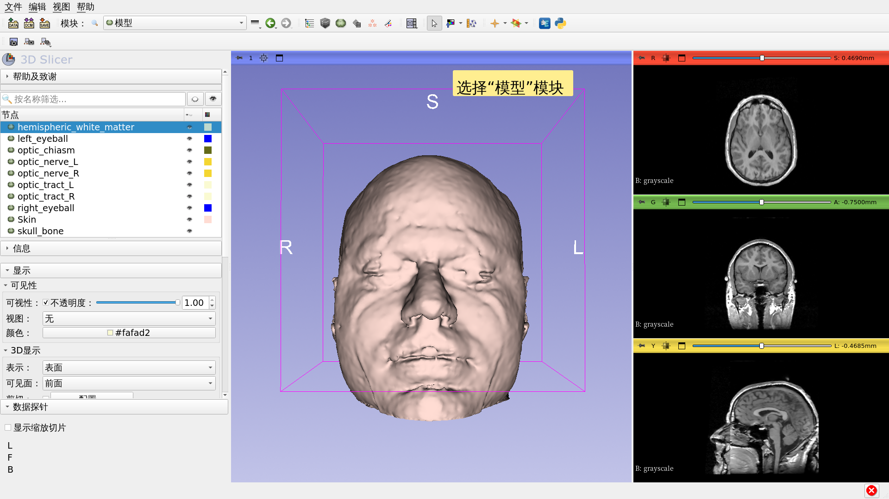

---

## 3D可视化

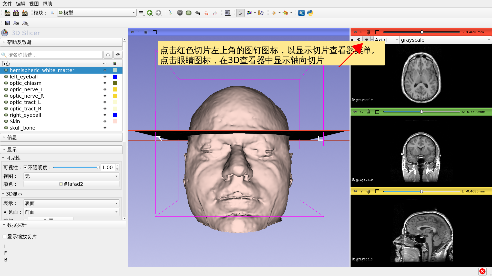

---

## 3D 可视化

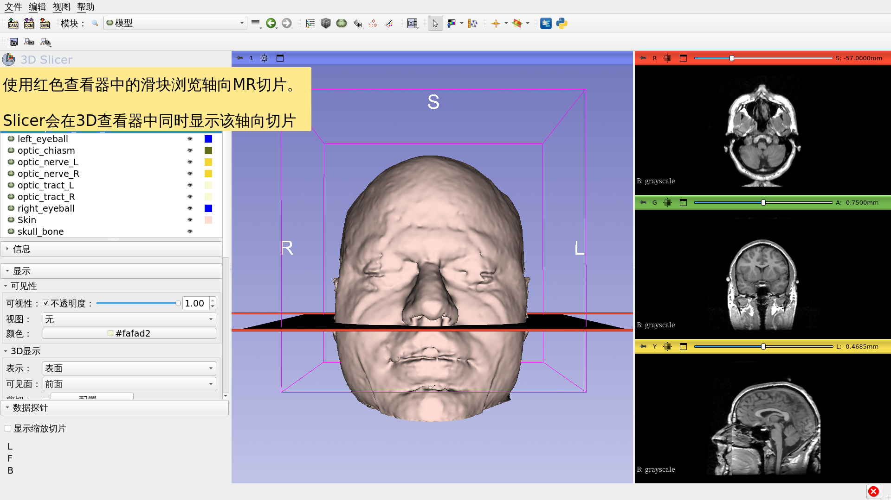

---

## 3D 可视化

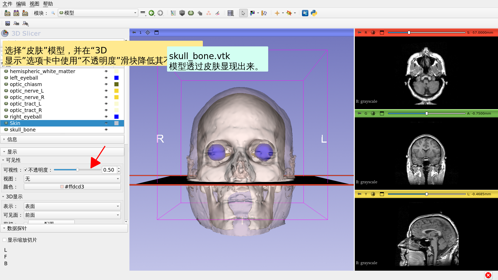

---

## 3D 可视化

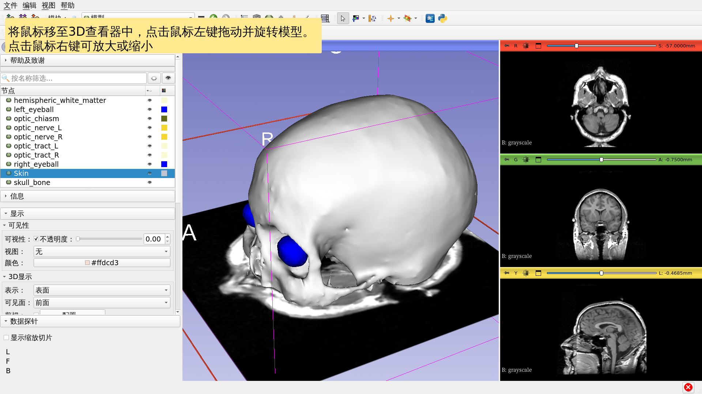

---

## 解剖图

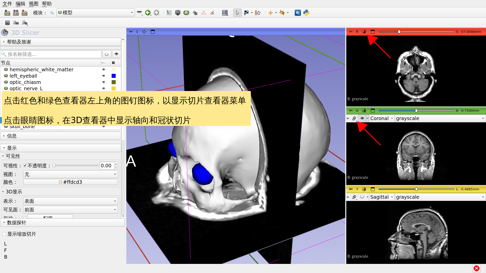

---

## 3D 可视化

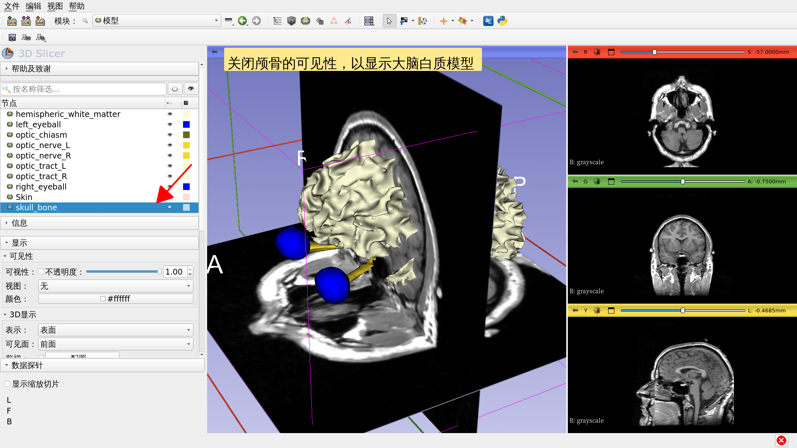

---

## 3D 可视化

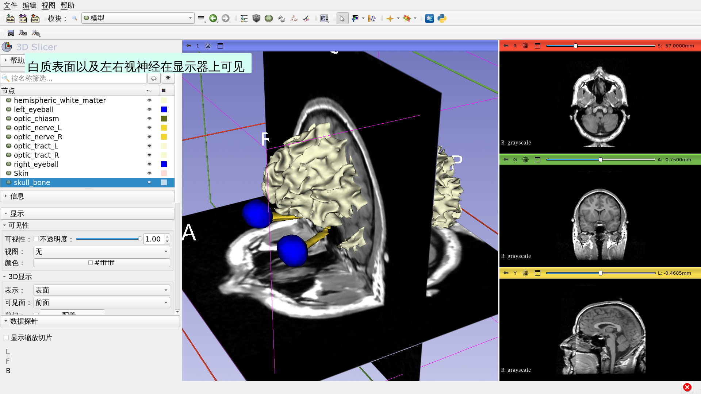

---

## 3D 可视化

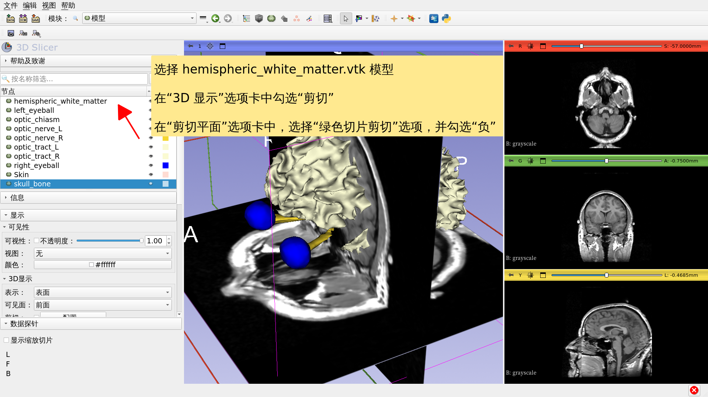

---

## Slicer 4分钟教程

*本教程简要介绍了如何在 Slicer 中对 MRI 数据和 3D 模型进行交互式 3D 可视化。

*《Slicer5 培训手册》包含一系列教程和预处理数据集，用于学习如何使用该软件。

---

# 致谢

全国医学影像

计算联盟

NIH U54EB005149

神经影像分析中心

NIH P41EB015902

---
