

# Slicer 四分鐘教學

Sonia Pujol 博士

 

放射學助理教授
布萊根婦女醫院
哈佛醫學院

---

## Slicer 四分鐘教學

本教學將在 4 分鐘內簡介 Slicer 5 醫學影像分析軟體的 3D 視覺化功能。 

---

## Slicer 5 軟體與資料集 (&D)

*從 http://download.slicer.org 下載 Slicer 5 軟體

*從 https://www.slicer.org/wiki/Documentation/4.10/Training 下載 Slicer4minute 資料集

---

## 3D Slicer 版本 5

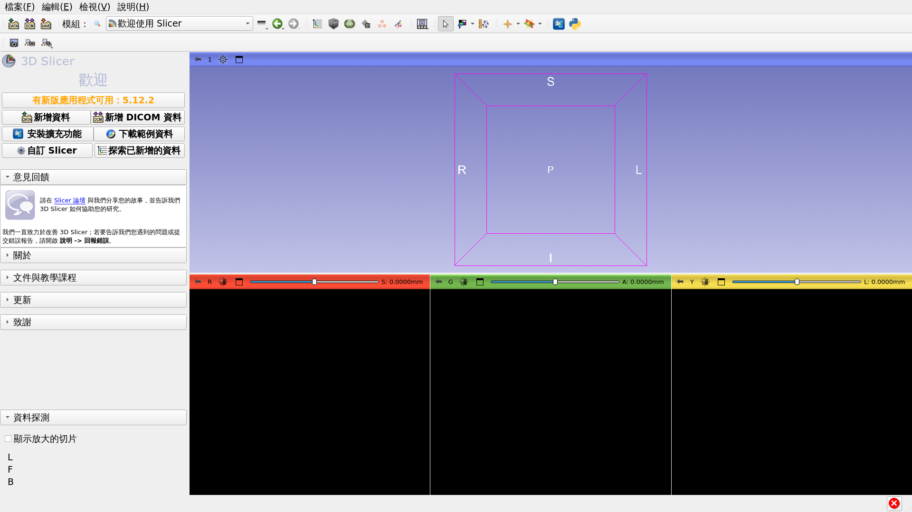

---

## 3D Slicer 場景

*Slicer 場景是一個 MRML (Medical Reality Modeling Language) 檔案，其中包含載入 Slicer 的元素清單 (影像體積、模型、基準點、變換等)。

*在以下範例中，我們使用由頭部 MRI 掃描影像及 3D 模型組成的「Slicer4minute.mrml」場景。

*場景檔案及資料集已儲存為 MRB (Medical Reality Bundle) 檔案。

*MRB 檔案格式是 Slicer 的封存檔案格式。

---

## 載入 Slicer4minute 資料集

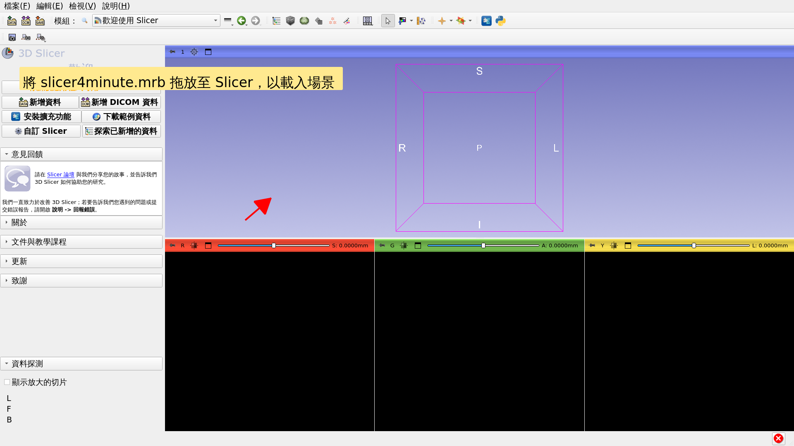

---

## Slicer4minute 場景

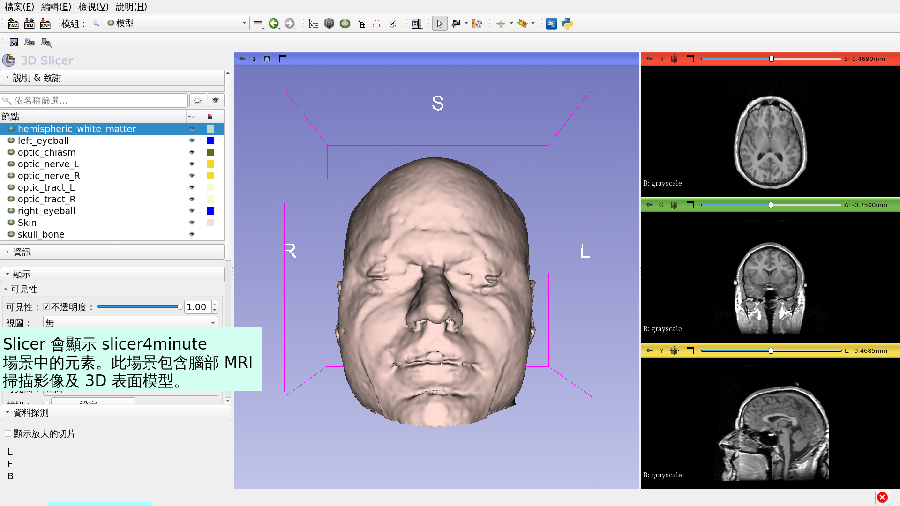

---

## 3D 視覺化

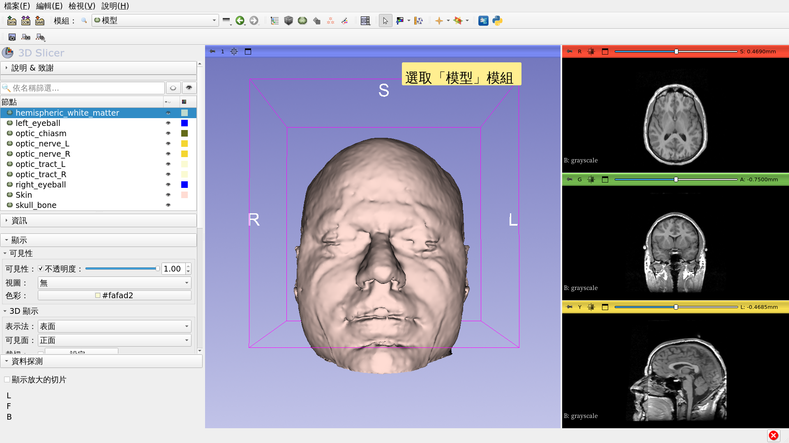

---

## 3D 視覺化

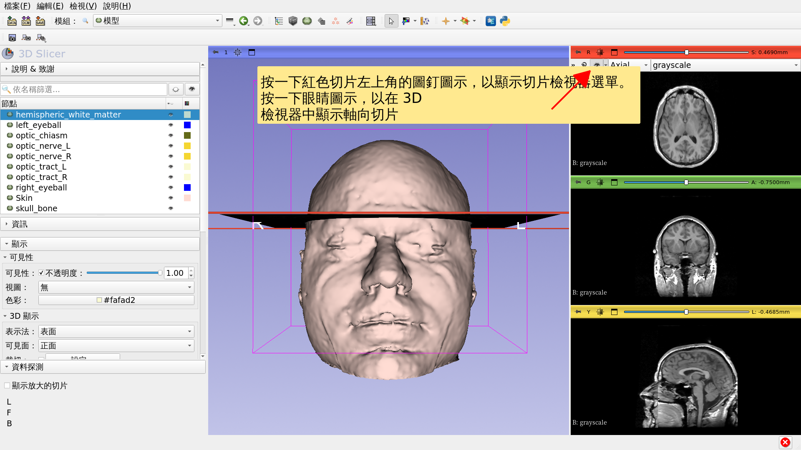

---

## 3D 視覺化

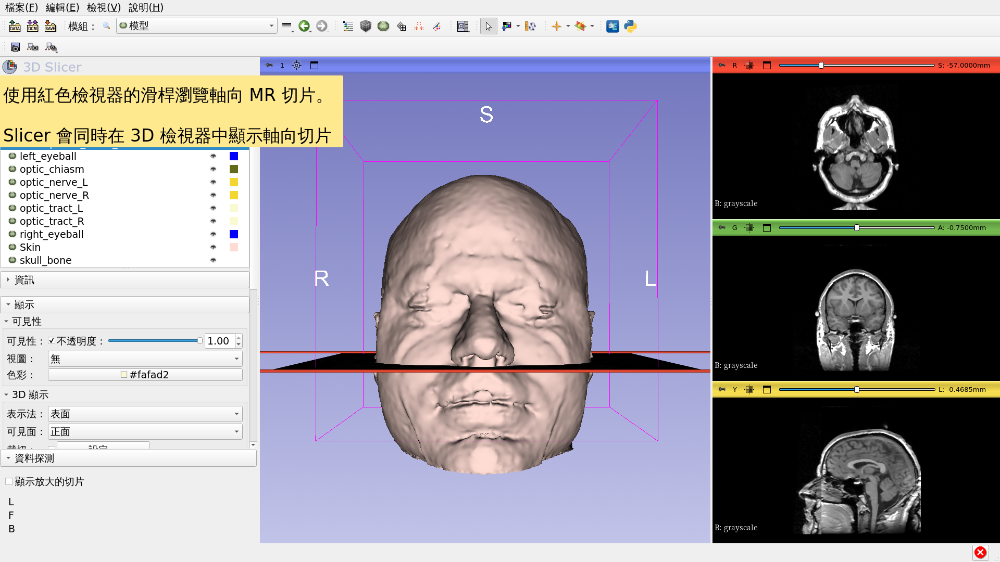

---

## 3D 視覺化

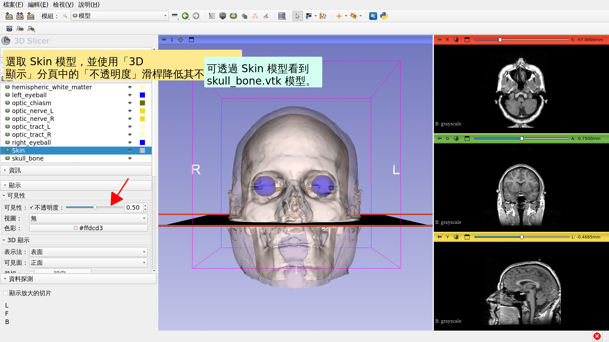

---

## 3D 視覺化

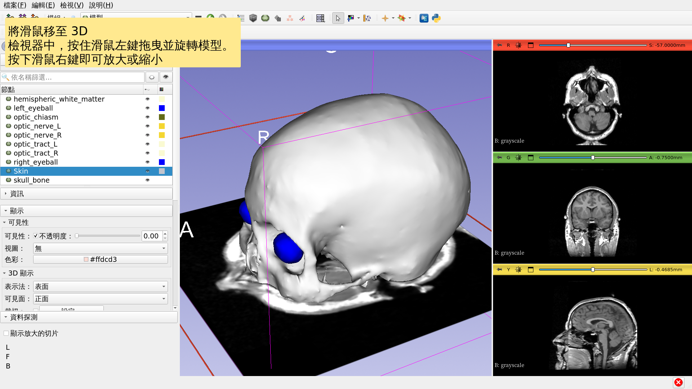

---

## 解剖視圖

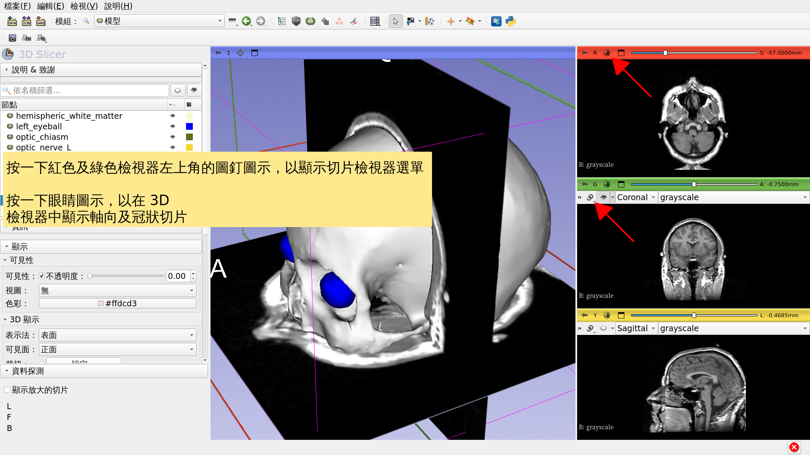

---

## 3D 視覺化

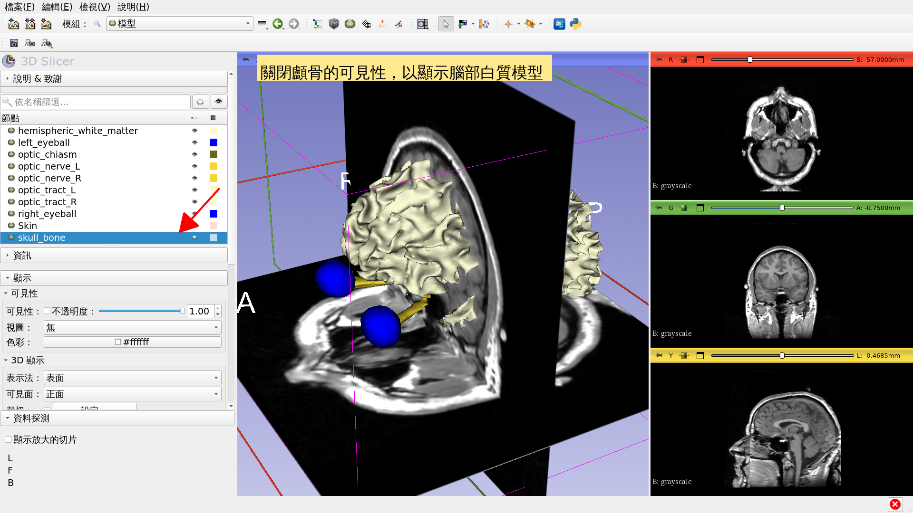

---

## 3D 視覺化

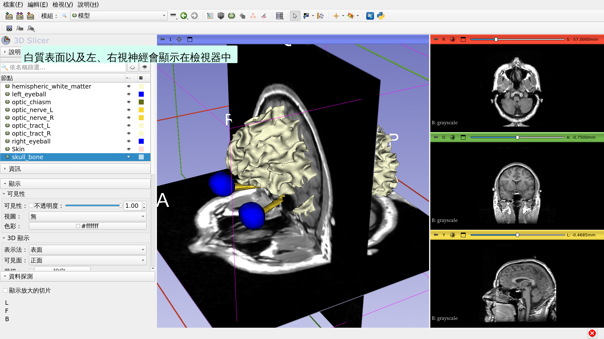

---

## 3D 視覺化

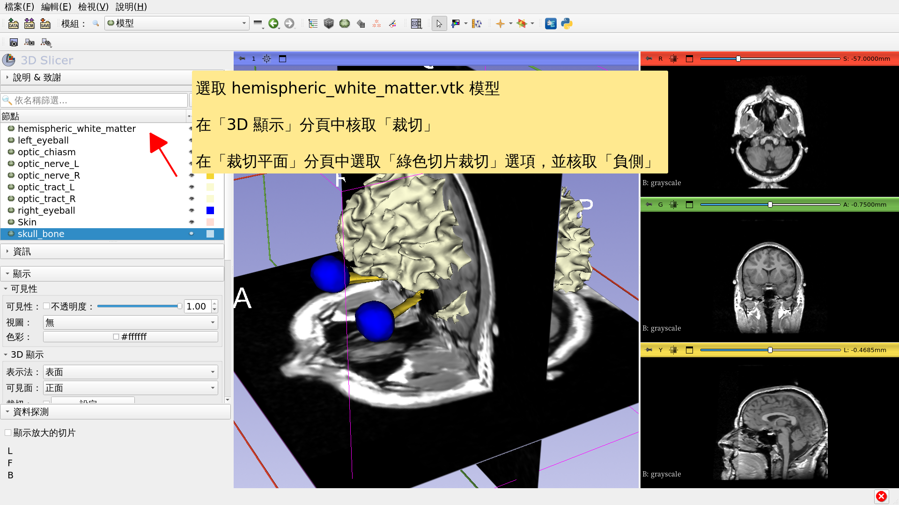

---

## Slicer 四分鐘教學

*本教學簡短介紹了如何在 Slicer 中以互動方式對 MRI 資料及 3D 模型進行 3D 視覺化。

*Slicer 5 訓練教材彙編包含一系列教學及預先計算的資料集，可用來學習如何使用此軟體。

---

# 致謝

國家醫學影像計算

聯盟

NIH U54EB005149

神經影像分析中心

NIH P41EB015902

---
