

# التجزئة المعتمدة على الذكاء الاصطناعي في 3D Slicer

سونيا بوجول، دكتوراه.
مستشفى بريغهام والنساء،
كلية الطب بجامعة هارفارد
بوسطن، ماساتشوستس

 

ورشة عمل Slicer ريبيراو بريتو
30 يونيو 2025

---

## التقسيم اليدوي مقابل التقسيم المدعوم بالذكاء الاصطناعي

عادة ما يتم تقسيم الصور الطبية يدويًا، وهي عملية تستغرق وقتًا طويلاً وتتطلب جهدًا مكثفًا من قبل أطباء الأشعة وتخضع لتباين بين القراء.

---

## التقسيم اليدوي مقابل التقسيم المدعوم بالذكاء الاصطناعي

في العقد الماضي، تم تعزيز تجزئة الصور من خلال تطوير خوارزميات التعلم العميق (مثل nnUnet من قبل المركز الألماني لأبحاث السرطان (DKFZ)/مركز هيلمهولتز للأبحاث).

يمكن لأدوات التجزئة المدعومة بالذكاء الاصطناعي تقليل وقت التجزئة وتوفير نتائج أكثر قابلية للتكرار.

---

## مصطلحات الذكاء الاصطناعي

النموذج هو خوارزمية ذكاء اصطناعي تم تدريبها لأداء مهمة محددة (مثل نموذج تقسيم ورم الدماغ).

أوزان نموذج الذكاء الاصطناعي هي أرقام صغيرة تحدد مدى الأهمية التي يوليها النموذج لميزات الصورة المختلفة.

خلال مرحلة التدريب، يتعلم النموذج الأنماط من البيانات المصنفة بواسطة الخبراء ويعدل أوزانه لتحسين تنبؤاته.

خلال مرحلة التحقق/الاختبار، يتم تقييم النموذج على مجموعة منفصلة من البيانات لم تستخدم خلال مرحلة التدريب.

خلال مرحلة الاستدلال، يتم تطبيق النموذج على مجموعات بيانات جديدة لأداء المهمة المحددة التي تم تدريبه عليها.

---

## دليل 3D Slicer للذكاء الاصطناعي

يركز هذا البرنامج التعليمي على تشغيل مهام الاستدلال باستخدام نماذج الذكاء الاصطناعي المختلفة المدربة مسبقًا للتجزئة الآلية للهياكل التشريحية والمرضية.

---

## إضافة MONAIAuto3DSeg Slicer

يستخدم هذا البرنامج التعليمي النماذج المدربة مسبقًا لملحق MONAIAuto3DSeg Slicer.

 تم تصميم الأداة للعمل على أجهزة الكمبيوتر المحمولة أو على أجهزة الكمبيوتر المكتبية متوسطة الإمكانات بدون وحدة معالجة رسومات (GPU).

---

## إضافة MONAIAuto3DSeg Slicer

دعم أساليب التصوير المتعددة (الأشعة المقطعية، الرنين المغناطيسي).

تشريح متعدد (رأس، صدر، بطن، حوض، إلخ).

أمراض متعددة (ورم، نزيف، وذمة).

---

## البرنامج التعليمي لـ Slicer AI: مهام التجزئة

مهمة التجزئة رقم 1: البروستاتا

مهمة التجزئة رقم 2: ورم الدماغ الدبقي

مهمة التجزئة رقم 3: تجزئة الجسم بالكامل

---

# مهمة تجزئة الذكاء الاصطناعي رقم 1: البروستاتا

---

##  

تقسيم المناطق المحيطية (PZ) والمناطق الانتقالية (TZ) للبروستاتا المعتمد على الذكاء الاصطناعي في صور الرنين المغناطيسي T2.

مجموعة البيانات:

msd_prostate_01-t2

msd_prostate_01-adc

---

## 

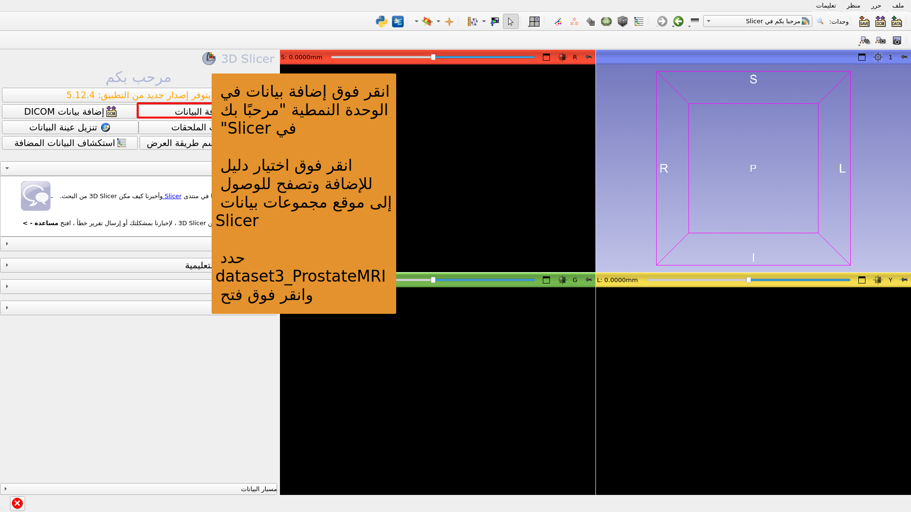

---

## 

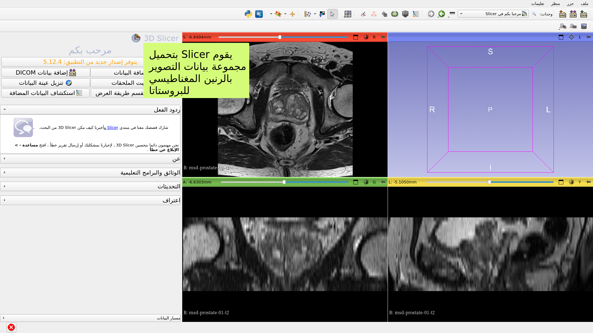

---

## 

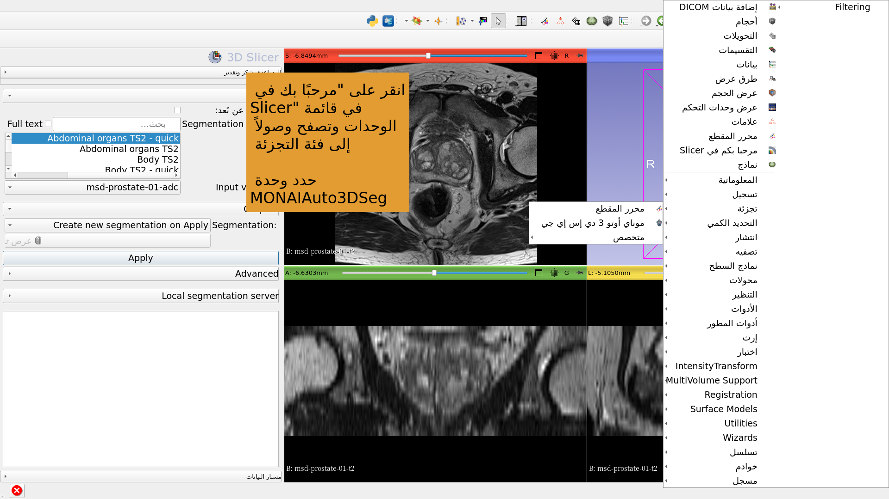

---

## 

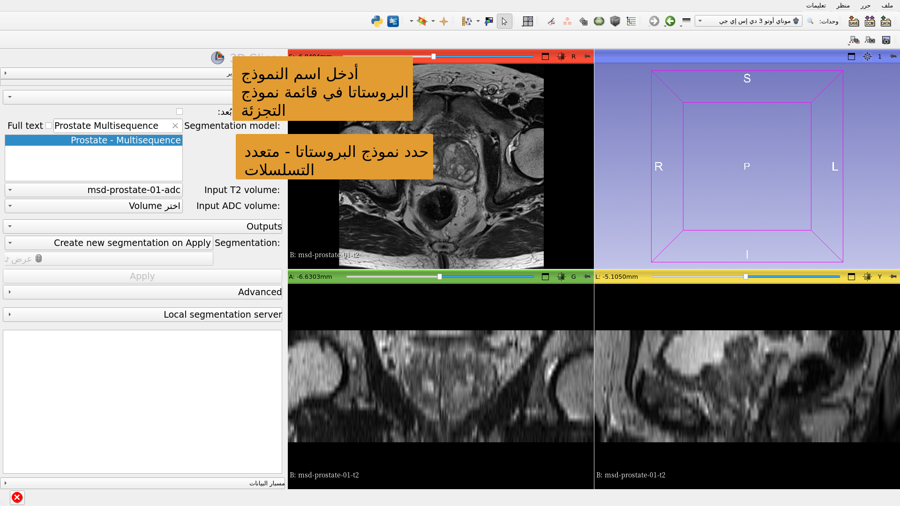

---

## 

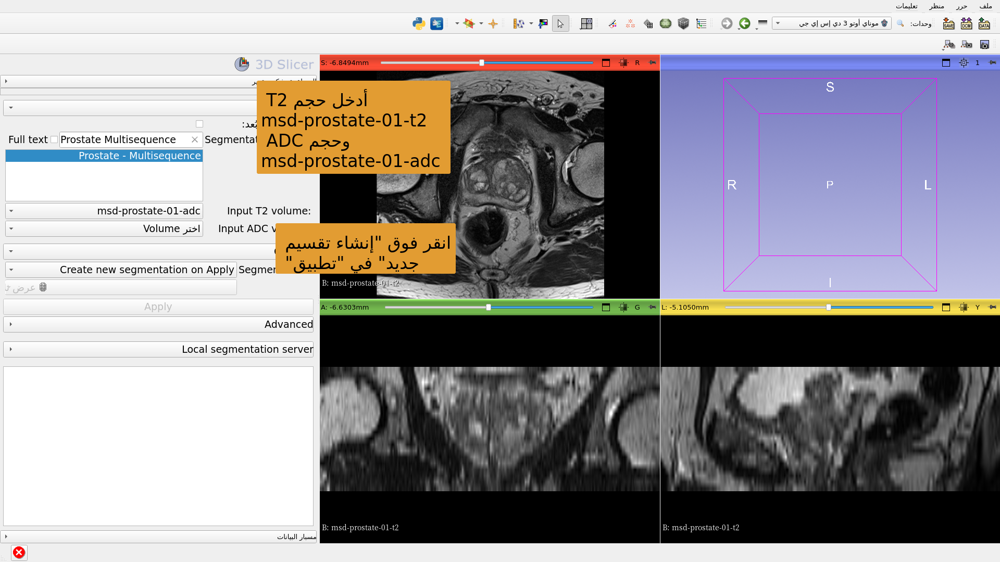

---

## 

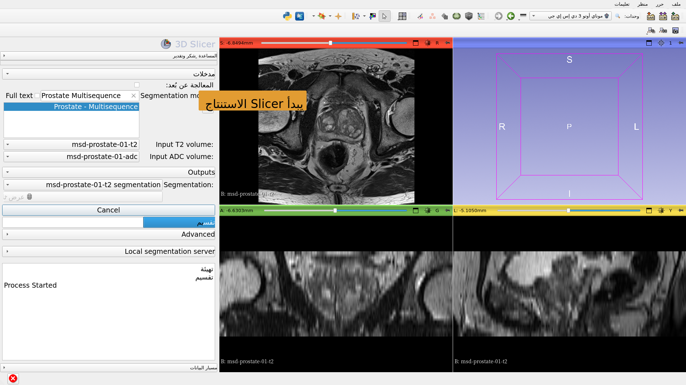

---

## 

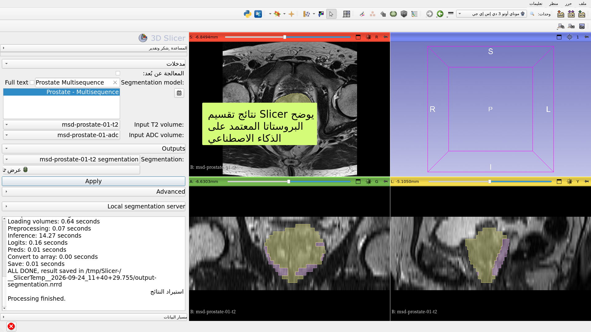

---

# مهمة تجزئة الذكاء الاصطناعي رقم 2: ورم دبقي في الدماغ

---

##  

التقسيم المستند إلى الذكاء الاصطناعي للأورام والغرغرينا والوذمة في صور الرنين المغناطيسي للدماغ.

مجموعات البيانات:

1) BraTS-GLI_00005-000-t1n (المرجحة T1)

2) BraTS-GLI_00005-000-t1c (المرجحة T1 بعد Gd)

3) BraTS-GLI_00005-000-t2w (المرجحة T2)

4) BraTS-GLI_00005-000-t2f (المرجحة T2-FLAIR)

---

## 

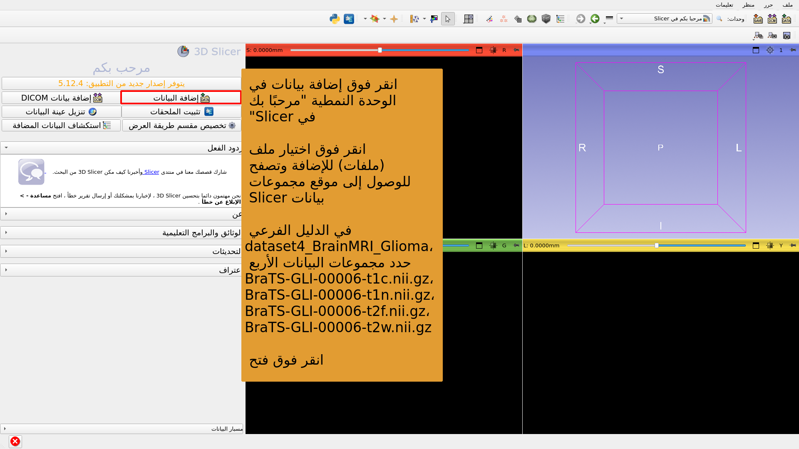

---

## 

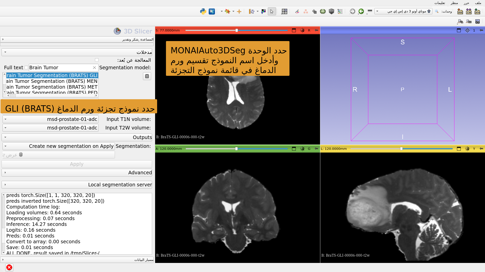

---

## 

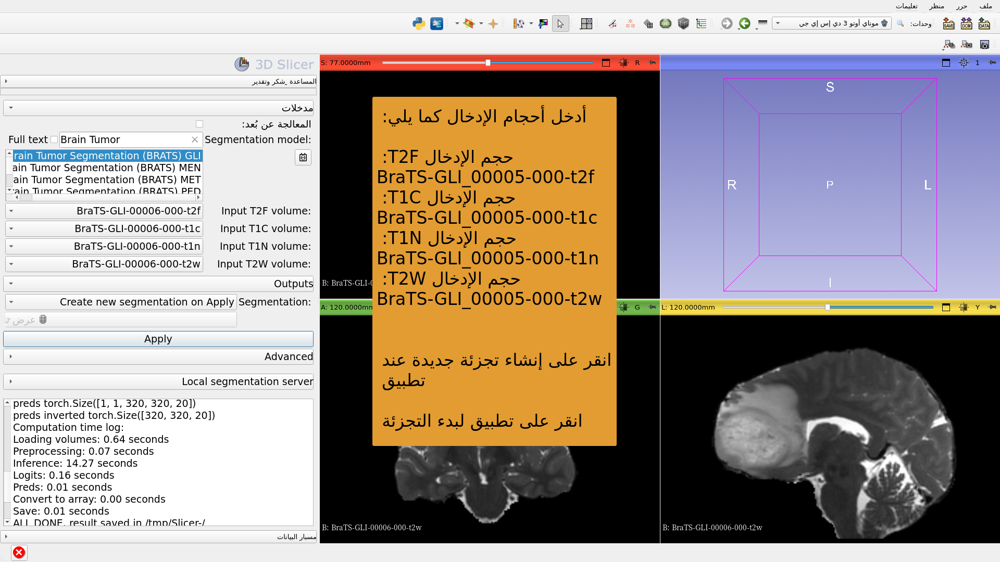

---

## 

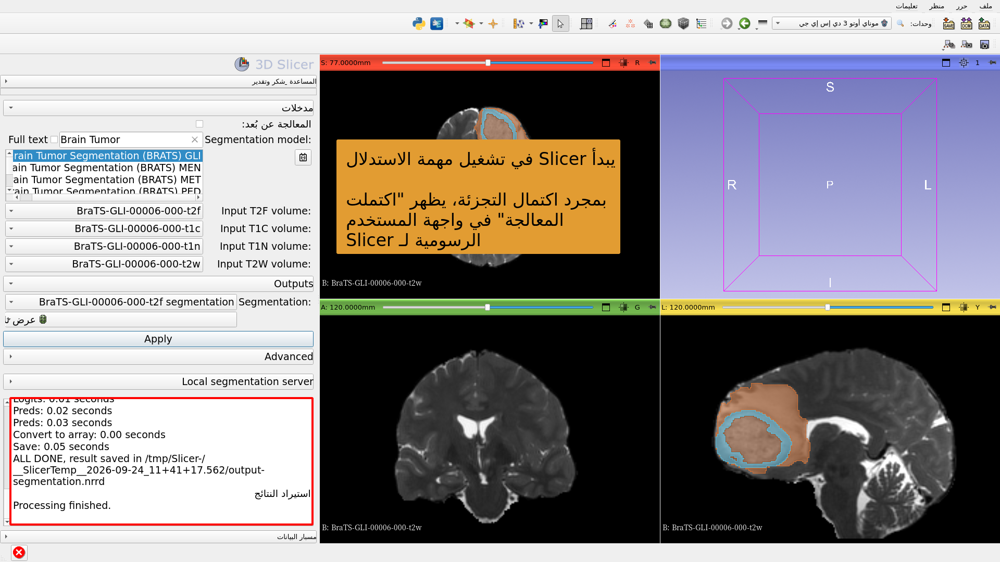

---

## 

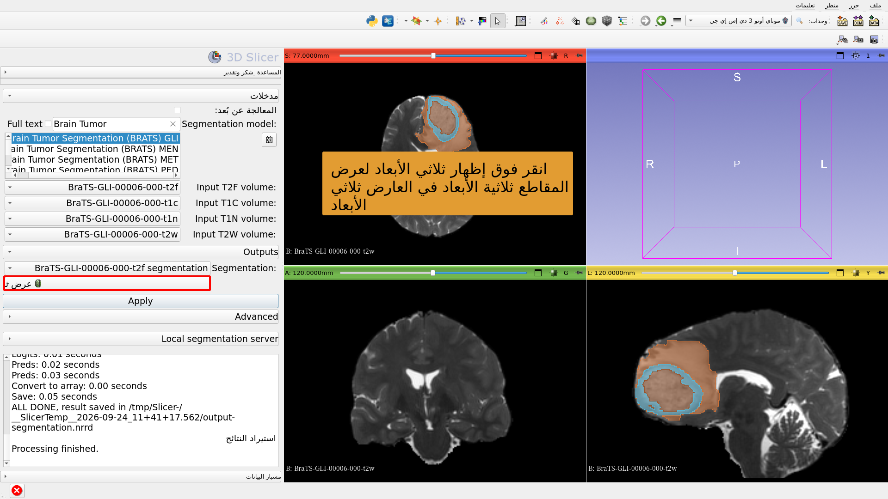

---

# مهمة تجزئة الذكاء الاصطناعي رقم 3: تجزئة الجسم بالكامل

---

##  

التجزئة الشاملة للجسم بالاعتماد على الذكاء الاصطناعي.

مجموعة البيانات:

CT_ThoraxAbdomen

---

## 

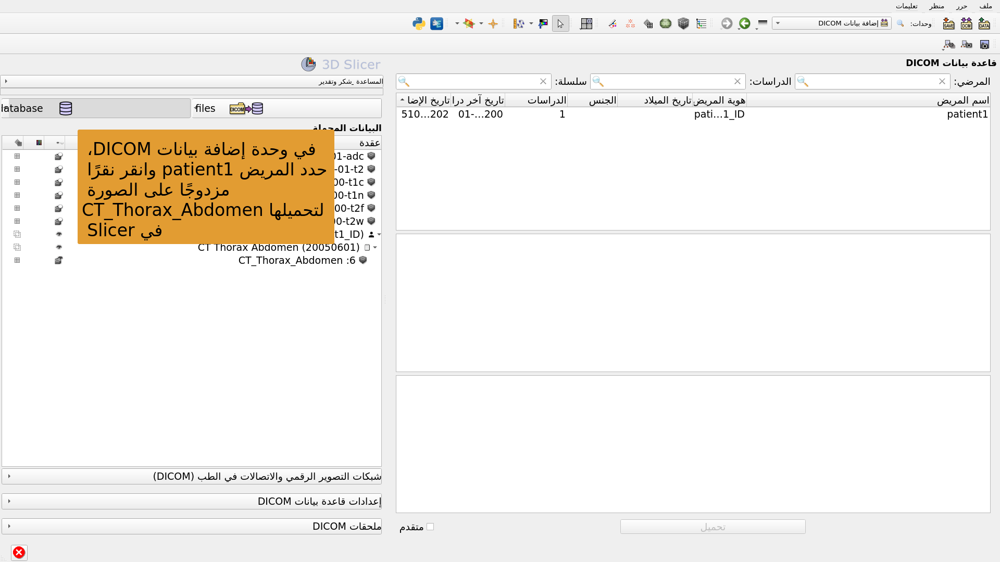

---

## 

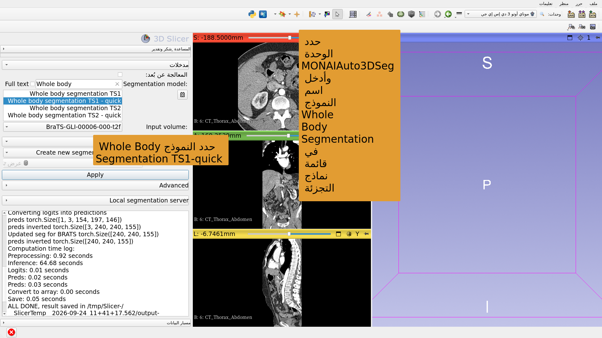

---

## 

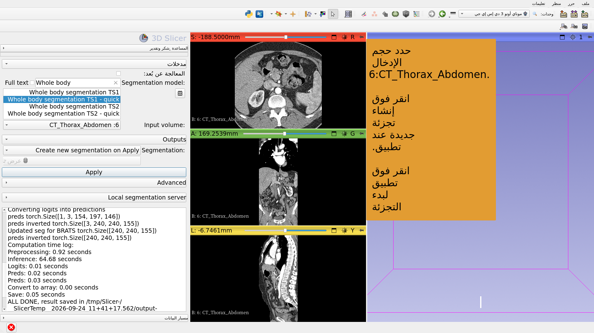

---

## 

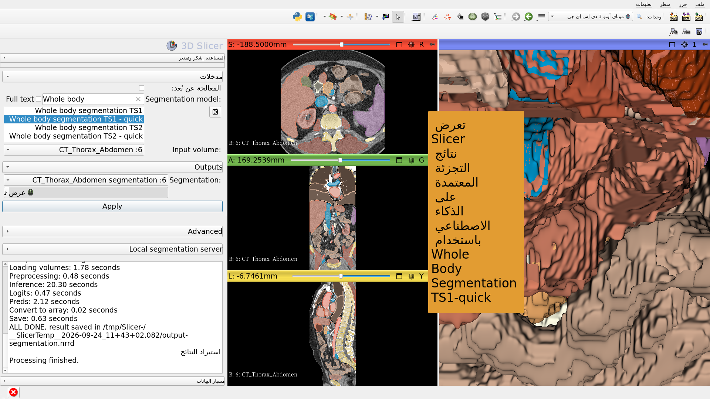

---

## الخلاصة

يوفر ملحق 3D Slicer MONAIAuto3DSeg تجزئة سريعة قائمة على الذكاء الاصطناعي للهياكل التشريحية والمرضية.

يمكن تشغيل الوحدة على أجهزة الكمبيوتر المحمولة والمكتبية القياسية التي لا تحتوي على وحدة معالجة رسومات (GPU).

---

# شكر وتقدير

لقد أصبح مشروع تدويل 3D Slicer ومشروع 3D Slicer لأمريكا اللاتينية ممكنين بفضل تمويل من مبادرة تشان زوكربيرج.

---
