

# AI-Basisbezogene Aufteilung in 3D Slicer

Dr. Sonia Pujol 
Brigham and Women’s Hospital,
Harvard Medical School
Boston, MA

 

Slicer-Workshop in Ribeirão Preto
30. Juni 2025

---

## Manuelle vs. KI-gestützte Segmentierung

Medizinische Bilder wurden bisher in der Regel manuell segmentiert – ein zeitaufwändiger Prozess, der einen hohen Aufwand seitens der Radiologen erfordert und mit Abweichungen zwischen den einzelnen Befundern behaftet ist.

---

## Manuelle vs. KI-gestützte Segmentierung

In den letzten zehn Jahren wurde die Bildsegmentierung durch die Entwicklung von Deep-Learning-Algorithmen vorangetrieben (z. B. nnUnet des Deutschen Krebsforschungszentrums (DKFZ) und der Helmholtz-Gemeinschaft).

KI-gestützte Segmentierungswerkzeuge können die Segmentierungszeit verkürzen und reproduzierbarere Ergebnisse liefern.

---

## KI-Fachbegriffe

Ein Modell ist ein KI-Algorithmus, der darauf trainiert wurde, eine bestimmte Aufgabe auszuführen (z. B. ein Modell zur Segmentierung von Hirntumoren).

Die Gewichte eines KI-Modells sind kleine Zahlen, die bestimmen, welche Bedeutung das Modell den verschiedenen Bildmerkmalen beimisst.

Während der Trainingsphase lernt ein Modell Muster aus von Experten beschrifteten Daten und passt seine Gewichte an, um seine Vorhersagen zu verbessern.

Während der Validierungs-/Testphase wird das Modell anhand eines separaten Datensatzes bewertet, der während der Trainingsphase nicht verwendet wurde.

Bei der Inferenz wird das Modell auf neue Datensätze angewendet, um die spezifische Aufgabe auszuführen, für die es trainiert wurde.

---

## 3D Slicer AI-Tutorial

Im Mittelpunkt dieses Tutorials steht die Durchführung von Inferenzaufgaben unter Verwendung verschiedener vortrainierter KI-Modelle zur automatisierten Segmentierung anatomischer und pathologischer Strukturen.

---

## MONAIAuto3DSeg Slicer-Erweiterung

In diesem Tutorial werden die vortrainierten Modelle der Erweiterung „MONAIAuto3DSeg Slicer“ verwendet.

Das Tool ist für den Einsatz auf Laptops oder durchschnittlichen Desktop-Computern ohne GPU ausgelegt.

---

## MONAIAuto3DSeg Slicer-Erweiterung

Unterstützung verschiedener Bildgebungsverfahren (CT, MRT).

Verschiedene anatomische Bereiche (Kopf, Thorax, Abdomen, Becken usw.).

Verschiedene Erkrankungen (Tumor, Blutung, Ödem).

---

## Slicer-AI-Tutorial: Segmentierungsaufgaben

Segmentierungsaufgabe Nr. 1: Prostata 

Segmentierungsaufgabe Nr. 2: Hirngliom 

Segmentierungsaufgabe Nr. 3: Ganzkörpersegmentierung

---

# KI-Segmentierungsaufgabe Nr. 1: Prostata

---

##  

KI-gestützte Segmentierung der peripheren Zone (PZ) und der Übergangszone (TZ) der Prostata auf T2-gewichteten MRT-Bildern.

Datensatz:

msd_prostate_01-t2

msd_prostate_01-adc

---

## 

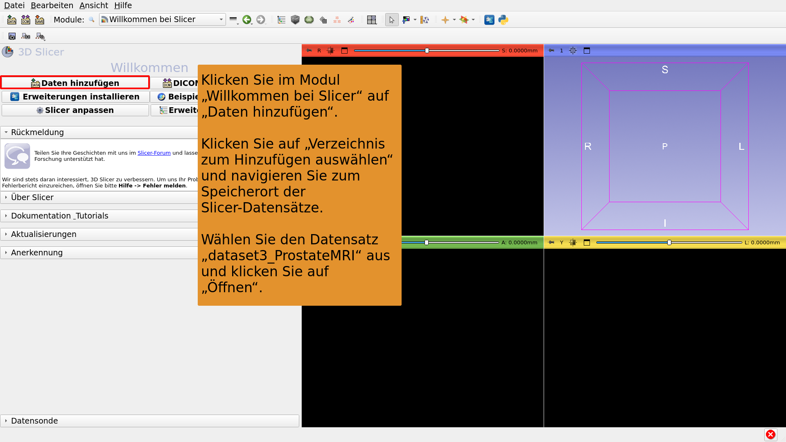

---

## 

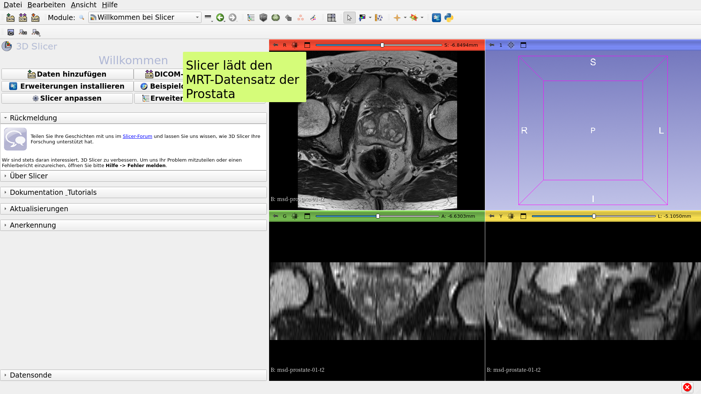

---

## 

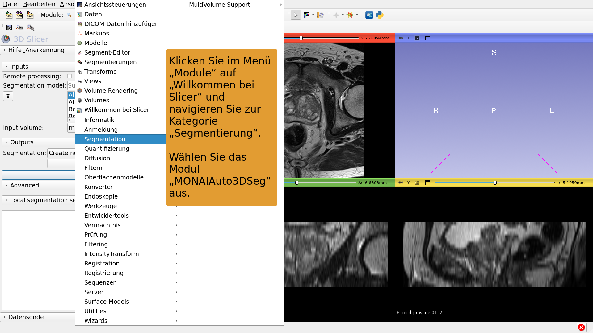

---

## 

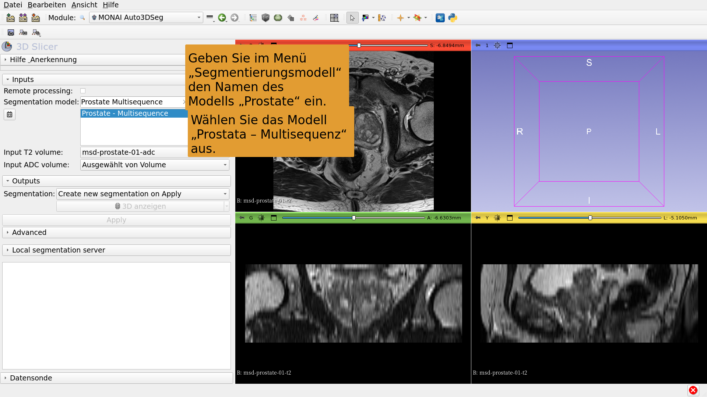

---

## 

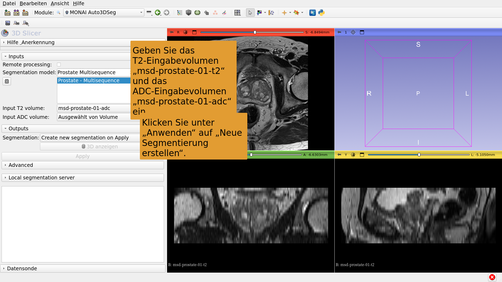

---

## 

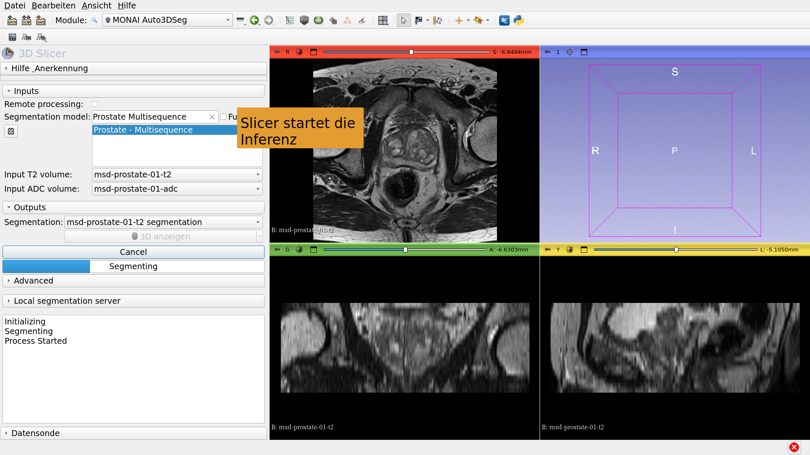

---

## 

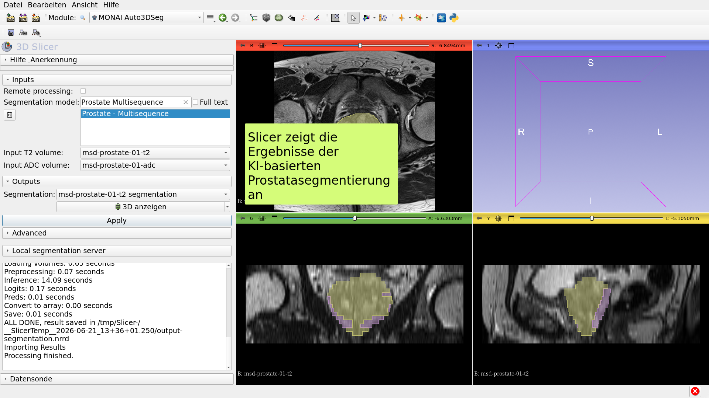

---

# KI-Segmentierungsaufgabe Nr. 2: Hirngliom

---

##  

KI-gestützte Segmentierung von Neoplasmen, Nekrosen und Ödemen in MRT-Bildern des Gehirns.

Datensätze:

1) BraTS-GLI_00005-000-t1n (T1-gewichtet)

2) BraTS-GLI_00005-000-t1c (T1-gewichtet nach Gd-Gabe)

3) BraTS-GLI_00005-000-t2w (T2-gewichtet)

4) BraTS-GLI_00005-000-t2f (T2-FLAIR)

---

## 

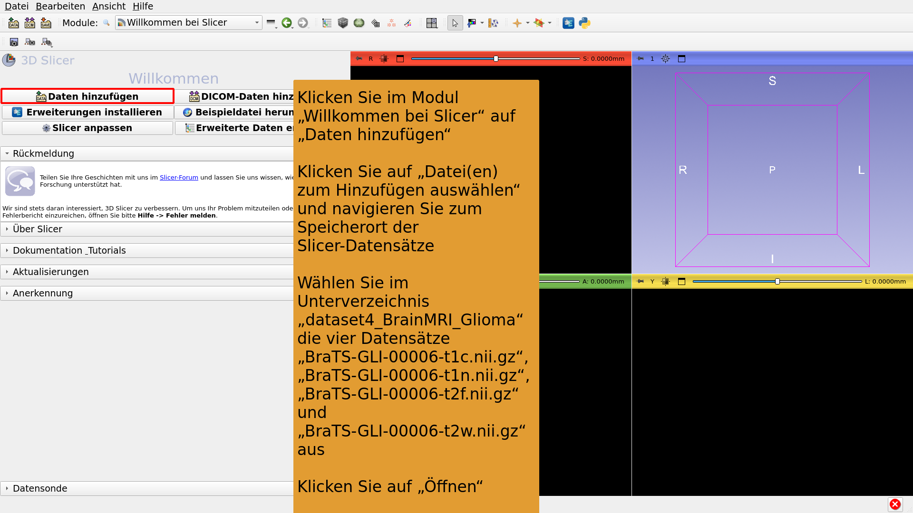

---

## 

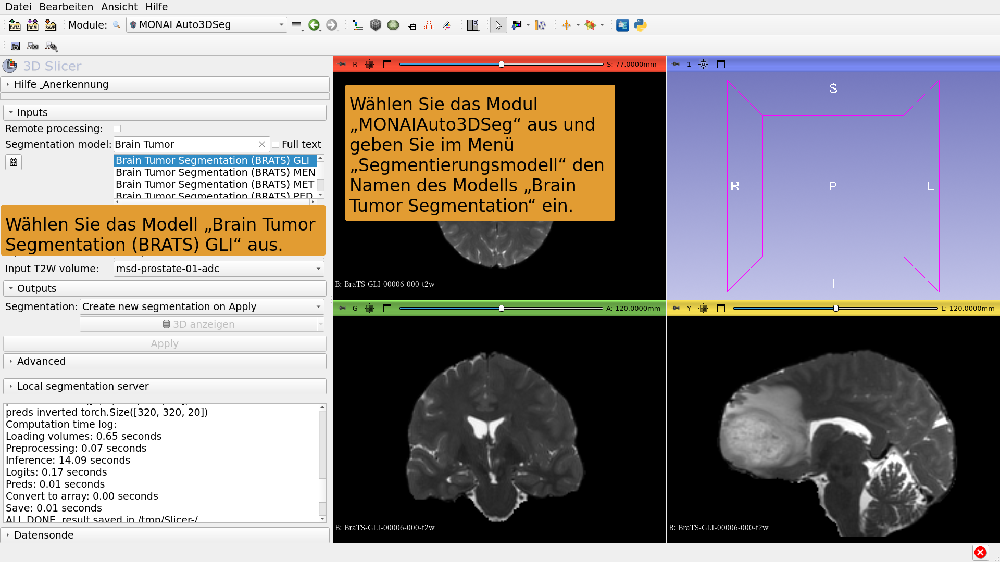

---

## 

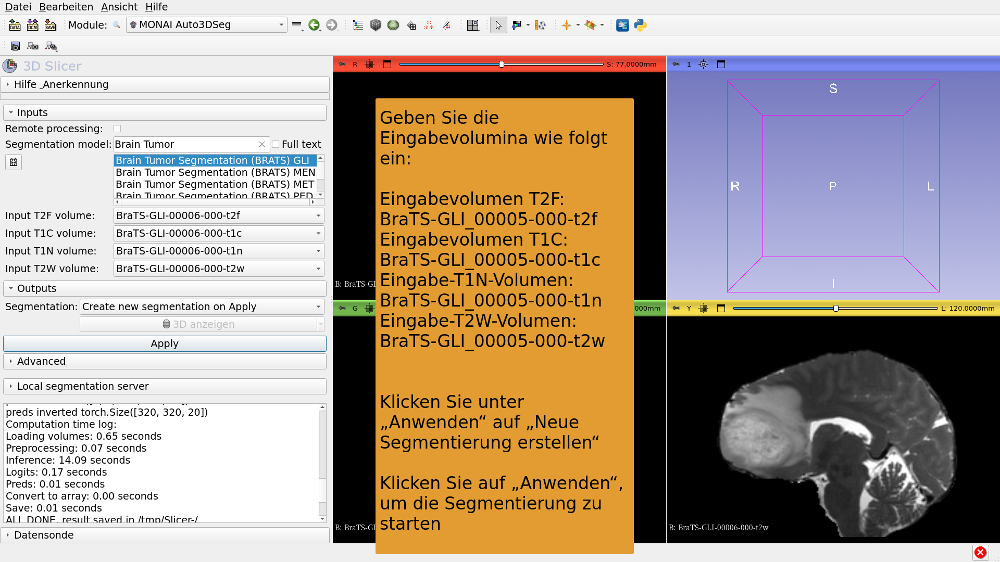

---

## 

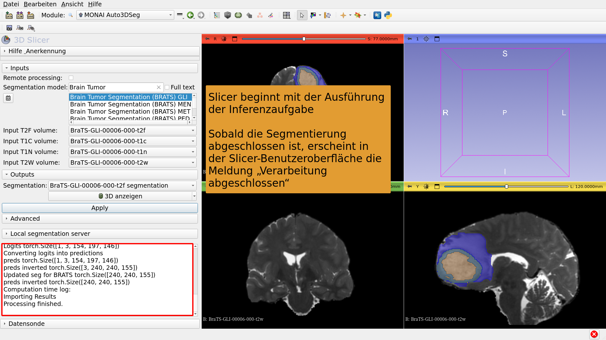

---

## 

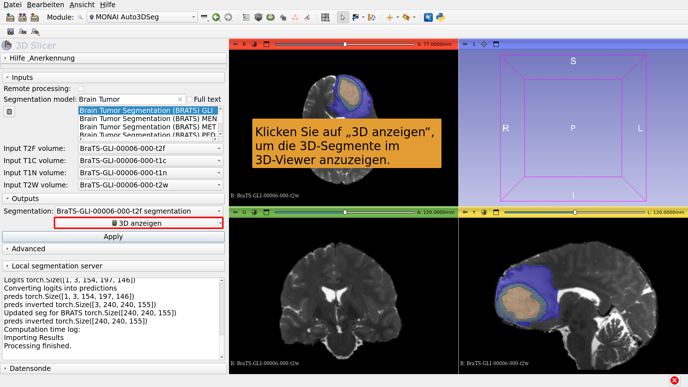

---

# KI-Segmentierungsaufgabe Nr. 3: Ganzkörpersegmentierung

---

##  

KI-gestützte Segmentierung des gesamten Körpers.

Datensatz:

CT_ThoraxAbdomen

---

## 

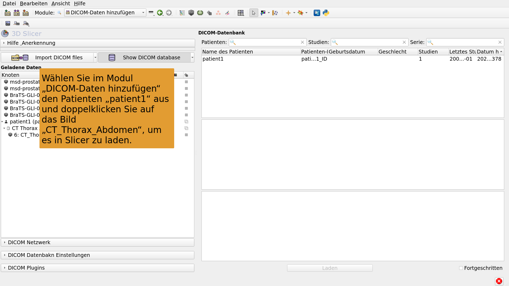

---

## 

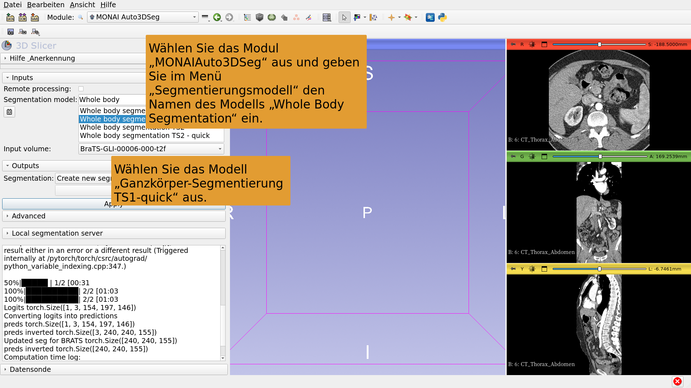

---

## 

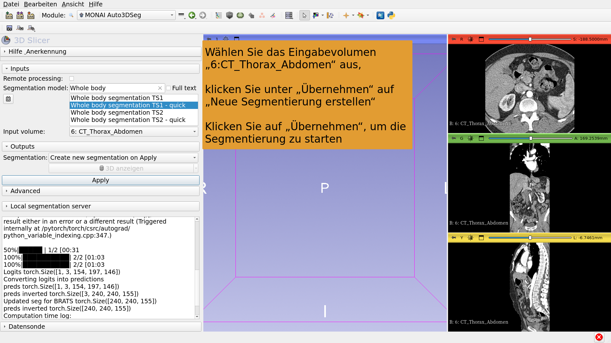

---

## 

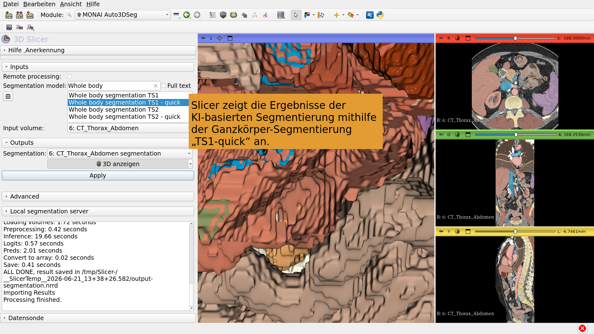

---

## Fazit

Die 3D Slicer-Erweiterung „MONAIAuto3DSeg“ ermöglicht eine schnelle, KI-basierte Segmentierung anatomischer und pathologischer Strukturen.

Das Modul kann auf handelsüblichen Laptops und Desktop-Computern ohne GPU ausgeführt werden.

---

# Danksagungen

Das Internationalisierungsprojekt von 3D Slicer und das Projekt „3D Slicer für Lateinamerika“ wurden durch die finanzielle Unterstützung der Chan Zuckerberg Initiative ermöglicht.

---
