

# Segmentación basada en IA en 3D Slicer

Dra. Sonia Pujol
Brigham and Women's Hospital,
Harvard Medical School
Boston, MA

 

Slicer Workshop Ribeirão Preto 
Junio 30, 2025

---

## Segmentación manual vs. segmentación asistida por IA

Las imágenes médicas han sido segmentadas tradicionalmente de forma manual, lo cual es un proceso que consume mucho tiempo, requiere un esfuerzo intensivo por parte de los radiólogos y está sujeto a variabilidad entre radiólogos.

---

## Segmentación manual vs. segmentación asistida por IA

En la última década, la segmentación de imágenes ha sido impulsada por el desarrollo de algoritmos de aprendizaje profundo (p. ej., nnUnet del Centro Alemán de Investigación del Cáncer (DKFZ)/Helmholtz Research).

 Las herramientas de segmentación basadas en IA pueden reducir el tiempo de segmentación y proporcionar resultados más reproducibles.

---

## Terminología de IA

Un modelo de IA es un algoritmo de IA que fue entrenado para realizar una tarea específica (p. ej., un modelo de segmentación de tumores cerebrales). 

Los pesos de un modelo de IA son números pequeños que determinan cuánta importancia le da el modelo a diferentes características de la imagen. 

Durante la fase de entrenamiento, un modelo aprende patrones a partir de datos etiquetados por expertos y ajusta sus pesos para mejorar sus predicciones. 

Durante la fase de validación/prueba, el modelo se evalúa en un conjunto de datos separado que no fue utilizado durante la fase de entrenamiento. 

Durante la inferencia, el modelo se aplica a nuevos conjuntos de datos para realizar la tarea específica para la que fue entrenado.

---

## Workshop de IA en 3D Slicer

Este tutorial se centra en la ejecución de tareas de inferencia utilizando diversos modelos de IA preentrenados para la segmentación automatizada de estructuras anatómicas y patológicas.

---

## Slicer extension MONAIAuto3DSeg

Este tutorial utiliza los modelos preentrenados de la extensión MONAIAuto3DSeg de Slicer.

La herramienta está diseñada para funcionar en laptops o en computadoras de escritorio promedio sin GPU.

---

## Slicer extension MONAIAuto3DSeg

Compatible con múltiples modalidades (TC, RM).

Múltiples anatomías (cabeza, tórax, abdomen, pelvis, etc.). 

Múltiples patologías (tumor, hemorragia, edema).

---

## Tutorial de IA en Slicer: Tareas de segmentación

Tarea de segmentación 1: Próstata

Tarea de segmentación 2: Glioma cerebral

Tarea de segmentación 3: Segmentación de cuerpo completo

---

# Tarea de segmentación de IA n.° 1: Próstata

---

##  

Segmentación basada en IA de la zona periférica (ZP) y la zona de transición (ZT) de la próstata en imágenes de RM ponderadas en T2. 

Conjunto de datos: 

msd_prostate_01-t2

msd_prostate_01-adc

---

## 

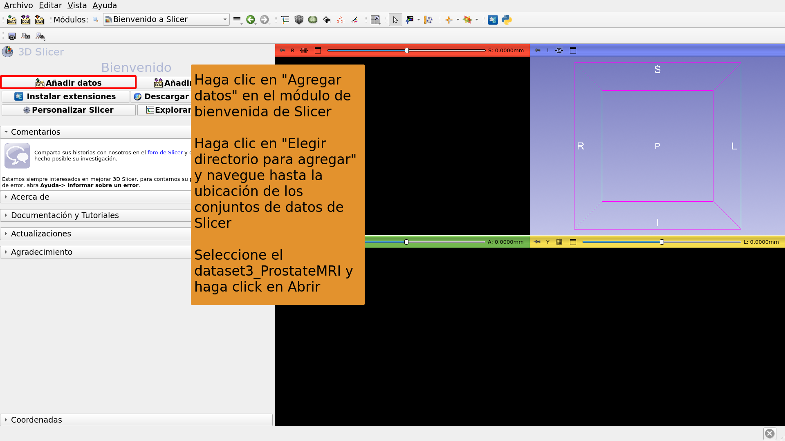

---

## 

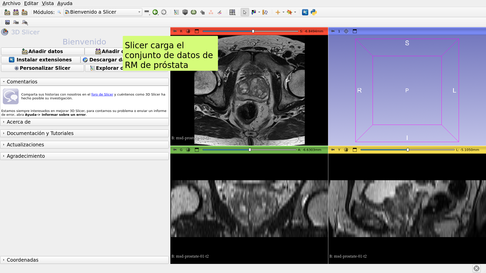

---

## 

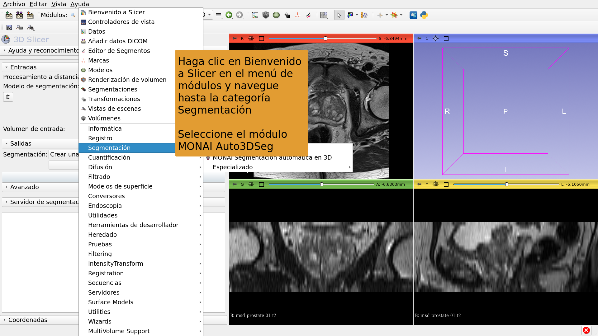

---

## 

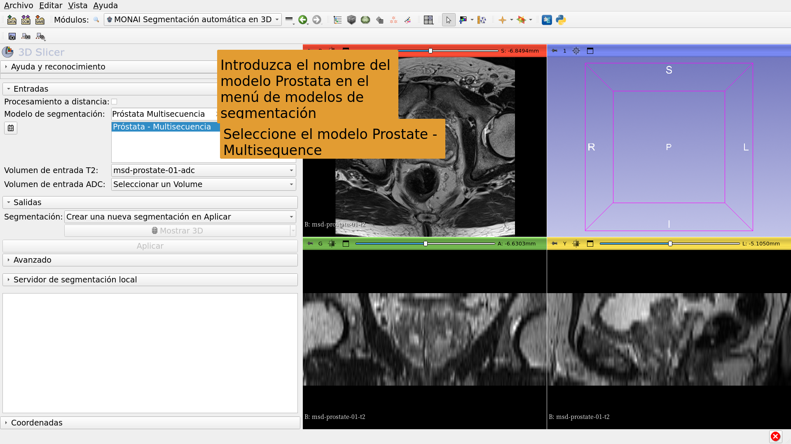

---

## 

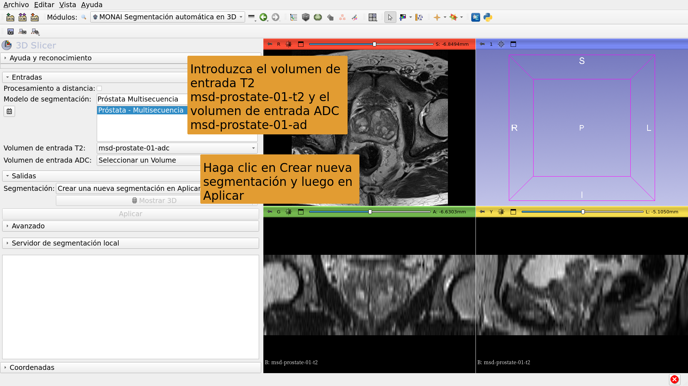

---

## 

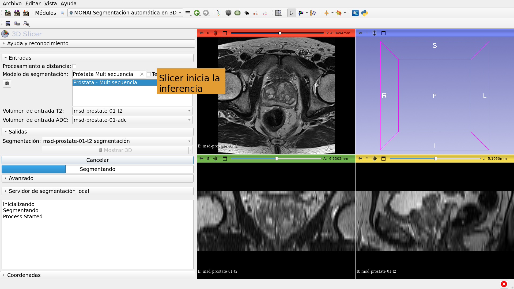

---

## 

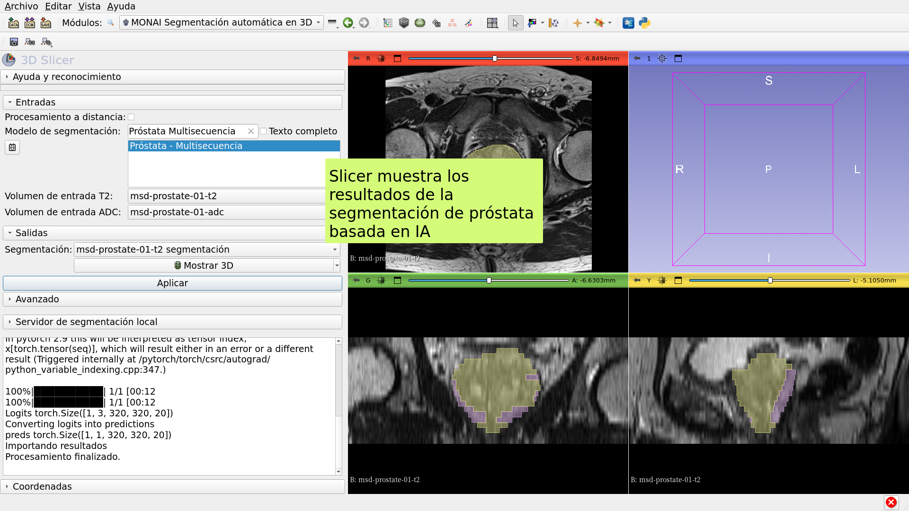

---

# Tarea de segmentación de IA n.° 2: Glioma cerebral

---

##  

Segmentación basada en IA de Neoplasia, Necrosis y Edema en imágenes de RM del cerebro.

Conjuntos de datos: 

1) BraTS-GLI_00005-000-t1n (ponderada en T1) 

2) BraTS-GLI_00005-000-t1c (ponderada en T1 post-Gd) 

3) BraTS-GLI_00005-000-t2w (ponderada en T2) 

4) BraTS-GLI_00005-000-t2f (T2-FLAIR)

---

## 

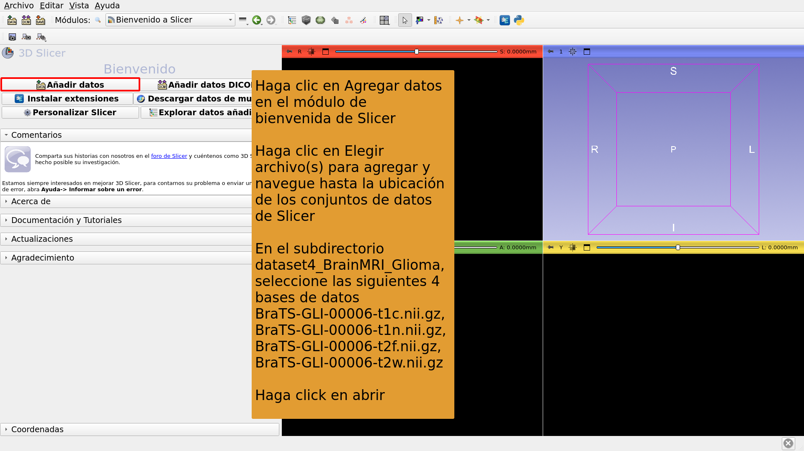

---

## 

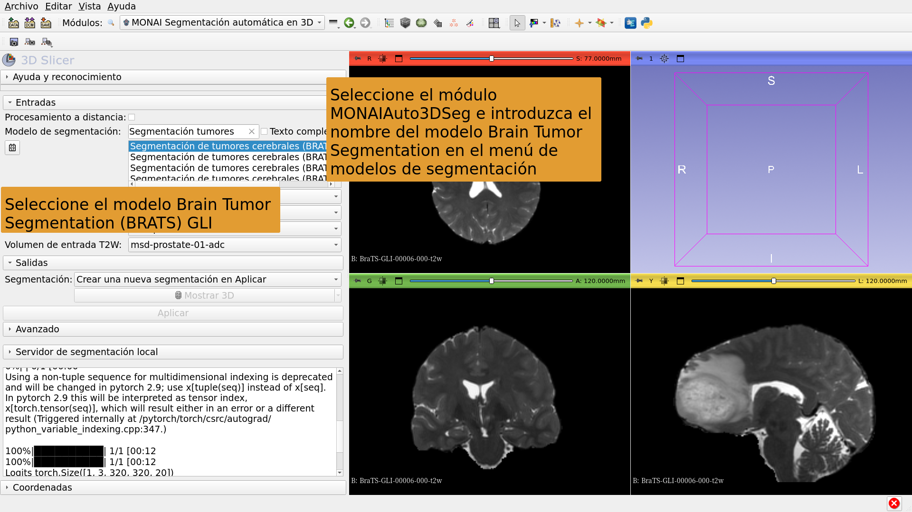

---

## 

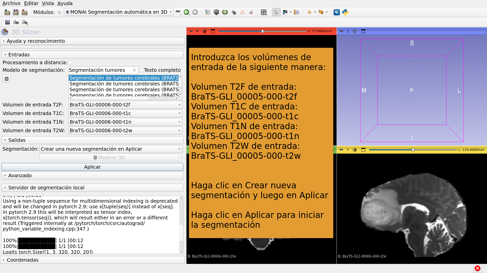

---

## 

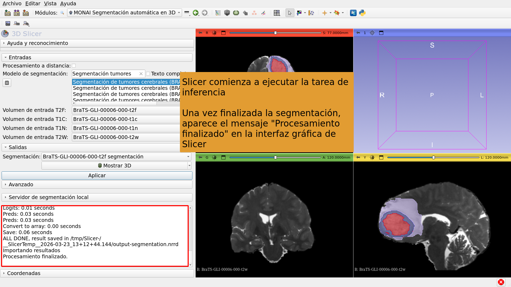

---

## 

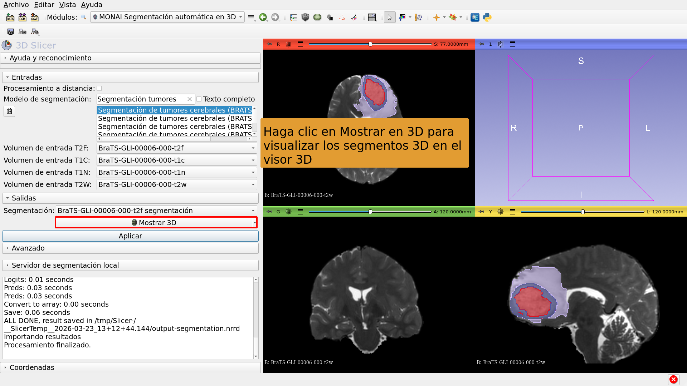

---

# Tarea de segmentación de IA n.° 3: Segmentación de cuerpo completo

---

##  

Segmentación de cuerpo completo basada en IA. 

Conjunto de datos: 

CT_ThoraxAbdomen

---

## 

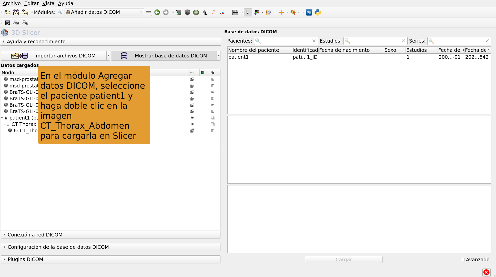

---

## 

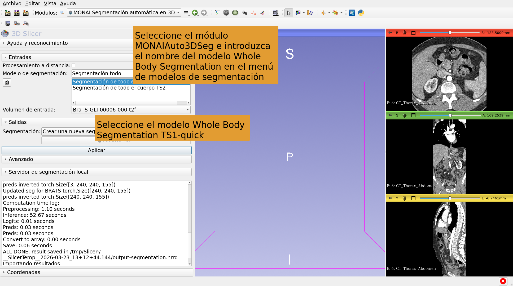

---

## 

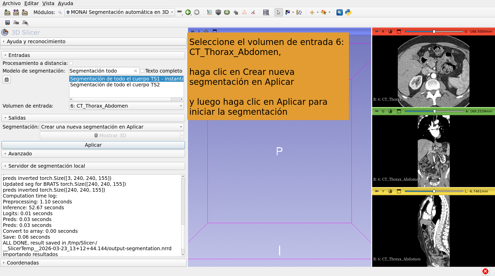

---

## 

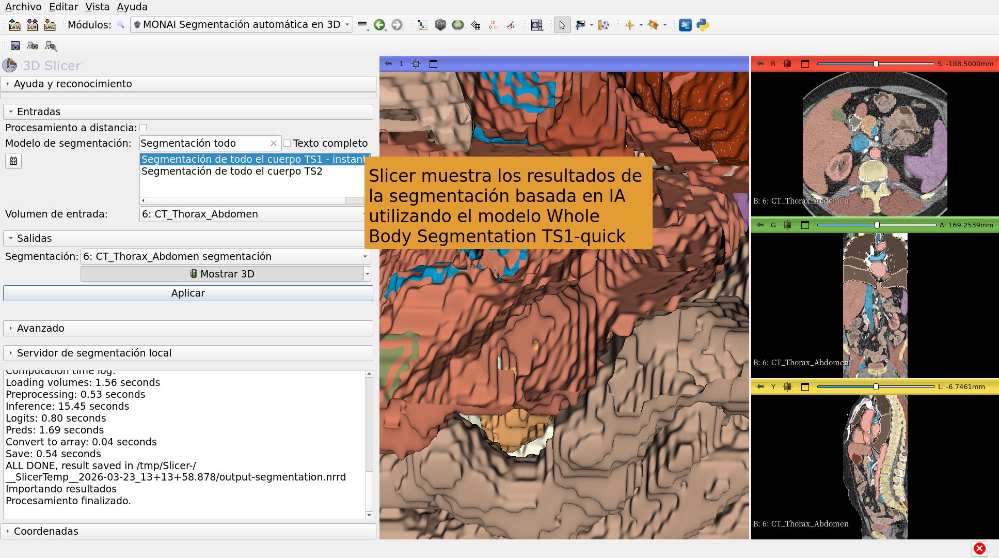

---

## Conclusión

La extensión MONAIAuto3DSeg de 3D Slicer proporciona segmentación rápida basada en IA de estructuras anatómicas y patológicas. 

El módulo puede ejecutarse en laptops y computadoras de escritorio estándar sin GPU.

---

# Agradecimientos

El proyecto de internacionalización de 3D Slicer y el proyecto 3D Slicer para América Latina han sido posibles gracias al financiamiento de la iniciativa Chan Zuckerberg.

---
