

# Segmentación basada en IA en 3D Slicer

Sonia Pujol, Ph. D. 
Brigham and Women's Hospital,
Harvard Medical School
Boston, MA

 

Slicer Ribeirão Preto Workshop
June 30, 2025

---

## Manual vs. Segmentación proporcionada por IA

Medical images have traditionally been manually segmented, which is a time-consuming process that requires intensive effort by radiologists and is subject to inter-reader variability.

---

## Manual vs. Segmentación proporcionada por IA

En la última década, la segmentación de imágenes se ha visto impulsada por el desarrollo de algoritmos de aprendizaje profundo (p.e., nnUnet del Centro Alemán de Investigación del Cáncer (DKFZ)/Helmholtz Research).

Las herramientas de segmentación basadas en IA pueden reducir el tiempo de segmentación y proporcionar resultados más reproducibles.

---

## Terminología de IA

Un modelo es un algoritmo de IA entrenado para realizar una tarea específica (por ejemplo, un modelo de segmentación de tumores cerebrales).

Los pesos de un modelo de IA son números pequeños que determinan la importancia que el modelo otorga a las diferentes características de la imagen.

Durante la fase de entrenamiento, el modelo aprende patrones a partir de datos etiquetados por expertos y ajusta sus pesos para mejorar sus predicciones.

Durante la fase de validación/prueba, el modelo se evalúa con un conjunto de datos independiente, no utilizado durante el entrenamiento.

Durante la fase de inferencia, el modelo se aplica a nuevos conjuntos de datos para realizar la tarea específica para la que fue entrenado.

---

## Tutorial de IA para 3D Slicer

Este tutorial se centra en la ejecución de tareas de inferencia utilizando varios modelos de IA preentrenados para la segmentación automatizada de estructuras anatómicas y patológicas.

---

## Extensión MONAIAuto3DSeg Slicer

Este tutorial utiliza los modelos pre‐entrenados de la extensión MONAIAuto3DSeg Slicer.

La herramienta está diseñada para funcionar en portátiles o en equipos de sobremesa convencionales sin tarjeta gráfica.

---

## Extensión MONAIAuto3DSeg Slicer

Compatibilidad con múltiples modalidades (TC, IRM).

Múltiples anatomías (cabeza, tórax, abdomen, pelvis, etc.).

Múltiples patologías (tumor, hemorragia, edema).

---

## Tutorial de Slicer AI: Tareas de segmentación

Tarea de segmentación n.° 1: Próstata

Tarea de segmentación n.° 2: Glioma cerebral

Tarea de segmentación n.° 3: Segmentación de todo el cuerpo

---

# Tarea de Segmentación con IA #1: Próstata

---

##  

Segmentación mediante IA de la zona periférica (ZP) y la zona de transición (ZT) de la próstata en imágenes de resonancia magnética ponderadas en T2.

Conjunto de datos:

msd_prostate_01-t2

msd_prostate_01-adc

---

## 

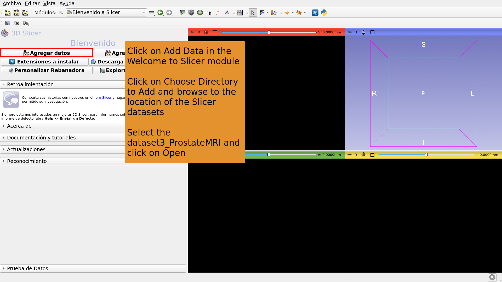

---

## 

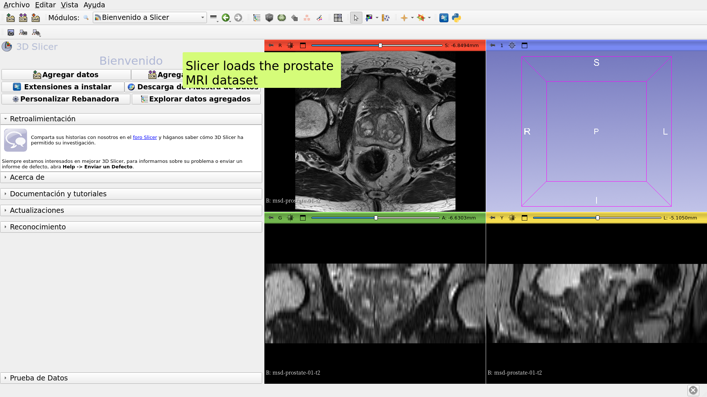

---

## 

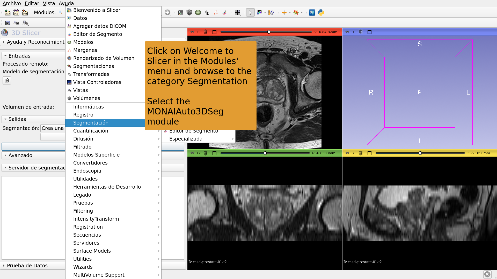

---

## 

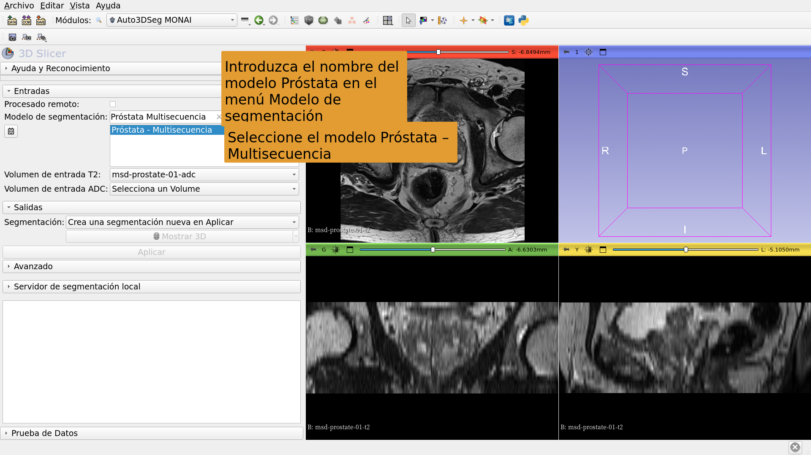

---

## 

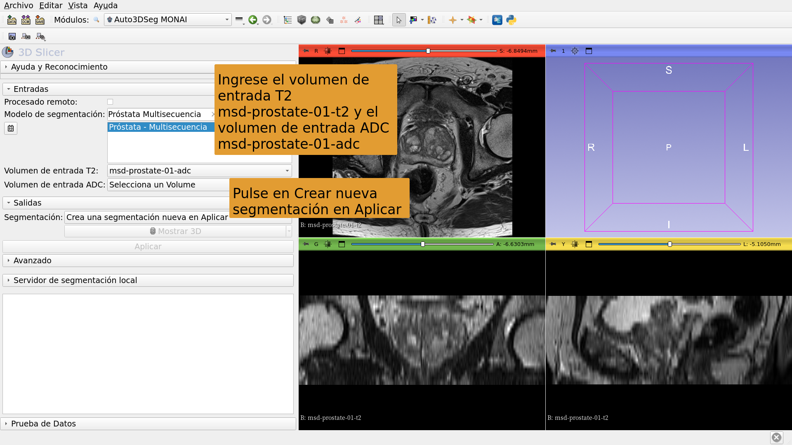

---

## 

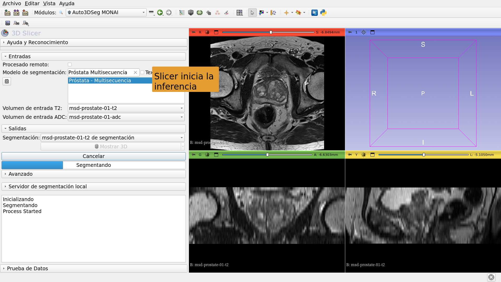

---

## 

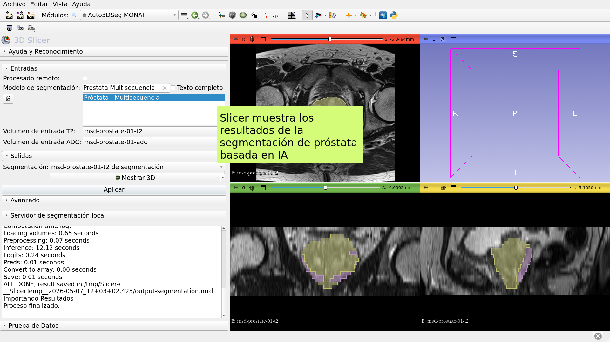

---

# Tarea de segmentación por IA n.° 2: Glioma cerebral

---

##  

Segmentación de neoplasias, necrosis y edema en imágenes de resonancia magnética cerebral mediante IA.

Conjuntos de datos:

1) BraTS-GLI_00005-000-t1n (ponderada en T1)

2) BraTS-GLI_00005-000-t1c (ponderada en T1 con contraste de gadolinio)

3) BraTS-GLI_00005-000-t2w (ponderada en T2)

4) BraTS-GLI_00005-000-t2f (T2-FLAIR)

---

## 

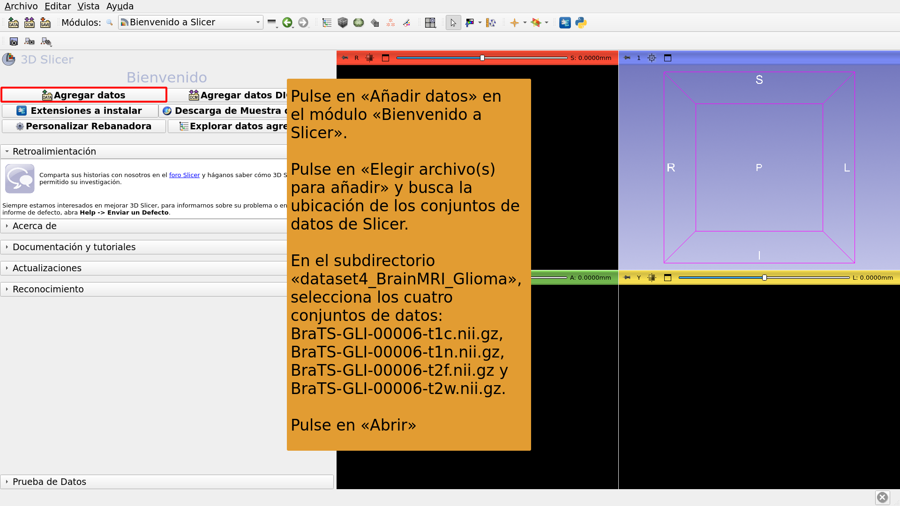

---

## 

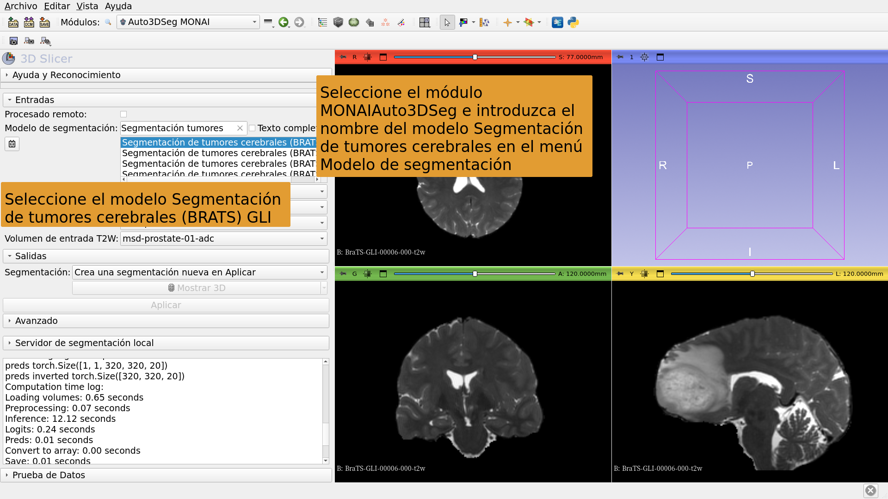

---

## 

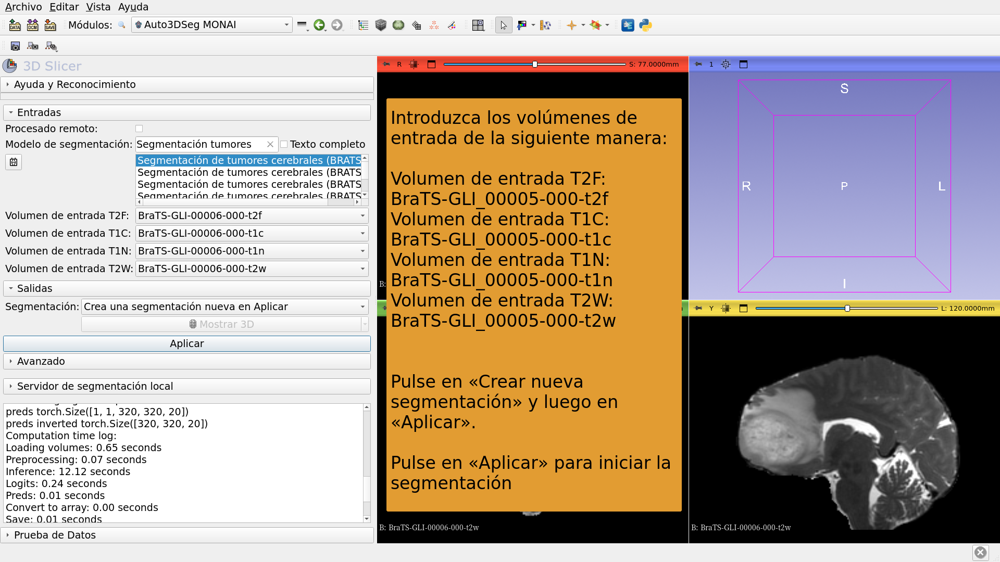

---

## 

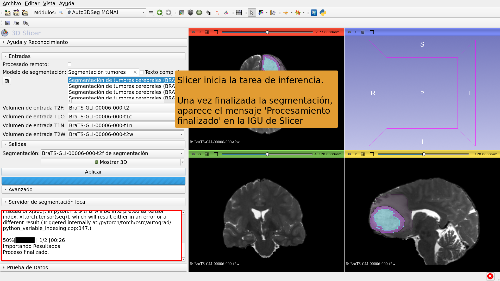

---

## 

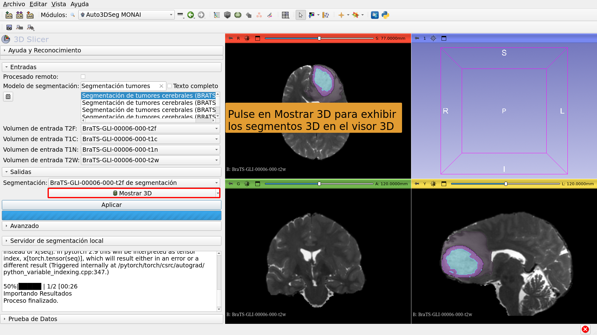

---

# Tarea de segmentación por IA n.° 3: Segmentación del cuerpo completo

---

##  

Segmentación del cuerpo completo mediante IA.

Conjunto de datos:

CT_ThoraxAbdomen

---

## 

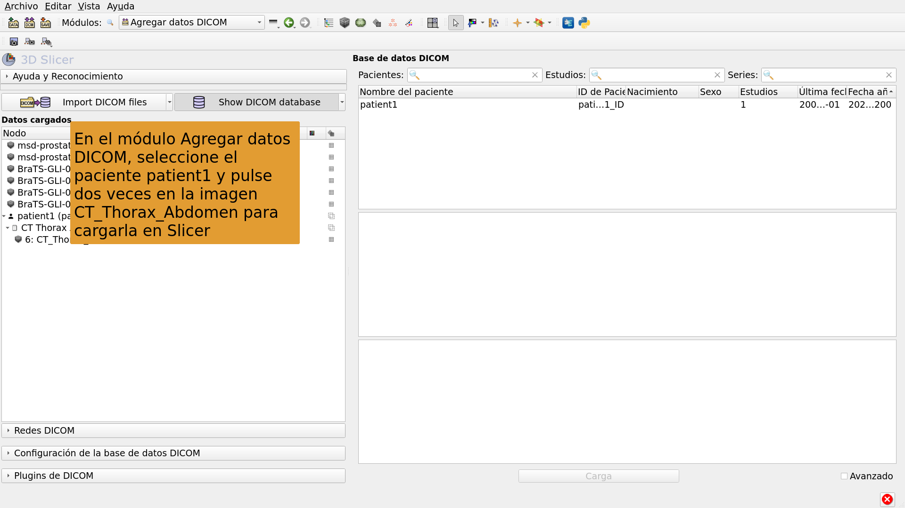

---

## 

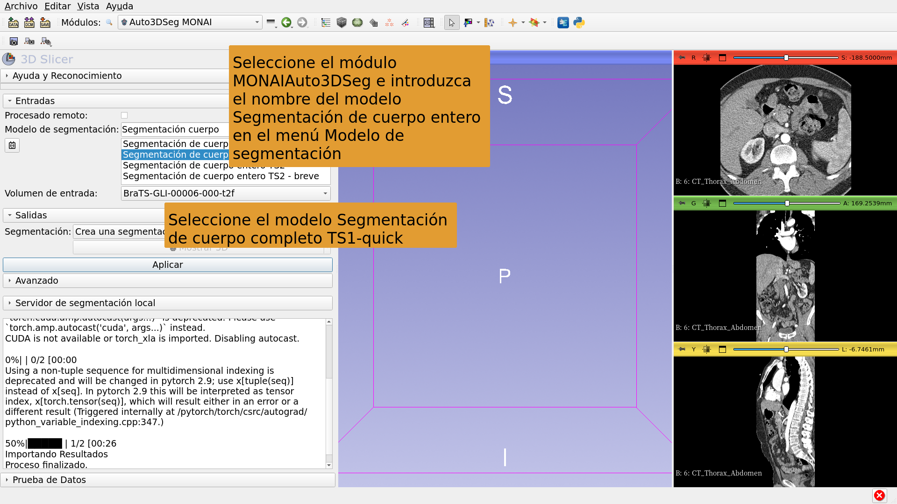

---

## 

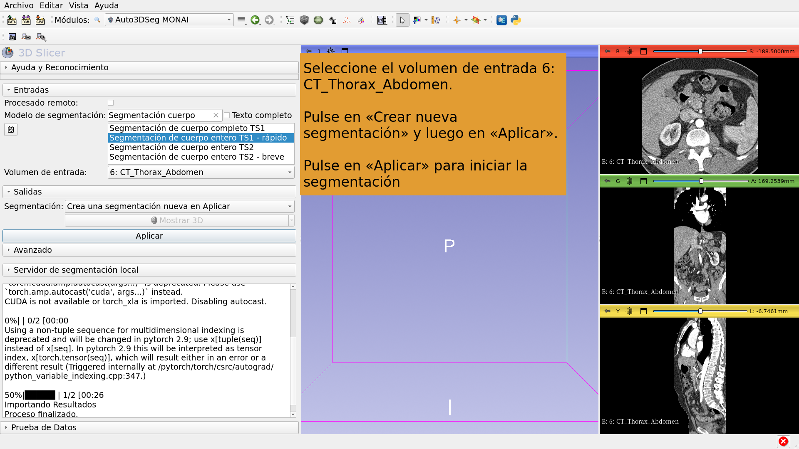

---

## 

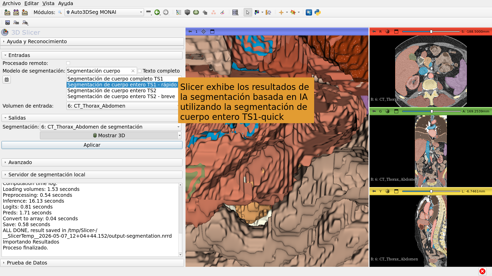

---

## Conclusión

La extensión MONAIAuto3DSeg de 3D Slicer proporciona una segmentación rápida de estructuras anatómicas y patológicas basada en IA.

El módulo puede ejecutarse en ordenadores portátiles y de sobremesa estándar sin GPU.

---

# Agradecimientos

El proyecto de internacionalización de 3D Slicer y el proyecto 3D Slicer para Latinoamérica han sido posibles gracias a la financiación de la Iniciativa Chan Zuckerberg.

---
