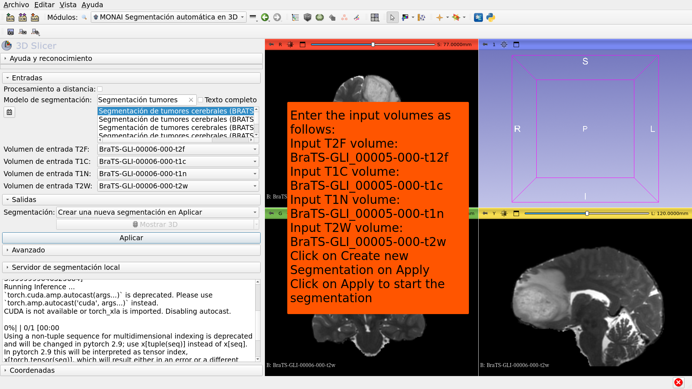
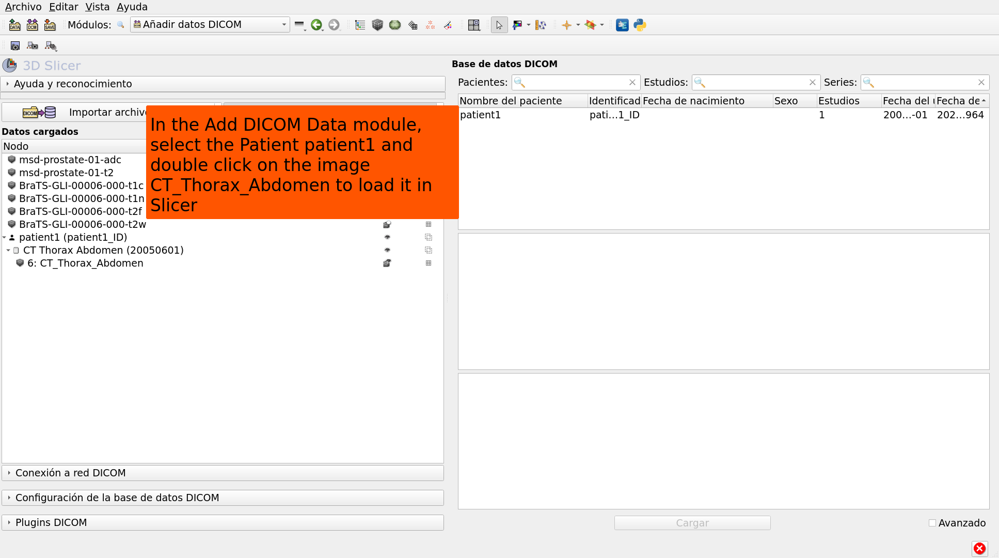
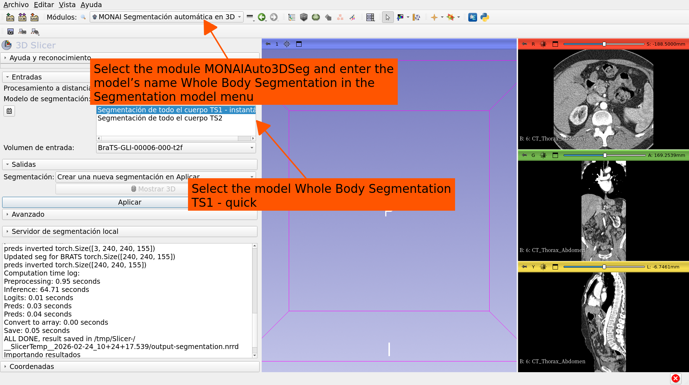
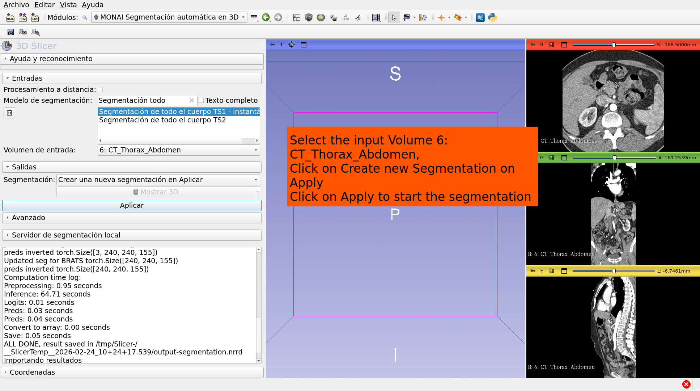
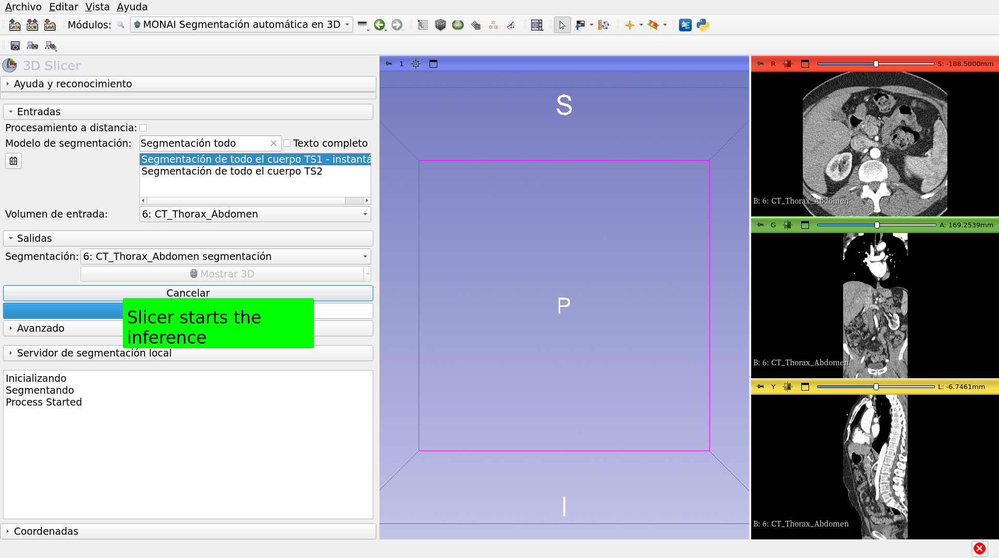
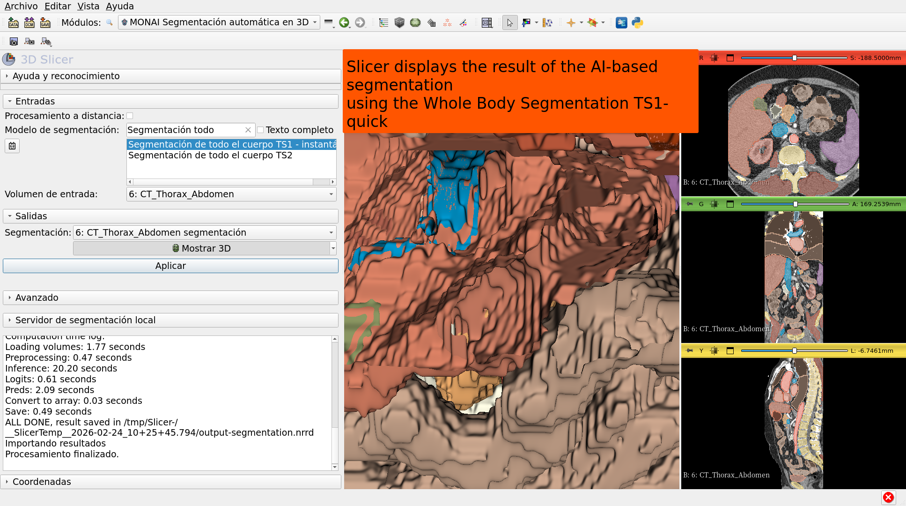

# AIBasedSegmentationIn3DSlicer

Sonia Pujol, Ph.D.

30/06/2025

AI - based Segmentation in 3D Slicer

---

## 

---

## 

---

## 

---

## 

---

## 

---

## 

---

## 

---

## 

---

## 

---

## 

---

## 

---

## 

---

## 

---

## 

---

## 

---

## 

---

## 

---

## 

---

# Acknowledgements

---
