

# AIBasedSegmentationIn3DSlicer

Sonia Pujol, Ph.D.

 

Segmentation basée sur l'IA dans 3D Slicer

---

## Segmentation manuelle vs segmentation assistée par IA

Cliquez sur Add Data dans le module Welcome to Slicer

---

## Segmentation manuelle vs segmentation assistée par IA

Au cours de la dernière décennie, la segmentation d’images a été révolutionnée par le développement d’algorithmes de deep learning (par exemple nnUnet développé par le German Cancer Research Center (DKFZ)/Helmholtz Research).

Les outils de segmentation assistés par IA peuvent réduire le temps de segmentation et fournir des résultats plus reproductibles.

---

## Terminologie de l’IA

Un modèle est un algorithme d’IA entraîné pour accomplir une tâche spécifique (par exemple, un modèle de segmentation de tumeur cérébrale).

Les poids d’un modèle d’IA sont de petits nombres qui déterminent l’importance que le modèle attribue aux différentes caractéristiques de l’image.

Lors de la phase d’entraînement, un modèle apprend des motifs à partir de données étiquetées par des experts et ajuste ses poids pour améliorer ses prédictions.

Lors de la phase de Validation/Test, le modèle est évalué sur un ensemble de données distinct, non utilisé pendant l’entraînement.

Lors de l’inférence, le modèle est appliqué à de nouveaux jeux de données pour réaliser la tâche spécifique pour laquelle il a été entraîné.

---

## Tutoriel IA 3D Slicer

Ce tutoriel se concentre sur l’exécution de tâches d’inférence en utilisant différents modèles d’IA pré-entraînés pour la segmentation automatisée de structures anatomiques et pathologiques.

---

## Extension Slicer MONAIAuto3DSeg

Ce tutoriel utilise les modèles pré-entraînés de l’extension Slicer MONAIAuto3DSeg.

L’outil est conçu pour fonctionner sur des ordinateurs portables ou des ordinateurs de bureau standards sans GPU.

---

## Extension Slicer MONAIAuto3DSeg

Cliquez sur Create new segmentation sur Apply

---

## Tutoriel IA Slicer : Tâches de segmentation

Tâche de segmentation #1 : Prostate

Tâche de segmentation #2 : Gliome cérébral

Tâche de segmentation #3 : Segmentation du corps entier

---

# Slicer affiche le résultat de la segmentation de la prostate basée sur l’IA

---

##  

Segmentation assistée par IA de la zone périphérique (PZ) et de la zone de transition (TZ) de la prostate sur des images IRM pondérées en T2.

Jeux de données :

msd_prostate_01-t2

msd_prostate_01-adc

---

## 

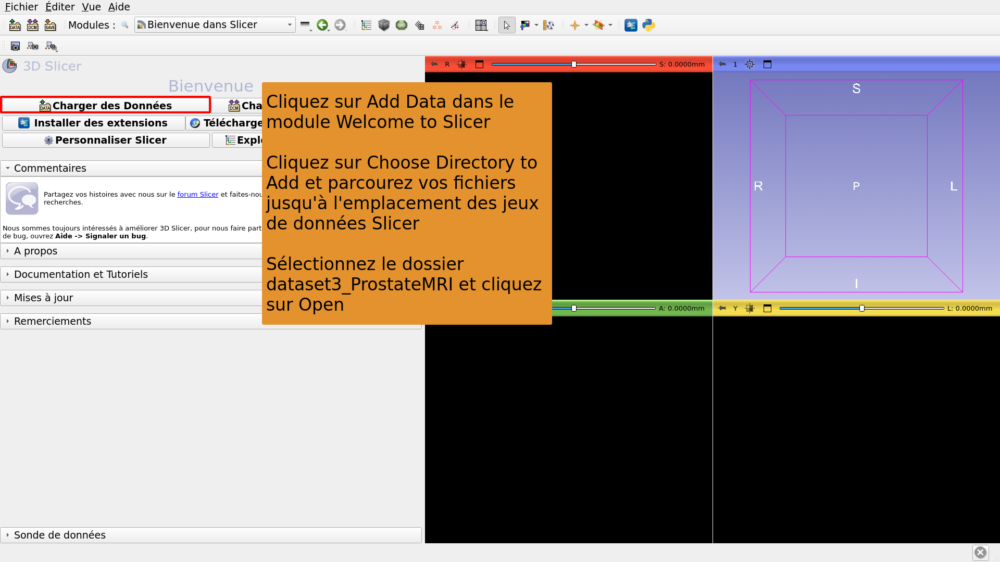

---

## 

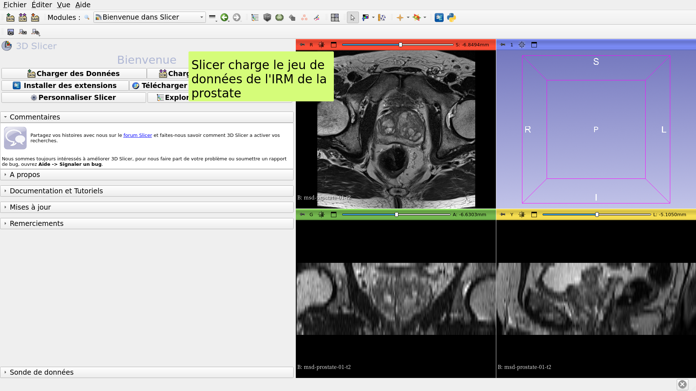

---

## 

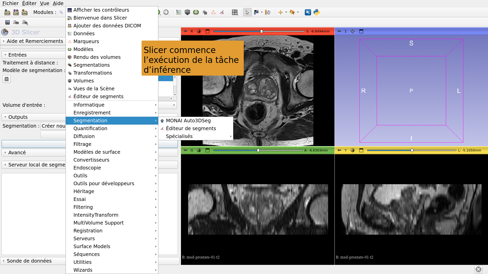

---

## 

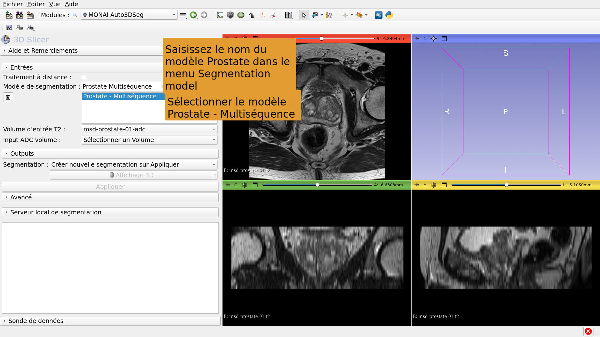

---

## 

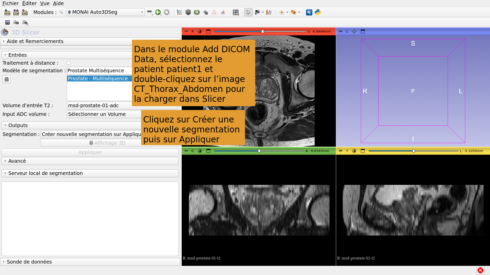

---

## 

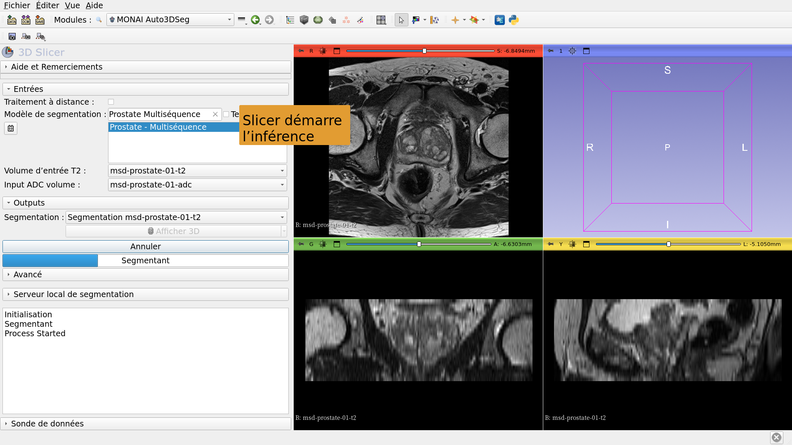

---

## 

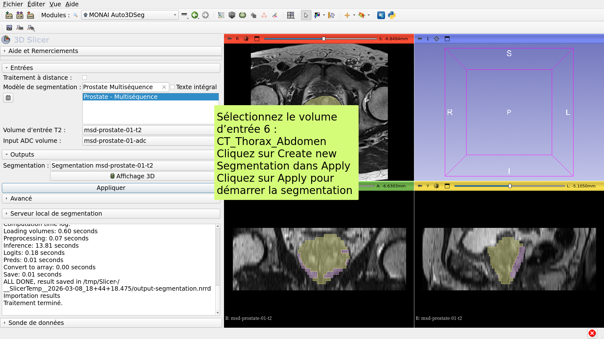

---

# Segmentation IA Tâche #2 : Gliome cérébral

---

##  

Segmentation assistée par IA des néoplasmes, de la nécrose et de l’œdème dans les images IRM cérébrales.

Jeux de données :

1) BraTS-GLI_00005-000-t1n (pondérée en T1)

2) BraTS-GLI_00005-000-t1c (pondérée en T1 post-Gd)

3) BraTS-GLI_00005-000-t2w (pondérée en T2)

4) BraTS-GLI_00005-000-t2f (T2-FLAIR)

---

## 

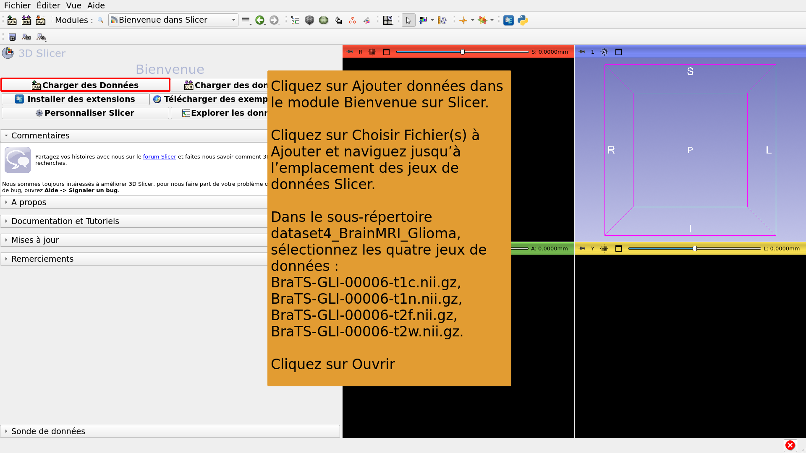

---

## 

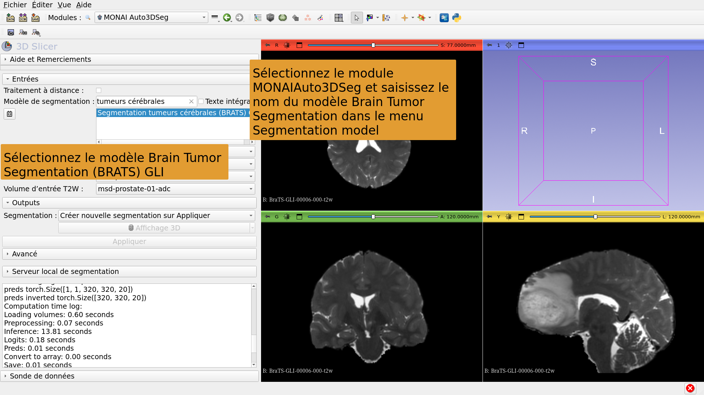

---

## 

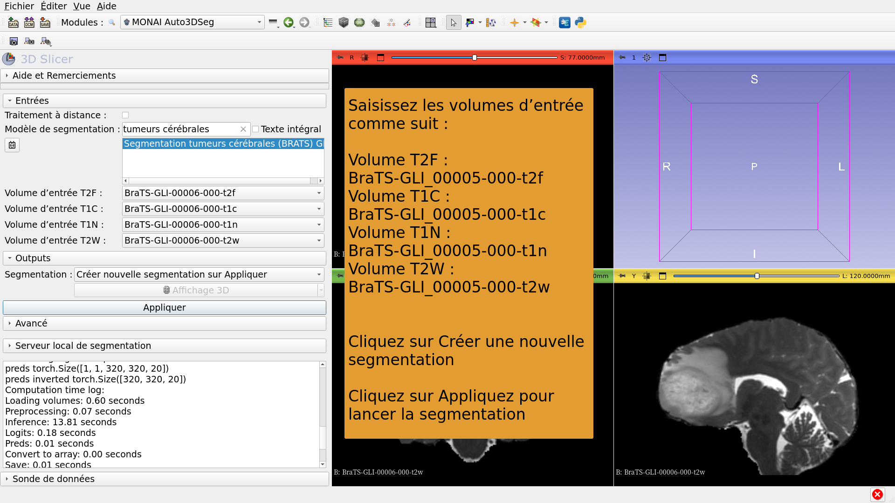

---

## 

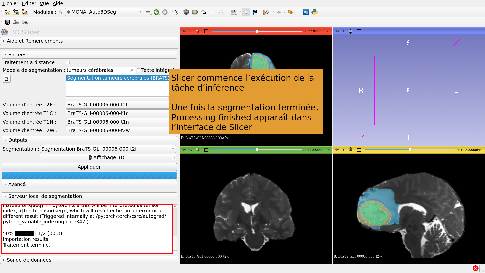

---

## 

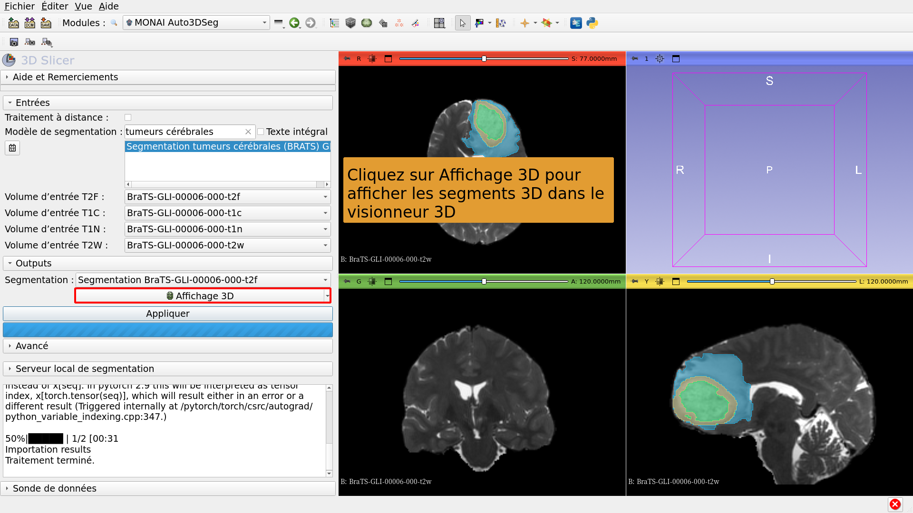

---

# Segmentation IA tâche #3 : Segmentation du corps entier

---

##  

Segmentation assistée par IA de l’ensemble du corps.

Jeu de données : 

CT_ThoraxAbdomen

---

## 

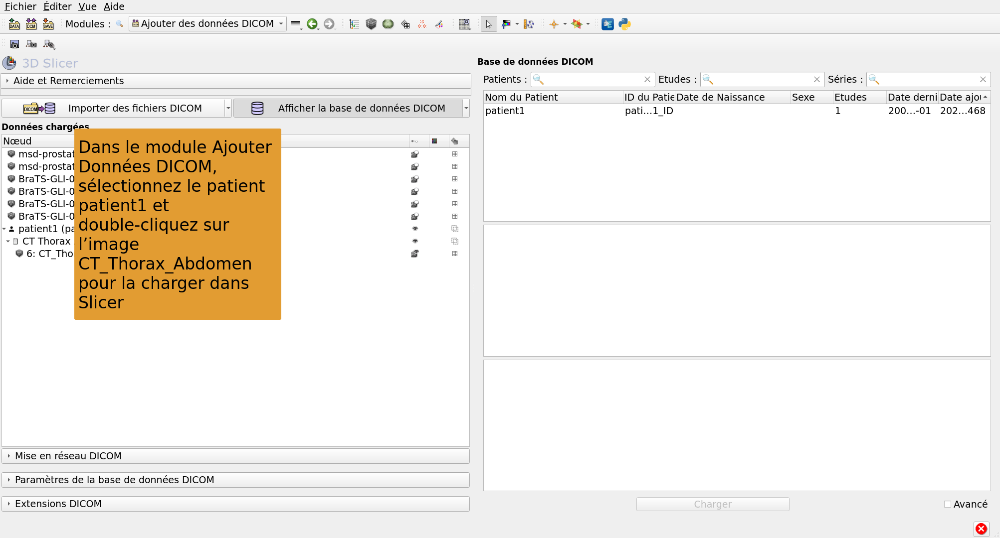

---

## 

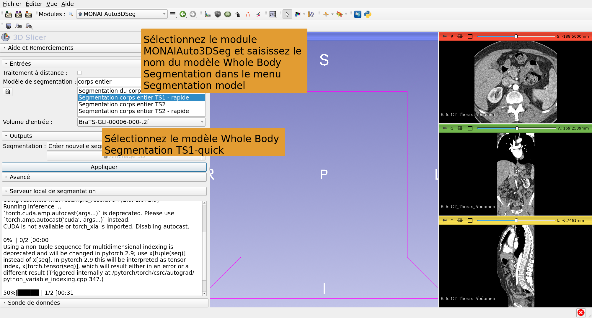

---

## 

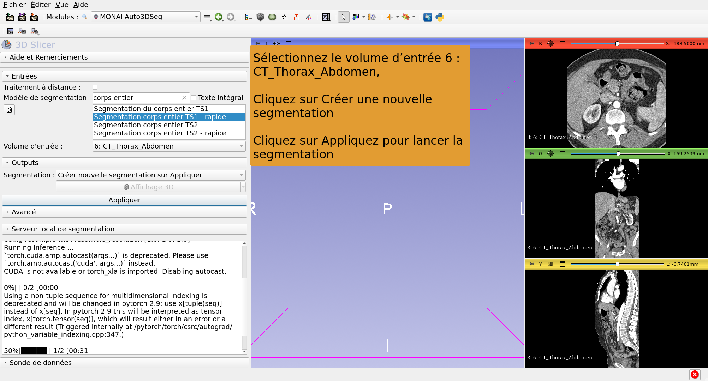

---

## 

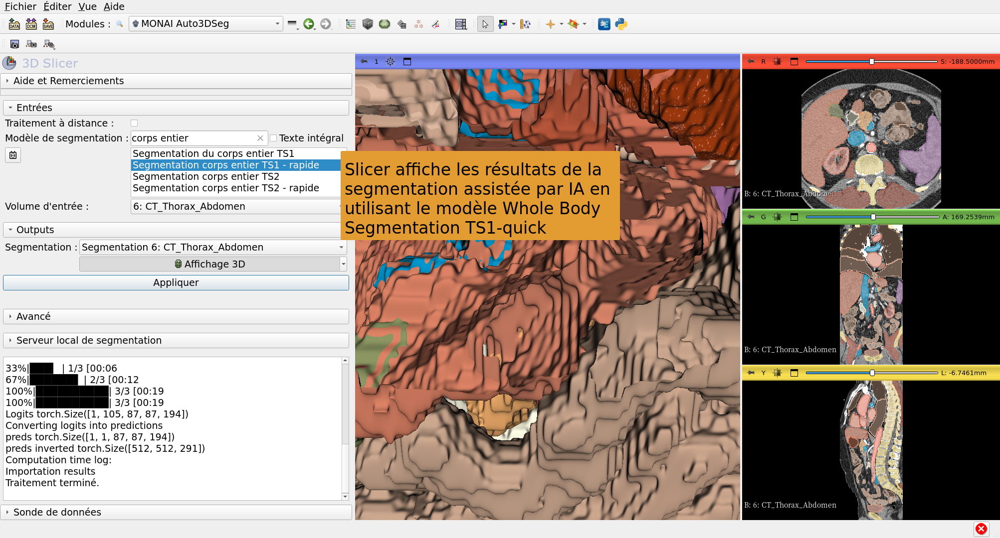

---

## Conclusion

L’extension MONAIAuto3DSeg de 3D Slicer permet une segmentation rapide assistée par IA des structures anatomiques et pathologiques.

Le module peut fonctionner sur des ordinateurs portables et de bureau standards, sans GPU.

---

# Remerciements

Le projet d’internationalisation de 3D Slicer et le projet 3D Slicer pour l’Amérique latine ont été rendus possibles grâce au financement de la Chan Zuckerberg Initiative.

---
