

# AI-based Segmentation in 3D Slicer

Sonia Pujol, Ph.D. 
Brigham and Women’s Hospital,
Harvard Medical School
Boston, MA

 

Slicer Ribeirão Preto műhely
2025. június 30.

---

## Kézi szegmentálás kontra mesterséges intelligenciával támogatott szegmentálás

Az orvosi képeket hagyományosan kézzel szegmentálták, ami időigényes folyamat, amely a radiológusok részéről jelentős erőfeszítést igényel, és az értékelők közötti eltéréseknek is ki van téve.

---

## Kézi szegmentálás kontra mesterséges intelligenciával támogatott szegmentálás

Az elmúlt évtizedben a képszegmentálás fejlődését a mélytanulási algoritmusok fejlesztése hajtotta előre (pl. a német Rákkutató Központ (DKFZ) és a Helmholtz Kutatóközpont által kifejlesztett nnUnet).

A mesterséges intelligencián alapuló szegmentáló eszközök csökkenthetik a szegmentáláshoz szükséges időt, és jobban reprodukálható eredményeket biztosítanak.

---

## Mesterséges intelligencia szakkifejezések

A modell egy olyan mesterséges intelligencia-algoritmus, amelyet egy adott feladat elvégzésére tanítottak be (pl. agydaganat-szegmentációs modell).

A mesterséges intelligencia-modell súlyai olyan kis számok, amelyek meghatározzák, hogy a modell milyen jelentőséget tulajdonít a különböző képjellemzőknek.

A betanítási fázis során a modell a szakértők által címkézett adatokból tanulja meg a mintákat, és súlyait úgy módosítja, hogy javuljanak előrejelzései.

A validációs/tesztelési fázis során a modellt egy olyan külön adatkészleten értékelik, amelyet a betanítási fázis során nem használtak.

A következtetés során a modellt új adatkészletekre alkalmazzák, hogy elvégezze azt a konkrét feladatot, amelyre betanították.

---

## 3D Slicer AI oktatóanyag

Ez az oktatóanyag arra összpontosít, hogyan lehet különböző előre betanított mesterséges intelligencia-modellek segítségével következtetési feladatokat futtatni anatómiai és patológiai struktúrák automatizált szegmentálása céljából.

---

## MONAIAuto3DSeg Slicer kiterjesztés

Ez az oktatóanyag a MONAIAuto3DSeg Slicer kiterjesztés előre betanított modelljeit használja.

Az eszköz úgy lett kialakítva, hogy laptopokon vagy átlagos, GPU nélküli asztali számítógépeken is működjön.

---

## MONAIAuto3DSeg Slicer kiterjesztés

Többféle vizsgálati módszer támogatása (CT, MRI).

Többféle anatómiai terület (fej, mellkas, has, medence stb.).

Többféle kóros állapot (daganat, vérzés, ödéma).

---

## Slicer AI bemutató: Szegmentációs feladatok

1. szegmentálási feladat: prosztata 

2. szegmentálási feladat: agyi glióma 

3. szegmentálási feladat: teljes test szegmentálása

---

# AI-szegmentációs feladat #1: Prosztata

---

##  

A prosztata perifériás zónájának (PZ) és átmeneti zónájának (TZ) mesterséges intelligencián alapuló szegmentálása T2-súlyozott MRI-felvételeken.

Adatkészlet:

msd_prostate_01-t2

msd_prostate_01-adc

---

## 

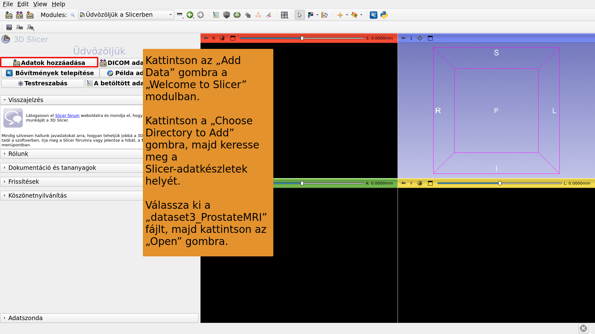

---

## 

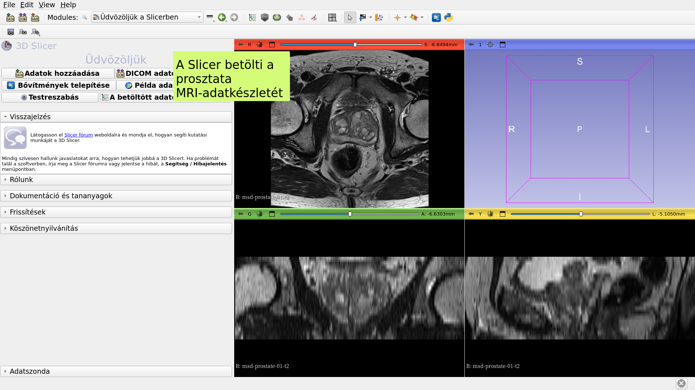

---

## 

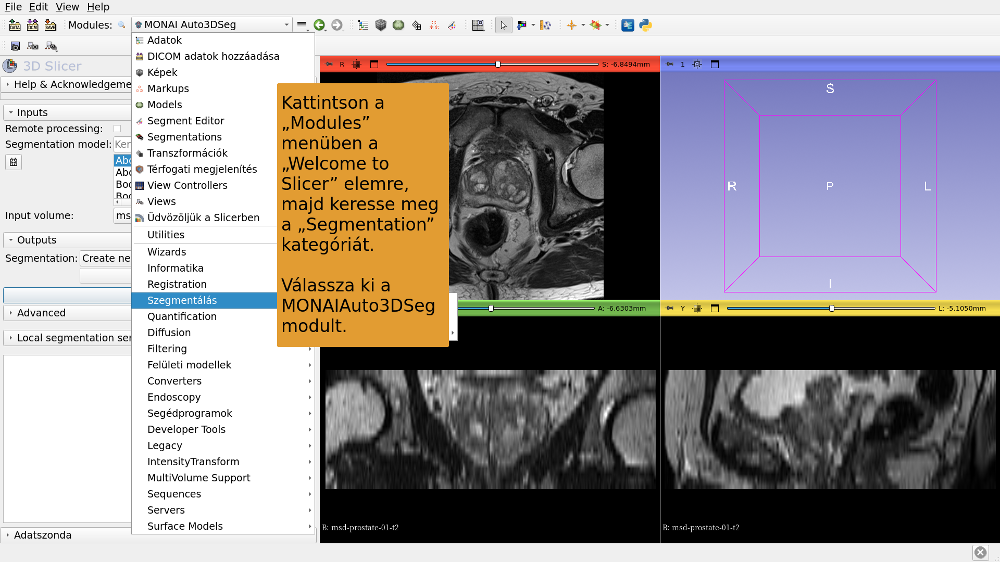

---

## 

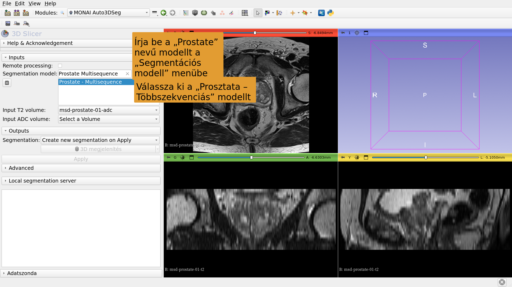

---

## 

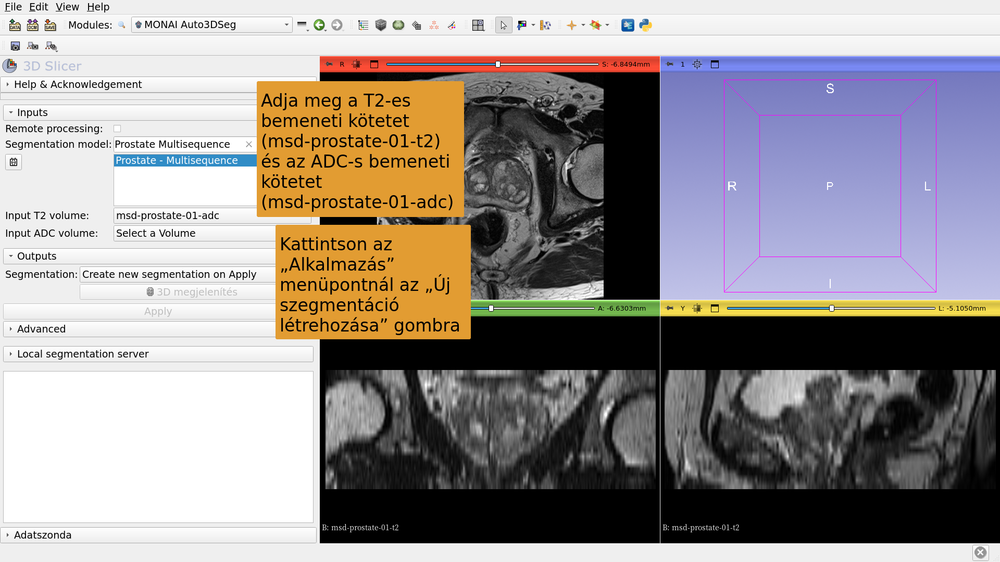

---

## 

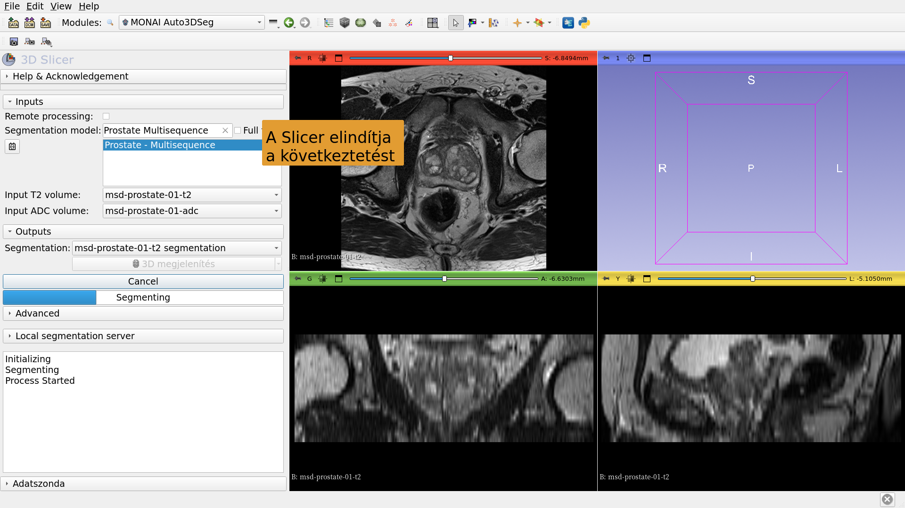

---

## 

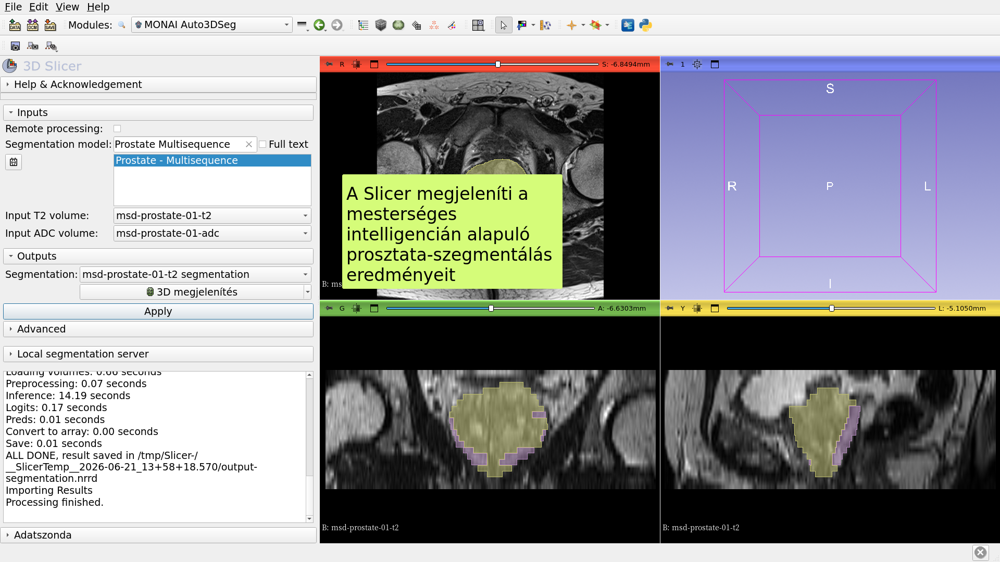

---

# 2. számú mesterséges intelligencia szegmentációs feladat: agyi glióma

---

##  

A daganatok, nekrózisok és ödémák mesterséges intelligencián alapuló szegmentálása agyi MRI-felvételeken.

Adatkészletek:

1) BraTS-GLI_00005-000-t1n (T1-súlyozott)

2) BraTS-GLI_00005-000-t1c (T1-súlyozott, Gd-kezelés után)

3) BraTS-GLI_00005-000-t2w (T2-súlyozott)

4) BraTS-GLI_00005-000-t2f (T2-FLAIR)

---

## 

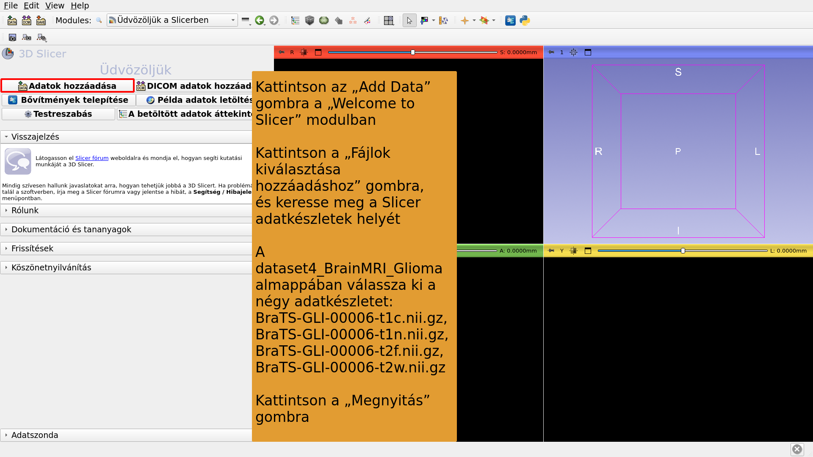

---

## 

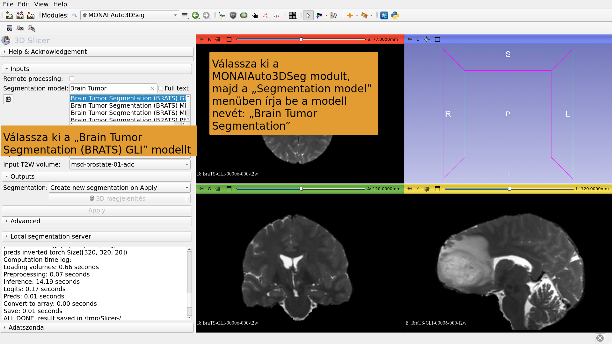

---

## 

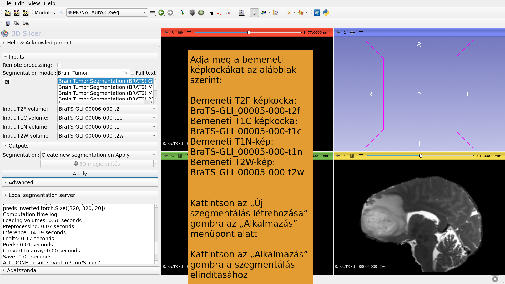

---

## 

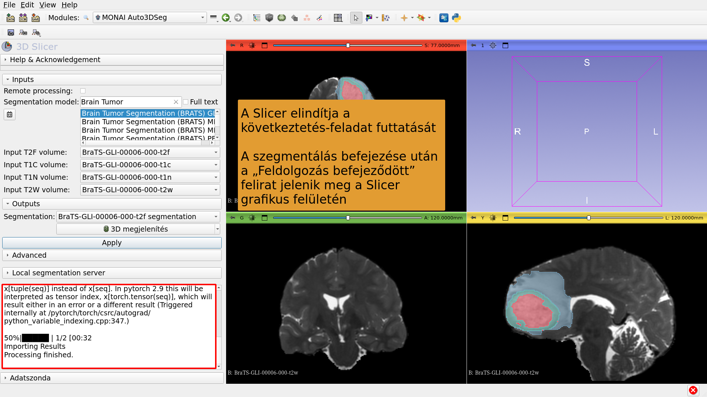

---

## 

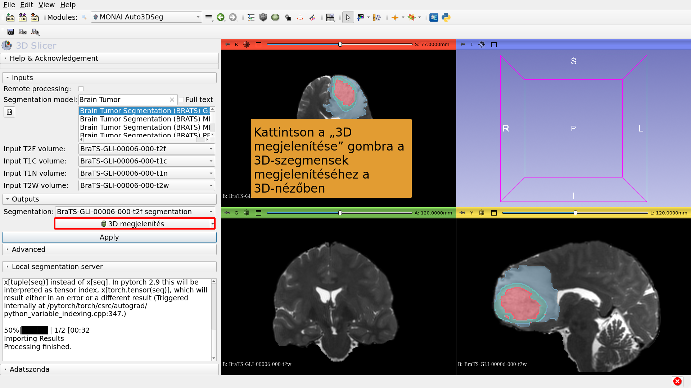

---

# 3. számú mesterséges intelligencia szegmentációs feladat: Teljes test szegmentálása

---

##  

A teljes test mesterséges intelligencián alapuló szegmentálása.

Adatkészlet:

CT_ThoraxAbdomen

---

## 

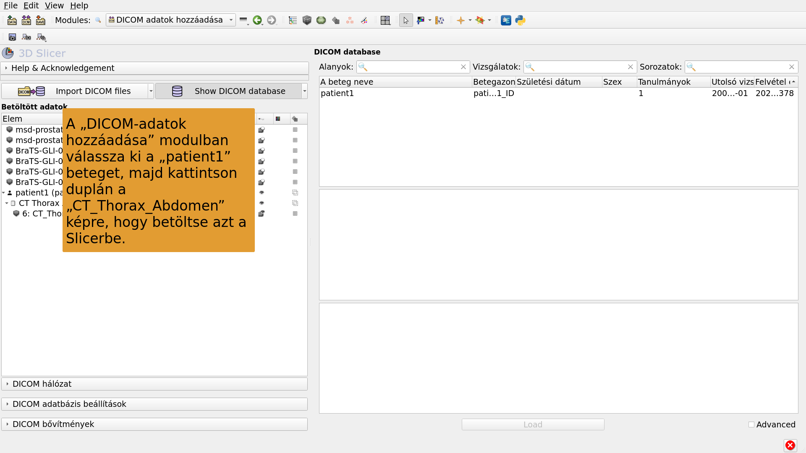

---

## 

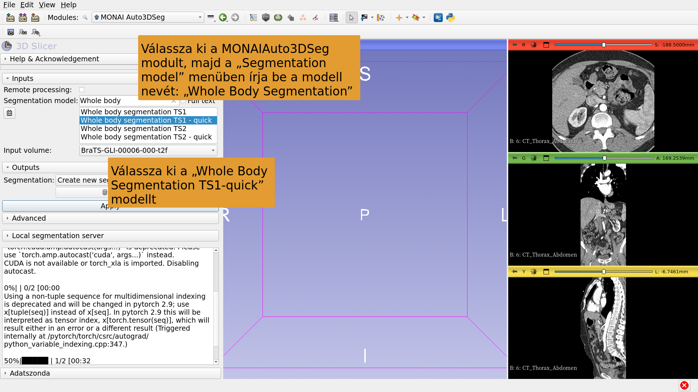

---

## 

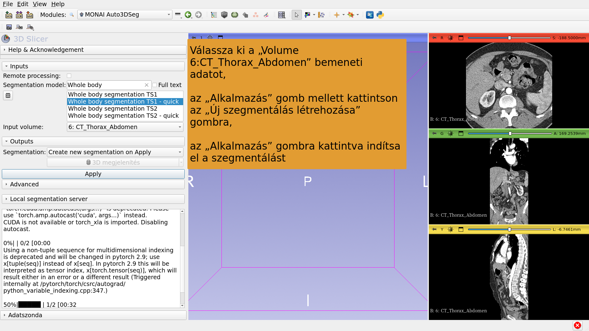

---

## 

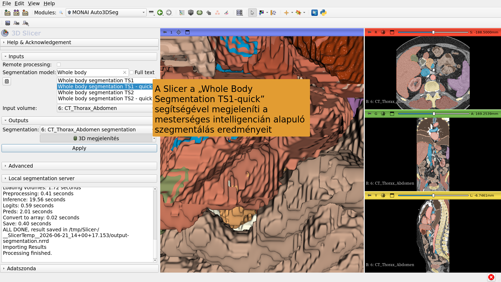

---

## Következtetés

A 3D Slicer MONAIAuto3DSeg kiterjesztés gyors, mesterséges intelligencián alapuló szegmentálást biztosít anatómiai és patológiai struktúrák esetében.

A modul GPU nélküli, szokványos laptopokon és asztali számítógépeken is futtatható.

---

# Köszönetnyilvánítás

A 3D Slicer nemzetköziesítési projektje és a 3D Slicer Latin-Amerikáért projekt megvalósítását a Chan Zuckerberg Initiative által nyújtott támogatás tette lehetővé.

---
