

# Segmentação baseada em IA no 3D Slicer

Sonia Pujol, Ph.D. 
Brigham and Women’s Hospital,
Faculdade de Medicina de Harvard
Boston, MA

 

Slicer Ribeirão Preto Workshop
30 de junho, 2025

---

## Segmentação manual vs. segmentação baseada em IA

Tradicionalmente, as imagens médicas têm sido segmentadas manualmente, o que constitui um processo moroso que exige um esforço considerável por parte dos radiologistas e está sujeito a variações entre os diferentes leitores.

---

## Segmentação manual vs. segmentação baseada em IA

Na última década, a segmentação de imagens tem sido impulsionada pelo desenvolvimento de algoritmos de aprendizagem profunda (por exemplo, o nnUnet, desenvolvido pelo Centro Alemão de Investigação do Cancro (DKFZ) e pela Fundação Helmholtz).

As ferramentas de segmentação baseadas em IA podem reduzir o tempo de segmentação e proporcionar resultados mais reprodutíveis.

---

## Terminologia da IA

Um modelo é um algoritmo de IA treinado para realizar uma tarefa específica (por exemplo, um modelo de segmentação de tumores cerebrais).

Os pesos de um modelo de IA são pequenos números que determinam a importância que o modelo atribui a diferentes características da imagem.

Durante a fase de treino, um modelo aprende padrões a partir de dados rotulados por especialistas e ajusta os seus pesos para melhorar as suas previsões.

Durante a fase de validação/teste, o modelo é avaliado num conjunto de dados separado, que não foi utilizado na fase de treino.

Durante a inferência, o modelo é aplicado a novos conjuntos de dados para realizar a tarefa específica para a qual foi treinado.

---

## Tutorial on 3D Slicer AI

Este tutorial centra-se na execução de tarefas de inferência com vários modelos de IA pré-treinados para a segmentação automatizada de estruturas anatómicas e patológicas.

---

## Extensão MONAIAuto3DSeg Slicer

Este tutorial utiliza os modelos pré-treinados da extensão MONAIAuto3DSeg Slicer.

A ferramenta foi concebida para funcionar em computadores portáteis ou em PCs  comuns sem placa de vídeo (GPU).

---

## Extensão MONAIAuto3DSeg Slicer

Compatibilidade com várias modalidades (TC, RM).

Várias regiões anatómicas (cabeça, tórax, abdómen, pélvis, etc.).

Várias patologias (tumores, hemorragias, edemas).

---

## Tutorial do Slicer AI: Tarefas de segmentação

Tarefa de segmentação n.º 1: Próstata 

Tarefa de segmentação n.º 2: Glioma cerebral 

Tarefa de segmentação n.º 3: Segmentação de corpo inteiro

---

# Tarefa de segmentação de IA n.º 1: Próstata

---

##  

Segmentação baseada em IA da zona periférica (PZ) e da zona de transição (TZ) da próstata em imagens ponderadas em T2 na ressonância magnética.

Conjunto de dados:

msd_prostate_01-t2

msd_prostate_01-adc

---

## 

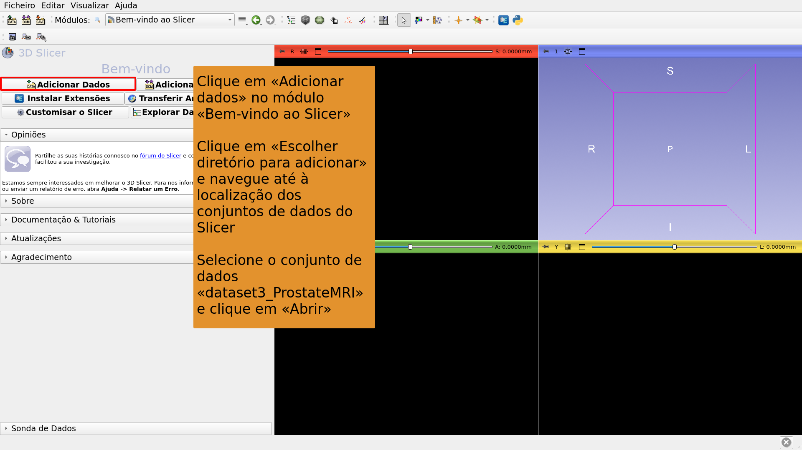

---

## 

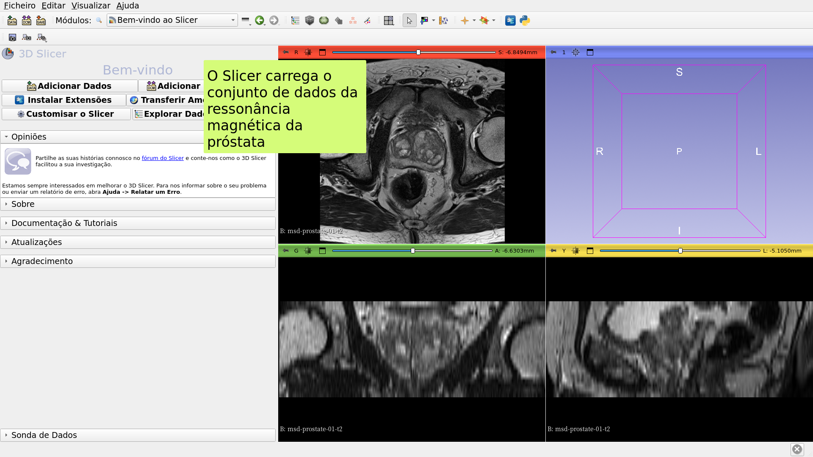

---

## 

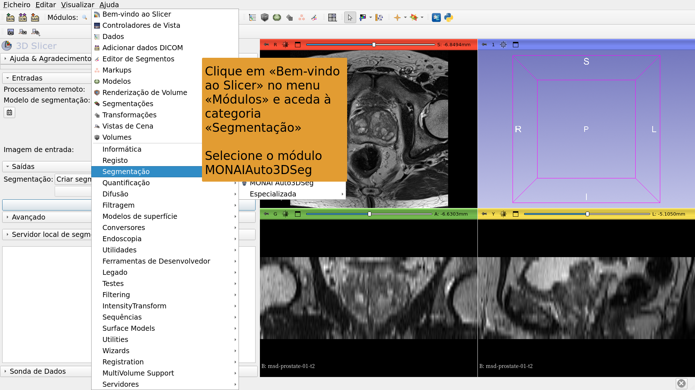

---

## 

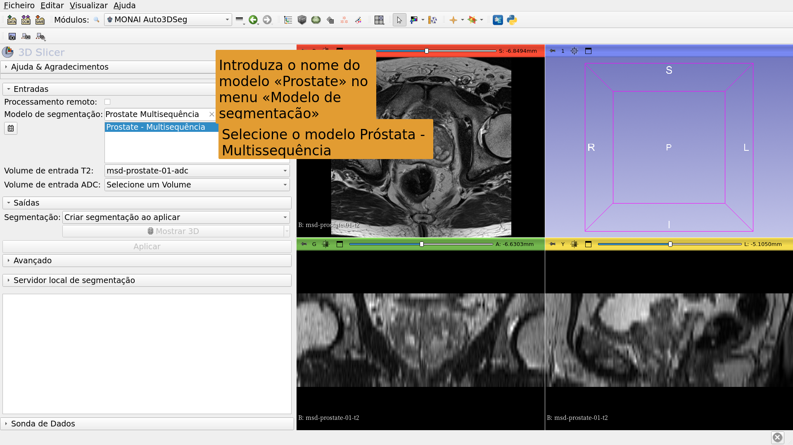

---

## 

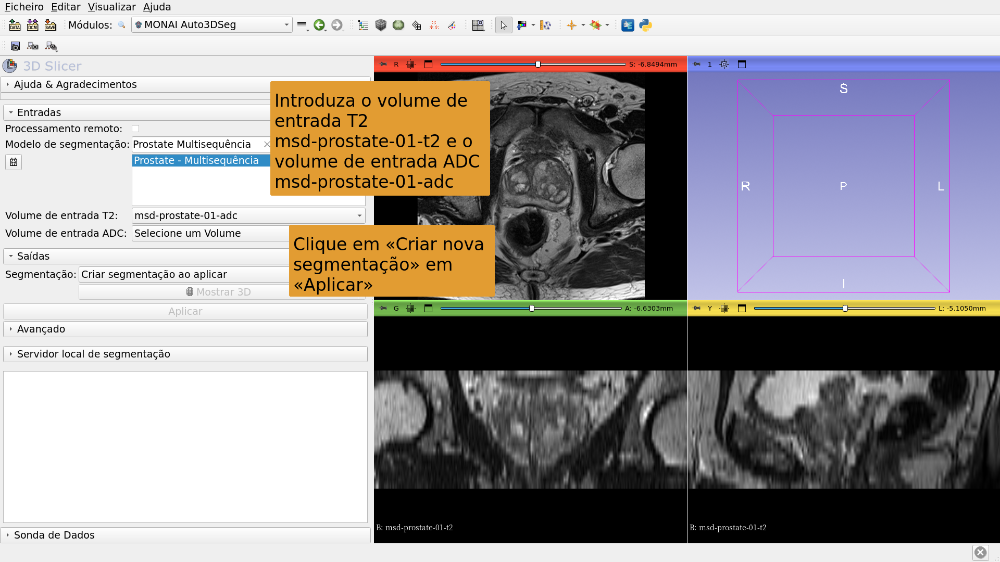

---

## 

---

## 

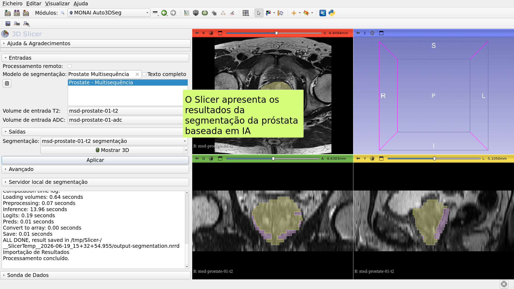

---

# Tarefa de segmentação com IA n.º 2: Glioma cerebral

---

##  

Segmentação baseada em IA de neoplasias, necrose e edema em imagens de ressonância magnética cerebral.

Conjuntos de dados:

1) BraTS-GLI_00005-000-t1n (ponderada em T1)

2) BraTS-GLI_00005-000-t1c (ponderada em T1 pós-Gd)

3) BraTS-GLI_00005-000-t2w (ponderada em T2)

4) BraTS-GLI_00005-000-t2f (T2-FLAIR)

---

## 

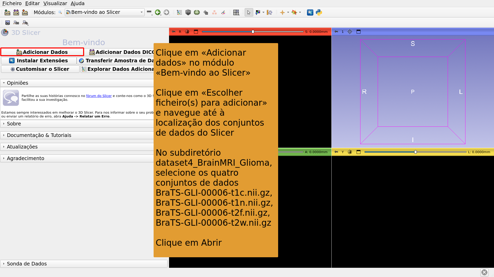

---

## 

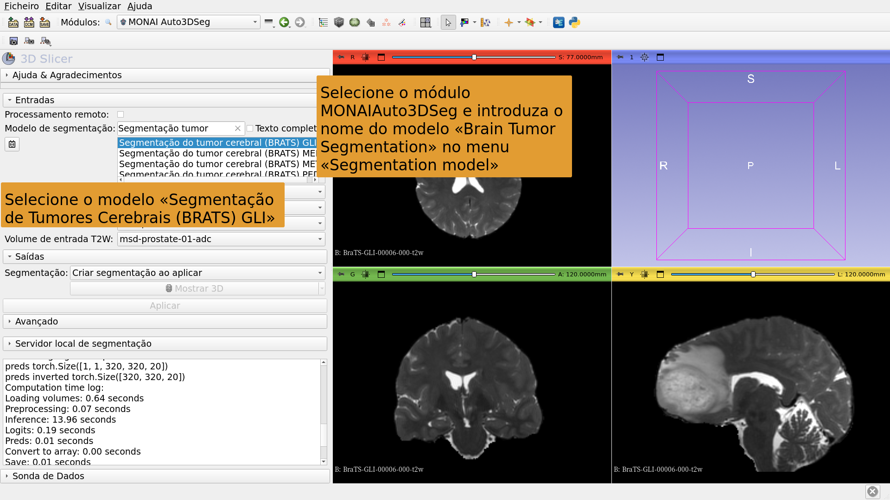

---

## 

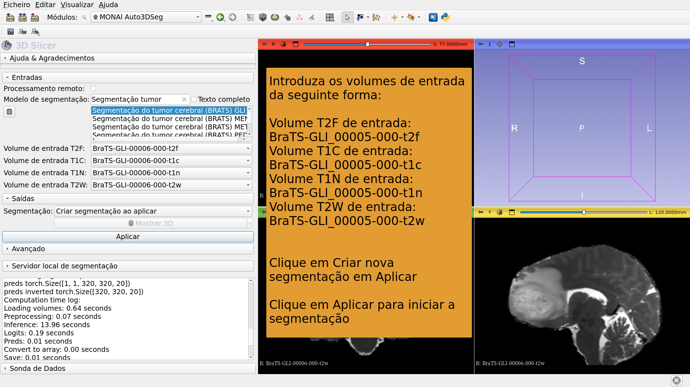

---

## 

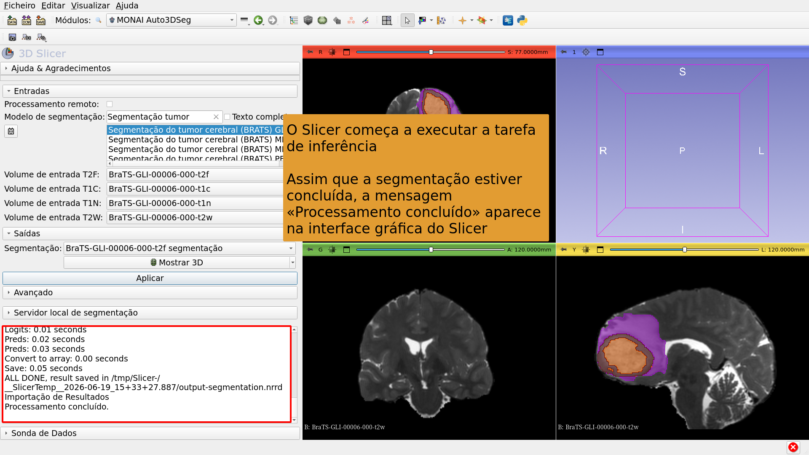

---

## 

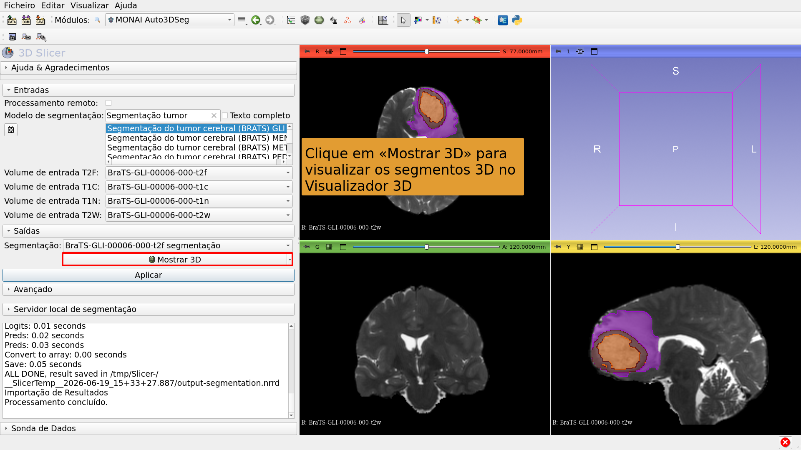

---

# Tarefa de segmentação com IA n.º 3: Segmentação de corpo inteiro

---

##  

Segmentação do corpo inteiro com base em IA.

Conjunto de dados:

CT_ThoraxAbdomen

---

## 

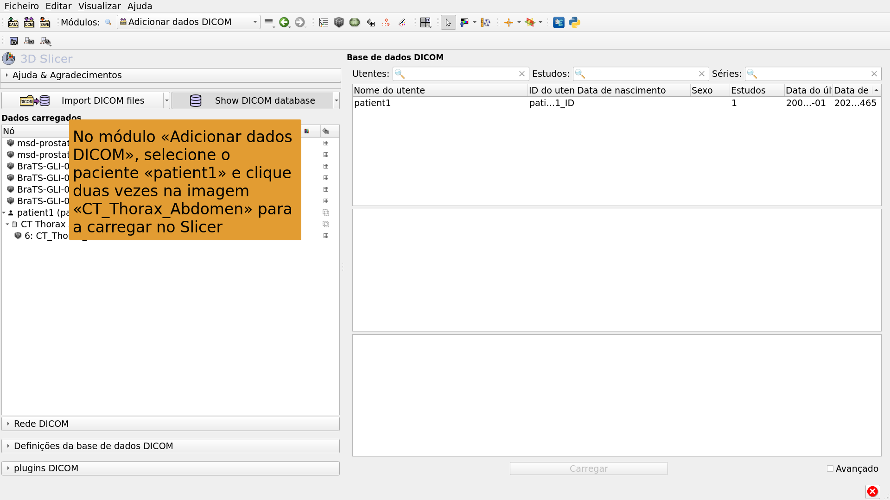

---

## 

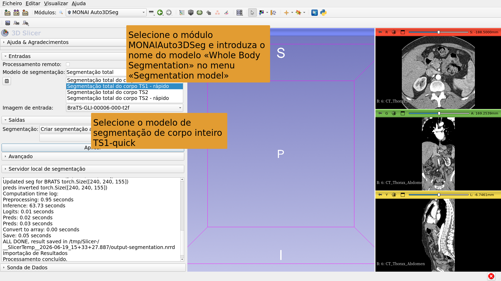

---

## 

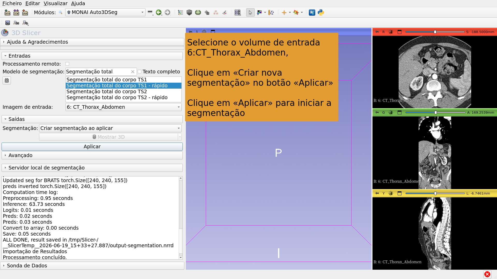

---

## 

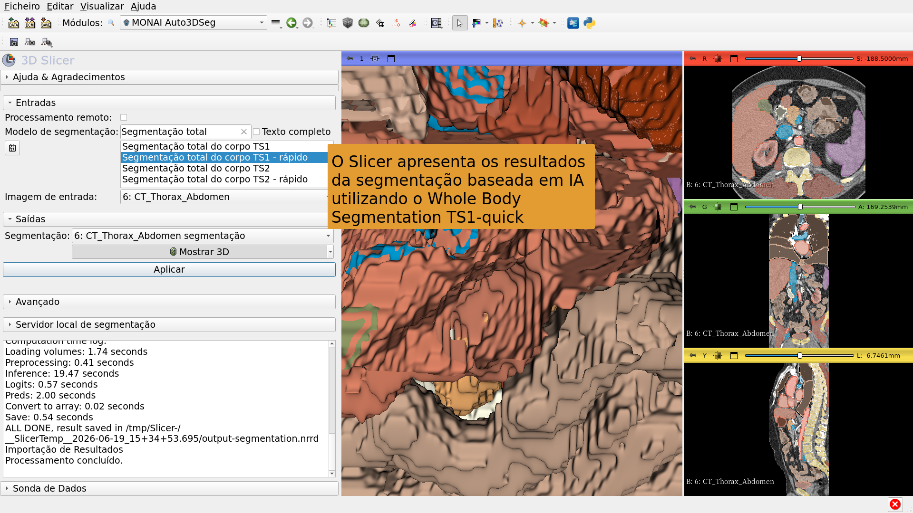

---

## Conclusão

A extensão MONAIAuto3DSeg do 3D Slicer permite uma segmentação rápida, baseada em IA, de estruturas anatómicas e patológicas.

O módulo pode ser executado em computadores portáteis e de secretária normais, sem necessidade de GPU.

---

# Agradecimentos

O projeto de internacionalização do 3D Slicer e o projeto 3D Slicer para a América Latina foram viabilizados graças ao financiamento da Chan Zuckerberg Initiative.

---
