

# Segmentação baseada em IA no 3D Slicer

Sonia Pujol, Ph. D
Brigham and Women's Hospital ,
Escola de Medicina de Harvard
Boston, MA

 

Oficina de Slicer Ribeirão Preto
30 de junho de 2025

---

## Segmentação Manual vs por IA

As imagens médicas têm sido tradicionalmente segmentadas manualmente, um processo demorado que requer esforço intensivo de radiologistas e sujeito à variabilidade inter-reader.

---

## Segmentação Manual vs por IA

Na última década, a segmentação de imagens tem sido alimentada pelo desenvolvimento de algoritmos de aprendizagem profunda (por exemplo, nnUnet pelo Centro Alemão de Pesquisa de Câncer (DKFZ)/Helmholtz Research).

As ferramentas de segmentação alimentadas por IA podem reduzir o tempo de segmentação e proporcionar resultados mais reprodutíveis.

---

## Terminologia

Um Modelo é um algoritmo de IA que foi treinado para executar uma tarefa específica (por exemplo, modelo de segmentação de tumor cerebral).

Os Pesos de um modelo de IA são números pequenos que determinam quanta importância o modelo dá a diferentes características da imagem.

Durante a fase de Treino, um modelo aprende padrões de dados rotulados por especialistas e ajusta os seus pesos para melhorar as suas previsões.

Durante a fase de Validação/Teste, o modelo é avaliado num conjunto separado de dados não usados durante a fase de Treino.

Durante a Inferência, o modelo é aplicado a novos conjuntos de dados para executar a tarefa específica para a qual foi treinado.

---

## Tutorial de IA do 3D Slicer

Este tutorial concentra-se na execução de tarefas de inferência usando vários modelos de IA pré-treinados para segmentação automatizada de estruturas anatômicas e patológicas.

---

## Extensão MONAIAuto3DSeg do Slicer

Este tutorial usa os modelos pré-treinados da extensão MONAIAuto3DSeg do Slicer.

A ferramenta foi projetada para funcionar em portátis ou computadores desktop médios sem GPU.

---

## Extensão MONAIAuto3DSeg do Slicer

Apoio a múltiplas modalidades (TC, RM).

Múltiplas anatomias (cabeça, tórax, abdome, pelve, etc.).

Múltiplas patologias (tumor, hemorragia, edema).

---

## Tutorial de IA do Slicer: Tarefas de Segmentação

Tarefa de Segmentação #1: Próstata

Tarefa de Segmentação #2: Glioma Cerebral

Tarefa de Segmentação #3: Segmentação de Corpo Inteiro

---

# Tarefa de Segmentação por IA #1: Próstata

---

##  

Segmentação baseada em IA da Zona Periférica (ZP) e Zona de Transição (ZT) da próstata em imagens de RM ponderadas em T2.

Conjunto de dados:

msd_prostate_01-t2

msd_prostate_01-adc

---

## 

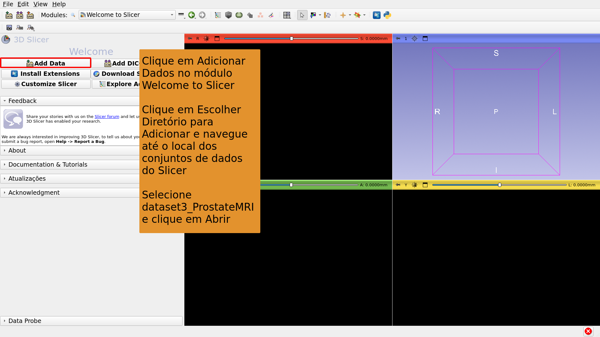

---

## 

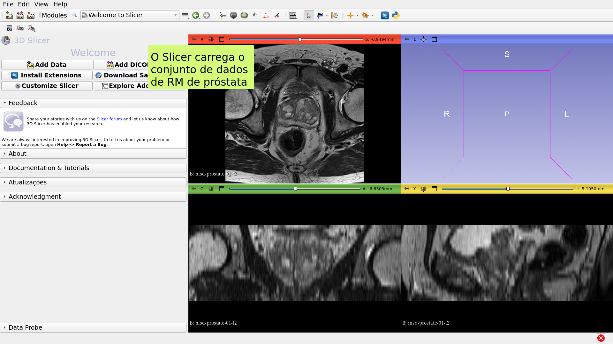

---

## 

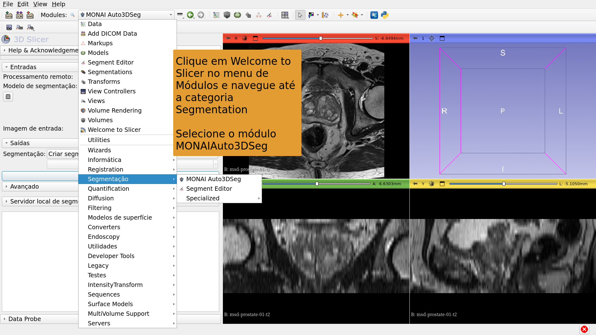

---

## 

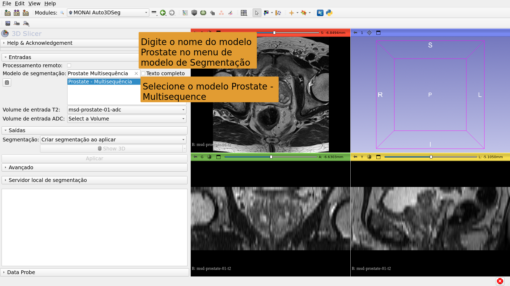

---

## 

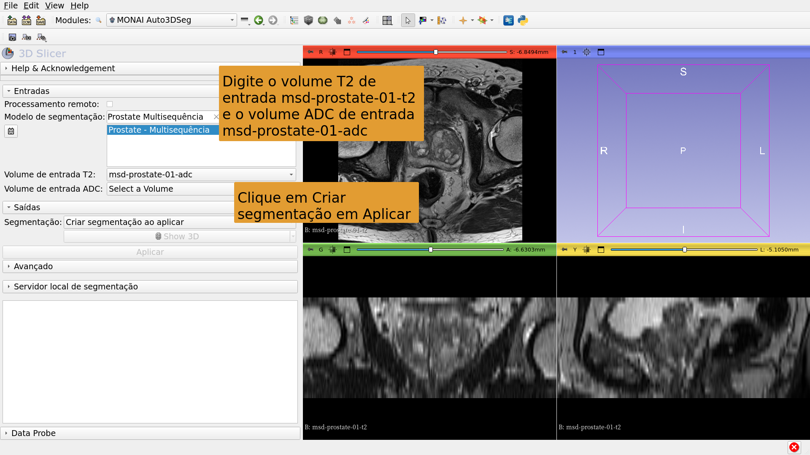

---

## 

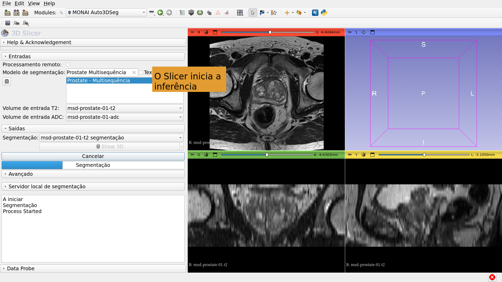

---

## 

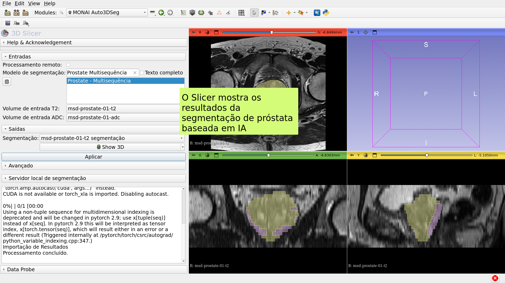

---

# Tarefa de Segmentação por IA #2: Glioma Cerebral

---

##  

Segmentação baseada em IA de Neoplasia, Necrose e Edema em imagens de RM cerebral.

Conjuntos de dados:

1) BraTS-GLI_00005-000-t1n (ponderado em T1)

2) BraTS-GLI_00005-000-t1c (ponderado em T1 pós-Gd)

3) BraTS-GLI_00005-000-t2w (ponderado em T2)

4) BraTS-GLI_00005-000-t2f (T2-FLAIR)

---

## 

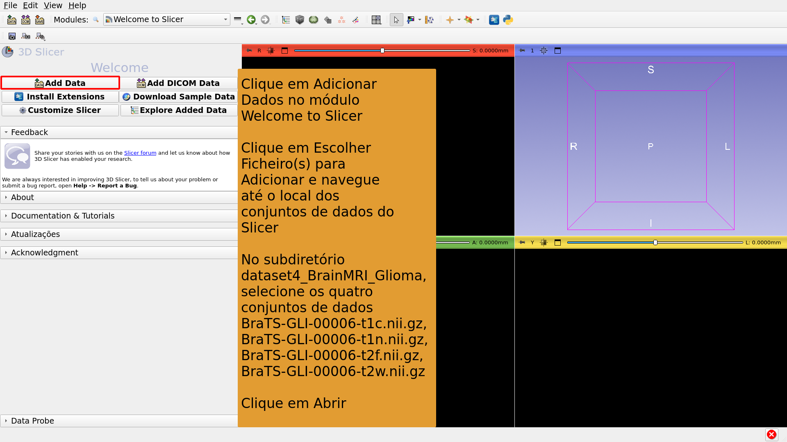

---

## 

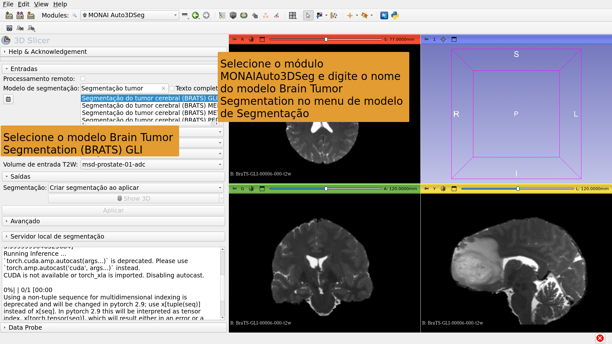

---

## 

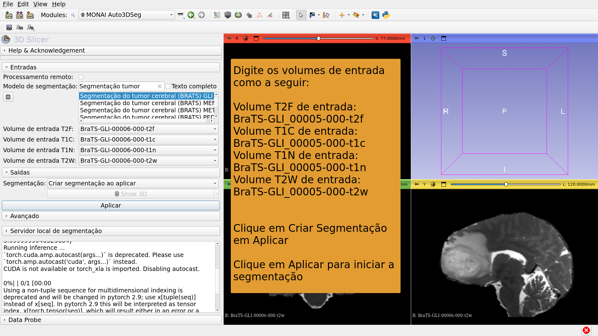

---

## 

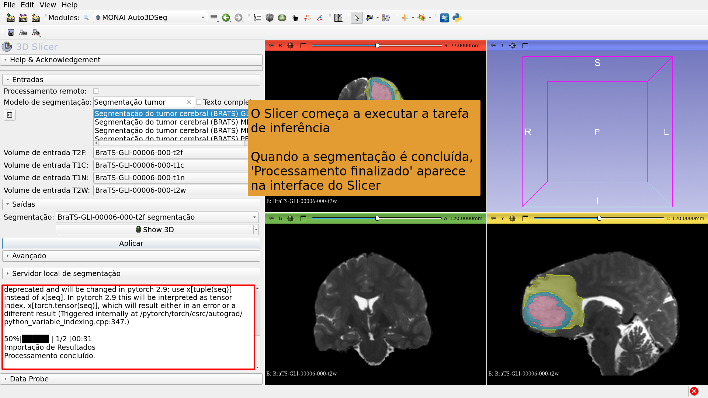

---

## 

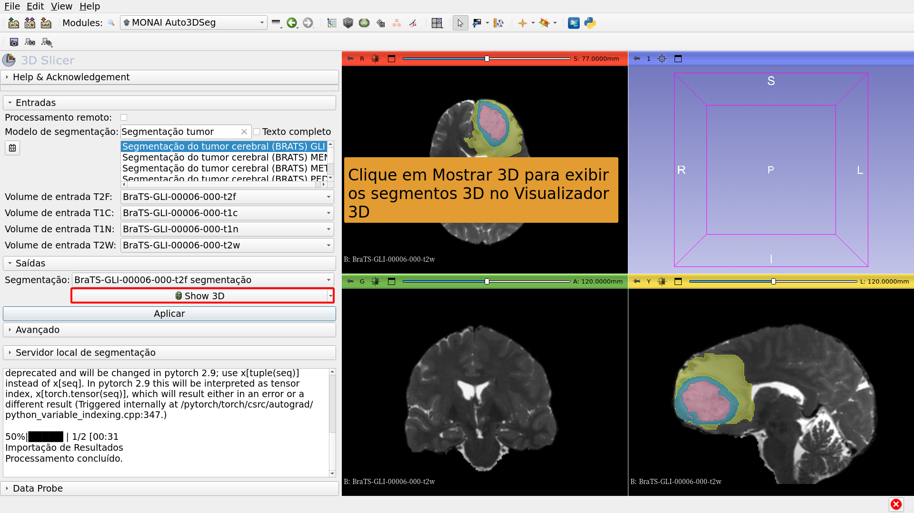

---

# Tarefa de Segmentação por IA #3: Segmentação de Corpo Inteiro

---

##  

Segmentação baseada em IA do corpo inteiro.

Conjunto de dados:

CT_ThoraxAbdomen

---

## 

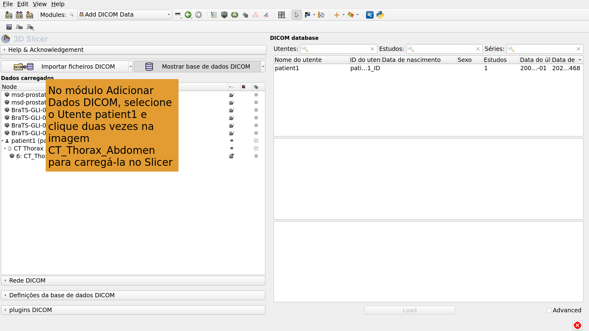

---

## 

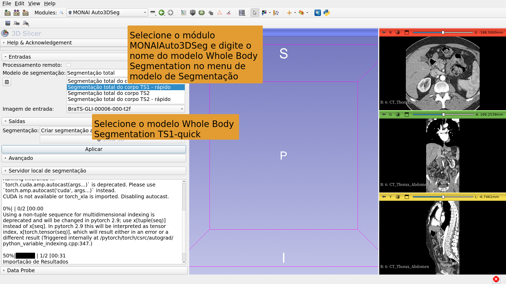

---

## 

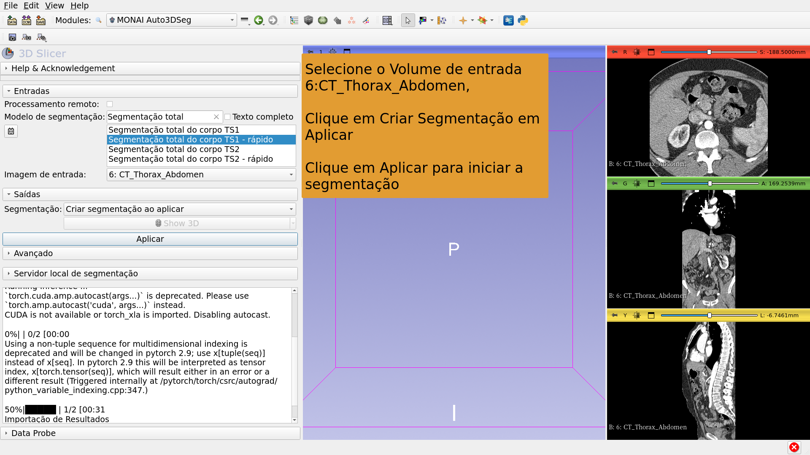

---

## 

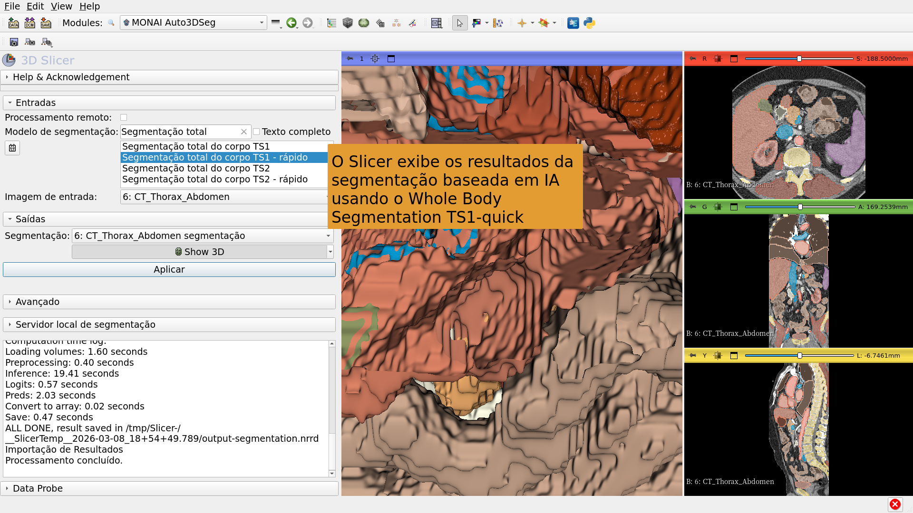

---

## Conclusão

A extensão MONAIAuto3DSeg do 3D Slicer fornece segmentação rápida baseada em IA de estruturas anatômicas e patológicas.

O módulo pode ser executado em portátis e computadores desktop padrão sem GPU.

---

# Agradecimentos

O projeto de internacionalização do 3D Slicer e o projeto 3D Slicer para América Latina foram possíveis através do financiamento da Chan Zuckerberg Initiative.

---
