

# AIBasedSegmentationIn3DSlicer

Sonia Pujol, Ph.D.

30/06/2025

AI - based Segmentation in 3D Slicer

---

## Manual vs AI-powered Segmentation

Click on Add Data in the Welcome to 	Slicer module

---

## Slicer loads the prostate MRI dataset

In the past decade, image segmentation has been powered by the development of deep learning algorithms (e.g. nnUnet by the German Cancer Research Center (DKFZ)/Helmholtz Research).

AI-powered segmentation tools can reduce the segmentation time and provide more reproducible results.

---

## AI Terminology

A is an AI algorithm that was trained to perform a specific task (e.g. brain tumor segmentation model).

The Weights of an AI model are small numbers that determine how  much importance the model gives to different image features.

During the Training phase, a Model learns patterns from data labelled  by experts and adjusts its weights to improve its predictions.

During the Validation/Test phase, the model is evaluated on a separate set of data not used during the Training phase.

During Inference, the model is applied to new datasets to perform the specific task it was trained for.

---

## 3D Slicer AI Workshop

ப்ரோச்டேட் - மல்டிசீக்வென்ச் மாதிரியைத் தேர்ந்தெடுக்கவும்

---

## MONAIAuto3DSeg Slicer extension

This tutorial uses the pre-trained models of the MONAIAuto3DSeg Slicer extension.

The tool is designed to work on laptops or on average desktop computer without a GPU.

---

## MONAIAuto3DSeg Slicer extension

Click on Create new segmentation on

Apply

---

## Slicer starts the inference

Segmentation Task #1: Prostate.

Segmentation Task #2: Brain Glioma.

Segmentation Task #3: Whole Body Segmentation.

---

# Slicer shows the result of the AIbased prostate segmentation

---

## Load dataset4_BrainMRI_Glioma

AI-based Segmentation of Peripheral Zone (PZ) and Transition Zone (TZ) of the prostate on T2-weighted MRI Images.

Dataset:

msd_prostate_01-t2

msd_prostate_01-adc

---

## 

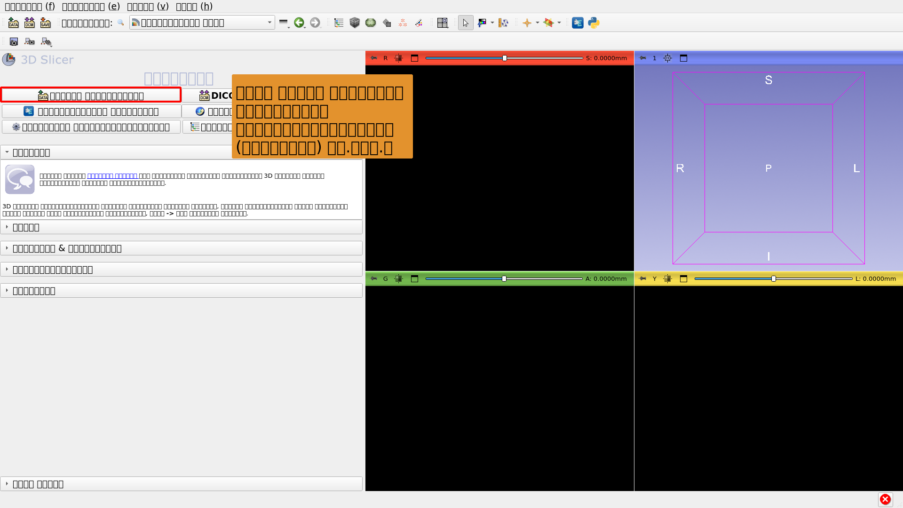

---

## 

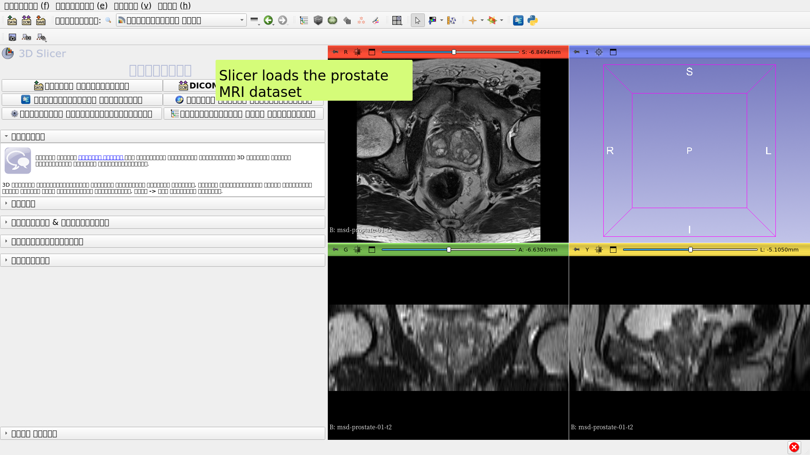

---

## 

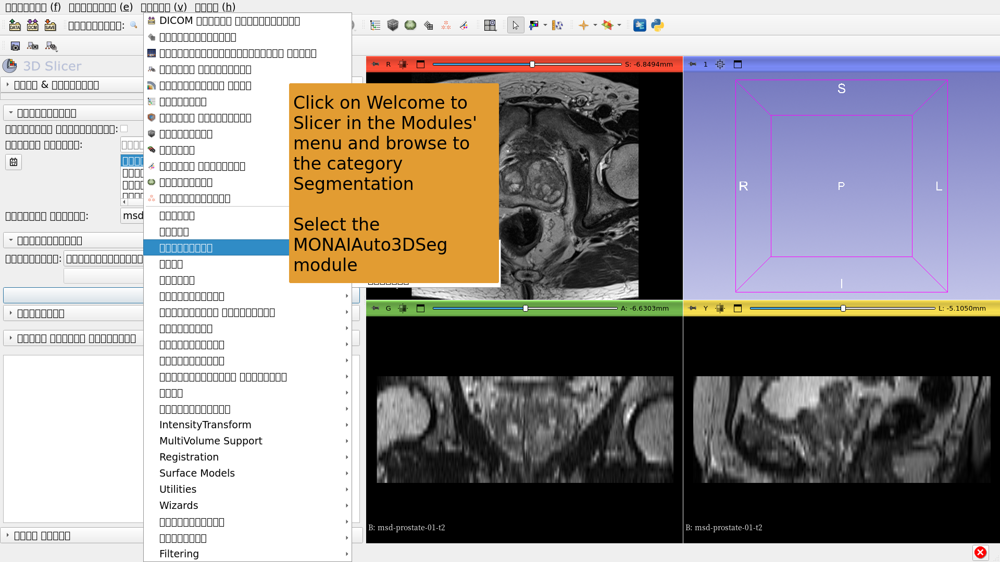

---

## 

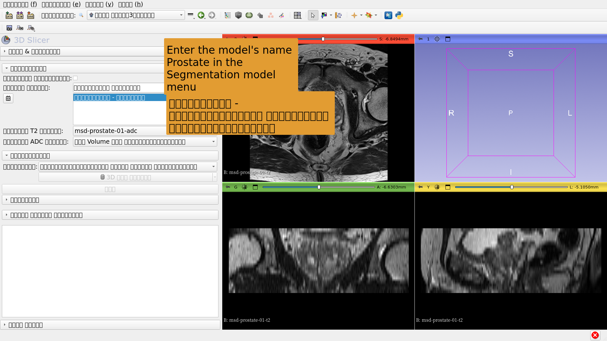

---

## 

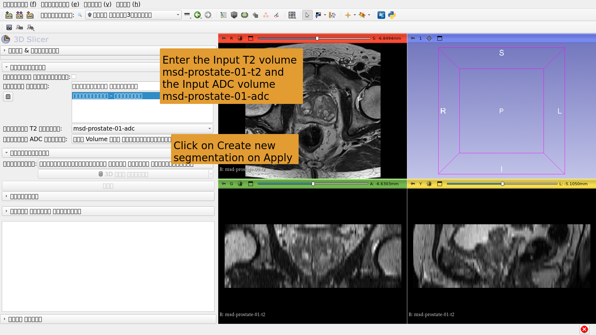

---

## 

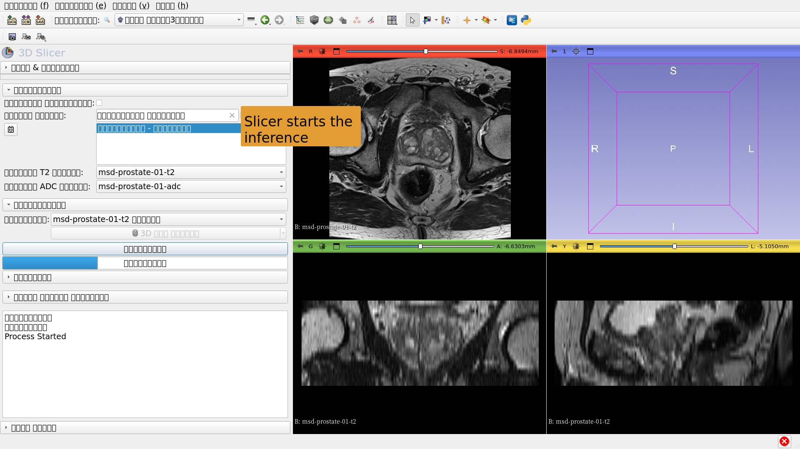

---

## 

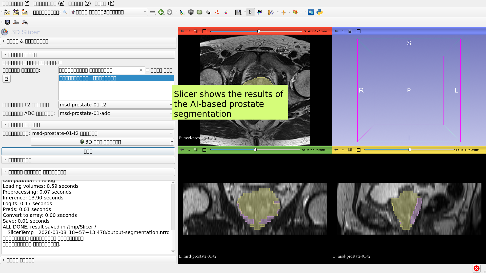

---

# Slicer starts the inference

---

## Slicer displays the result of the AI-based segmentation
using the Whole Body Segmentation TS1- quick

AI-based Segmentation of Neoplasm, Necrosis and Edema in Brain MRI images.

Datasets:

1) BraTS-GLI_00005-000-t1n (T1-weighted)

2) BraTS-GLI_00005-000-t1c (T1-weighted post-Gd)

3) BraTS-GLI_00005-000-t2w (T2-weighted)

4) BraTS-GLI_00005-000-t2f (T2-FLAIR )

---

## 

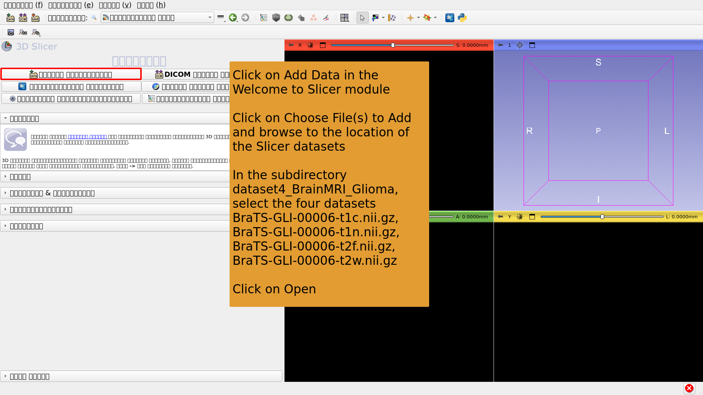

---

## 

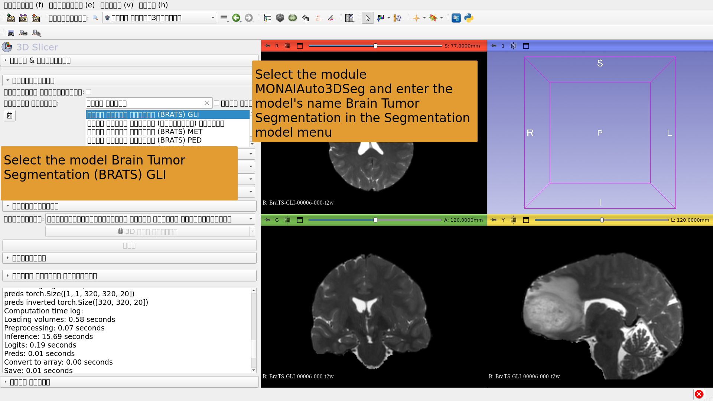

---

## 

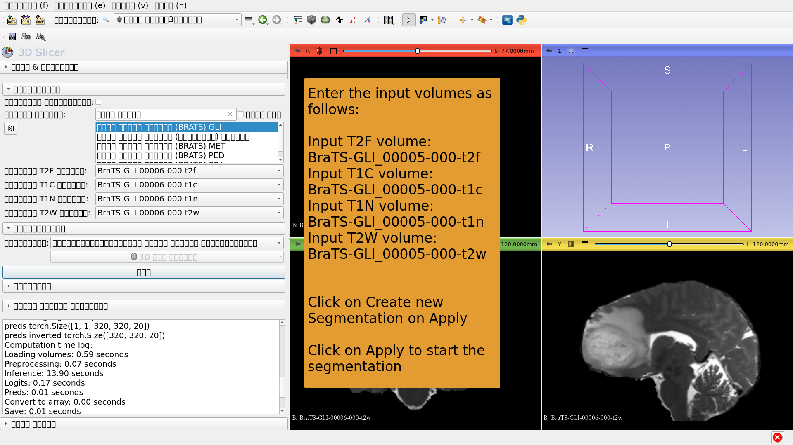

---

## 

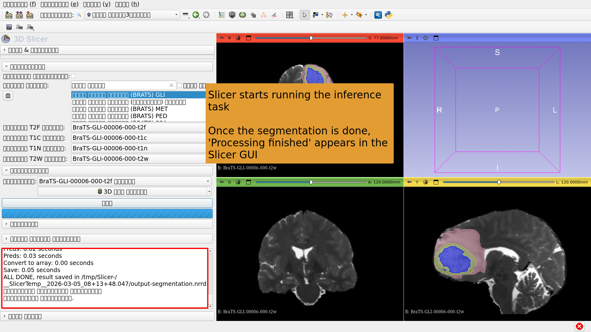

---

## 

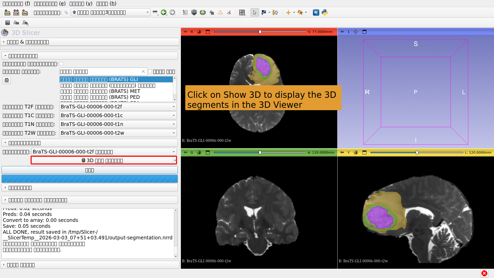

---

# AI Segmentation Task #3: Whole Body Segmentation

---

##  

AI-based Segmentation of the whole body.

Dataset:

CT_ThoraxAbdomen

---

## 

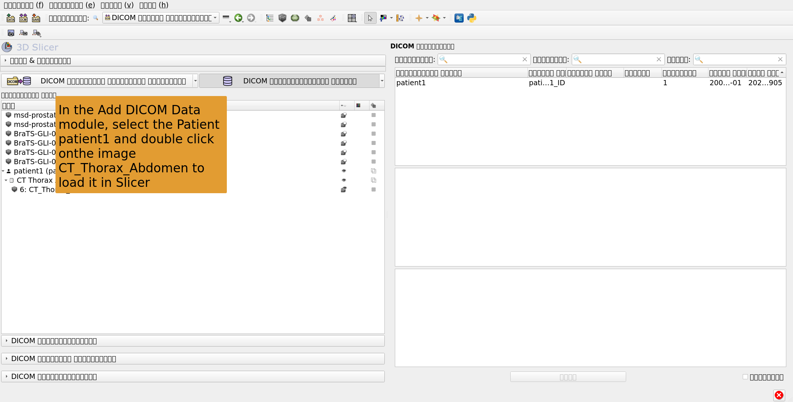

---

## 

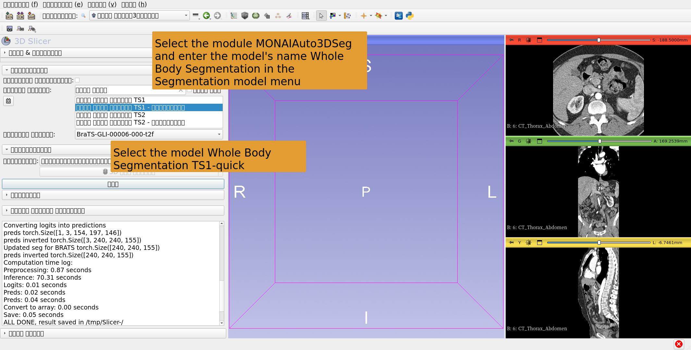

---

## 

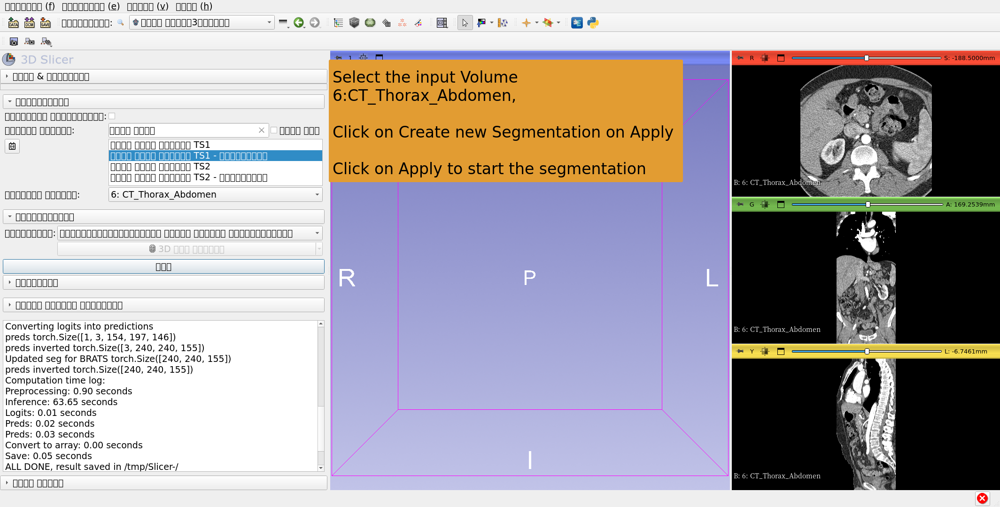

---

## 

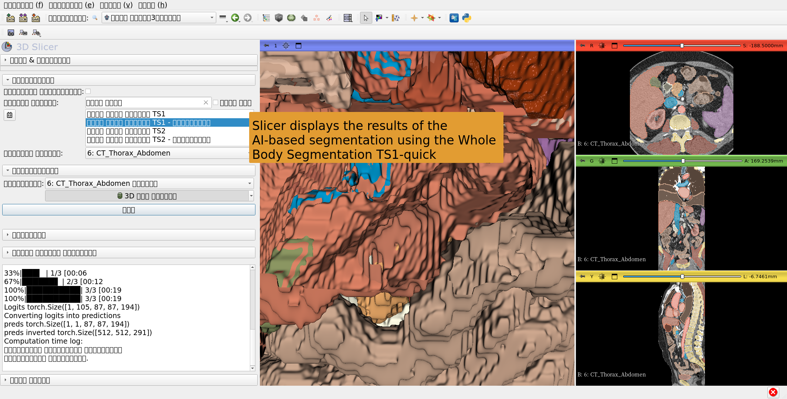

---

## Conclusion

The 3D SlicerMONAIAuto3DSeg extension provides fast AI-based segmentation of anatomical and pathological structures.

The module can run on standard laptop and desktop computers with no GPU.

---

# Acknowledgements

The 3D Slicer internationalization project and the 3D Slicer for Latin America project have been made possible by two CZI Essential  Open Source Software for Science (EOSS cycle 4 & 5) grants.

---
