

# 3D ச்லைசரில் AI அடிப்படையிலான பிரிவு

சோனியா புசோல், Ph. D. 
பிரிகாம் மற்றும் பெண்கள் மருத்துவமனை, 
ஆர்வர்ட் மருத்துவப் பள்ளி 
பாச்டன், எம்.ஏ

 

Slicer Ribeirão Preto பட்டறை
சூன் 30, 2025

---

## கையேடு vs AI- இயங்கும் பிரிவு

மருத்துவப் படங்கள் பாரம்பரியமாக கைமுறையாகப் பிரிக்கப்படுகின்றன, இது கதிரியக்கவியலாளர்களின் தீவிர முயற்சி தேவைப்படும் நேரத்தைச் செலவழிக்கும் செயல்முறையாகும், மேலும் இது வாசகர்களுக்கிடையேயான மாறுபாட்டிற்கு உட்பட்டது.

---

## கையேடு vs AI- இயங்கும் பிரிவு

கடந்த தசாப்தத்தில், ஆழமான கற்றல் அல்காரிதம்களின் வளர்ச்சியால் படப் பிரிவு இயங்குகிறது (எ.கா. செர்மன் புற்றுநோய் ஆராய்ச்சி நடுவண் (DKFZ)/Helmholtz ஆராய்ச்சி மூலம் nnUnet). 

AI-இயங்கும் பிரிவுக் கருவிகள் பிரிவு நேரத்தைக் குறைத்து, மேலும் மீண்டும் உருவாக்கக்கூடிய முடிவுகளை வழங்க முடியும்.

---

## AI சொற்களஞ்சியம்

ஒரு மாதிரி என்பது ஒரு குறிப்பிட்ட பணியைச் செய்ய பயிற்சியளிக்கப்பட்ட ஒரு AI அல்காரிதம் ஆகும் (எ.கா. மூளைக் கட்டிப் பிரிப்பு மாதிரி). 

AI மாதிரியின் எடைகள் சிறிய எண்களாகும், அவை வெவ்வேறு பட அம்சங்களுக்கு மாதிரி எவ்வளவு முக்கியத்துவம் கொடுக்கிறது என்பதை தீர்மானிக்கிறது. 

பயிற்சியின் போது, ஒரு மாதிரியானது நிபுணர்களால் பெயரிடப்பட்ட தரவுகளிலிருந்து வடிவங்களைக் கற்றுக்கொள்கிறது மற்றும் அதன் கணிப்புகளை மேம்படுத்த அதன் எடையை சரிசெய்கிறது. 

சரிபார்ப்பு/சோதனை கட்டத்தின் போது, பயிற்சி கட்டத்தில் பயன்படுத்தப்படாத தரவுகளின் தனித் தொகுப்பில் மாதிரி மதிப்பீடு செய்யப்படுகிறது. 

அனுமானத்தின் போது, மாதிரியானது பயிற்சியளிக்கப்பட்ட குறிப்பிட்ட பணியைச் செய்ய புதிய தரவுத்தொகுப்புகளுக்குப் பயன்படுத்தப்படுகிறது.

---

## ZD Slitzer AI பயிற்சி

உடற்கூறியல் மற்றும் நோயியல் கட்டமைப்புகளின் தானியங்குப் பிரிவிற்காக பல்வேறு முன் பயிற்சி பெற்ற AI மாதிரிகளைப் பயன்படுத்தி அனுமானப் பணிகளை இயக்குவதில் இந்தப் பயிற்சி கவனம் செலுத்துகிறது.

---

## MONAIAauto3DSeg ச்லைசர் நீட்டிப்பு

இந்த பயிற்சியானது MONAIAuto3DSeg ச்லைசர் நீட்டிப்பின் முன் பயிற்சி பெற்ற மாதிரிகளைப் பயன்படுத்துகிறது. 

இந்த கருவியானது மடிக்கணினிகளில் அல்லது GPU இல்லாமல் சராசரி டெச்க்டாப் கணினியில் வேலை செய்ய வடிவமைக்கப்பட்டுள்ளது.

---

## MONAIAauto3DSeg ச்லைசர் நீட்டிப்பு

பல முறைகள் உதவி (CT, MRI). 

பல உடற்கூறியல் (தலை, மார்பு, வயிறு, இடுப்பு, முதலியன). 

பல நோய்க்குறியியல் (கட்டி, இரத்தக்கசிவு, எடிமா).

---

## ச்லைசர் AI பயிற்சி: பிரிவு பணிகள்

பிரிவு பணி #1: புரோச்டேட் 

பிரிவு பணி #2: மூளை க்ளியோமா 

பிரிவு பணி #3: முழு உடல் பிரிவு

---

# AI பிரிவு பணி #1: புரோச்டேட்

---

##  

AI-அடிப்படையிலான பிரிவு மண்டலம் (PZ) மற்றும் T2 எடையுள்ள MRI படங்களில் புரோச்டேட்டின் மாற்றம் மண்டலம் (TZ). 

தரவுத்தொகுப்பு: 

msd_prostate_01-t2 

msd_prostate_01-adc

---

## 

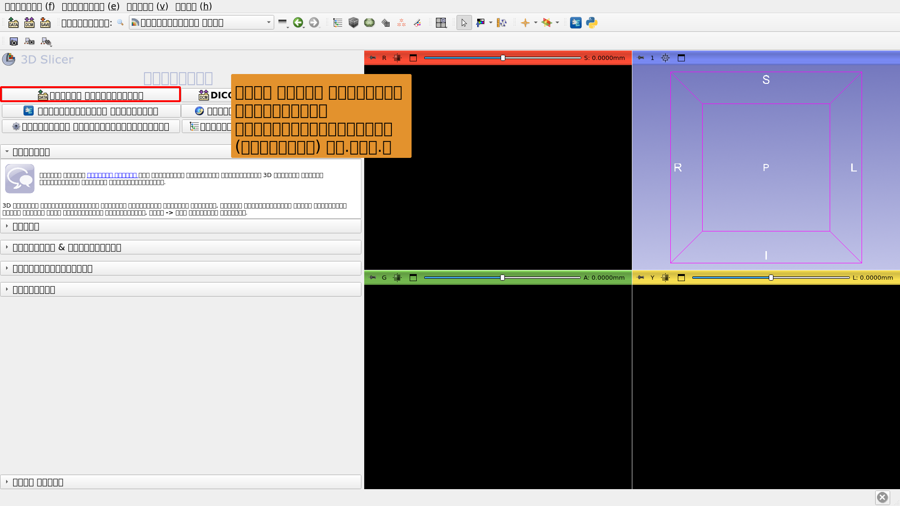

---

## 

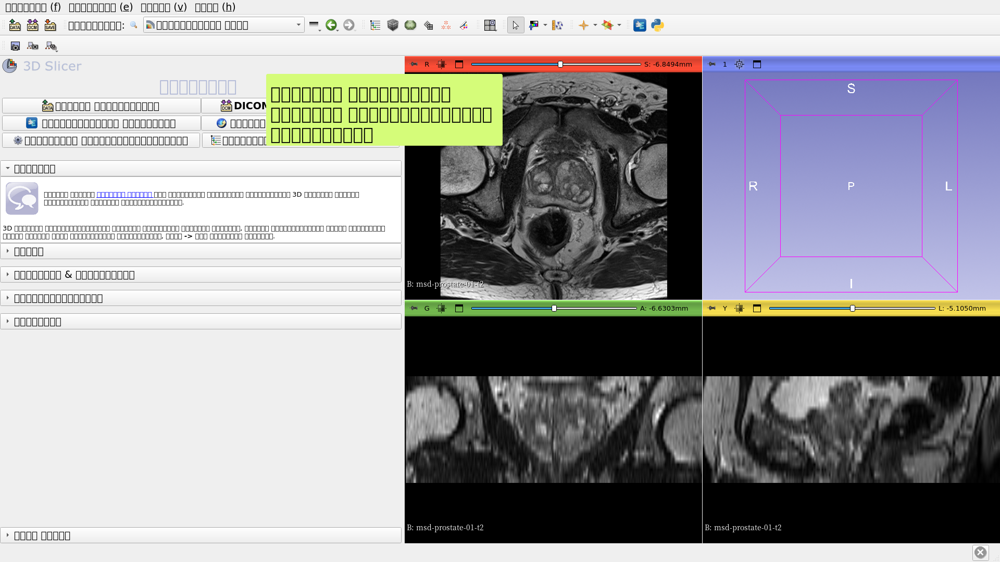

---

## 

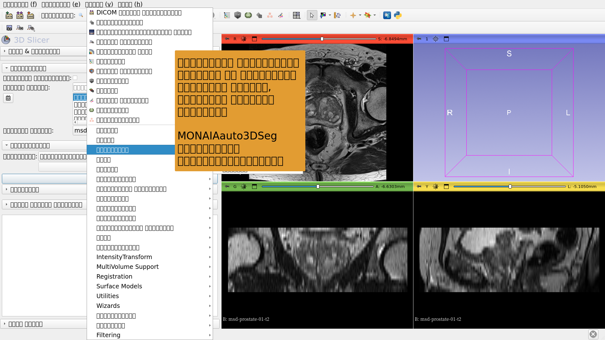

---

## 

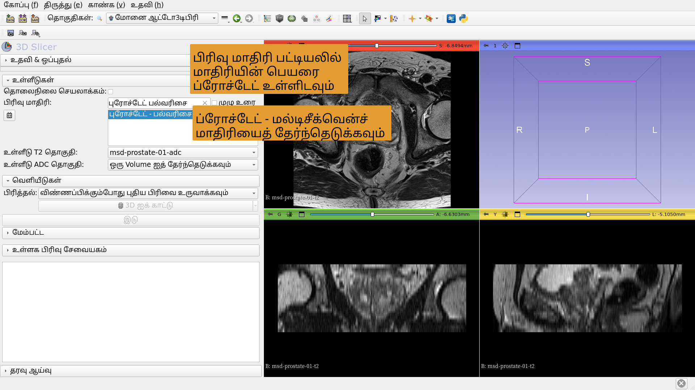

---

## 

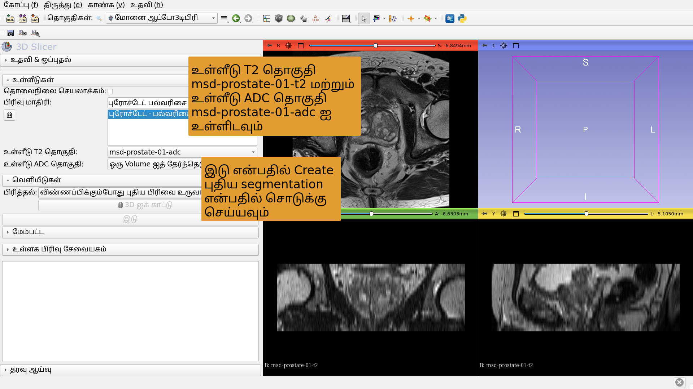

---

## 

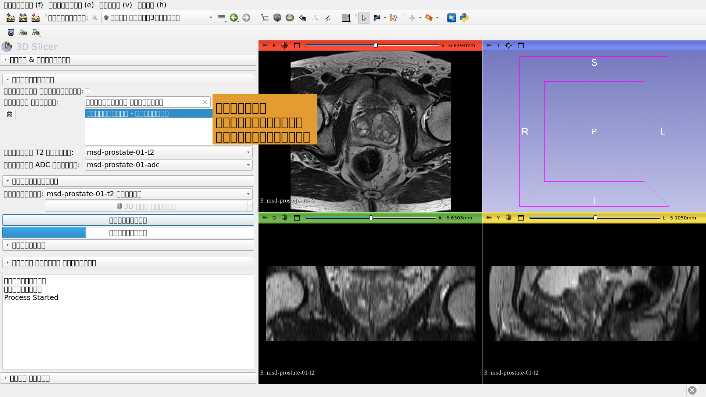

---

## 

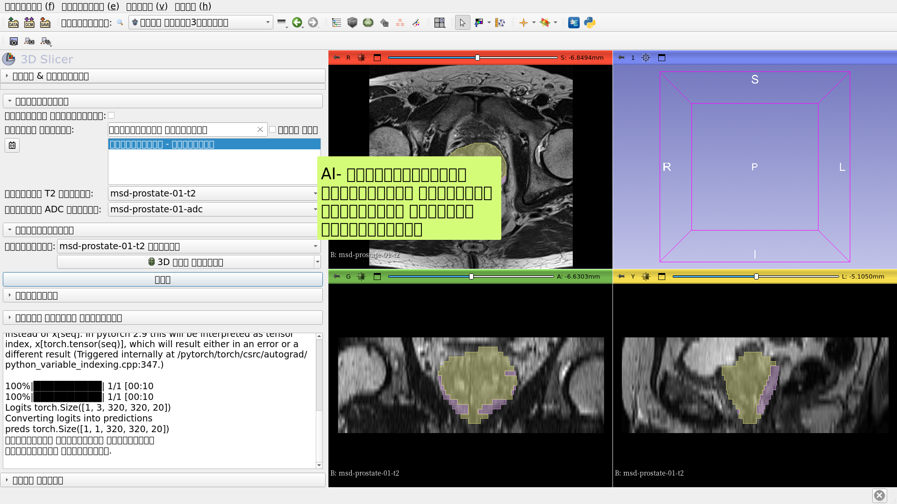

---

# AI பிரிவு பணி #2: மூளை க்ளியோமா

---

##  

மூளை MRI படங்களில் நியோபிளாசம், நெக்ரோசிச் மற்றும் எடிமாவின் AI- அடிப்படையிலான பிரிவு. 

தரவுத்தொகுப்புகள்: 

1) BraTS-GLI_00005-000-t1n (T1-வெயிட்டட்) 

2) BraTS-GLI_00005-000-t1c (T1-வெயிட்டட் பிந்தைய சிடி) 

3) BraTS-GLI_00005-000-t2w (T2-வெயிட்டட்) 

4) BraTS-GLI_00005-000-t2f (T2-FLAIR )

---

## 

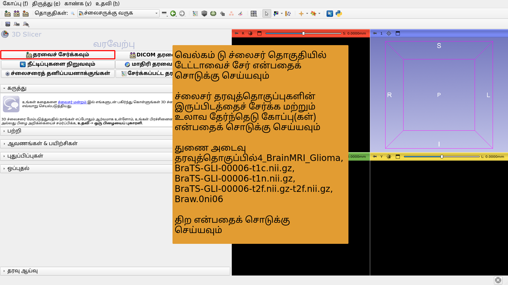

---

## 

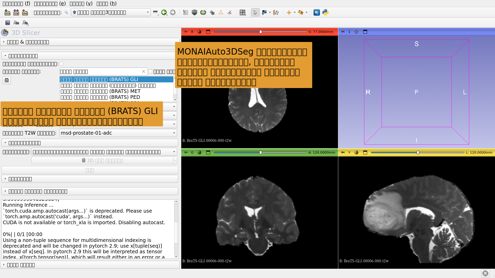

---

## 

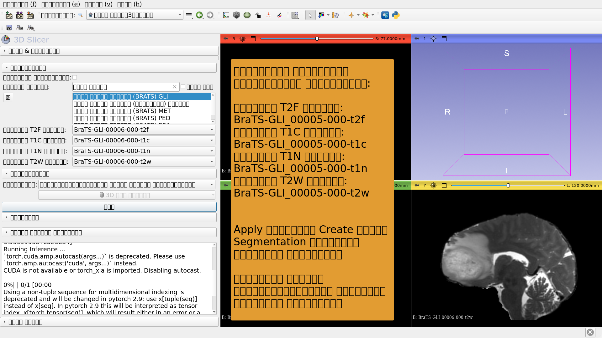

---

## 

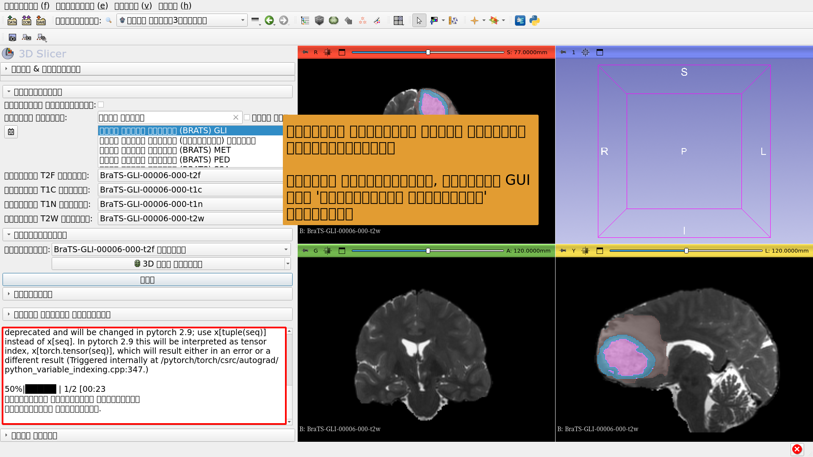

---

## 

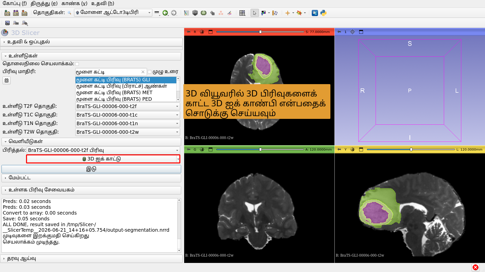

---

# AI பிரிவு பணி #3: முழு உடல் பிரிவு

---

##  

முழு உடலின் AI- அடிப்படையிலான பிரிவு. 

தரவுத்தொகுப்பு: 

CT_ThoraxAbdomen

---

## 

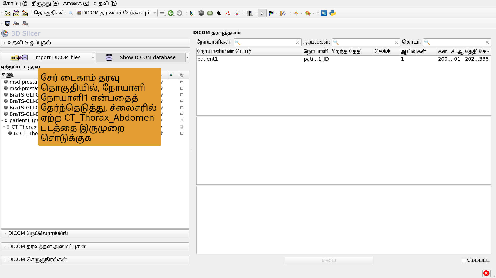

---

## 

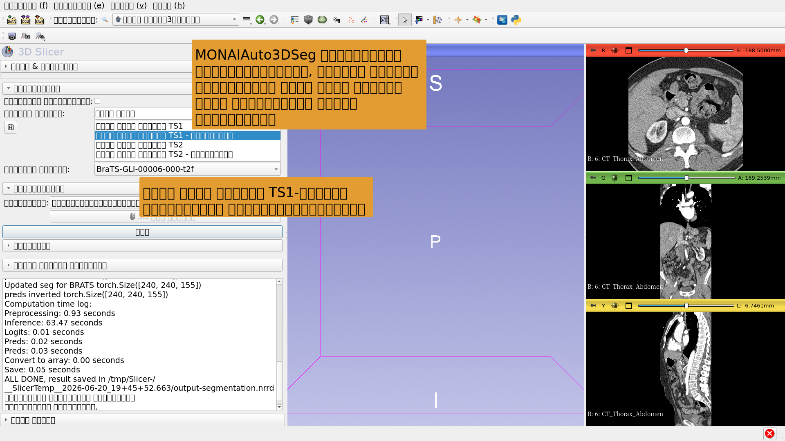

---

## 

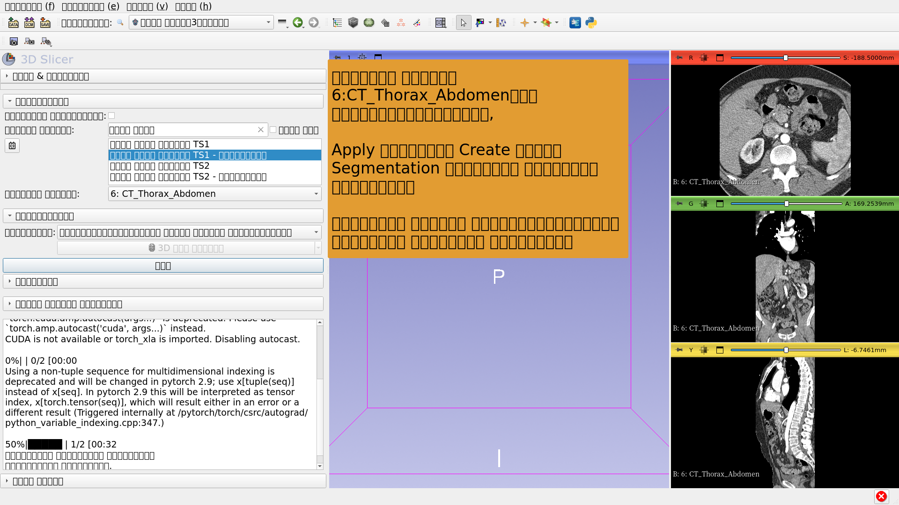

---

## 

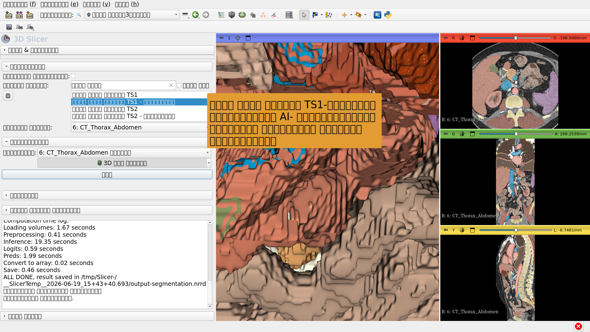

---

## முடிவுரை

3D ச்லைசர் MONAIAauto3DSeg நீட்டிப்பு, உடற்கூறியல் மற்றும் நோயியல் கட்டமைப்புகளின் விரைவான AI- அடிப்படையிலான பிரிவை வழங்குகிறது. 

GPU இல்லாத நிலையான லேப்டாப் மற்றும் டெச்க்டாப் கம்ப்யூட்டர்களில் மாட்யூல் இயங்க முடியும்.

---

# அங்கீகாரங்கள்

3D ச்லைசர் பன்னாட்டுமயமாக்கல் திட்டம் மற்றும் லத்தீன் அமெரிக்கா திட்டத்திற்கான 3D ச்லைசர் ஆகியவை சான் சுக்கர்பெர்க் முன்முயற்சியின் மூலம் நிதியளிப்பதன் மூலம் சாத்தியமாக்கப்பட்டுள்ளன.

---
