

# 3D Slicer 的 AI 分割

Sonia Pujol 博士
布萊根婦女醫院
哈佛醫學院
美國麻薩諸塞州波士頓

 

Slicer Ribeirão Preto 工作坊
2025 年 6 月 30 日

---

## 手動分割與 AI 分割

傳統上，醫學影像採用手動分割。這項流程相當耗時，需要放射科醫師投入大量精力，且會受到判讀者間變異影響。

---

## 手動分割與 AI 分割

過去十年間，影像分割因深度學習演算法的發展而快速進步 (例如德國癌症研究中心 (DKFZ)／Helmholtz Research 開發的 nnUnet)。

AI 分割工具可縮短分割時間，並提供更具再現性的結果。

---

## AI 術語

模型 (Model) 是經過訓練、可執行特定工作 (例如腦腫瘤分割) 的 AI 演算法。

AI 模型的權重 (Weights) 是一些較小的數值，用來決定模型賦予不同影像特徵的重要程度。

在訓練 (Training) 階段，模型會從專家標註的資料中學習模式，並調整權重以改善預測結果。

在驗證／測試 (Validation/Test) 階段，會使用未用於訓練的另一組資料評估模型。

在推論 (Inference) 階段，模型會套用於新的資料集，以執行受訓的特定工作。

---

## 3D Slicer AI 教學

本教學著重於使用各種預先訓練的 AI 模型執行推論工作，以自動分割解剖與病理結構。

---

## MONAIAuto3DSeg Slicer 擴充功能

本教學使用 MONAIAuto3DSeg Slicer 擴充功能的預先訓練模型。

此工具可在沒有 GPU 的筆記型電腦或一般桌上型電腦上運作。

---

## MONAIAuto3DSeg Slicer 擴充功能

支援多種影像模態 (CT、MRI)。

支援多種解剖部位 (頭部、胸部、腹部、骨盆等)。

支援多種病理狀況 (腫瘤、出血、水腫)。

---

## Slicer AI 教學：分割工作

分割工作 #1：前列腺

分割工作 #2：腦膠質瘤

分割工作 #3：全身分割

---

# AI 分割工作 #1：前列腺

---

##  

在 T2 加權 MRI 影像上，以 AI 分割前列腺的周邊區 (PZ) 與移行區 (TZ)。

資料集：

msd_prostate_01-t2

msd_prostate_01-adc

---

## 

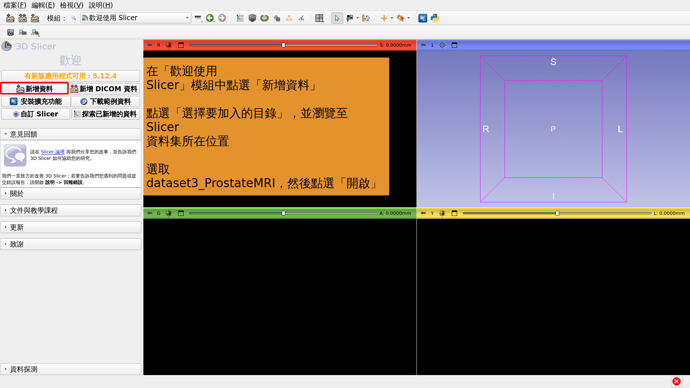

---

## 

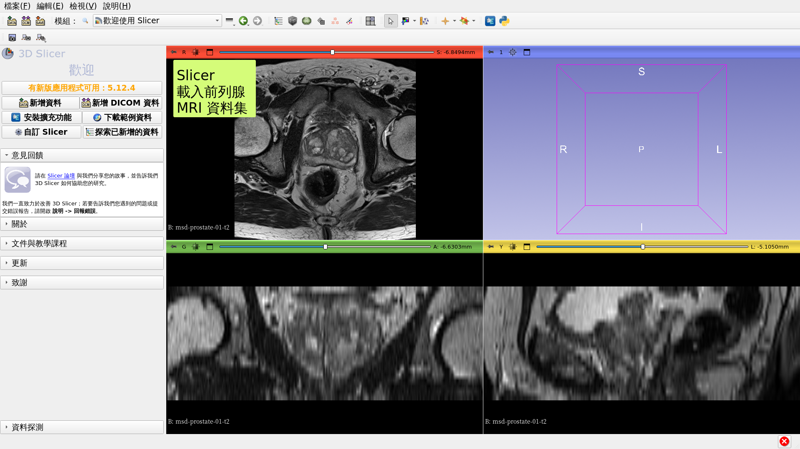

---

## 

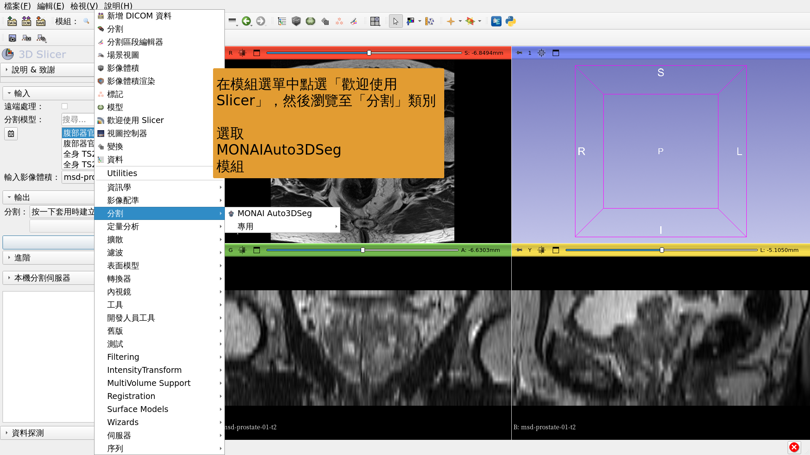

---

## 

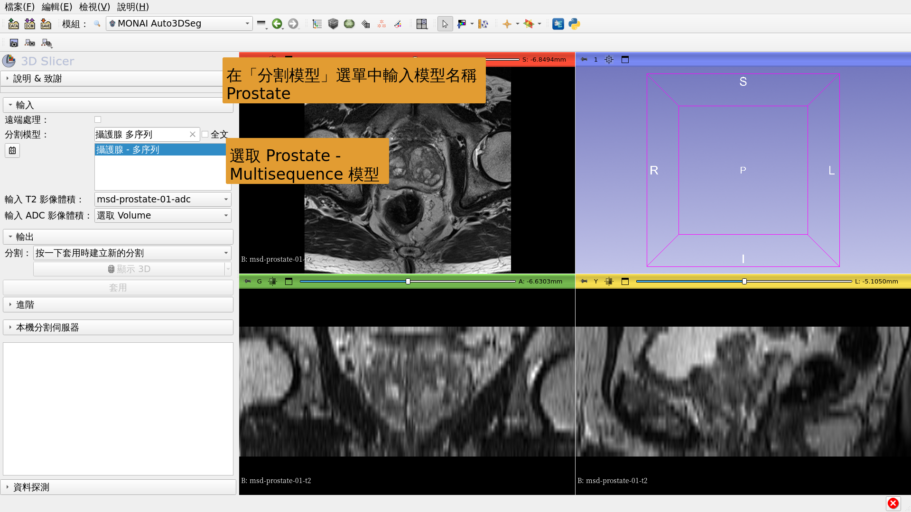

---

## 

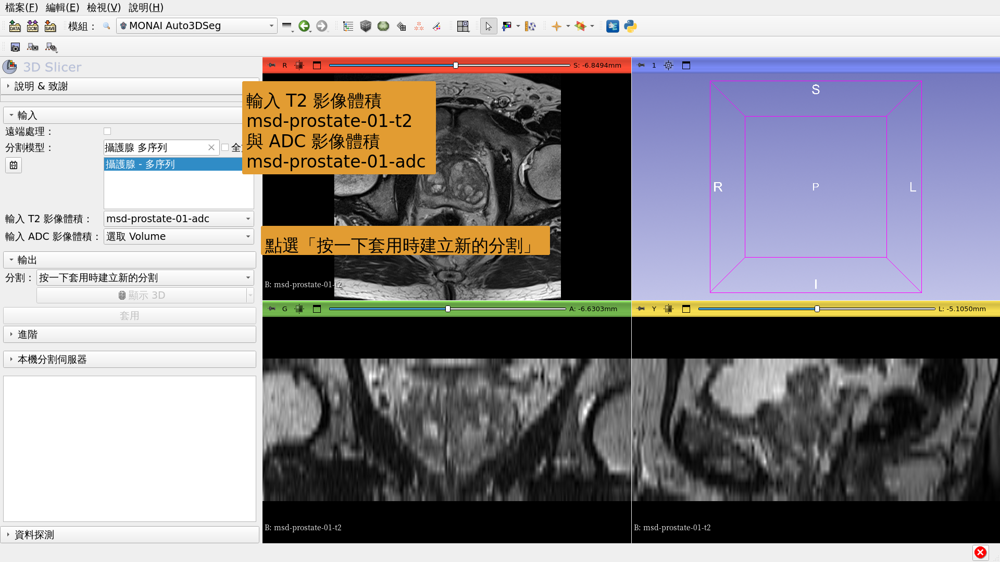

---

## 

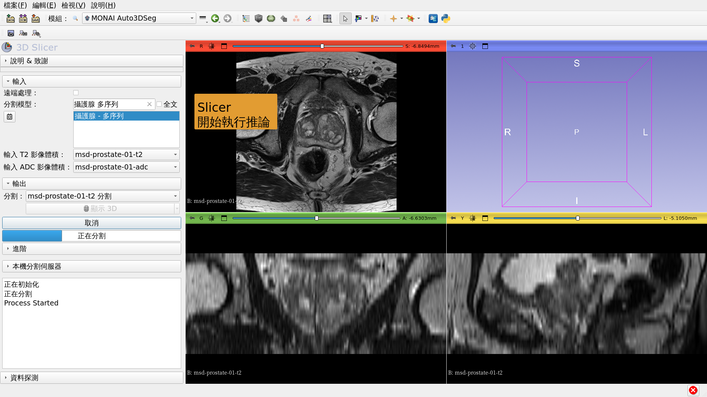

---

## 

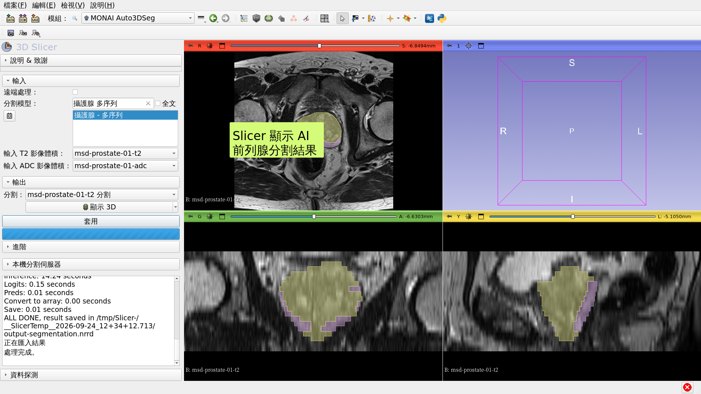

---

# AI 分割工作 #2：腦膠質瘤

---

##  

在腦部 MRI 影像上，以 AI 分割腫瘤、壞死與水腫。

資料集：

1) BraTS-GLI_00005-000-t1n (T1 加權)

2) BraTS-GLI_00005-000-t1c (T1 加權，注射 Gd 後)

3) BraTS-GLI_00005-000-t2w (T2 加權)

4) BraTS-GLI_00005-000-t2f (T2-FLAIR)

---

## 

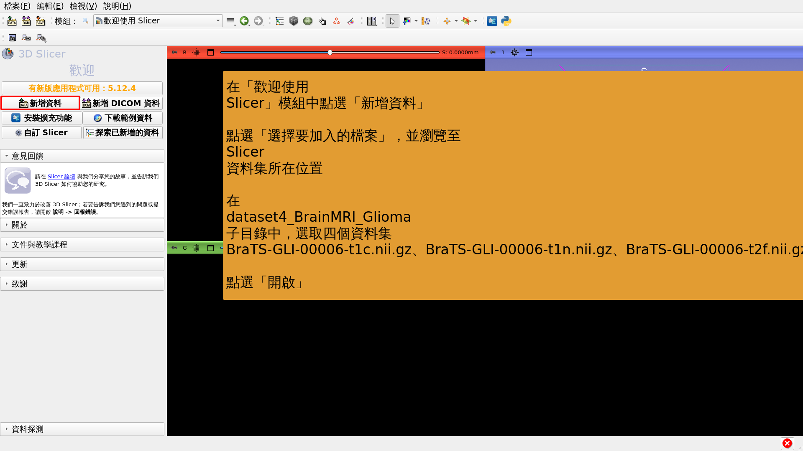

---

## 

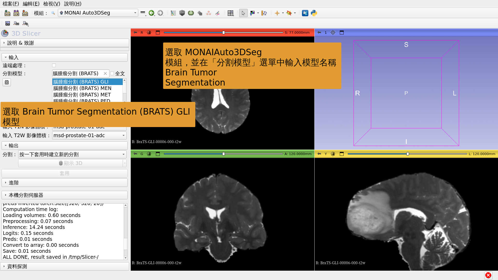

---

## 

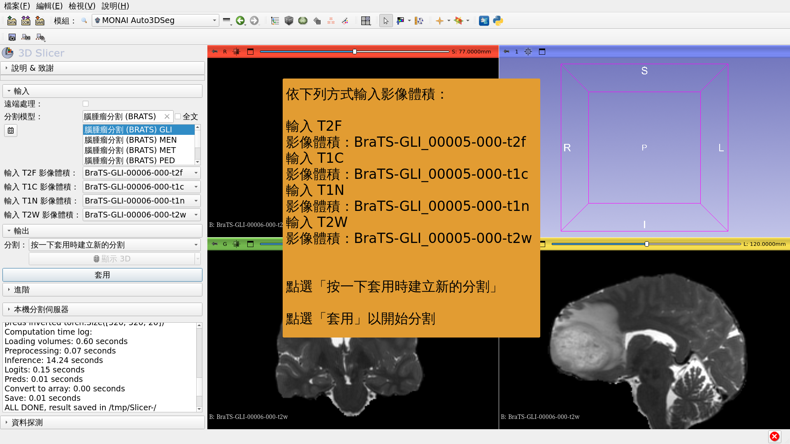

---

## 

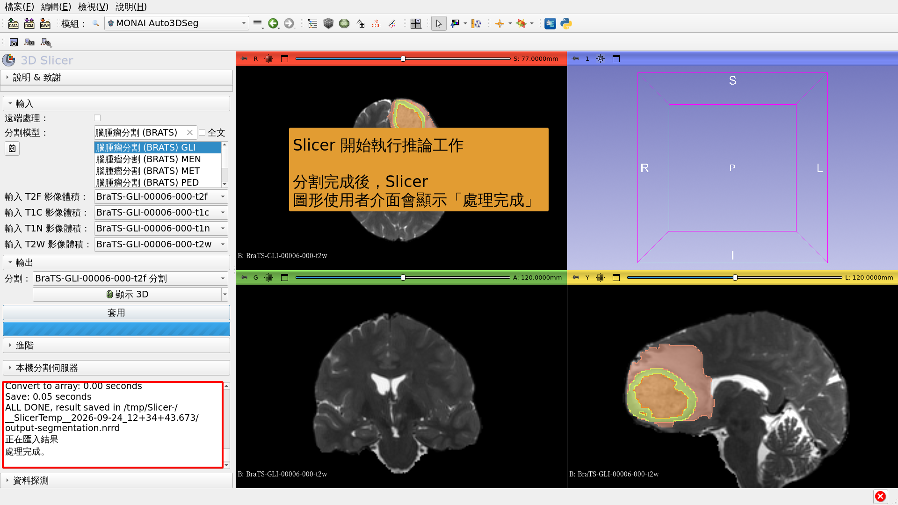

---

## 

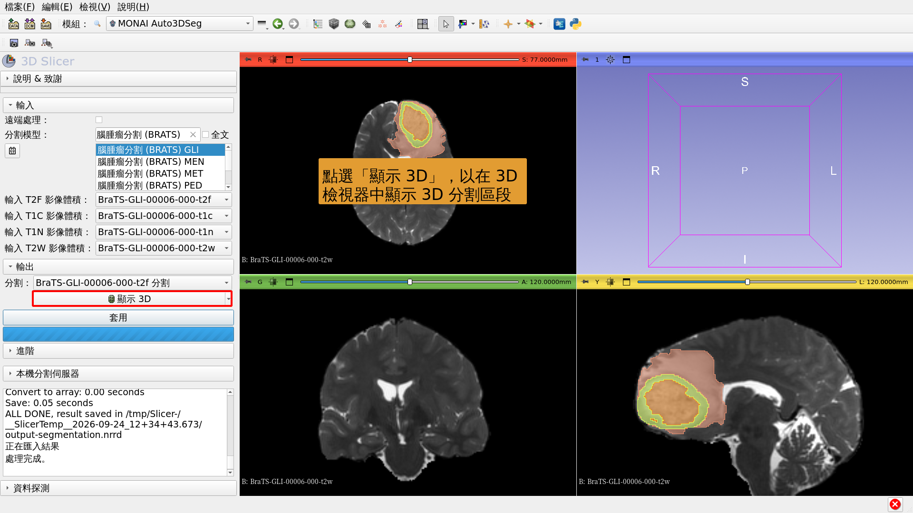

---

# AI 分割工作 #3：全身分割

---

##  

以 AI 分割全身。

資料集：

CT_ThoraxAbdomen

---

## 

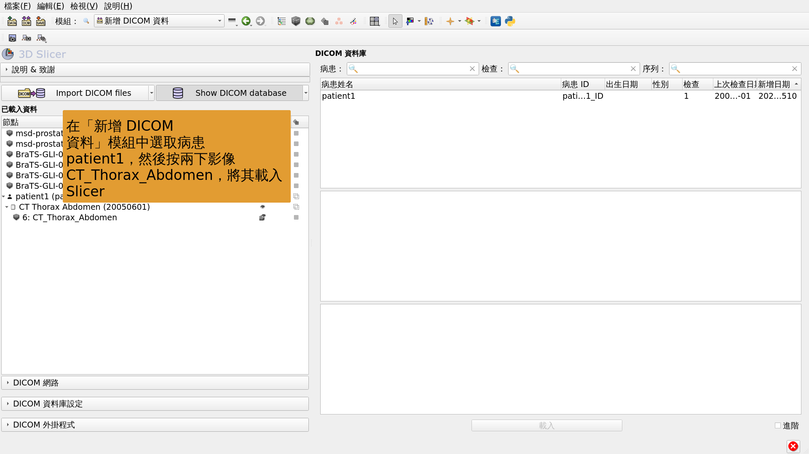

---

## 

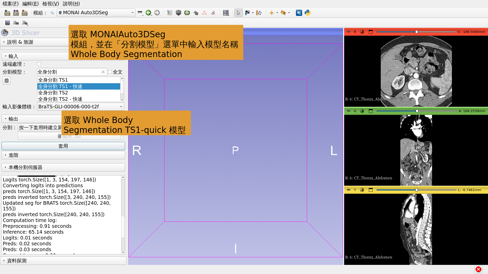

---

## 

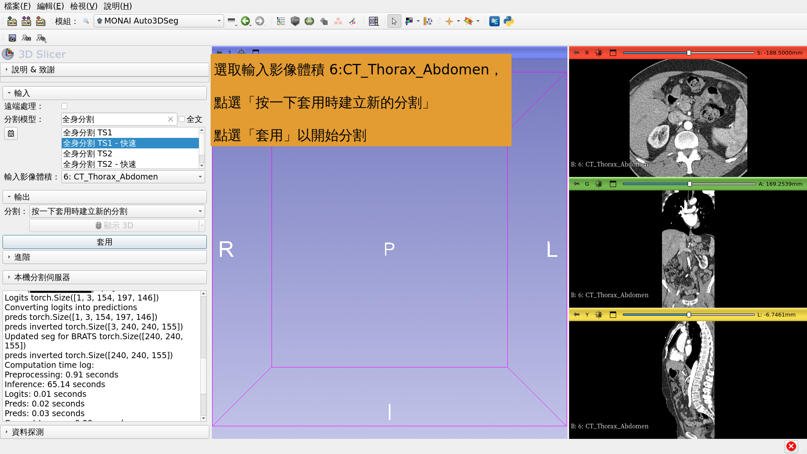

---

## 

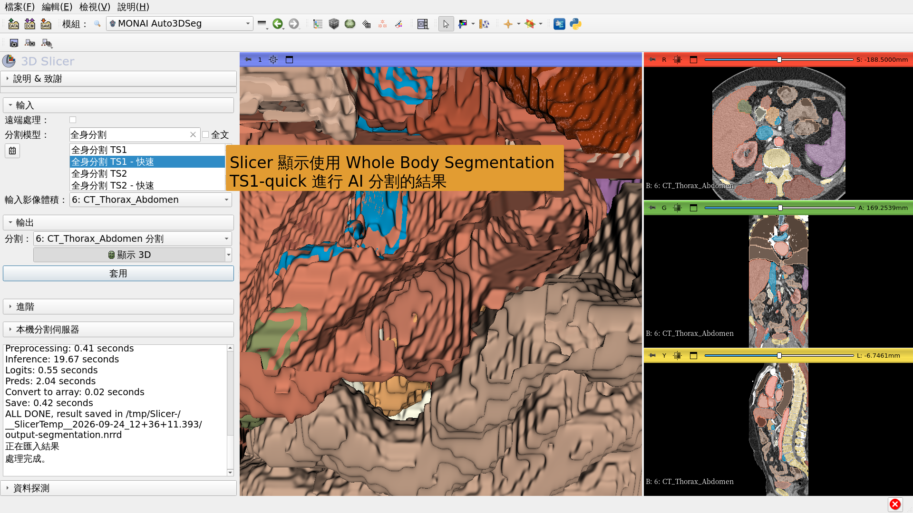

---

## 結論

3D Slicer MONAIAuto3DSeg 擴充功能可快速以 AI 分割解剖與病理結構。

此模組不需 GPU，即可在一般筆記型與桌上型電腦上執行。

---

# 致謝

3D Slicer 國際化專案與 3D Slicer 拉丁美洲專案得以實現，有賴 Chan Zuckerberg Initiative 資助。

---
